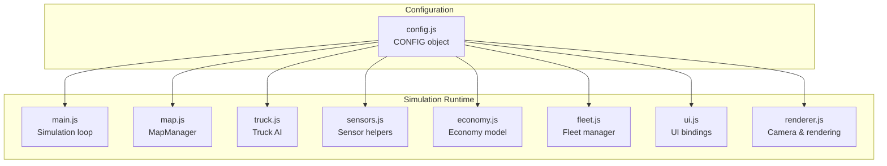
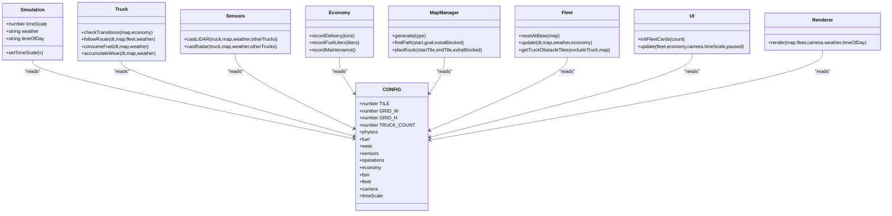
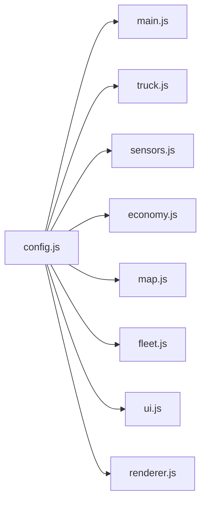

# Configuration System

<cite>
**Referenced Files in This Document**
- [config.js](file://config.js)
- [main.js](file://main.js)
- [truck.js](file://truck.js)
- [economy.js](file://economy.js)
- [sensors.js](file://sensors.js)
- [map.js](file://map.js)
- [fleet.js](file://fleet.js)
- [ui.js](file://ui.js)
- [renderer.js](file://renderer.js)
- [README.txt](file://README.txt)
</cite>

## Table of Contents
1. [Introduction](#introduction)
2. [Project Structure](#project-structure)
3. [Core Components](#core-components)
4. [Architecture Overview](#architecture-overview)
5. [Detailed Component Analysis](#detailed-component-analysis)
6. [Dependency Analysis](#dependency-analysis)
7. [Performance Considerations](#performance-considerations)
8. [Troubleshooting Guide](#troubleshooting-guide)
9. [Conclusion](#construction)
10. [Appendices](#appendices)

## Introduction
This document describes the centralized configuration system that governs all simulation parameters and constants. The CONFIG object serves as the single source of truth for physics, economics, sensors, operations, fleet behavior, camera, and time scaling. It enables modular runtime tuning without code changes, allowing educators and users to quickly adapt the simulation to different scenarios (e.g., varying fleet sizes, weather conditions, or operational zones).

## Project Structure
The configuration system is implemented as a single module that exports a global CONFIG object. Other modules import and use CONFIG values to drive behavior across physics, AI, sensors, economy, and rendering.

**Diagram sources**
- [config.js:1-93](file://config.js#L1-L93)
- [main.js:1-266](file://main.js#L1-L266)
- [map.js:1-438](file://map.js#L1-L438)
- [truck.js:1-406](file://truck.js#L1-L406)
- [sensors.js:1-103](file://sensors.js#L1-L103)
- [economy.js:1-66](file://economy.js#L1-L66)
- [fleet.js:1-65](file://fleet.js#L1-L65)
- [ui.js:1-200](file://ui.js#L1-L200)
- [renderer.js:1-437](file://renderer.js#L1-L437)

**Section sources**
- [config.js:1-93](file://config.js#L1-L93)
- [README.txt:1-20](file://README.txt#L1-L20)

## Core Components
The CONFIG object organizes parameters into logical categories:

- Grid and rendering
  - TILE, GRID_W, GRID_H
  - camera: zoomMin, zoomMax, zoomDefault, followLerp
- Fleet sizing
  - TRUCK_COUNT
- Physics
  - maxSpeed, accel, friction, reverseMax, steerBase, steerSpeedFactor, rainTraction, dustTraction, moveScale
- Fuel and wear
  - fuel: max, baseUsage, speedCoeff, terrainCoeff, cargoCoeff, weatherCoeff
  - wear: baseRate, speedCoeff, terrainCoeff, cargoCoeff, planThreshold, urgentThreshold, max
- Sensors
  - lidarRays, lidarMaxDist, lidarStep, radarMaxDist, fogRangeFactor, dustNoiseMax, frontSector, brakeDistFactor, overtakeOffset
- Operations
  - loadSec, unloadSec, fuelSec, maintenanceSecMin, maintenanceSecMax
- Economy
  - fuelCostPerLiter, incomePerTon, maintenanceCost
- Finite State Machine (FSM)
  - fuelCritical, routeDeviationMax, pathReplanCooldownSec, arrivalDist, waypointSnapDist
- Fleet coordination
  - fleet: separationRadius, queueDist, safetyBubbleAhead, safetyBubbleSide, truckObstacleCost
- Time scaling
  - timeScale: options[], defaultIndex

These categories are consumed across modules to control movement, sensor perception, economic outcomes, and UI behavior.

**Section sources**
- [config.js:1-93](file://config.js#L1-L93)

## Architecture Overview
The CONFIG object is imported and used by all major modules. The centralization ensures consistent behavior across physics, AI decision-making, sensor modeling, economic accounting, and rendering.

**Diagram sources**
- [config.js:1-93](file://config.js#L1-L93)
- [main.js:1-266](file://main.js#L1-L266)
- [truck.js:1-406](file://truck.js#L1-L406)
- [sensors.js:1-103](file://sensors.js#L1-L103)
- [economy.js:1-66](file://economy.js#L1-L66)
- [map.js:1-438](file://map.js#L1-L438)
- [fleet.js:1-65](file://fleet.js#L1-L65)
- [ui.js:1-200](file://ui.js#L1-L200)
- [renderer.js:1-437](file://renderer.js#L1-L437)

## Detailed Component Analysis

### CONFIG Object Structure and Categories
- Grid and rendering
  - TILE, GRID_W, GRID_H define grid resolution and bounds used across map generation, rendering, and pathfinding.
  - camera: zoomMin, zoomMax, zoomDefault, followLerp control camera behavior and smoothing.
- Fleet sizing
  - TRUCK_COUNT determines initial fleet size and UI card population.
- Physics
  - Movement: maxSpeed, accel, friction, reverseMax, steerBase, steerSpeedFactor.
  - Surface traction: rainTraction, dustTraction.
  - Movement scaling: moveScale.
- Fuel and wear
  - fuel: max capacity and usage coefficients for base, speed, terrain, cargo, and weather.
  - wear: base rate and coefficients for speed, terrain, cargo; thresholds for planned and urgent maintenance; max wear.
- Sensors
  - lidarRays, lidarMaxDist, lidarStep, radarMaxDist, fogRangeFactor, dustNoiseMax, frontSector, brakeDistFactor, overtakeOffset.
- Operations
  - loadSec, unloadSec, fuelSec, maintenanceSecMin, maintenanceSecMax define operation durations.
- Economy
  - fuelCostPerLiter, incomePerTon, maintenanceCost.
- FSM
  - fuelCritical threshold, routeDeviationMax, pathReplanCooldownSec, arrivalDist, waypointSnapDist.
- Fleet coordination
  - separationRadius, queueDist, safetyBubbleAhead, safetyBubbleSide, truckObstacleCost.
- Time scaling
  - timeScale.options[], defaultIndex.

**Section sources**
- [config.js:1-93](file://config.js#L1-L93)

### Parameter Categories and Usage

#### TRUCK_COUNT
- Purpose: Controls initial fleet size and UI fleet cards.
- Usage locations:
  - Simulation constructor creates fleet with CONFIG.TRUCK_COUNT.
  - UI initialization uses CONFIG.TRUCK_COUNT to build fleet cards.
  - Fleet reset positions trucks around the base zone using CONFIG.TRUCK_COUNT.
- Tuning guidance:
  - Increase for larger-scale experiments; decrease for focused demonstrations.
  - Ensure UI remains readable with fewer cards.

**Section sources**
- [main.js:4-44](file://main.js#L4-L44)
- [ui.js:70-100](file://ui.js#L70-L100)
- [fleet.js:2-18](file://fleet.js#L2-L18)

#### timeScale Options
- Purpose: Control simulation speed multiplier.
- Usage locations:
  - Simulation holds current timeScale from CONFIG.timeScale.options[CONFIG.timeScale.defaultIndex].
  - UI binds timeScale buttons to change simulation speed.
  - Simulation loop scales delta time by timeScale.
- Tuning guidance:
  - Use higher values for rapid scenario exploration; lower values for detailed observation.
  - Zero disables updates for inspection mode.

**Section sources**
- [main.js:10, 86-88, 218-223:10-10](file://main.js#L10-L10)
- [main.js:254-259](file://main.js#L254-L259)
- [ui.js:43-49](file://ui.js#L43-L49)

#### Weather Effects Impact Factors
- Purpose: Modify movement, sensor perception, and wear under weather conditions.
- Usage locations:
  - Manual driving applies traction modifiers based on CONFIG.physics.rainTraction/dustTraction.
  - Sensor helpers adjust visibility/range via CONFIG.sensors.fogRangeFactor and other factors.
  - Wear increases under rain; fuel usage may increase under rain/dust.
- Tuning guidance:
  - Lower traction coefficients reduce handling stability; useful for safety education.
  - Reduce fogRangeFactor to simulate reduced visibility scenarios.

**Section sources**
- [main.js:125-132](file://main.js#L125-L132)
- [sensors.js:2-7](file://sensors.js#L2-L7)
- [truck.js:291-294](file://truck.js#L291-L294)
- [truck.js:376-377](file://truck.js#L376-L377)

#### Operational Zones Specifications
- Purpose: Define named regions (base, load, unload, fuel, maintenance) and their geometry.
- Usage locations:
  - MapManager generates zones per map type and computes centers for routing.
  - Truck transitions depend on current zone detection.
  - UI displays zone names and highlights.
- Tuning guidance:
  - Adjust zone sizes and positions to reflect different quarry layouts.
  - Use different map types to explore route-planning differences.

**Section sources**
- [map.js:196-249](file://map.js#L196-L249)
- [map.js:260-293](file://map.js#L260-L293)
- [map.js:302-314](file://map.js#L302-L314)
- [truck.js:118-157](file://truck.js#L118-L157)

### Modular Configuration Approach
- Centralized source: All parameters live in config.js.
- Decoupled consumers: Modules import CONFIG and use values without hardcoding.
- Runtime tuning: Changing CONFIG values immediately affects behavior without recompilation.
- Educational flexibility: Different profiles can be loaded to demonstrate various scenarios.

**Section sources**
- [config.js:1-93](file://config.js#L1-L93)
- [main.js:1-266](file://main.js#L1-L266)
- [truck.js:1-406](file://truck.js#L1-L406)
- [sensors.js:1-103](file://sensors.js#L1-L103)
- [economy.js:1-66](file://economy.js#L1-L66)
- [map.js:1-438](file://map.js#L1-L438)
- [fleet.js:1-65](file://fleet.js#L1-L65)
- [ui.js:1-200](file://ui.js#L1-L200)
- [renderer.js:1-437](file://renderer.js#L1-L437)

### Examples of Configuration Profiles and Behavior
- Profile A: High-speed demonstration
  - Increase CONFIG.physics.maxSpeed and CONFIG.physics.accel.
  - Decrease CONFIG.physics.friction to simulate low-grip surfaces.
  - Observe faster routes and more aggressive steering behavior.
- Profile B: Realistic fuel economy
  - Increase CONFIG.fuel.terrainCoeff and CONFIG.fuel.cargoCoeff.
  - Observe increased fuel consumption on rough terrain and with cargo.
- Profile C: Safety-focused operation
  - Increase CONFIG.sensors.lidarMaxDist and CONFIG.sensors.lidarRays.
  - Reduce CONFIG.sensors.brakeDistFactor to require earlier braking.
  - Observe tighter avoidance maneuvers and slower speeds near obstacles.
- Profile D: Weather impact
  - Set CONFIG.physics.rainTraction to a lower value.
  - Observe reduced handling and increased wear under rain.
- Profile E: Fleet coordination
  - Increase CONFIG.fleet.separationRadius and CONFIG.fleet.queueDist.
  - Observe smoother traffic flow and reduced collisions.

[No sources needed since this section provides conceptual examples]

## Dependency Analysis
CONFIG is a global dependency across modules. The following diagram shows how modules depend on CONFIG:

**Diagram sources**
- [config.js:1-93](file://config.js#L1-L93)
- [main.js:1-266](file://main.js#L1-L266)
- [truck.js:1-406](file://truck.js#L1-L406)
- [sensors.js:1-103](file://sensors.js#L1-L103)
- [economy.js:1-66](file://economy.js#L1-L66)
- [map.js:1-438](file://map.js#L1-L438)
- [fleet.js:1-65](file://fleet.js#L1-L65)
- [ui.js:1-200](file://ui.js#L1-L200)
- [renderer.js:1-437](file://renderer.js#L1-L437)

**Section sources**
- [config.js:1-93](file://config.js#L1-L93)
- [main.js:1-266](file://main.js#L1-L266)
- [truck.js:1-406](file://truck.js#L1-L406)
- [sensors.js:1-103](file://sensors.js#L1-L103)
- [economy.js:1-66](file://economy.js#L1-L66)
- [map.js:1-438](file://map.js#L1-L438)
- [fleet.js:1-65](file://fleet.js#L1-L65)
- [ui.js:1-200](file://ui.js#L1-L200)
- [renderer.js:1-437](file://renderer.js#L1-L437)

## Performance Considerations
- Centralized CONFIG reduces duplication and improves maintainability.
- Sensor and pathfinding computations scale with CONFIG.sensors.lidarRays and CONFIG.sensors.lidarMaxDist; increasing these values increases CPU usage.
- Higher TRUCK_COUNT increases collision checks and route planning overhead.
- timeScale affects computational load proportionally; higher values accelerate but increase per-frame work.

[No sources needed since this section provides general guidance]

## Troubleshooting Guide
- Unexpected behavior after changing CONFIG:
  - Verify the change is applied before starting a new simulation session.
  - Confirm that the module consuming the parameter is using CONFIG and not a cached local value.
- Physics instability:
  - Excessive CONFIG.physics.accel or low CONFIG.physics.friction can cause oscillations; adjust these parameters gradually.
- Sensor anomalies:
  - If CONFIG.sensors.lidarMaxDist is too large, memory and computation can spike; reduce for performance.
- Economy misreporting:
  - Ensure CONFIG.economy.* values match expected units and currency; incorrect values skew profit calculations.

**Section sources**
- [config.js:1-93](file://config.js#L1-L93)
- [truck.js:358-382](file://truck.js#L358-L382)
- [economy.js:17-39](file://economy.js#L17-L39)

## Conclusion
The CONFIG object provides a robust, centralized foundation for the simulation’s behavior. By organizing parameters into clear categories and enabling runtime modification, it supports flexible experimentation and educational scenarios. Proper tuning of parameters across physics, sensors, economy, and fleet coordination yields realistic and instructive simulations.

[No sources needed since this section summarizes without analyzing specific files]

## Appendices

### Parameter Reference Index
- Grid and rendering: TILE, GRID_W, GRID_H, camera.*
- Fleet sizing: TRUCK_COUNT
- Physics: physics.*
- Fuel and wear: fuel.*, wear.*
- Sensors: sensors.*
- Operations: operations.*
- Economy: economy.*
- FSM: fsm.*
- Fleet coordination: fleet.*
- Time scaling: timeScale.*

**Section sources**
- [config.js:1-93](file://config.js#L1-L93)