# Core Simulation System

<cite>
**Referenced Files in This Document**
- [index.html](file://index.html)
- [config.js](file://config.js)
- [main.js](file://main.js)
- [map.js](file://map.js)
- [truck.js](file://truck.js)
- [fleet.js](file://fleet.js)
- [economy.js](file://economy.js)
- [sensors.js](file://sensors.js)
- [renderer.js](file://renderer.js)
- [ui.js](file://ui.js)
- [utils.js](file://utils.js)
</cite>

## Table of Contents
1. [Introduction](#introduction)
2. [Project Structure](#project-structure)
3. [Core Components](#core-components)
4. [Architecture Overview](#architecture-overview)
5. [Detailed Component Analysis](#detailed-component-analysis)
6. [Dependency Analysis](#dependency-analysis)
7. [Performance Considerations](#performance-considerations)
8. [Troubleshooting Guide](#troubleshooting-guide)
9. [Conclusion](#conclusion)
10. [Appendices](#appendices)

## Introduction
This document describes the core simulation system that orchestrates the autonomous truck simulator. It focuses on the main simulation controller, the game loop, event handling, component coordination, centralized configuration, time management, frame rate control, simulation scaling, event-driven architecture, and integration patterns for new components. The system is implemented in a modular, object-oriented JavaScript architecture with a central configuration object driving physics, economics, sensors, and behavioral parameters.

## Project Structure
The project is organized around a single HTML page that loads multiple script modules. The simulation lifecycle starts when the DOM is ready, instantiating the Simulation controller which initializes all subsystems and begins the animation loop.

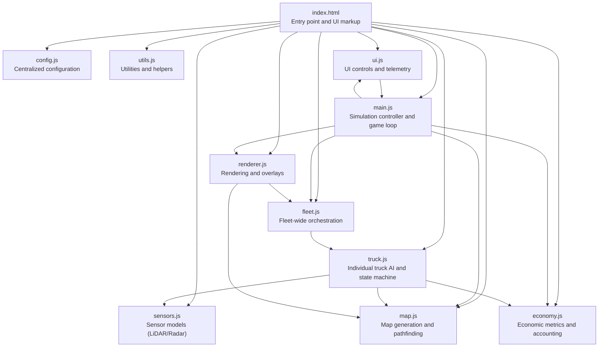

**Diagram sources**
- [index.html:245-254](file://index.html#L245-L254)
- [main.js:1-45](file://main.js#L1-L45)

**Section sources**
- [index.html:1-257](file://index.html#L1-L257)
- [main.js:1-45](file://main.js#L1-L45)

## Core Components
- Simulation: Central controller managing initialization, game loop, event binding, component updates, rendering, and UI synchronization.
- MapManager: Generates terrain, zones, roads, and provides pathfinding and spatial queries.
- Fleet: Manages multiple trucks, resets positions, and coordinates updates.
- Truck: Individual autonomous vehicle with state machine, AI routing, sensors, fuel/wear consumption, collision handling, and operation scheduling.
- Sensors: Implements LiDAR and Radar models with weather effects and noise.
- Economy: Tracks deliveries, fuel usage, maintenance costs, and computes production metrics.
- Renderer/Camera: Renders the map, trucks, routes, overlays, and sensor displays; follows a selected truck.
- UI: Provides interactive controls, telemetry cards, and export functionality.
- Utilities: Shared math helpers, priority queue, and hashing utilities.

**Section sources**
- [main.js:1-266](file://main.js#L1-L266)
- [map.js:1-438](file://map.js#L1-L438)
- [fleet.js:1-65](file://fleet.js#L1-L65)
- [truck.js:1-406](file://truck.js#L1-L406)
- [sensors.js:1-103](file://sensors.js#L1-L103)
- [economy.js:1-66](file://economy.js#L1-L66)
- [renderer.js:1-437](file://renderer.js#L1-L437)
- [ui.js:1-200](file://ui.js#L1-L200)
- [utils.js:1-102](file://utils.js#L1-L102)

## Architecture Overview
The simulation follows a layered architecture:
- Presentation Layer: UI and Renderer handle visuals and user interactions.
- Control Layer: Simulation orchestrates updates and renders.
- Domain Layer: Map, Fleet, Truck encapsulate simulation logic.
- Services Layer: Sensors and Economy provide auxiliary computations.
- Configuration Layer: Centralized CONFIG object supplies constants and parameters.

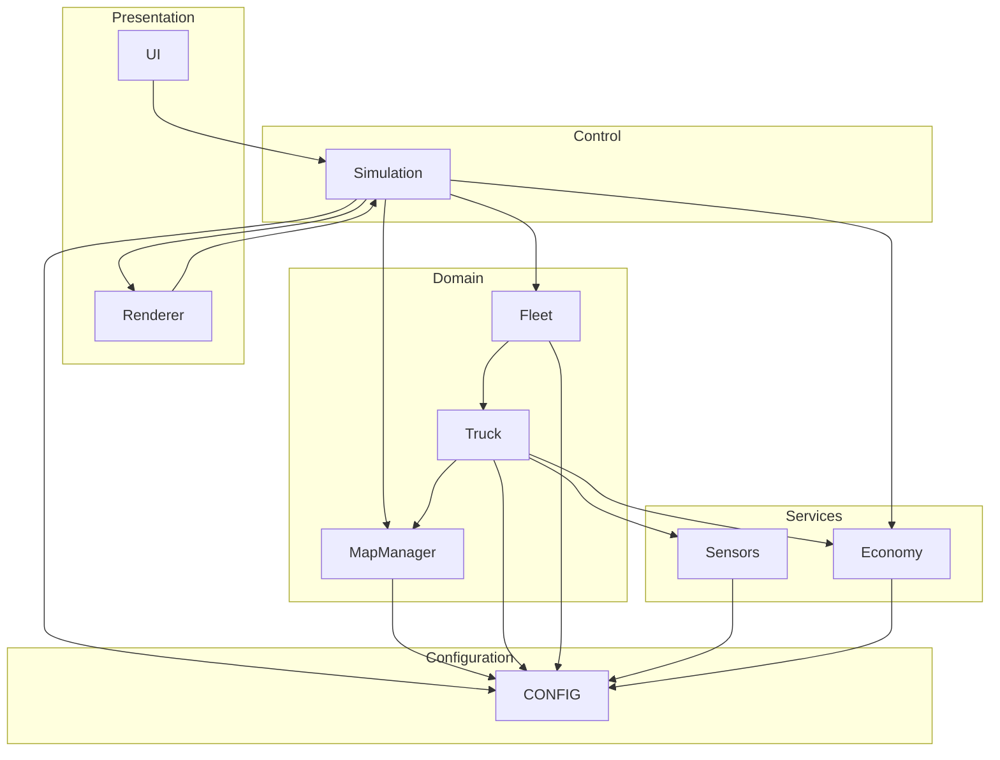

**Diagram sources**
- [main.js:1-266](file://main.js#L1-L266)
- [map.js:1-438](file://map.js#L1-L438)
- [truck.js:1-406](file://truck.js#L1-L406)
- [fleet.js:1-65](file://fleet.js#L1-L65)
- [sensors.js:1-103](file://sensors.js#L1-L103)
- [economy.js:1-66](file://economy.js#L1-L66)
- [renderer.js:1-437](file://renderer.js#L1-L437)
- [ui.js:1-200](file://ui.js#L1-L200)
- [config.js:1-93](file://config.js#L1-L93)

## Detailed Component Analysis

### Simulation Controller
The Simulation class is the central coordinator. It:
- Initializes subsystems (Map, Fleet, Economy, Camera, Renderer, UI).
- Binds keyboard and mouse events.
- Runs the game loop with requestAnimationFrame.
- Coordinates updates and rendering.
- Manages mode switching (AI/manual), camera selection, time scale, and weather/time-of-day.

Key responsibilities:
- Game loop: Calculates delta time, applies time scaling, and toggles pause.
- Manual mode: Processes keyboard input to control a selected truck.
- Event handling: Keyboard keys, mouse clicks, and UI controls.
- Component coordination: Updates fleet, camera, and renderer; syncs UI.

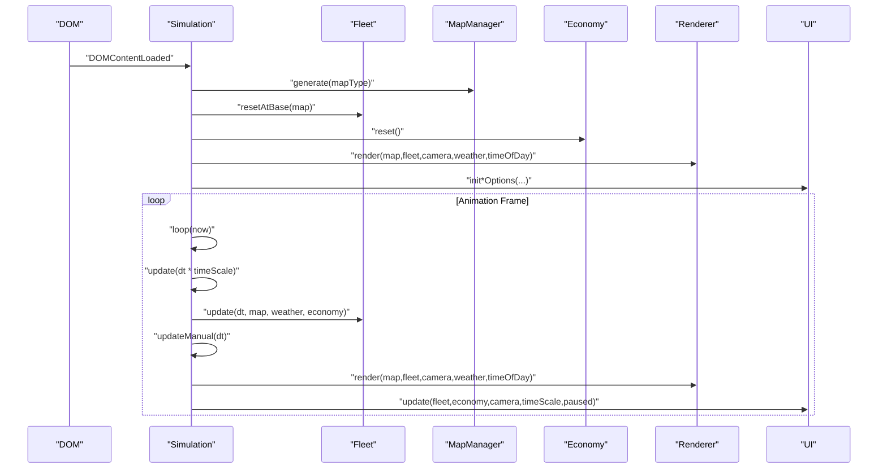

**Diagram sources**
- [main.js:263-266](file://main.js#L263-L266)
- [main.js:67-80](file://main.js#L67-L80)
- [main.js:215-223](file://main.js#L215-L223)
- [main.js:209-213](file://main.js#L209-L213)
- [main.js:28-43](file://main.js#L28-L43)

**Section sources**
- [main.js:1-266](file://main.js#L1-L266)

### Centralized Configuration System
The CONFIG object centralizes all tunable parameters:
- Physics: Speed limits, acceleration, friction, steering, traction modifiers, movement scaling.
- Fuel: Capacity, base usage, speed/terrain/cargo/weather coefficients.
- Wear: Base rate, speed/terrain/cargo coefficients, thresholds, max.
- Sensors: LiDAR/Radar parameters, field-of-view sectors, braking distance factor, overtaking offsets, noise.
- Operations: Loading/unloading/fueling durations, maintenance range.
- Economy: Fuel cost, income per ton, maintenance cost.
- FSM: Fuel critical threshold, route deviation limits, replanning cooldown, snapping distances.
- Fleet: Separation radii, queue distances, safety bubbles, obstacle cost.
- Camera: Zoom bounds, default, follow interpolation.
- Time scale: Options and default index.

Integration pattern:
- All modules read from CONFIG for constants and parameters.
- No module holds global mutable state; parameters are accessed via CONFIG.

**Section sources**
- [config.js:1-93](file://config.js#L1-L93)

### Time Management, Frame Rate Control, and Simulation Scaling
- Delta time calculation: Uses performance.now() to compute dt capped to a maximum step.
- Pause and time scale: Pausing disables updates; timeScale multiplies dt for simulation speed control.
- Rendering: Separate from update timing; renderer draws at display refresh rate.

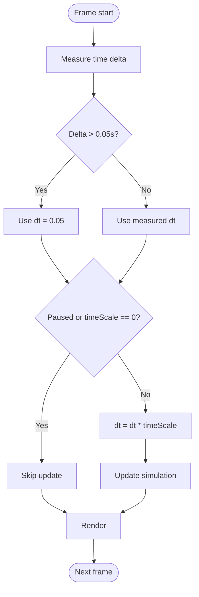

**Diagram sources**
- [main.js:215-223](file://main.js#L215-L223)

**Section sources**
- [main.js:215-223](file://main.js#L215-L223)

### Event-Driven Architecture and Component Coordination
- UI-to-Simulation: Buttons and selects trigger callbacks that update Simulation state (mode, camera, time scale, map).
- Keyboard-to-Simulation: Keydown/keyup events update internal key state and trigger manual actions.
- Mouse-to-Simulation: Clicks on trucks switch camera focus.
- Simulation-to-UI: Periodic UI.update synchronizes telemetry and controls.
- Simulation-to-Renderer: Rendering pipeline draws map, routes, trucks, overlays, and charts.
- Simulation-to-Fleet: Fleet.update iterates all trucks and delegates to individual Truck.update.
- Truck-to-Map/Sensors/Economy: Trucks query map zones, cast sensors, consume fuel/wear, and record economy events.

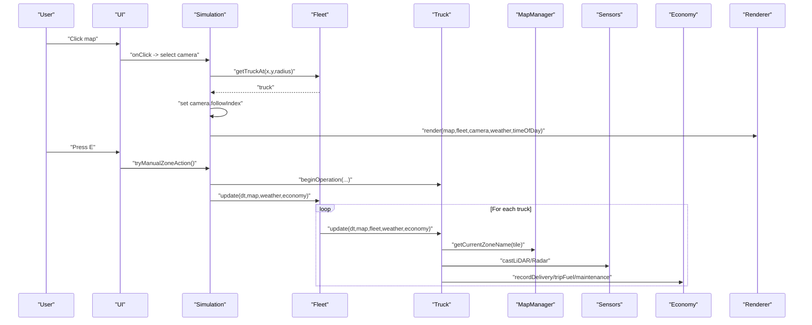

**Diagram sources**
- [main.js:225-260](file://main.js#L225-L260)
- [main.js:148-207](file://main.js#L148-L207)
- [fleet.js:20-24](file://fleet.js#L20-L24)
- [truck.js:78-116](file://truck.js#L78-L116)
- [sensors.js:9-49](file://sensors.js#L9-L49)
- [economy.js:17-39](file://economy.js#L17-L39)

**Section sources**
- [main.js:225-260](file://main.js#L225-L260)
- [main.js:148-207](file://main.js#L148-L207)
- [fleet.js:20-24](file://fleet.js#L20-L24)
- [truck.js:78-116](file://truck.js#L78-L116)
- [sensors.js:9-49](file://sensors.js#L9-L49)
- [economy.js:17-39](file://economy.js#L17-L39)

### Truck State Machine and AI Behavior
Trucks operate a finite state machine with transitions driven by zones, fuel, wear, and operations:
- States: IDLE, TO_LOAD, LOADING, TO_UNLOAD, UNLOADING, TO_FUEL, FUELING, TO_MAINTENANCE, MAINTENANCE.
- Transitions: Zone detection, fuel critical threshold, wear thresholds, operation completion.
- Route planning: A* pathfinding with smoothing; replan on deviation; avoidance based on LiDAR.
- Sensors: Front obstacle detection, lateral space assessment; braking and steering adjustments.
- Consumption: Fuel and wear depend on speed, terrain, cargo, and weather.

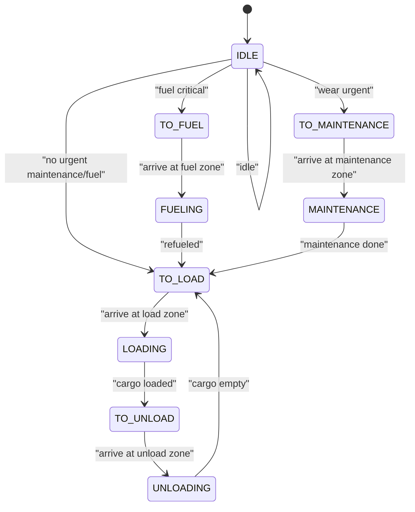

**Diagram sources**
- [truck.js:118-157](file://truck.js#L118-L157)
- [truck.js:159-222](file://truck.js#L159-L222)

**Section sources**
- [truck.js:118-222](file://truck.js#L118-L222)

### Pathfinding and Route Management
- A* pathfinding with diagonal movement penalties and extra blocked tiles from other trucks.
- Route smoothing reduces zigzags.
- Deviation monitoring triggers replanning.
- Waypoint snapping and target index progression.

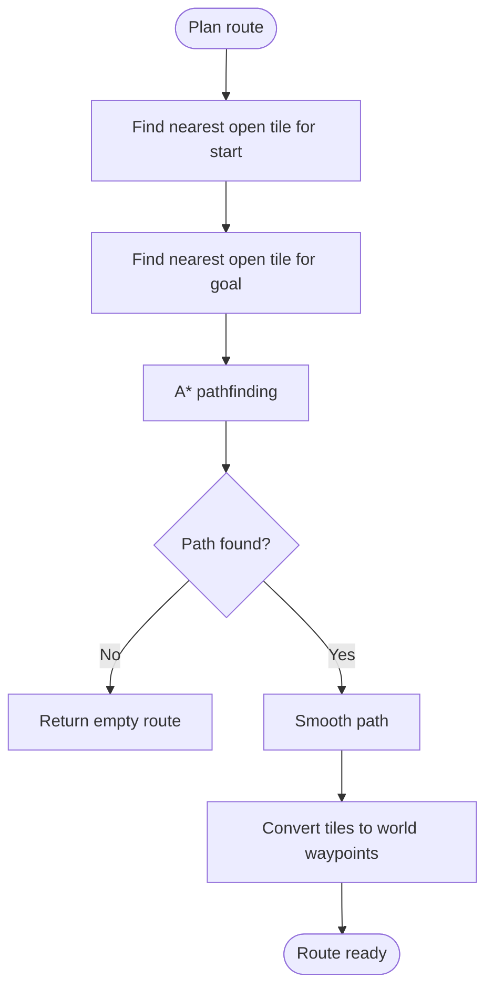

**Diagram sources**
- [map.js:414-419](file://map.js#L414-L419)
- [map.js:332-385](file://map.js#L332-L385)
- [map.js:396-412](file://map.js#L396-L412)

**Section sources**
- [map.js:414-419](file://map.js#L414-L419)
- [map.js:332-385](file://map.js#L332-L385)
- [map.js:396-412](file://map.js#L396-L412)

### Sensor Models (LiDAR and Radar)
- LiDAR: Casts rays at configurable angles, measures distances, accounts for weather noise and truck proximity.
- Radar: Samples radial points to detect walls and nearby trucks.
- Front obstacle detection and lateral space assessment drive avoidance and braking.

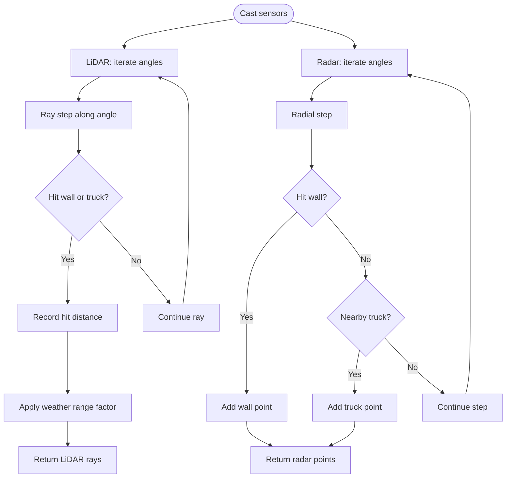

**Diagram sources**
- [sensors.js:9-49](file://sensors.js#L9-L49)
- [sensors.js:51-79](file://sensors.js#L51-L79)

**Section sources**
- [sensors.js:9-49](file://sensors.js#L9-L49)
- [sensors.js:51-79](file://sensors.js#L51-L79)

### Economic Metrics and Accounting
- Tracks deliveries, fuel consumption, maintenance costs, and computes profit and efficiency.
- Records events with timestamps for history and reporting.
- Provides shift statistics for UI and CSV export.

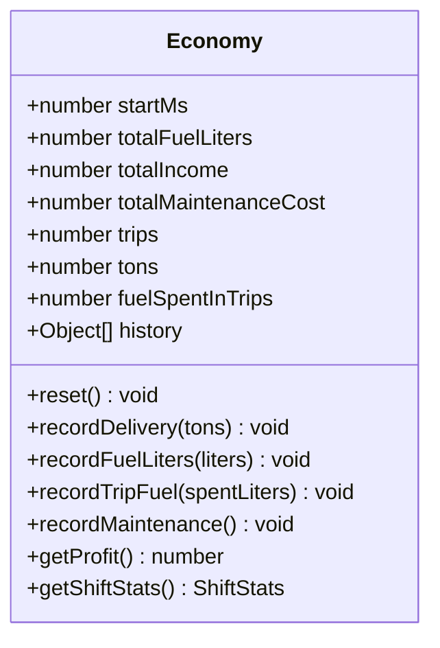

**Diagram sources**
- [economy.js:1-66](file://economy.js#L1-L66)

**Section sources**
- [economy.js:1-66](file://economy.js#L1-L66)

### Rendering Pipeline and Camera
- Camera follows a selected truck with interpolation.
- Renders grid, zones, routes, trucks, overlays (weather/time), and mini-map.
- Draws sensor displays (LiDAR/Radar) for the selected truck.
- Draws charts (fuel, tons, profit) based on economy data.

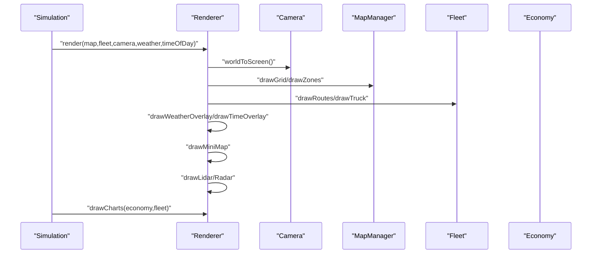

**Diagram sources**
- [renderer.js:38-66](file://renderer.js#L38-L66)
- [renderer.js:9-15](file://renderer.js#L9-L15)
- [renderer.js:278-316](file://renderer.js#L278-L316)
- [renderer.js:318-388](file://renderer.js#L318-L388)
- [renderer.js:390-435](file://renderer.js#L390-L435)

**Section sources**
- [renderer.js:38-66](file://renderer.js#L38-L66)
- [renderer.js:9-15](file://renderer.js#L9-L15)
- [renderer.js:278-316](file://renderer.js#L278-L316)
- [renderer.js:318-388](file://renderer.js#L318-L388)
- [renderer.js:390-435](file://renderer.js#L390-L435)

### UI Controls and Telemetry
- Initializes fleet cards, camera options, and map options.
- Synchronizes UI state with Simulation (mode, time scale, zoom, camera).
- Displays real-time metrics and allows CSV export.

**Section sources**
- [ui.js:70-121](file://ui.js#L70-L121)
- [ui.js:122-158](file://ui.js#L122-L158)
- [ui.js:175-198](file://ui.js#L175-L198)

## Dependency Analysis
- Simulation depends on Map, Fleet, Economy, Renderer, UI, and CONFIG.
- Fleet depends on Map and CONFIG.
- Truck depends on Map, Sensors, Economy, and CONFIG.
- Sensors depends on Map, CONFIG, and other trucks.
- Renderer depends on Map, Fleet, and CONFIG.
- Economy depends on CONFIG.
- UI depends on Simulation callbacks and CONFIG.

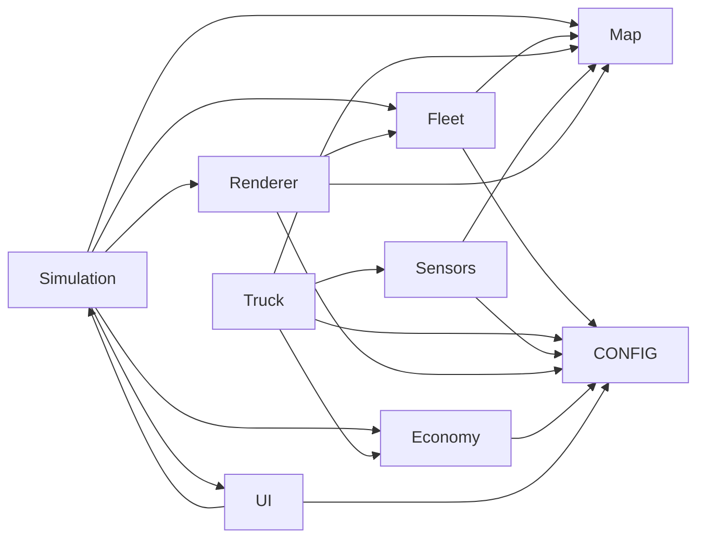

**Diagram sources**
- [main.js:1-45](file://main.js#L1-L45)
- [fleet.js:1-65](file://fleet.js#L1-L65)
- [truck.js:1-406](file://truck.js#L1-L406)
- [sensors.js:1-103](file://sensors.js#L1-L103)
- [renderer.js:1-437](file://renderer.js#L1-L437)
- [economy.js:1-66](file://economy.js#L1-L66)
- [ui.js:1-200](file://ui.js#L1-L200)
- [config.js:1-93](file://config.js#L1-L93)

**Section sources**
- [main.js:1-45](file://main.js#L1-L45)
- [fleet.js:1-65](file://fleet.js#L1-L65)
- [truck.js:1-406](file://truck.js#L1-L406)
- [sensors.js:1-103](file://sensors.js#L1-L103)
- [renderer.js:1-437](file://renderer.js#L1-L437)
- [economy.js:1-66](file://economy.js#L1-L66)
- [ui.js:1-200](file://ui.js#L1-L200)
- [config.js:1-93](file://config.js#L1-L93)

## Performance Considerations
- Delta time clamping prevents spikes and stabilizes physics.
- Time scale enables fast-forward/slow-motion without changing logic.
- A* pathfinding uses a priority queue and diagonal penalties; smoothing reduces unnecessary waypoints.
- Sensor casting counts as O(N) per truck; consider limiting rays or caching where appropriate.
- Rendering batches draw calls; overlays are conditional to reduce overhead.
- UI updates are decoupled from simulation updates to minimize coupling.

[No sources needed since this section provides general guidance]

## Troubleshooting Guide
Common issues and checks:
- Physics instability: Verify CONFIG values for max speed, friction, and steer parameters; ensure dt is clamped.
- Truck stuck in place: Check fuel exhaustion logic and AI activation flags; confirm route planning and replanning conditions.
- Sensor anomalies: Validate weather range factors and noise parameters; ensure LiDAR/Radar ray counts and steps are reasonable.
- Economy discrepancies: Confirm delivery and fuel/maintenance recording; verify shift start time and history entries.
- Rendering artifacts: Inspect camera interpolation and world-to-screen transforms; verify overlay drawing order.
- UI desynchronization: Ensure UI.update is called after Simulation.update and that callbacks are bound correctly.

**Section sources**
- [main.js:215-223](file://main.js#L215-L223)
- [truck.js:111-116](file://truck.js#L111-L116)
- [sensors.js:2-7](file://sensors.js#L2-L7)
- [economy.js:17-39](file://economy.js#L17-L39)
- [renderer.js:9-21](file://renderer.js#L9-L21)
- [ui.js:122-158](file://ui.js#L122-L158)

## Conclusion
The simulation system is a cohesive, modular architecture centered on a Simulation controller that orchestrates Map, Fleet, Truck, Sensors, Economy, Renderer, UI, and a centralized CONFIG. The design emphasizes:
- Centralized configuration for easy tuning.
- Clear separation of concerns across components.
- Event-driven UI integration and responsive controls.
- Robust time management and scaling.
- Practical AI behavior with pathfinding and sensor feedback loops.

[No sources needed since this section summarizes without analyzing specific files]

## Appendices

### Integrating New Components
To integrate a new component into the simulation framework:
1. Define the component class and its responsibilities (e.g., new subsystem like traffic lights).
2. Add a property in Simulation to instantiate and manage the component.
3. Initialize the component in Simulation constructor and bind any required events.
4. In Simulation.update(), call the component’s update(dt, ...) method.
5. In Simulation.render(), call the component’s render(...) method if applicable.
6. Expose any UI controls via UI and connect them to Simulation setters.
7. Use CONFIG for any tunable parameters the component needs.

Example integration points:
- Simulation constructor: Instantiate the component and store in a property.
- Simulation.update(): Call component.update(dt, map, fleet, economy, ...).
- Simulation.render(): Call component.render(renderer, camera, ...).
- UI: Add controls and bind callbacks to Simulation setters.

**Section sources**
- [main.js:1-45](file://main.js#L1-L45)
- [main.js:67-80](file://main.js#L67-L80)
- [main.js:209-213](file://main.js#L209-L213)
- [ui.js:30-62](file://ui.js#L30-L62)

### Singleton Pattern for Global Configuration Access
The CONFIG object acts as a global configuration singleton:
- Declared once in config.js.
- Imported by all modules via script tags in index.html.
- Accessed directly by all components without instantiation.
- Provides a single source of truth for constants and parameters.

Benefits:
- Consistent parameter usage across modules.
- Centralized tuning without scattered magic numbers.
- Predictable behavior across simulation updates.

**Section sources**
- [config.js:1-93](file://config.js#L1-L93)
- [index.html:245-254](file://index.html#L245-L254)