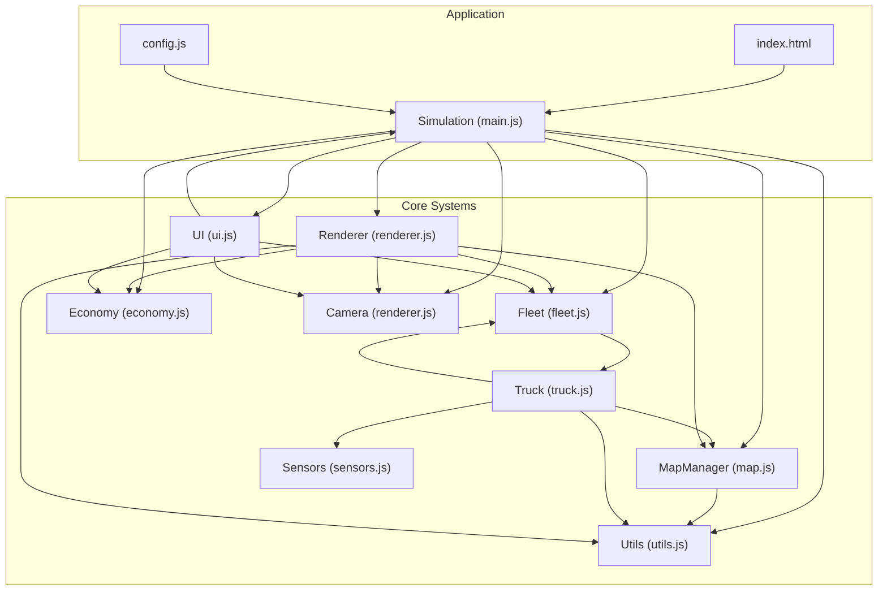
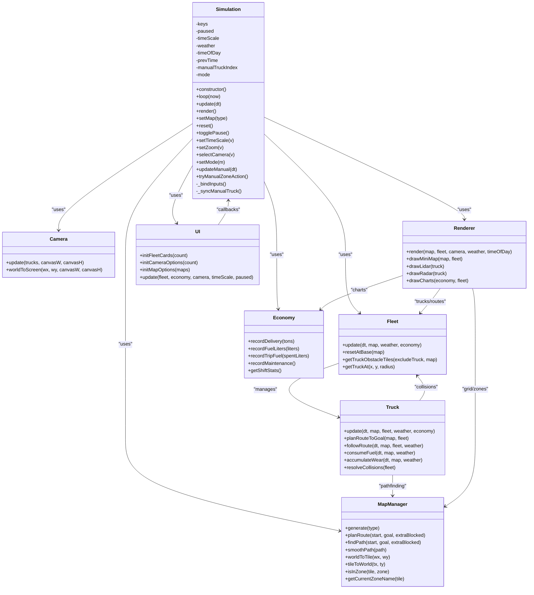
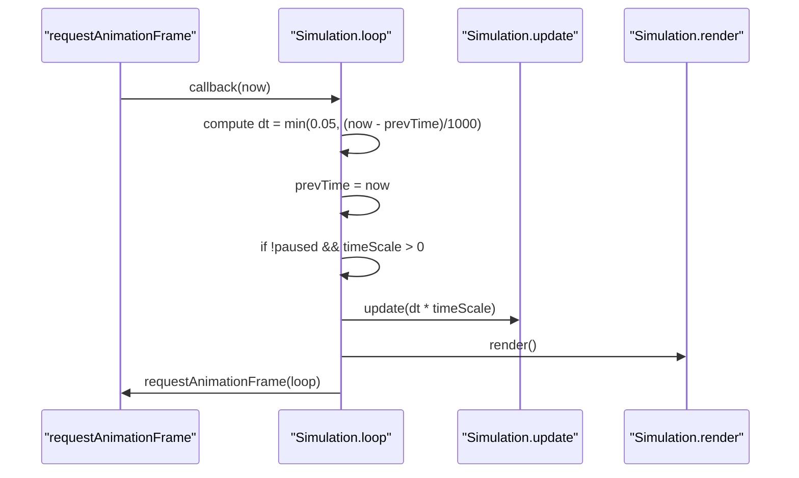
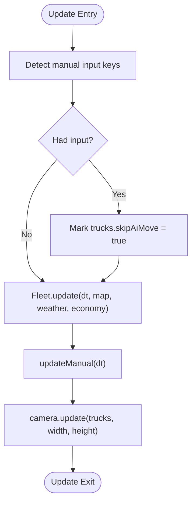
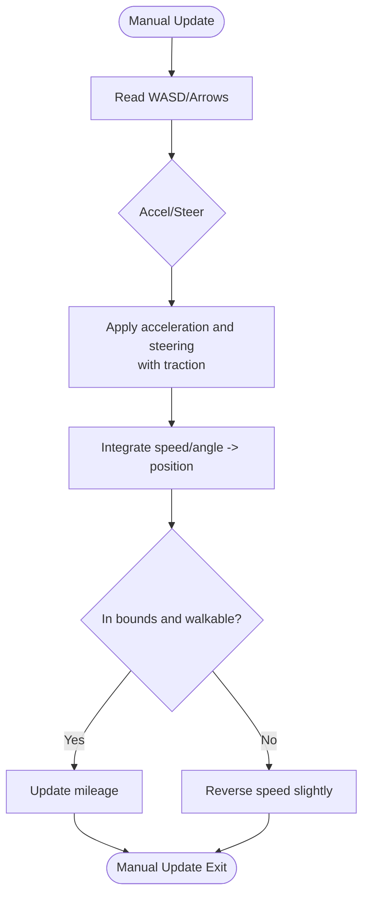
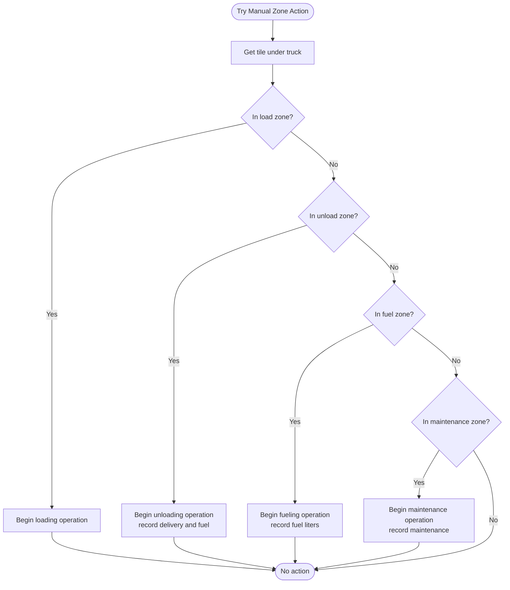
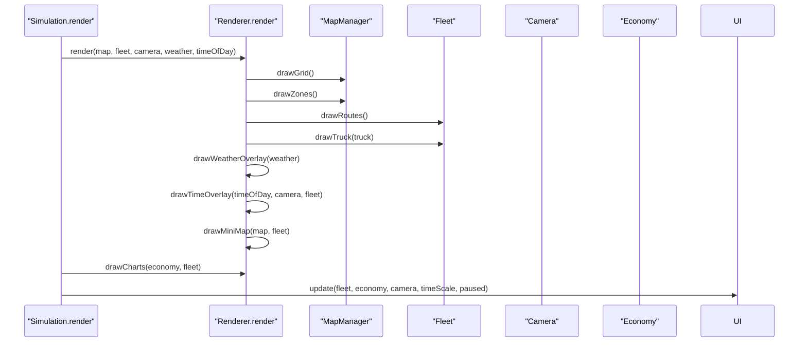
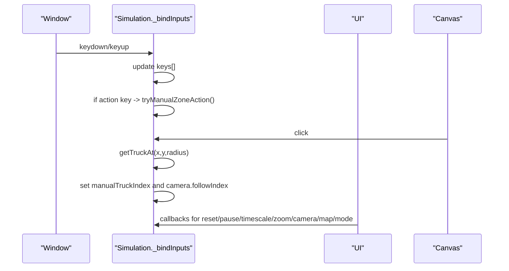
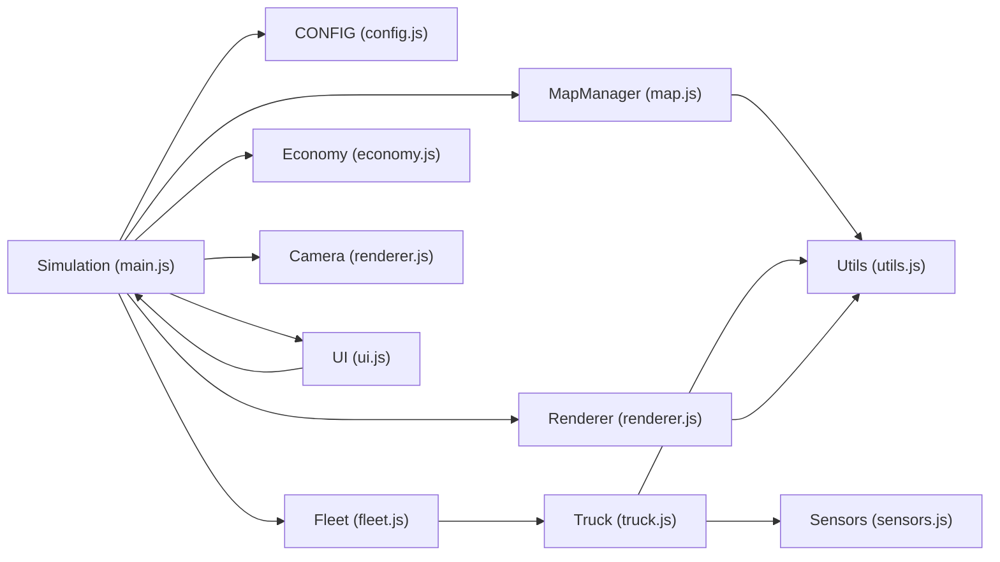

# Simulation Controller

<cite>
**Referenced Files in This Document**
- [main.js](file://main.js)
- [index.html](file://index.html)
- [config.js](file://config.js)
- [map.js](file://map.js)
- [fleet.js](file://fleet.js)
- [economy.js](file://economy.js)
- [renderer.js](file://renderer.js)
- [ui.js](file://ui.js)
- [truck.js](file://truck.js)
- [sensors.js](file://sensors.js)
- [utils.js](file://utils.js)
</cite>

## Table of Contents
1. [Introduction](#introduction)
2. [Project Structure](#project-structure)
3. [Core Components](#core-components)
4. [Architecture Overview](#architecture-overview)
5. [Detailed Component Analysis](#detailed-component-analysis)
6. [Dependency Analysis](#dependency-analysis)
7. [Performance Considerations](#performance-considerations)
8. [Troubleshooting Guide](#troubleshooting-guide)
9. [Conclusion](#conclusion)

## Introduction
This document describes the Simulation controller class that orchestrates the autonomous truck simulator. It covers constructor initialization, component instantiation, event binding, the main game loop using requestAnimationFrame, update cycles, rendering pipeline, input handling, manual control mechanics, UI integration, and lifecycle management. It also explains the singleton-like global references used for external access to the map manager and economy.

## Project Structure
The simulation is organized around a single controller class that composes several specialized subsystems:
- Simulation controller: central orchestration and loop
- MapManager: procedural map generation and navigation
- Fleet: collection and AI/physics of trucks
- Economy: production metrics and financial tracking
- Camera: viewport and following behavior
- Renderer: canvas drawing and overlays
- UI: interactive controls and telemetry display
- Sensors: LiDAR and radar computation
- Utilities: math helpers and data structures

**Diagram sources**
- [main.js:1-266](file://main.js#L1-L266)
- [index.html:1-257](file://index.html#L1-L257)
- [config.js:1-93](file://config.js#L1-L93)
- [map.js:1-438](file://map.js#L1-L438)
- [fleet.js:1-65](file://fleet.js#L1-L65)
- [economy.js:1-66](file://economy.js#L1-L66)
- [renderer.js:1-437](file://renderer.js#L1-L437)
- [ui.js:1-200](file://ui.js#L1-L200)
- [truck.js:1-406](file://truck.js#L1-L406)
- [sensors.js:1-103](file://sensors.js#L1-L103)
- [utils.js:1-102](file://utils.js#L1-L102)

**Section sources**
- [main.js:1-45](file://main.js#L1-L45)
- [index.html:1-257](file://index.html#L1-L257)

## Core Components
- Simulation: constructor initializes all subsystems, binds inputs, sets up UI, and starts the animation loop.
- MapManager: generates maps, computes zones, pathfinding, and tile/world conversions.
- Fleet: manages multiple trucks, resets positions, collision avoidance, and route obstacles.
- Economy: tracks deliveries, fuel usage, maintenance, and shift statistics.
- Camera: follows a selected truck with smoothing and zoom control.
- Renderer: draws grid, zones, routes, trucks, overlays, mini-map, and sensor displays.
- UI: controls for mode, time scale, camera selection, map change, pause/reset, and telemetry.
- Truck: AI finite-state machine, movement, sensors, fuel/wear consumption, collisions.
- Sensors: LiDAR and radar simulations with weather effects.
- Utils: Vec2, PriorityQueue, math helpers, hashing noise.

**Section sources**
- [main.js:1-266](file://main.js#L1-L266)
- [map.js:1-438](file://map.js#L1-L438)
- [fleet.js:1-65](file://fleet.js#L1-L65)
- [economy.js:1-66](file://economy.js#L1-L66)
- [renderer.js:1-437](file://renderer.js#L1-L437)
- [ui.js:1-200](file://ui.js#L1-L200)
- [truck.js:1-406](file://truck.js#L1-L406)
- [sensors.js:1-103](file://sensors.js#L1-L103)
- [utils.js:1-102](file://utils.js#L1-L102)

## Architecture Overview
The Simulation controller acts as the central orchestrator. It instantiates and coordinates:
- MapManager for terrain and zones
- Fleet for truck management
- Economy for metrics
- Camera for viewport
- Renderer for graphics
- UI for controls and telemetry
- Window globals for external access to map and economy

**Diagram sources**
- [main.js:1-266](file://main.js#L1-L266)
- [map.js:1-438](file://map.js#L1-L438)
- [fleet.js:1-65](file://fleet.js#L1-L65)
- [economy.js:1-66](file://economy.js#L1-L66)
- [renderer.js:1-437](file://renderer.js#L1-L437)
- [ui.js:1-200](file://ui.js#L1-L200)
- [truck.js:1-406](file://truck.js#L1-L406)

## Detailed Component Analysis

### Simulation Controller Initialization
- Instantiates subsystems: MapManager, Fleet, Economy, Camera, Renderer, UI.
- Exposes global references: window.simMap and window.simEconomy for external access.
- Initializes internal state: keys, paused flag, timeScale, weather, timeOfDay, previous time, manual truck index, mode.
- Binds input handlers for keyboard and mouse events.
- Sets initial map, UI options, and starts the animation loop.

Key initialization steps:
- Component creation and assignment
- Global exposure for map and economy
- UI initialization for fleet cards, camera options, and map options
- Starting the loop via requestAnimationFrame

**Section sources**
- [main.js:1-45](file://main.js#L1-L45)
- [index.html:156-257](file://index.html#L156-L257)

### Main Game Loop and Frame Timing
The loop uses requestAnimationFrame with fixed-time-step scaling:
- Computes delta time capped at a maximum to prevent spikes
- Updates only when not paused and timeScale > 0
- Applies time scaling to the delta time
- Renders the scene
- Schedules the next frame

**Diagram sources**
- [main.js:215-223](file://main.js#L215-L223)

**Section sources**
- [main.js:215-223](file://main.js#L215-L223)

### Update Cycle
The update phase coordinates:
- Manual mode input detection and temporary AI skip
- Fleet update with map, weather, and economy
- Manual truck processing when applicable
- Camera update to follow the selected truck

**Diagram sources**
- [main.js:67-80](file://main.js#L67-L80)

**Section sources**
- [main.js:67-80](file://main.js#L67-L80)

### Manual Truck Control Mechanics
Manual mode allows direct steering and acceleration:
- Reads WASD/Arrow keys to compute acceleration and steering
- Applies traction modifiers based on weather
- Integrates velocity and position with bounds checking against map tiles
- Updates mileage and handles collisions with penalties

**Diagram sources**
- [main.js:114-146](file://main.js#L114-L146)
- [truck.js:341-356](file://truck.js#L341-L356)

**Section sources**
- [main.js:114-146](file://main.js#L114-L146)
- [truck.js:341-356](file://truck.js#L341-L356)

### Manual Zone Actions
When the player presses the action key, the controller checks the current tile:
- Load zone: starts loading operation and transitions to unload path
- Unload zone: completes delivery, records revenue and fuel usage, transitions to load path
- Fuel zone: refuels and transitions to load path
- Maintenance zone: performs maintenance and transitions to load path

**Diagram sources**
- [main.js:148-207](file://main.js#L148-L207)
- [map.js:302-314](file://map.js#L302-L314)

**Section sources**
- [main.js:148-207](file://main.js#L148-L207)
- [map.js:302-314](file://map.js#L302-L314)

### Render Pipeline and Component Coordination
Rendering is split into two parts:
- Main scene rendering: grid, zones, routes, trucks, weather/time overlays, mini-map
- Sensor overlays: LiDAR and radar for the selected truck
- Charts: economic metrics overlay

**Diagram sources**
- [main.js:209-213](file://main.js#L209-L213)
- [renderer.js:38-66](file://renderer.js#L38-L66)

**Section sources**
- [main.js:209-213](file://main.js#L209-L213)
- [renderer.js:38-66](file://renderer.js#L38-L66)

### Keyboard and Mouse Input Handling
- Keyboard: keydown/keyup toggles internal key state; action key triggers manual zone actions
- Mouse: click on canvas selects the nearest truck as the camera target
- UI: buttons and sliders trigger controller methods for mode, time scale, zoom, camera, map, pause/reset

**Diagram sources**
- [main.js:225-260](file://main.js#L225-L260)
- [ui.js:30-62](file://ui.js#L30-L62)

**Section sources**
- [main.js:225-260](file://main.js#L225-L260)
- [ui.js:30-62](file://ui.js#L30-L62)

### Component Lifecycle Management
- Construction: Simulation creates subsystems and exposes globals
- Reset: setMap resets map, fleet, economy, camera, and UI state
- Destruction: no explicit teardown; relies on browser GC and DOM removal
- Reinitialization: new Simulation instance replaces previous one

Lifecycle highlights:
- Constructor sets up globals and UI
- Reset reinitializes map-dependent state
- Mode switching toggles manual vs AI behavior

**Section sources**
- [main.js:47-65](file://main.js#L47-L65)
- [main.js:100-112](file://main.js#L100-L112)

### Singleton Pattern Through Global References
The controller exposes window.simMap and window.simEconomy for external access. This enables UI and other parts of the application to read map and economy state without tight coupling.

- window.simMap: MapManager instance
- window.simEconomy: Economy instance

These globals are set during Simulation construction and can be used by UI export functionality and other scripts.

**Section sources**
- [main.js:25-26](file://main.js#L25-L26)
- [ui.js:175-198](file://ui.js#L175-L198)

## Dependency Analysis
The Simulation controller depends on:
- Configuration constants for physics, fuel, wear, sensors, operations, economy, FSM, fleet, and camera
- MapManager for navigation and pathfinding
- Fleet for truck management and collisions
- Economy for metrics and reporting
- Camera for viewport
- Renderer for drawing and overlays
- UI for controls and telemetry
- Sensors for perception
- Utilities for math and data structures

**Diagram sources**
- [main.js:1-266](file://main.js#L1-L266)
- [config.js:1-93](file://config.js#L1-L93)
- [map.js:1-438](file://map.js#L1-L438)
- [fleet.js:1-65](file://fleet.js#L1-L65)
- [economy.js:1-66](file://economy.js#L1-L66)
- [renderer.js:1-437](file://renderer.js#L1-L437)
- [ui.js:1-200](file://ui.js#L1-L200)
- [truck.js:1-406](file://truck.js#L1-L406)
- [sensors.js:1-103](file://sensors.js#L1-L103)
- [utils.js:1-102](file://utils.js#L1-L102)

**Section sources**
- [main.js:1-266](file://main.js#L1-L266)
- [config.js:1-93](file://config.js#L1-L93)

## Performance Considerations
- Frame timing: delta time capped at 0.05 seconds to avoid large jumps
- Time scaling: configurable multipliers (0, 1, 2, 4) applied to dt
- Physics: traction modifiers reduce speed on wet/dusty surfaces
- Fuel and wear: computed per tick with coefficients depending on speed, terrain, and cargo
- Rendering: selective overlays and charts to minimize overdraw
- Pathfinding: A* with smoothed waypoints and periodic replanning to balance accuracy and cost

[No sources needed since this section provides general guidance]

## Troubleshooting Guide
Common issues and diagnostics:
- No rendering: ensure Canvas element exists and Renderer initializes correctly
- Controls not responding: verify keydown/keyup listeners and mouse click handler registration
- Manual mode not engaging: confirm mode is set to manual and manualTruckIndex is selected
- Weather effects: check weather selection and traction coefficients
- Economy reports: ensure window.simEconomy is set and UI export uses it

**Section sources**
- [main.js:225-260](file://main.js#L225-L260)
- [ui.js:175-198](file://ui.js#L175-L198)

## Conclusion
The Simulation controller provides a cohesive orchestration layer for the autonomous truck simulator. It integrates map generation, fleet management, economic modeling, camera control, rendering, and UI interactions. The requestAnimationFrame-driven loop ensures smooth updates, while configuration-driven parameters enable flexible tuning. The global references facilitate external access to core systems, and the modular design supports future extensions.