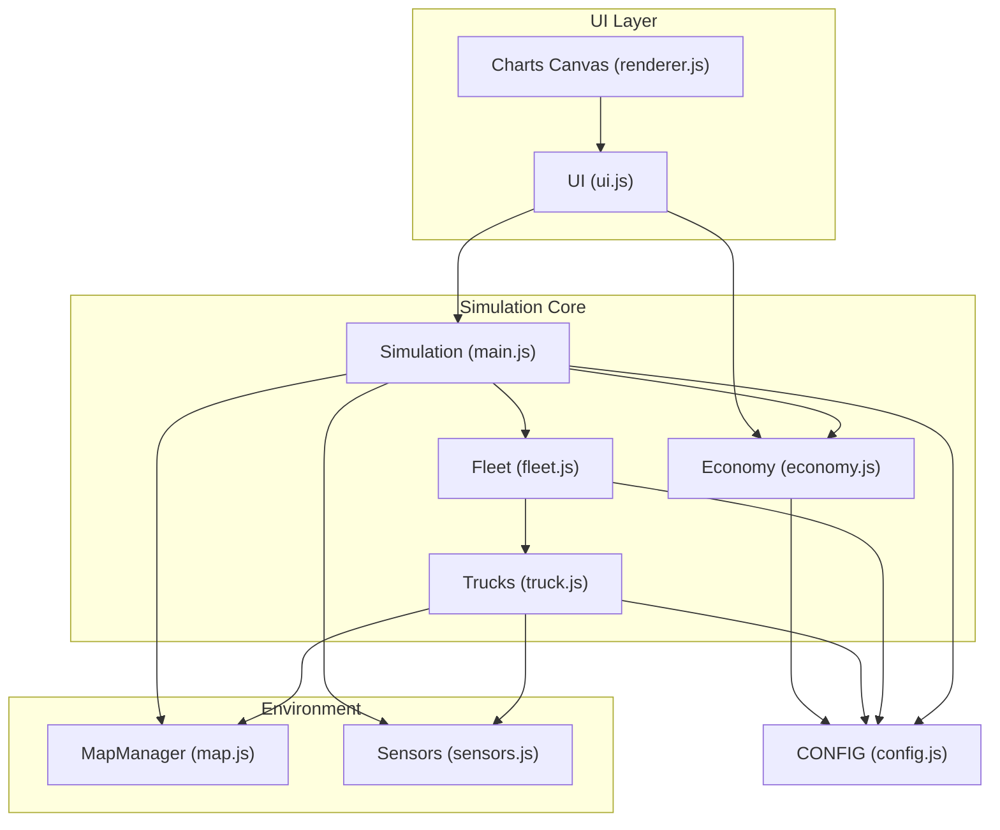
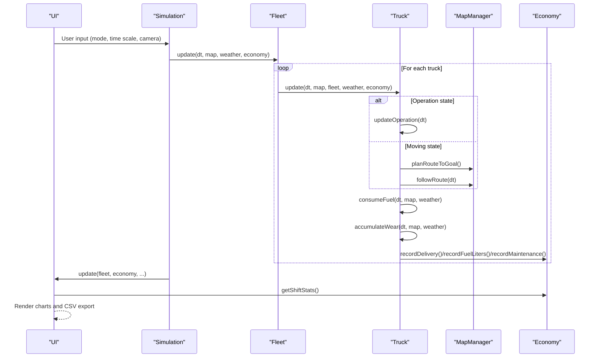
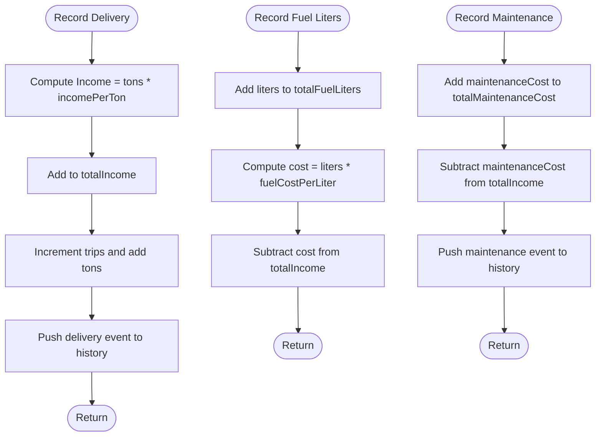
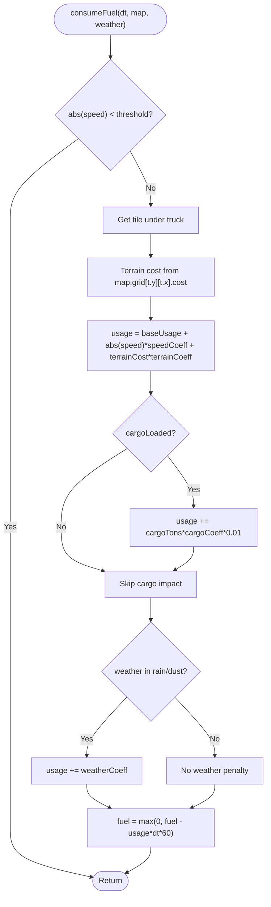
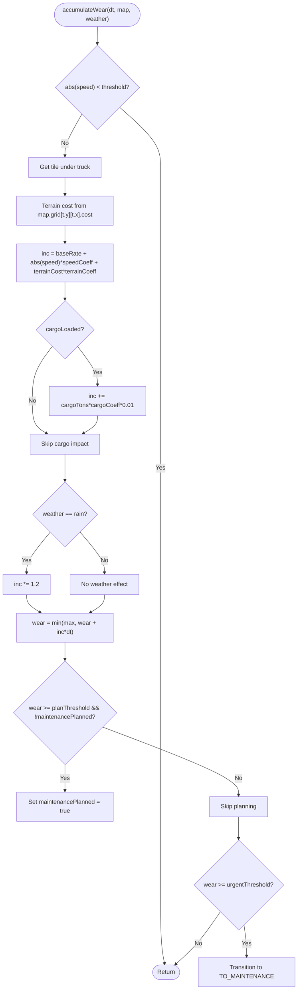
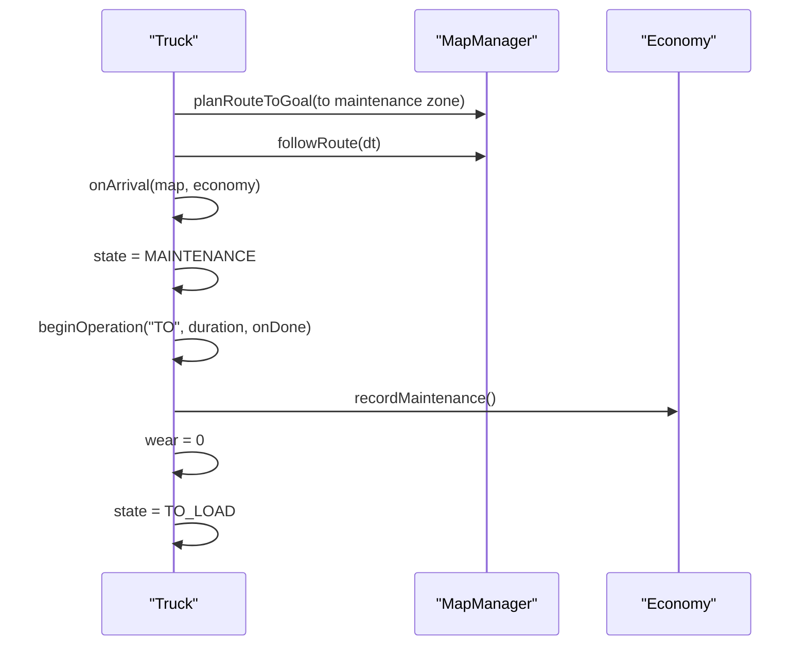
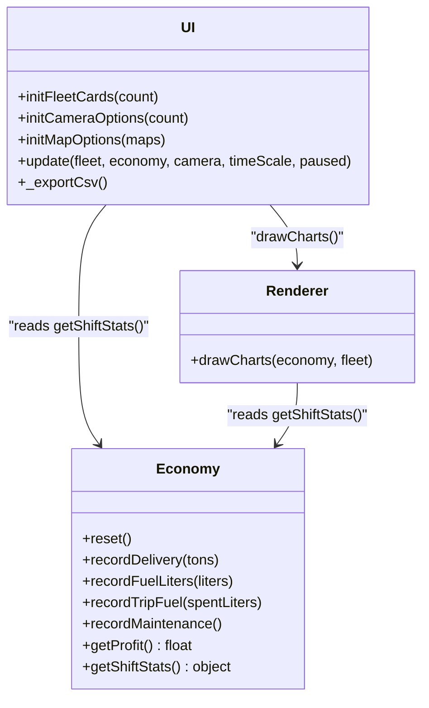
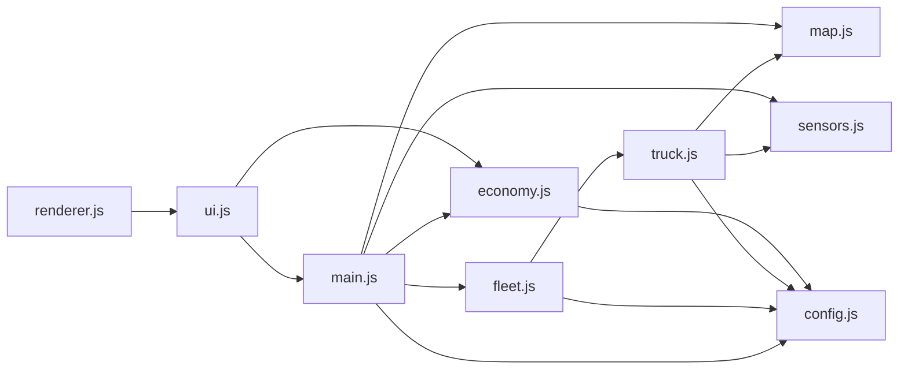

# Economic and Performance System

<cite>
**Referenced Files in This Document**
- [index.html](file://index.html)
- [config.js](file://config.js)
- [main.js](file://main.js)
- [economy.js](file://economy.js)
- [truck.js](file://truck.js)
- [fleet.js](file://fleet.js)
- [map.js](file://map.js)
- [sensors.js](file://sensors.js)
- [ui.js](file://ui.js)
- [renderer.js](file://renderer.js)
- [utils.js](file://utils.js)
</cite>

## Table of Contents
1. [Introduction](#introduction)
2. [Project Structure](#project-structure)
3. [Core Components](#core-components)
4. [Architecture Overview](#architecture-overview)
5. [Detailed Component Analysis](#detailed-component-analysis)
6. [Dependency Analysis](#dependency-analysis)
7. [Performance Considerations](#performance-considerations)
8. [Troubleshooting Guide](#troubleshooting-guide)
9. [Conclusion](#conclusion)
10. [Appendices](#appendices)

## Introduction
This document describes the economic modeling and performance tracking system that simulates realistic operational costs and revenue generation for autonomous dump trucks. It covers:
- Fuel consumption model with terrain-based calculations, speed-dependent efficiency, cargo impact, and weather effects
- Maintenance system with wear accumulation tracking, predictive maintenance thresholds, cost calculation, and service scheduling logic
- Performance analytics system that monitors key metrics, generates CSV reports, and provides real-time statistics dashboards
- Economic scoring algorithms, profit calculation methods, and operational efficiency measurements
- Practical examples of cost optimization strategies, maintenance scheduling patterns, and performance analysis workflows

## Project Structure
The simulation is organized around a central simulation loop that updates the fleet, renders the scene, and exposes economic and performance metrics to the UI. Configuration constants define all economic and physical parameters.

**Diagram sources**
- [main.js:1-266](file://main.js#L1-L266)
- [ui.js:1-200](file://ui.js#L1-L200)
- [renderer.js:1-437](file://renderer.js#L1-L437)
- [economy.js:1-66](file://economy.js#L1-L66)
- [fleet.js:1-65](file://fleet.js#L1-L65)
- [truck.js:1-406](file://truck.js#L1-L406)
- [map.js:1-438](file://map.js#L1-L438)
- [sensors.js:1-103](file://sensors.js#L1-L103)
- [config.js:1-93](file://config.js#L1-L93)

**Section sources**
- [index.html:1-257](file://index.html#L1-L257)
- [config.js:1-93](file://config.js#L1-L93)
- [main.js:1-266](file://main.js#L1-L266)

## Core Components
- Economy: Tracks total fuel spent, income from tonnage, maintenance costs, and shift statistics; computes profit and efficiency.
- Truck: Encapsulates vehicle state, movement, fuel consumption, wear accumulation, and operation scheduling.
- Fleet: Manages multiple trucks, collision resolution, and aggregate metrics.
- MapManager: Generates maps, defines zones, and provides pathfinding and terrain cost.
- Sensors: Provides LiDAR and radar data used for collision avoidance and braking logic.
- UI: Renders fleet cards, shift statistics, charts, and CSV export.
- Renderer: Draws the simulation, charts, and sensor displays.

**Section sources**
- [economy.js:1-66](file://economy.js#L1-L66)
- [truck.js:1-406](file://truck.js#L1-L406)
- [fleet.js:1-65](file://fleet.js#L1-L65)
- [map.js:1-438](file://map.js#L1-L438)
- [sensors.js:1-103](file://sensors.js#L1-L103)
- [ui.js:1-200](file://ui.js#L1-L200)
- [renderer.js:1-437](file://renderer.js#L1-L437)

## Architecture Overview
The simulation runs a continuous loop:
- Update: The Simulation orchestrates fleet updates, manual controls, camera, and weather/time-of-day.
- Fleet update: Each truck updates state transitions, routes, operations, fuel consumption, and wear.
- Economy update: Events (deliveries, refueling, maintenance) update financial records and history.
- Render: The Renderer draws the map, trucks, routes, charts, and sensor overlays.
- UI: The UI displays per-truck status, shift statistics, and provides CSV export.

**Diagram sources**
- [main.js:67-223](file://main.js#L67-L223)
- [fleet.js:20-24](file://fleet.js#L20-L24)
- [truck.js:78-116](file://truck.js#L78-L116)
- [economy.js:17-39](file://economy.js#L17-L39)
- [ui.js:122-158](file://ui.js#L122-L158)

## Detailed Component Analysis

### Economic Modeling and Profit Tracking
The Economy class maintains:
- Shift start time, total fuel liters consumed, total income, total maintenance cost, trip count, tonnage delivered, and trip-specific fuel usage
- History entries for deliveries and maintenance events
- Methods to record deliveries, fuel usage, per-trip fuel, and maintenance events
- Profit computation and shift statistics including average fuel per trip, average tons per trip, tons per hour, and efficiency metric

Key formulas and logic:
- Income from delivery: income = tons × incomePerTon
- Fuel cost deduction: cost = liters × fuelCostPerLiter
- Maintenance cost deduction: fixed maintenanceCost per event
- Efficiency metric: normalized ratio of profit to production rate with small offset to avoid division by zero

**Diagram sources**
- [economy.js:17-39](file://economy.js#L17-L39)
- [config.js:59-63](file://config.js#L59-L63)

**Section sources**
- [economy.js:1-66](file://economy.js#L1-L66)
- [config.js:59-63](file://config.js#L59-L63)

### Fuel Consumption Model
The Truck consumes fuel based on:
- Base usage plus speed-dependent term
- Terrain cost multiplier from the map tile
- Cargo weight impact
- Weather penalties
- Zero consumption when speed below threshold

**Diagram sources**
- [truck.js:358-367](file://truck.js#L358-L367)
- [map.js:432-436](file://map.js#L432-L436)
- [config.js:20-27](file://config.js#L20-L27)

**Section sources**
- [truck.js:358-367](file://truck.js#L358-L367)
- [map.js:432-436](file://map.js#L432-L436)
- [config.js:20-27](file://config.js#L20-L27)

### Wear Accumulation and Predictive Maintenance
Wear increases with:
- Base rate plus speed and terrain multipliers
- Cargo impact
- Weather modifier (rain increases wear)
- Threshold-based predictive maintenance scheduling

Urgent vs planned thresholds trigger immediate or scheduled maintenance transitions.

**Diagram sources**
- [truck.js:369-382](file://truck.js#L369-L382)
- [config.js:29-37](file://config.js#L29-L37)

**Section sources**
- [truck.js:369-382](file://truck.js#L369-L382)
- [config.js:29-37](file://config.js#L29-L37)

### Maintenance Scheduling and Service Logic
When maintenance is triggered:
- Transition to maintenance operation with random duration within configured bounds
- Record maintenance cost and reset wear
- Resume normal operation after completion

**Diagram sources**
- [truck.js:210-222](file://truck.js#L210-L222)
- [economy.js:35-39](file://economy.js#L35-L39)
- [config.js:51-57](file://config.js#L51-L57)

**Section sources**
- [truck.js:210-222](file://truck.js#L210-L222)
- [economy.js:35-39](file://economy.js#L35-L39)
- [config.js:51-57](file://config.js#L51-L57)

### Performance Analytics and Real-Time Dashboards
The UI and Renderer provide:
- Per-truck cards with fuel and wear meters
- Shift statistics panel with trips, tonnage, average fuel per trip, tons per hour, total fuel, maintenance cost, profit, and efficiency
- Bar chart visualization of fuel consumption, tonnage, and profit
- CSV export of shift metrics

**Diagram sources**
- [ui.js:1-200](file://ui.js#L1-L200)
- [economy.js:1-66](file://economy.js#L1-L66)
- [renderer.js:390-435](file://renderer.js#L390-L435)

**Section sources**
- [ui.js:122-158](file://ui.js#L122-L158)
- [ui.js:175-198](file://ui.js#L175-L198)
- [renderer.js:390-435](file://renderer.js#L390-L435)
- [economy.js:45-64](file://economy.js#L45-L64)

### Operational Efficiency Metrics
Efficiency is computed as:
- Tons per hour derived from total tonnage divided by shift hours
- Profit normalized against production rate and a small offset to prevent division by zero
- Used to rank performance and guide optimization decisions

**Section sources**
- [economy.js:45-64](file://economy.js#L45-L64)

### Cost Optimization Strategies
- Route planning and replanning reduce deviations and idle time
- Predictive maintenance prevents costly urgent repairs
- Weather-aware driving reduces fuel and wear penalties
- Balanced cargo loads optimize fuel efficiency while maximizing revenue

[No sources needed since this section provides general guidance]

### Maintenance Scheduling Patterns
- Planned maintenance triggers when wear reaches planThreshold
- Urgent maintenance triggers when wear reaches urgentThreshold
- Maintenance duration is randomized within configured bounds

**Section sources**
- [truck.js:379-381](file://truck.js#L379-L381)
- [config.js:34-36](file://config.js#L34-L36)
- [config.js:55-57](file://config.js#L55-L57)

### Performance Analysis Workflows
- Monitor shift statistics in real-time for trends
- Export CSV for external reporting and trend analysis
- Use charts to compare fuel consumption, tonnage, and profit
- Adjust driving behavior and scheduling to improve efficiency

**Section sources**
- [ui.js:175-198](file://ui.js#L175-L198)
- [renderer.js:390-435](file://renderer.js#L390-L435)

## Dependency Analysis
The system exhibits clear layering:
- UI depends on Simulation and Economy for data
- Simulation depends on Fleet, MapManager, Sensors, and Economy
- Fleet depends on Truck and MapManager
- Truck depends on MapManager, Sensors, and Economy
- Economy depends on CONFIG for constants

**Diagram sources**
- [main.js:1-266](file://main.js#L1-L266)
- [ui.js:1-200](file://ui.js#L1-L200)
- [renderer.js:1-437](file://renderer.js#L1-L437)
- [economy.js:1-66](file://economy.js#L1-L66)
- [fleet.js:1-65](file://fleet.js#L1-L65)
- [truck.js:1-406](file://truck.js#L1-L406)
- [map.js:1-438](file://map.js#L1-L438)
- [sensors.js:1-103](file://sensors.js#L1-L103)
- [config.js:1-93](file://config.js#L1-L93)

**Section sources**
- [main.js:1-266](file://main.js#L1-L266)
- [ui.js:1-200](file://ui.js#L1-L200)
- [renderer.js:1-437](file://renderer.js#L1-L437)
- [economy.js:1-66](file://economy.js#L1-L66)
- [fleet.js:1-65](file://fleet.js#L1-L65)
- [truck.js:1-406](file://truck.js#L1-L406)
- [map.js:1-438](file://map.js#L1-L438)
- [sensors.js:1-103](file://sensors.js#L1-L103)
- [config.js:1-93](file://config.js#L1-L93)

## Performance Considerations
- Fuel and wear calculations are O(1) per update tick; keep CONFIG values reasonable to avoid numerical instability.
- Pathfinding and route smoothing are performed per truck per update; consider caching or limiting replan frequency.
- Rendering and chart updates occur each frame; ensure chart dimensions and redraw logic remain lightweight.
- CSV export is synchronous and creates a Blob; avoid frequent exports during intensive sessions.

[No sources needed since this section provides general guidance]

## Troubleshooting Guide
Common issues and resolutions:
- Fuel depleting unexpectedly: verify speed threshold, terrain cost, and weather coefficients; confirm cargo impact is enabled when loaded.
- Wear increasing too fast: review speed and terrain coefficients; check rain modifier; ensure cargo weight is accurately tracked.
- Maintenance not triggering: confirm thresholds and maintenance planning logic; verify state transitions to maintenance zones.
- CSV export fails silently: ensure Economy instance is attached to window and UI status text indicates success.

**Section sources**
- [truck.js:358-382](file://truck.js#L358-L382)
- [economy.js:17-39](file://economy.js#L17-L39)
- [ui.js:175-198](file://ui.js#L175-L198)

## Conclusion
The economic and performance system integrates realistic fuel consumption, wear accumulation, and maintenance scheduling with robust analytics and visualization. By tuning CONFIG parameters and leveraging predictive maintenance, operators can optimize efficiency, reduce costs, and maintain reliable fleet operations.

[No sources needed since this section summarizes without analyzing specific files]

## Appendices

### Configuration Reference
Key parameters controlling economic and performance behavior:
- Physics: max speed, acceleration, friction, reverse max, steering, traction modifiers
- Fuel: maximum capacity, base usage, speed coefficient, terrain coefficient, cargo coefficient, weather coefficient
- Wear: base rate, speed coefficient, terrain coefficient, cargo coefficient, plan threshold, urgent threshold, maximum wear
- Operations: loading/unloading/fueling/maintenance durations
- Economy: fuel cost per liter, income per ton, maintenance cost
- FSM: fuel critical threshold, route deviation tolerance, path replan cooldown, waypoint snap distance
- Fleet: separation radius, queue distances, safety bubbles, obstacle cost
- Camera: zoom limits and follow lerp
- Time scale: simulation speed options

**Section sources**
- [config.js:1-93](file://config.js#L1-L93)