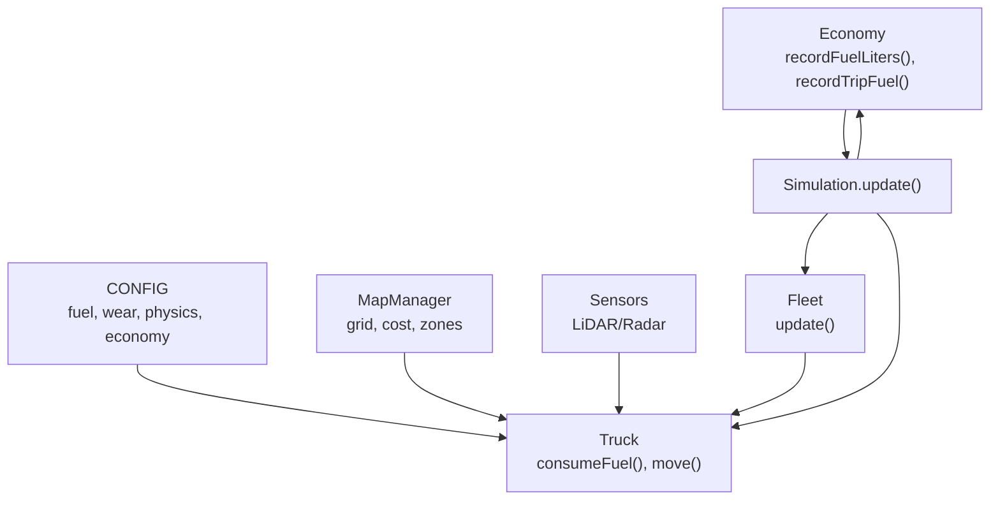
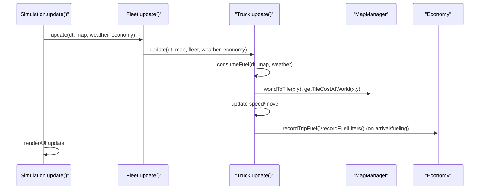
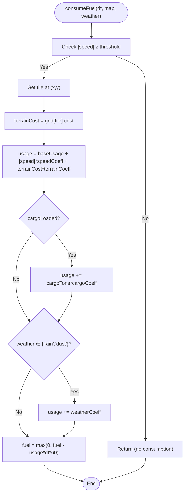
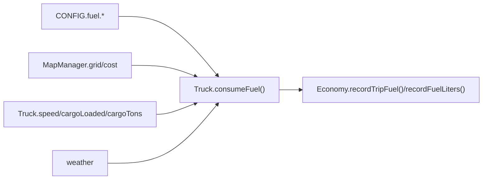

# Fuel Consumption Model

<cite>
**Referenced Files in This Document**
- [config.js](file://config.js)
- [truck.js](file://truck.js)
- [map.js](file://map.js)
- [economy.js](file://economy.js)
- [main.js](file://main.js)
- [sensors.js](file://sensors.js)
- [utils.js](file://utils.js)
- [fleet.js](file://fleet.js)
</cite>

## Table of Contents
1. [Introduction](#introduction)
2. [Project Structure](#project-structure)
3. [Core Components](#core-components)
4. [Architecture Overview](#architecture-overview)
5. [Detailed Component Analysis](#detailed-component-analysis)
6. [Dependency Analysis](#dependency-analysis)
7. [Performance Considerations](#performance-considerations)
8. [Troubleshooting Guide](#troubleshooting-guide)
9. [Conclusion](#conclusion)
10. [Appendices](#appendices)

## Introduction
This document describes the fuel consumption model used by autonomous dump trucks in the simulation. It explains how fuel usage is calculated in real-time during movement, factoring in terrain characteristics, vehicle speed, cargo weight, and weather conditions. It also documents how fuel consumption integrates with the physics system, route planning, and economic metrics to support operational cost and profitability analysis.

## Project Structure
The fuel consumption model spans several modules:
- Configuration defines baseline parameters for fuel usage, wear, physics, and economy.
- Truck encapsulates vehicle state, movement, and fuel/wear consumption.
- Map provides terrain cost and zone information used by the truck.
- Economy tracks fuel spending and trip-level fuel usage for profitability.
- Sensors influence movement behavior and indirectly affect fuel efficiency.
- Fleet coordinates multiple trucks and aggregates shared metrics.
- Main orchestrates updates and passes environment context to trucks.

**Diagram sources**
- [config.js:1-93](file://config.js#L1-L93)
- [truck.js:78-116](file://truck.js#L78-L116)
- [map.js:1-438](file://map.js#L1-L438)
- [sensors.js:1-103](file://sensors.js#L1-L103)
- [fleet.js:20-24](file://fleet.js#L20-L24)
- [main.js:67-80](file://main.js#L67-L80)
- [economy.js:1-66](file://economy.js#L1-L66)

**Section sources**
- [config.js:1-93](file://config.js#L1-L93)
- [truck.js:78-116](file://truck.js#L78-L116)
- [map.js:1-438](file://map.js#L1-L438)
- [sensors.js:1-103](file://sensors.js#L1-L103)
- [fleet.js:20-24](file://fleet.js#L20-L24)
- [main.js:67-80](file://main.js#L67-L80)
- [economy.js:1-66](file://economy.js#L1-L66)

## Core Components
- Fuel consumption algorithm: Computes instantaneous fuel usage per tick based on speed, terrain cost, cargo mass, and weather.
- Terrain-based calculation: Uses the map grid’s cost field to reflect road quality and surface difficulty.
- Speed-dependent efficiency: Adds a term proportional to absolute speed and a higher-order term for dynamic effects.
- Cargo weight impact: Increases fuel usage linearly with loaded tons.
- Weather influence: Adds a fixed increment under rain/dust conditions.
- Economic integration: Records fuel spent per trip and total fuel liters consumed for cost accounting.

Key implementation locations:
- Fuel consumption: [consumeFuel:358-367](file://truck.js#L358-L367)
- Terrain cost extraction: [MapManager.worldToTile:13-15](file://map.js#L13-L15), [MapManager.getTileCostAtWorld:432-436](file://map.js#L432-L436)
- Economy recording: [onArrival:159-222](file://truck.js#L159-L222), [recordTripFuel:31-33](file://economy.js#L31-L33), [recordFuelLiters:25-29](file://economy.js#L25-L29)

**Section sources**
- [truck.js:358-367](file://truck.js#L358-L367)
- [map.js:13-15](file://map.js#L13-L15)
- [map.js:432-436](file://map.js#L432-L436)
- [truck.js:159-222](file://truck.js#L159-L222)
- [economy.js:31-33](file://economy.js#L31-L33)
- [economy.js:25-29](file://economy.js#L25-L29)

## Architecture Overview
The fuel model is invoked during each simulation update cycle. Trucks call consumeFuel(dt, map, weather) after movement and sensor application. The algorithm reads the current tile’s terrain cost, applies speed and cargo multipliers, and adjusts for weather conditions. Economy records fuel usage for cost tracking.

**Diagram sources**
- [main.js:67-80](file://main.js#L67-L80)
- [fleet.js:20-24](file://fleet.js#L20-L24)
- [truck.js:78-116](file://truck.js#L78-L116)
- [truck.js:358-367](file://truck.js#L358-L367)
- [map.js:13-15](file://map.js#L13-L15)
- [map.js:432-436](file://map.js#L432-L436)
- [economy.js:31-33](file://economy.js#L31-L33)
- [economy.js:25-29](file://economy.js#L25-L29)

## Detailed Component Analysis

### Fuel Consumption Algorithm
The algorithm computes fuel usage per simulation tick using the following formula:
- Base usage increases with speed and terrain cost.
- Additional usage scales with cargo mass.
- Weather adds a constant increment under rain/dust.
- The result is integrated over time and clamped to zero.

Mathematical formulation:
- Let:
  - speed = absolute speed of the truck
  - terrainCost = cost of the current tile
  - cargoTons = loaded mass in tons
  - weather = "rain" or "dust" otherwise no extra cost
- Compute instantaneous usage:
  - usage = baseUsage + |speed| × speedCoeff + terrainCost × terrainCoeff
  - if cargoLoaded: usage += cargoTons × cargoCoeff
  - if weather ∈ {"rain","dust"}: usage += weatherCoeff
- Update fuel:
  - fuel = max(0, fuel − usage × dt × 60)

Notes:
- The factor 60 converts per-second units to per-tick scaling.
- Movement below a small threshold is ignored to prevent unnecessary consumption.

Implementation references:
- [consumeFuel:358-367](file://truck.js#L358-L367)
- [CONFIG.fuel parameters:20-27](file://config.js#L20-L27)

**Diagram sources**
- [truck.js:358-367](file://truck.js#L358-L367)
- [config.js:20-27](file://config.js#L20-L27)
- [map.js:13-15](file://map.js#L13-L15)
- [map.js:432-436](file://map.js#L432-L436)

**Section sources**
- [truck.js:358-367](file://truck.js#L358-L367)
- [config.js:20-27](file://config.js#L20-L27)
- [map.js:13-15](file://map.js#L13-L15)
- [map.js:432-436](file://map.js#L432-L436)

### Terrain-Based Calculation
Terrain cost is derived from the map grid:
- Each tile stores a numeric cost reflecting slope and surface roughness.
- The current tile’s cost is used to increase fuel consumption proportionally.
- Road carving reduces tile cost near roads and zones.

Key references:
- Tile-to-world conversion: [MapManager.worldToTile:13-15](file://map.js#L13-L15)
- Cost retrieval: [MapManager.getTileCostAtWorld:432-436](file://map.js#L432-L436)
- Road carving and cost adjustments: [MapManager.carveRoads:76-91](file://map.js#L76-L91), [MapManager.carveZoneRoads:260-293](file://map.js#L260-L293)

**Section sources**
- [map.js:13-15](file://map.js#L13-L15)
- [map.js:432-436](file://map.js#L432-L436)
- [map.js:76-91](file://map.js#L76-L91)
- [map.js:260-293](file://map.js#L260-L293)

### Speed-Dependent Efficiency Factors
- Base usage increases with absolute speed.
- Higher speeds increase rolling resistance and aerodynamic losses, modeled by a linear speed term and a terrain cost term.
- The algorithm also considers traction effects indirectly via speed dynamics (see Physics Integration).

References:
- [consumeFuel:358-367](file://truck.js#L358-L367)
- [CONFIG.fuel.speedCoeff](file://config.js#L23)
- [CONFIG.fuel.terrainCoeff](file://config.js#L24)

**Section sources**
- [truck.js:358-367](file://truck.js#L358-L367)
- [config.js:23](file://config.js#L23)
- [config.js:24](file://config.js#L24)

### Cargo Weight Impact on Fuel Burn Rates
- Loaded cargo adds a proportional increase to fuel usage.
- The coefficient is scaled by 0.01 to match units and magnitude.

References:
- [consumeFuel](file://truck.js#L364)
- [CONFIG.fuel.cargoCoeff](file://config.js#L25)

**Section sources**
- [truck.js:364](file://truck.js#L364)
- [config.js:25](file://config.js#L25)

### Weather Conditions and Fuel Efficiency
- Rain and dust add a fixed increment to fuel usage.
- Traction modifiers affect speed dynamics but fuel usage is a separate additive term.

References:
- [consumeFuel](file://truck.js#L365)
- [CONFIG.fuel.weatherCoeff](file://config.js#L26)
- [CONFIG.physics.rainTraction](file://config.js#L15)
- [CONFIG.physics.dustTraction](file://config.js#L16)

**Section sources**
- [truck.js:365](file://truck.js#L365)
- [config.js:26](file://config.js#L26)
- [config.js:15](file://config.js#L15)
- [config.js:16](file://config.js#L16)

### Distance-Based Consumption Tracking
- Accumulated mileage is tracked per truck to monitor distances traveled.
- Trip-level fuel usage is recorded upon unloading to compute per-trip fuel consumption.

References:
- [Truck.mileage accumulation](file://truck.js#L352)
- [Trip fuel recording on unloading:179-182](file://truck.js#L179-L182)
- [Economy.recordTripFuel:31-33](file://economy.js#L31-L33)

**Section sources**
- [truck.js:352](file://truck.js#L352)
- [truck.js:179-182](file://truck.js#L179-L182)
- [economy.js:31-33](file://economy.js#L31-L33)

### Integration with Physics System
- Speed updates incorporate traction modifiers for rain/dust.
- Movement uses a move scale factor and collision resolution affects speed.
- Fuel consumption is decoupled from physics but uses the same speed value.

References:
- [followRoute speed update with traction:291-298](file://truck.js#L291-L298)
- [move with collision handling:341-356](file://truck.js#L341-L356)
- [CONFIG.physics.moveScale](file://config.js#L17)

**Section sources**
- [truck.js:291-298](file://truck.js#L291-L298)
- [truck.js:341-356](file://truck.js#L341-L356)
- [config.js:17](file://config.js#L17)

### Economic Metrics and Profitability
- Fuel cost is computed from liters consumed and cost per liter.
- Per-trip fuel usage is tracked separately for analytics.
- Profit equals total income minus maintenance cost and fuel cost.

References:
- [Economy.recordFuelLiters:25-29](file://economy.js#L25-L29)
- [Economy.recordTripFuel:31-33](file://economy.js#L31-L33)
- [Economy.getProfit:41-43](file://economy.js#L41-L43)
- [CONFIG.economy.fuelCostPerLiter](file://config.js#L60)
- [CONFIG.economy.maintenanceCost](file://config.js#L62)

**Section sources**
- [economy.js:25-29](file://economy.js#L25-L29)
- [economy.js:31-33](file://economy.js#L31-L33)
- [economy.js:41-43](file://economy.js#L41-L43)
- [config.js:60](file://config.js#L60)
- [config.js:62](file://config.js#L62)

### Parameter Tuning Options
- Fuel parameters:
  - baseUsage, speedCoeff, terrainCoeff, cargoCoeff, weatherCoeff
- Wear parameters (affects planned maintenance):
  - baseRate, speedCoeff, terrainCoeff, cargoCoeff, thresholds
- Economy parameters:
  - fuelCostPerLiter, incomePerTon, maintenanceCost
- Physics parameters affecting speed and traction:
  - maxSpeed, accel, friction, reverseMax, steerBase, steerSpeedFactor, rainTraction, dustTraction, moveScale

References:
- [CONFIG.fuel:20-27](file://config.js#L20-L27)
- [CONFIG.wear:29-37](file://config.js#L29-L37)
- [CONFIG.economy:59-63](file://config.js#L59-L63)
- [CONFIG.physics:8-18](file://config.js#L8-L18)

**Section sources**
- [config.js:20-27](file://config.js#L20-L27)
- [config.js:29-37](file://config.js#L29-L37)
- [config.js:59-63](file://config.js#L59-L63)
- [config.js:8-18](file://config.js#L8-L18)

### Example Scenarios
Below are representative scenarios illustrating how fuel consumption varies across terrains, speeds, and loads. These are conceptual examples to demonstrate the model’s sensitivity to inputs.

- Scenario A: Highway-like surface (low terrain cost), moderate speed, empty truck, clear weather
  - Expected: low fuel usage due to minimal terrain cost and cargo mass.
  - Reference: [consumeFuel:358-367](file://truck.js#L358-L367), [MapManager.getTileCostAtWorld:432-436](file://map.js#L432-L436)

- Scenario B: Rough terrain (high terrain cost), high speed, heavy load, rain
  - Expected: high fuel usage due to increased terrain cost, speed, cargo, and weather coefficient.
  - Reference: [consumeFuel:364-365](file://truck.js#L364-L365), [CONFIG.fuel.terrainCoeff](file://config.js#L24), [CONFIG.fuel.weatherCoeff](file://config.js#L26)

- Scenario C: Dust storm with moderate speed and light load
  - Expected: modest increase from weather coefficient; speed and cargo effects are minor.
  - Reference: [consumeFuel](file://truck.js#L365), [CONFIG.physics.dustTraction](file://config.js#L16)

- Scenario D: Long trip with multiple stops and varying terrain
  - Expected: cumulative fuel usage tracked per trip; total fuel liters recorded for cost computation.
  - Reference: [onArrival unloading:179-182](file://truck.js#L179-L182), [Economy.recordTripFuel:31-33](file://economy.js#L31-L33)

**Section sources**
- [truck.js:358-367](file://truck.js#L358-L367)
- [map.js:432-436](file://map.js#L432-L436)
- [truck.js:364-365](file://truck.js#L364-L365)
- [config.js:24](file://config.js#L24)
- [config.js:26](file://config.js#L26)
- [config.js:16](file://config.js#L16)
- [truck.js:179-182](file://truck.js#L179-L182)
- [economy.js:31-33](file://economy.js#L31-L33)

## Dependency Analysis
The fuel model depends on:
- Configuration values for coefficients and thresholds
- Map grid for terrain cost
- Truck state for speed and cargo
- Weather context for additional fuel increments

**Diagram sources**
- [config.js:20-27](file://config.js#L20-L27)
- [truck.js:358-367](file://truck.js#L358-L367)
- [map.js:432-436](file://map.js#L432-L436)
- [economy.js:31-33](file://economy.js#L31-L33)
- [economy.js:25-29](file://economy.js#L25-L29)

**Section sources**
- [config.js:20-27](file://config.js#L20-L27)
- [truck.js:358-367](file://truck.js#L358-L367)
- [map.js:432-436](file://map.js#L432-L436)
- [economy.js:31-33](file://economy.js#L31-L33)
- [economy.js:25-29](file://economy.js#L25-L29)

## Performance Considerations
- Fuel consumption is computed per tick and only when speed exceeds a small threshold, minimizing overhead.
- Terrain cost lookup is O(1) per tick via tile indexing.
- Weather coefficient addition is constant-time.
- Aggregated economy metrics are updated only on significant events (arrivals, refueling), reducing computational load.

[No sources needed since this section provides general guidance]

## Troubleshooting Guide
Common issues and remedies:
- Fuel depleting too quickly
  - Verify CONFIG.fuel coefficients and ensure cargoCoeff is not excessively high.
  - Confirm that terrain cost is reasonable for the selected map type.
  - References: [CONFIG.fuel:20-27](file://config.js#L20-L27), [MapManager.generate](file://map.js#L62)

- Trucks idle despite sufficient fuel
  - Check FSM thresholds and fuelCritical ratio; ensure state transitions are not prematurely switching to FUELING.
  - References: [Truck.checkTransitions:118-157](file://truck.js#L118-L157), [CONFIG.fsm.fuelCritical](file://config.js#L66)

- Fuel not recorded for trips
  - Ensure onArrival unloading triggers recordTripFuel and deliveryFuelStart is set at loading.
  - References: [Truck.onArrival:159-222](file://truck.js#L159-L222), [Economy.recordTripFuel:31-33](file://economy.js#L31-L33)

**Section sources**
- [config.js:20-27](file://config.js#L20-L27)
- [map.js:62](file://map.js#L62)
- [truck.js:118-157](file://truck.js#L118-L157)
- [config.js:66](file://config.js#L66)
- [truck.js:159-222](file://truck.js#L159-L222)
- [economy.js:31-33](file://economy.js#L31-L33)

## Conclusion
The fuel consumption model integrates terrain, speed, cargo, and weather into a simple yet realistic per-tick calculation. It is tightly coupled with the physics system for speed dynamics and with the economy module for cost tracking. Proper tuning of CONFIG parameters allows modeling of diverse operational environments and supports accurate profitability analysis.

[No sources needed since this section summarizes without analyzing specific files]

## Appendices

### Mathematical Formulation Summary
- Instantaneous usage:
  - usage = baseUsage + |speed| × speedCoeff + terrainCost × terrainCoeff
  - if cargoLoaded: usage += cargoTons × cargoCoeff
  - if weather ∈ {"rain","dust"}: usage += weatherCoeff
- Fuel update:
  - fuel = max(0, fuel − usage × dt × 60)

References:
- [consumeFuel:358-367](file://truck.js#L358-L367)
- [CONFIG.fuel:20-27](file://config.js#L20-L27)

**Section sources**
- [truck.js:358-367](file://truck.js#L358-L367)
- [config.js:20-27](file://config.js#L20-L27)