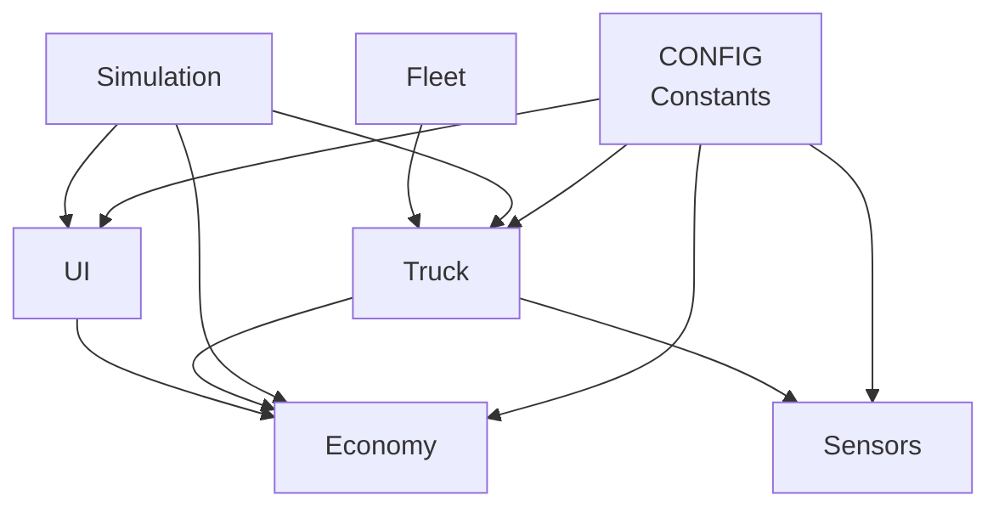
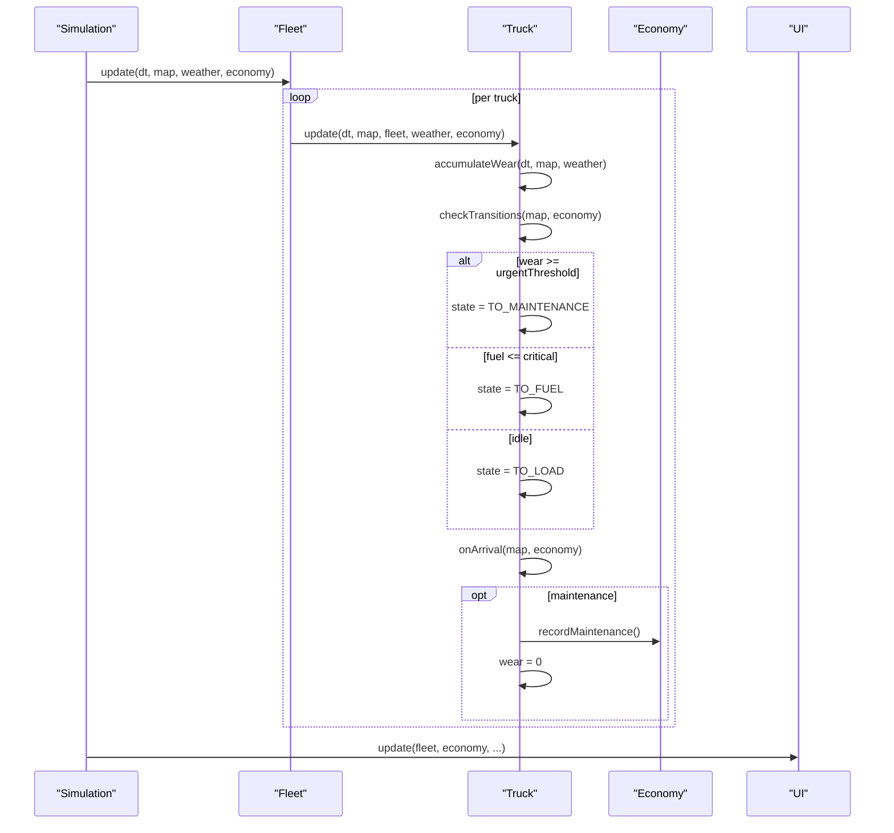
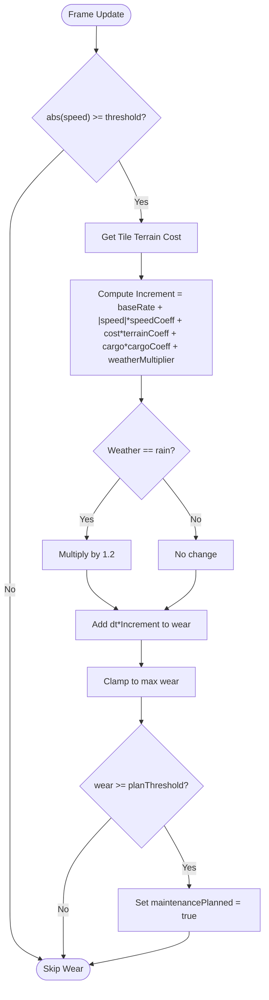
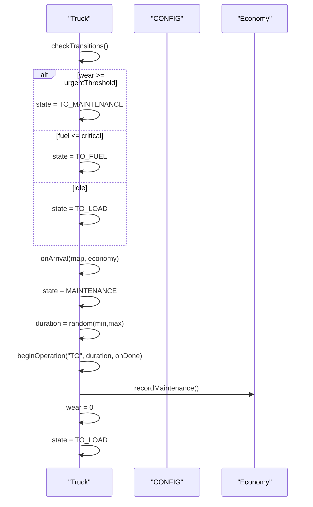
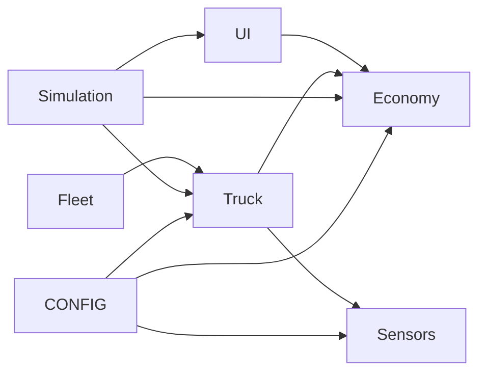

# Maintenance and Wear Tracking

<cite>
**Referenced Files in This Document**
- [config.js](file://config.js)
- [truck.js](file://truck.js)
- [main.js](file://main.js)
- [economy.js](file://economy.js)
- [fleet.js](file://fleet.js)
- [sensors.js](file://sensors.js)
- [ui.js](file://ui.js)
- [utils.js](file://utils.js)
</cite>

## Table of Contents
1. [Introduction](#introduction)
2. [Project Structure](#project-structure)
3. [Core Components](#core-components)
4. [Architecture Overview](#architecture-overview)
5. [Detailed Component Analysis](#detailed-component-analysis)
6. [Dependency Analysis](#dependency-analysis)
7. [Performance Considerations](#performance-considerations)
8. [Troubleshooting Guide](#troubleshooting-guide)
9. [Conclusion](#conclusion)
10. [Appendices](#appendices)

## Introduction
This document explains the maintenance scheduling and wear accumulation system that simulates realistic vehicle maintenance cycles in the autonomous dump truck simulator. It documents the predictive maintenance algorithms, including wear factor calculations, component degradation tracking, preventive maintenance scheduling, and cost prediction models. It also covers maintenance cost calculation methods, service interval determination, and automated maintenance triggering mechanisms. The document includes examples of maintenance schedules under different operational conditions, wear patterns across various truck components, and cost optimization strategies through proactive maintenance planning.

## Project Structure
The simulation consists of several interconnected modules:
- Configuration defines constants for physics, fuel consumption, wear rates, operations, and economic parameters.
- The Truck class encapsulates vehicle state, movement, sensor application, fuel consumption, wear accumulation, and state transitions.
- The Simulation orchestrates updates, rendering, and user interface integration.
- Economy tracks financial metrics including fuel costs, maintenance expenses, deliveries, and profitability.
- Fleet manages multiple trucks and coordinates shared resources.
- Sensors provide environmental awareness and obstacle detection.
- UI renders real-time dashboards and statistics.
- Utilities support mathematical helpers and data formatting.

**Diagram sources**
- [config.js:1-93](file://config.js#L1-L93)
- [truck.js:1-406](file://truck.js#L1-L406)
- [main.js:1-266](file://main.js#L1-L266)
- [economy.js:1-66](file://economy.js#L1-L66)
- [fleet.js:1-65](file://fleet.js#L1-L65)
- [sensors.js:1-103](file://sensors.js#L1-L103)
- [ui.js:1-200](file://ui.js#L1-L200)

**Section sources**
- [config.js:1-93](file://config.js#L1-L93)
- [main.js:1-266](file://main.js#L1-L266)
- [truck.js:1-406](file://truck.js#L1-L406)
- [economy.js:1-66](file://economy.js#L1-L66)
- [fleet.js:1-65](file://fleet.js#L1-L65)
- [sensors.js:1-103](file://sensors.js#L1-L103)
- [ui.js:1-200](file://ui.js#L1-L200)

## Core Components
- Wear Accumulation: Computes incremental wear based on speed, terrain, cargo weight, and weather conditions, with thresholds for planned maintenance and urgent maintenance.
- Preventive Maintenance Scheduling: Triggers planned maintenance when wear reaches a pre-defined threshold and prevents urgent failures by scheduling maintenance proactively.
- Automated Maintenance Triggering: Forces immediate maintenance when wear reaches the urgent threshold, interrupting other operations.
- Cost Prediction Models: Tracks fuel consumption and maintenance costs to compute profitability and efficiency metrics.
- Service Interval Determination: Uses wear thresholds and accumulated mileage to determine optimal maintenance intervals.

**Section sources**
- [truck.js:369-382](file://truck.js#L369-L382)
- [truck.js:118-157](file://truck.js#L118-L157)
- [truck.js:210-222](file://truck.js#L210-L222)
- [economy.js:17-39](file://economy.js#L17-L39)
- [config.js:29-37](file://config.js#L29-L37)

## Architecture Overview
The system integrates wear tracking, state machine transitions, and economic modeling. Trucks continuously accumulate wear during movement and operations, and the state machine decides whether to proceed to load/unload/fueling or to maintenance based on thresholds. The Economy module aggregates costs and revenues to inform maintenance decisions and profitability.

**Diagram sources**
- [main.js:67-80](file://main.js#L67-L80)
- [fleet.js:20-24](file://fleet.js#L20-L24)
- [truck.js:78-116](file://truck.js#L78-L116)
- [truck.js:118-157](file://truck.js#L118-L157)
- [truck.js:159-222](file://truck.js#L159-L222)
- [economy.js:35-39](file://economy.js#L35-L39)

## Detailed Component Analysis

### Wear Factor Calculation and Accumulation
Wear accumulation is computed each frame when the truck is moving. The increment depends on:
- Base rate constant
- Speed coefficient multiplied by absolute speed
- Terrain coefficient multiplied by terrain cost at the current tile
- Cargo coefficient multiplied by loaded tons
- Weather multiplier (rain increases wear by 20%)

After computing the incremental wear, it is clamped to a maximum value and added to the cumulative wear. If wear reaches the planning threshold, a maintenance is marked as planned to enable proactive scheduling.

**Diagram sources**
- [truck.js:369-382](file://truck.js#L369-L382)
- [config.js:29-37](file://config.js#L29-L37)

**Section sources**
- [truck.js:369-382](file://truck.js#L369-L382)
- [config.js:29-37](file://config.js#L29-L37)

### Preventive Maintenance Scheduling
Preventive maintenance is scheduled when wear reaches the planning threshold and no maintenance is currently planned. The system avoids scheduling redundant maintenance while ensuring proactive care before reaching the urgent threshold. This reduces downtime and prevents catastrophic failure.

Key behaviors:
- Planned maintenance flag prevents repeated scheduling.
- Urgent threshold overrides planned scheduling to force immediate maintenance.
- After maintenance, wear resets to zero and the truck resumes normal operations.

**Section sources**
- [truck.js:379-381](file://truck.js#L379-L381)
- [truck.js:210-222](file://truck.js#L210-L222)
- [config.js:34-36](file://config.js#L34-L36)

### Automated Maintenance Triggering Mechanisms
Automated triggering occurs in two scenarios:
- Planned maintenance: When wear reaches the planning threshold and the maintenancePlanned flag is false, the truck transitions to TO_MAINTENANCE.
- Urgent maintenance: When wear reaches the urgent threshold, the truck transitions to TO_MAINTENANCE regardless of planned status.

During maintenance, the operation duration is randomized within configured bounds, and the wear counter is reset upon completion.

**Diagram sources**
- [truck.js:118-157](file://truck.js#L118-L157)
- [truck.js:159-222](file://truck.js#L159-L222)
- [config.js:55-56](file://config.js#L55-L56)
- [economy.js:35-39](file://economy.js#L35-L39)

**Section sources**
- [truck.js:118-157](file://truck.js#L118-L157)
- [truck.js:159-222](file://truck.js#L159-L222)
- [config.js:55-56](file://config.js#L55-L56)
- [economy.js:35-39](file://economy.js#L35-L39)

### Maintenance Cost Calculation Methods
Maintenance cost is tracked centrally in the Economy module:
- Each maintenance event adds a fixed maintenance cost to total maintenance cost and subtracts it from total income.
- Fuel costs are calculated from liters consumed and recorded as expenses.
- Delivery revenue is computed from tons delivered and subtracted from total income.

Profit is derived as total income minus total maintenance cost. Efficiency considers tonnage per hour and normalized by time to reflect productivity relative to resource consumption.

**Section sources**
- [economy.js:35-39](file://economy.js#L35-L39)
- [economy.js:25-29](file://economy.js#L25-L29)
- [economy.js:17-23](file://economy.js#L17-L23)
- [economy.js:41-63](file://economy.js#L41-L63)
- [config.js:60-63](file://config.js#L60-L63)

### Service Interval Determination
Service intervals are determined by wear thresholds:
- Planning threshold: Proactive maintenance scheduling begins when wear reaches this level.
- Urgent threshold: Immediate maintenance is triggered when wear reaches this level.

These thresholds define safe operating windows and help balance maintenance frequency against operational efficiency. The system also records maintenance events to historical data for reporting and optimization.

**Section sources**
- [config.js:34-36](file://config.js#L34-L36)
- [truck.js:379-381](file://truck.js#L379-L381)
- [economy.js:35-39](file://economy.js#L35-L39)

### Predictive Maintenance Algorithms
Predictive maintenance relies on continuous wear monitoring and threshold-based triggers:
- Incremental wear is proportional to operating conditions (speed, terrain, cargo, weather).
- Planned maintenance is scheduled before urgent thresholds to prevent breakdowns.
- Maintenance duration is randomized to simulate variability in service tasks.

Operational conditions affecting wear:
- Rain increases wear by 20%.
- Higher speeds and heavier loads increase wear proportionally.
- Rough terrain multiplies wear by terrain cost.

**Section sources**
- [truck.js:369-382](file://truck.js#L369-L382)
- [config.js:30-37](file://config.js#L30-L37)

### Component Degradation Tracking
Degradation tracking is integrated into the Truck class:
- Wear accumulates continuously during movement and operations.
- State transitions incorporate wear checks to decide next action.
- On completion of maintenance, wear resets to zero.

The Fleet class aggregates wear across all trucks to provide fleet-wide metrics.

**Section sources**
- [truck.js:369-382](file://truck.js#L369-L382)
- [truck.js:118-157](file://truck.js#L118-L157)
- [truck.js:210-222](file://truck.js#L210-L222)
- [fleet.js:59-63](file://fleet.js#L59-L63)

### Cost Optimization Strategies Through Proactive Maintenance Planning
Proactive maintenance planning optimizes costs by:
- Scheduling maintenance before urgent thresholds to reduce emergency repairs and downtime.
- Balancing maintenance frequency with wear accumulation to minimize total maintenance cost while avoiding catastrophic failures.
- Using economic metrics to evaluate efficiency and adjust operational parameters.

The UI displays wear percentages and fuel levels, enabling operators to monitor and adjust behavior for cost optimization.

**Section sources**
- [ui.js:122-158](file://ui.js#L122-L158)
- [economy.js:41-63](file://economy.js#L41-L63)
- [truck.js:379-381](file://truck.js#L379-L381)

## Dependency Analysis
The system exhibits clear separation of concerns:
- CONFIG centralizes constants for physics, wear, operations, and economy.
- Truck depends on CONFIG for thresholds and coefficients, and on Economy for recording maintenance.
- Simulation coordinates updates and passes environment and economy to trucks.
- Fleet manages multiple trucks and provides shared obstacles for routing.
- Sensors influence movement and braking, indirectly affecting wear and fuel consumption.
- UI consumes Economy and Truck states for visualization.

**Diagram sources**
- [config.js:1-93](file://config.js#L1-93)
- [truck.js:1-406](file://truck.js#L1-L406)
- [main.js:1-266](file://main.js#L1-L266)
- [economy.js:1-66](file://economy.js#L1-L66)
- [fleet.js:1-65](file://fleet.js#L1-L65)
- [sensors.js:1-103](file://sensors.js#L1-L103)
- [ui.js:1-200](file://ui.js#L1-L200)

**Section sources**
- [config.js:1-93](file://config.js#L1-L93)
- [truck.js:1-406](file://truck.js#L1-L406)
- [main.js:1-266](file://main.js#L1-L266)
- [economy.js:1-66](file://economy.js#L1-L66)
- [fleet.js:1-65](file://fleet.js#L1-L65)
- [sensors.js:1-103](file://sensors.js#L1-L103)
- [ui.js:1-200](file://ui.js#L1-L200)

## Performance Considerations
- Wear computation is O(1) per frame and lightweight, scaling with speed, terrain, cargo, and weather.
- State transitions occur infrequently and are gated by thresholds, minimizing overhead.
- Economy aggregation is constant-time per event and per frame.
- UI updates are throttled by requestAnimationFrame and only recompute when necessary.

[No sources needed since this section provides general guidance]

## Troubleshooting Guide
Common issues and resolutions:
- Maintenance not triggered: Verify wear thresholds and that maintenancePlanned flag is not preventing scheduling. Confirm urgent threshold is not exceeded prematurely.
- Unexpected fuel consumption spikes: Check speed coefficients, terrain coefficients, cargo coefficients, and weather coefficients in CONFIG.
- Excessive wear accumulation: Review terrain costs and ensure cargo loading aligns with coefficients.
- Economic reports show negative profit: Confirm maintenance cost and fuel cost are correctly configured and recorded.

**Section sources**
- [config.js:29-37](file://config.js#L29-L37)
- [config.js:60-63](file://config.js#L60-L63)
- [economy.js:35-39](file://economy.js#L35-L39)
- [economy.js:25-29](file://economy.js#L25-L29)
- [truck.js:118-157](file://truck.js#L118-L157)

## Conclusion
The maintenance and wear tracking system provides a robust framework for simulating realistic vehicle maintenance cycles. By combining configurable wear factors, threshold-based scheduling, and economic modeling, the system enables proactive maintenance planning that optimizes cost and reliability. Operators can leverage wear and fuel metrics to adjust driving behavior and improve efficiency while maintaining predictable maintenance intervals.

[No sources needed since this section summarizes without analyzing specific files]

## Appendices

### Example Maintenance Schedules Under Different Operational Conditions
- Normal conditions: Moderate speed, light cargo, dry weather. Maintenance scheduled around the planning threshold; wear growth gradual.
- Heavy load conditions: High cargo weight increases wear increment; schedule maintenance earlier to avoid urgent threshold.
- Rough terrain: Elevated terrain coefficient accelerates wear; plan maintenance more frequently.
- Rain conditions: 20% increase in wear multiplier; schedule maintenance sooner to mitigate risk.
- High-speed operations: Increased speed coefficient leads to faster wear; consider reducing speed or increasing maintenance intervals.

[No sources needed since this section provides general guidance]

### Wear Patterns Across Various Truck Components
- Engine and drivetrain: Accelerated by speed and cargo; influenced by weather.
- Tires and suspension: Heavily affected by terrain cost and rough surfaces.
- Brakes: Subject to increased wear during frequent stops and braking in traffic.
- Fuel system: Consumes fuel proportional to speed, terrain, and weather; affects operational costs.

[No sources needed since this section provides general guidance]