# Performance Analytics and Reporting

<cite>
**Referenced Files in This Document**
- [main.js](file://main.js)
- [fleet.js](file://fleet.js)
- [truck.js](file://truck.js)
- [economy.js](file://economy.js)
- [sensors.js](file://sensors.js)
- [ui.js](file://ui.js)
- [renderer.js](file://renderer.js)
- [config.js](file://config.js)
- [utils.js](file://utils.js)
- [map.js](file://map.js)
</cite>

## Table of Contents
1. [Introduction](#introduction)
2. [Project Structure](#project-structure)
3. [Core Components](#core-components)
4. [Architecture Overview](#architecture-overview)
5. [Detailed Component Analysis](#detailed-component-analysis)
6. [Dependency Analysis](#dependency-analysis)
7. [Performance Considerations](#performance-considerations)
8. [Troubleshooting Guide](#troubleshooting-guide)
9. [Conclusion](#conclusion)
10. [Appendices](#appendices)

## Introduction
This document describes the performance analytics and reporting system for an autonomous truck fleet simulation. It focuses on real-time statistics tracking, trip efficiency calculations, fuel consumption analytics, revenue and profit monitoring, and CSV export for external reporting. It also covers shift statistics computation, efficiency scoring, comparative analysis, and dashboard-style visualizations.

## Project Structure
The system is organized around a central simulation loop that updates trucks, tracks economic outcomes, and renders UI and charts. Key modules include:
- Simulation orchestration and lifecycle
- Fleet and individual truck state machines
- Economic accounting and shift statistics
- Sensor suite for perception and collision avoidance
- Rendering pipeline for charts and UI
- Configuration constants and utilities

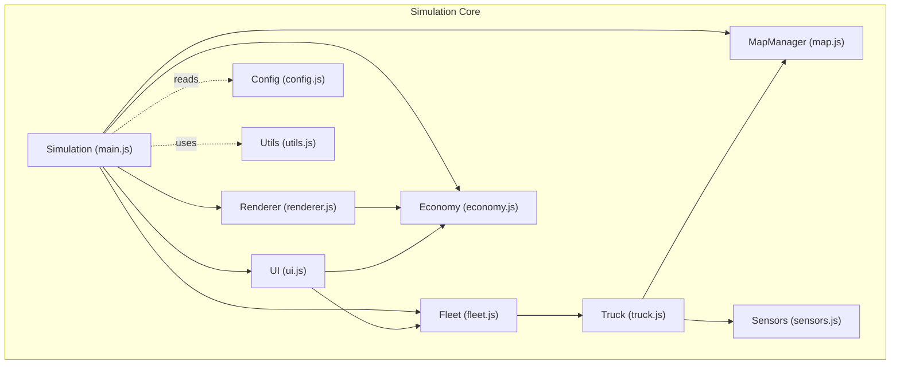

**Diagram sources**
- [main.js:1-266](file://main.js#L1-L266)
- [map.js:1-438](file://map.js#L1-L438)
- [fleet.js:1-65](file://fleet.js#L1-L65)
- [truck.js:1-406](file://truck.js#L1-L406)
- [economy.js:1-66](file://economy.js#L1-L66)
- [sensors.js:1-103](file://sensors.js#L1-L103)
- [ui.js:1-200](file://ui.js#L1-L200)
- [renderer.js:1-437](file://renderer.js#L1-L437)
- [config.js:1-93](file://config.js#L1-L93)
- [utils.js:1-102](file://utils.js#L1-L102)

**Section sources**
- [main.js:1-266](file://main.js#L1-L266)
- [config.js:1-93](file://config.js#L1-L93)

## Core Components
- Simulation orchestrator: runs the game loop, updates trucks, handles manual mode, and triggers rendering and UI updates.
- Fleet manager: maintains per-truck state, computes fleet-level aggregates (average fuel/wear).
- Truck state machine: AI-driven movement, operation scheduling, collision avoidance, fuel and wear accumulation, and transitions between states.
- Economy tracker: records deliveries, fuel purchases, maintenance events, and computes shift statistics and profit.
- Sensors: LiDAR and radar simulations with weather effects and obstacle detection.
- Renderer: draws the map, trucks, routes, mini-map, sensor displays, and performance charts.
- UI: presents per-truck cards, shift statistics, and CSV export button.

**Section sources**
- [main.js:67-223](file://main.js#L67-L223)
- [fleet.js:1-65](file://fleet.js#L1-L65)
- [truck.js:78-116](file://truck.js#L78-L116)
- [economy.js:1-66](file://economy.js#L1-L66)
- [sensors.js:1-103](file://sensors.js#L1-L103)
- [renderer.js:390-435](file://renderer.js#L390-L435)
- [ui.js:122-198](file://ui.js#L122-L198)

## Architecture Overview
The simulation loop updates trucks and the economy, then renders charts and UI. Trucks record fuel usage and wear during movement and operations, and the economy accumulates income and costs. The UI exposes shift statistics and CSV export.

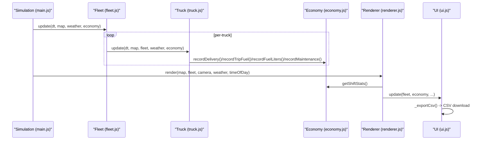

**Diagram sources**
- [main.js:67-223](file://main.js#L67-L223)
- [fleet.js:20-24](file://fleet.js#L20-L24)
- [truck.js:159-222](file://truck.js#L159-L222)
- [economy.js:17-39](file://economy.js#L17-L39)
- [renderer.js:390-435](file://renderer.js#L390-L435)
- [ui.js:175-198](file://ui.js#L175-L198)

## Detailed Component Analysis

### Real-Time Statistics Tracking
- Per-truck telemetry: fuel level, wear percentage, cargo tonnage, state, and task.
- Fleet-level aggregates: average fuel percentage and average wear across trucks.
- Shift statistics: computed from cumulative economy metrics and elapsed time.

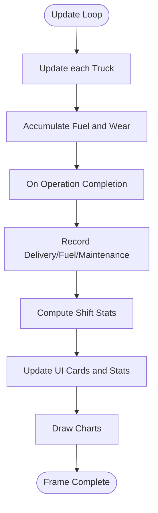

**Diagram sources**
- [main.js:67-223](file://main.js#L67-L223)
- [truck.js:358-382](file://truck.js#L358-L382)
- [economy.js:17-64](file://economy.js#L17-L64)
- [ui.js:122-158](file://ui.js#L122-L158)
- [renderer.js:390-435](file://renderer.js#L390-L435)

**Section sources**
- [ui.js:122-158](file://ui.js#L122-L158)
- [economy.js:45-64](file://economy.js#L45-L64)
- [fleet.js:53-63](file://fleet.js#L53-L63)

### Trip Efficiency Calculations
- Average fuel per trip: sum of fuel consumed during trips divided by number of trips.
- Average tons per trip: sum of delivered tons divided by number of trips.
- Tonnes per hour: total delivered tons divided by shift hours.
- Efficiency score: profit normalized against tonnes-per-hour and time, preventing division by zero.

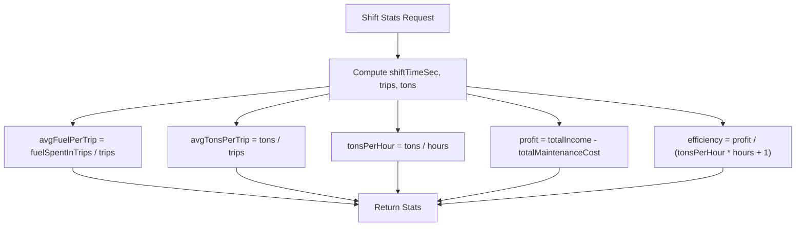

**Diagram sources**
- [economy.js:45-64](file://economy.js#L45-L64)

**Section sources**
- [economy.js:45-64](file://economy.js#L45-L64)

### Fuel Consumption Analytics
- Instantaneous fuel usage depends on speed, terrain cost, cargo weight, and weather conditions.
- Accumulated per-trip fuel recorded when unloading; total fuel liters tracked for cost calculations.
- Fleet-wide fuel percentage computed as mean across trucks.

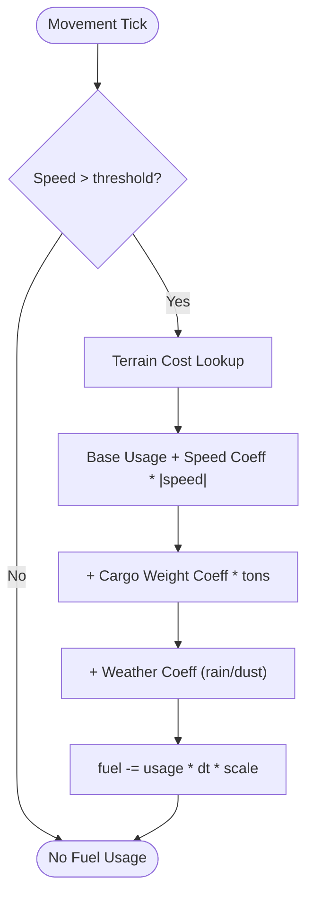

**Diagram sources**
- [truck.js:358-367](file://truck.js#L358-L367)
- [economy.js:31-33](file://economy.js#L31-L33)
- [fleet.js:53-57](file://fleet.js#L53-L57)

**Section sources**
- [truck.js:358-367](file://truck.js#L358-L367)
- [economy.js:25-33](file://economy.js#L25-L33)
- [fleet.js:53-57](file://fleet.js#L53-L57)

### Revenue Generation and Profit Margin Analysis
- Income from deliveries: tons delivered multiplied by income per ton.
- Costs: fuel purchase cost and maintenance cost per event.
- Profit: income minus maintenance cost; profit margin derived from efficiency formula.

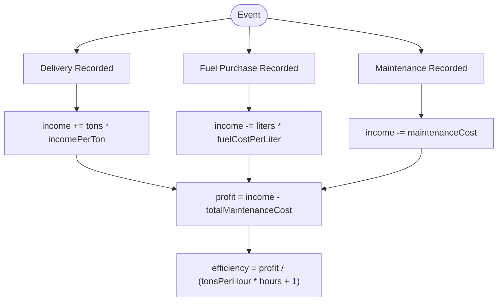

**Diagram sources**
- [economy.js:17-39](file://economy.js#L17-L39)
- [config.js:59-63](file://config.js#L59-L63)

**Section sources**
- [economy.js:17-39](file://economy.js#L17-L39)
- [config.js:59-63](file://config.js#L59-L63)

### CSV Export Functionality
- Exports a CSV with key metrics: shift time, trips, total tons, average fuel per trip, total fuel liters, maintenance cost, profit, and efficiency percentage.
- Uses a Blob and anchor element to trigger a browser download.

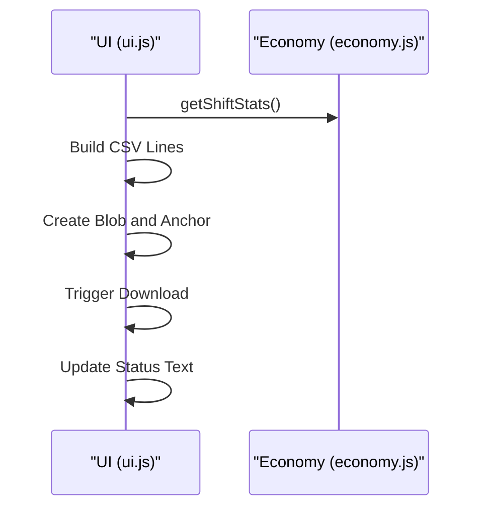

**Diagram sources**
- [ui.js:175-198](file://ui.js#L175-L198)
- [economy.js:45-64](file://economy.js#L45-L64)

**Section sources**
- [ui.js:175-198](file://ui.js#L175-L198)

### Historical Data Tracking and Trend Analysis
- Economy history stores discrete events (deliveries and maintenance) with timestamps in seconds since shift start.
- Renderer’s chart visualization displays normalized bars for fuel, tons, and profit, enabling trend observation over time.

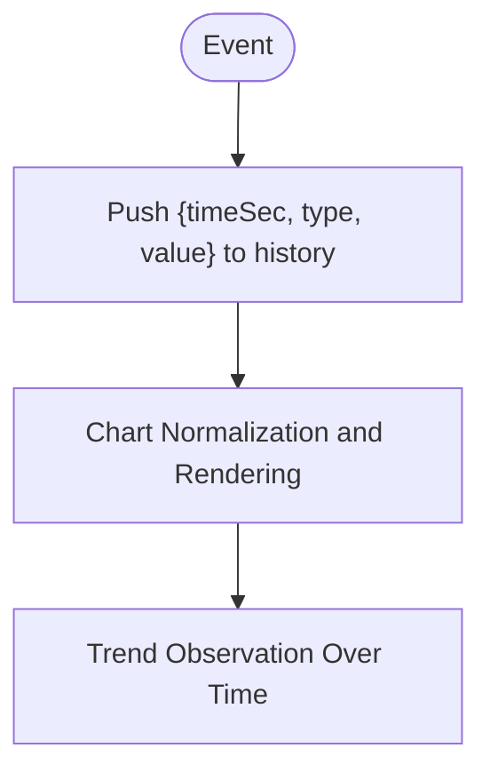

**Diagram sources**
- [economy.js:22](file://economy.js#L22)
- [economy.js:38](file://economy.js#L38)
- [renderer.js:390-435](file://renderer.js#L390-L435)

**Section sources**
- [economy.js:14](file://economy.js#L14)
- [economy.js:22](file://economy.js#L22)
- [economy.js:38](file://economy.js#L38)
- [renderer.js:390-435](file://renderer.js#L390-L435)

### Shift Statistics Calculation Methods
- Shift time in seconds computed from start time.
- Aggregates: total trips, total tons, total fuel liters, total maintenance cost.
- Derived metrics: average fuel per trip, average tons per trip, tonnes per hour, profit, and efficiency.

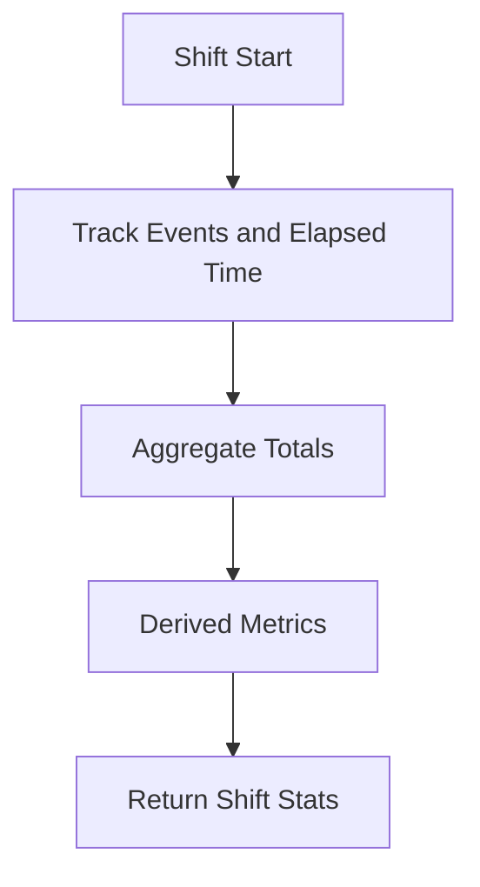

**Diagram sources**
- [economy.js:6-15](file://economy.js#L6-L15)
- [economy.js:45-64](file://economy.js#L45-L64)

**Section sources**
- [economy.js:6-15](file://economy.js#L6-L15)
- [economy.js:45-64](file://economy.js#L45-L64)

### Efficiency Scoring Algorithms
- Efficiency score normalizes profit against tonnes-per-hour and time to avoid division by zero and to penalize low productivity.
- Fleet-level averages (fuel and wear) provide comparative insights across trucks.

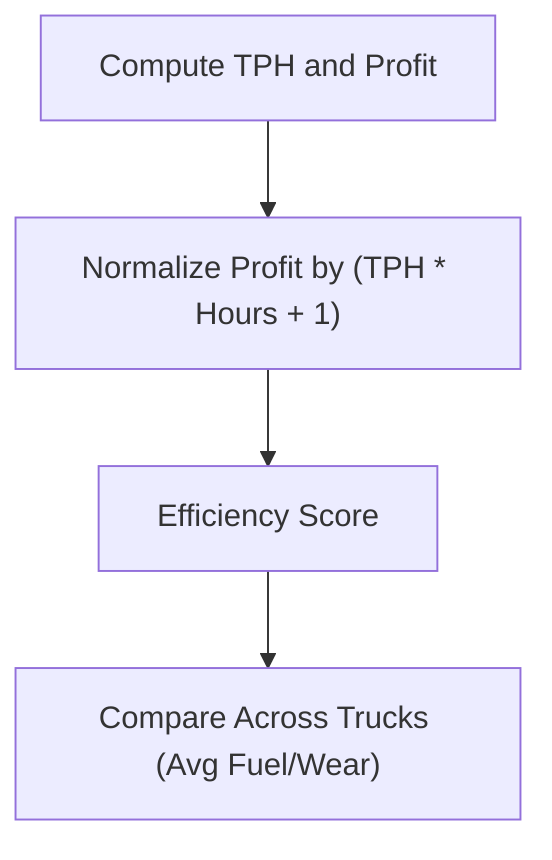

**Diagram sources**
- [economy.js:62](file://economy.js#L62)
- [fleet.js:53-63](file://fleet.js#L53-L63)

**Section sources**
- [economy.js:62](file://economy.js#L62)
- [fleet.js:53-63](file://fleet.js#L53-L63)

### Comparative Analysis Features
- Per-truck cards show fuel percentage, wear percentage, cargo status, and current state.
- Fleet averages enable quick comparative analysis of fuel efficiency and component wear.

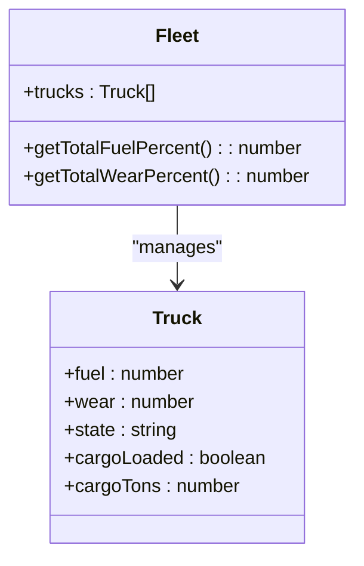

**Diagram sources**
- [fleet.js:53-63](file://fleet.js#L53-L63)
- [truck.js:1-60](file://truck.js#L1-L60)

**Section sources**
- [ui.js:122-158](file://ui.js#L122-L158)
- [fleet.js:53-63](file://fleet.js#L53-L63)

### Performance Dashboards and KPIs
- Dashboard elements:
  - Shift duration
  - Total trips and delivered tons
  - Average fuel per trip and total fuel liters
  - Maintenance cost and profit
  - Efficiency percentage
- Visualizations:
  - Bar charts for fuel, tons, and profit with normalization and directional coloring.

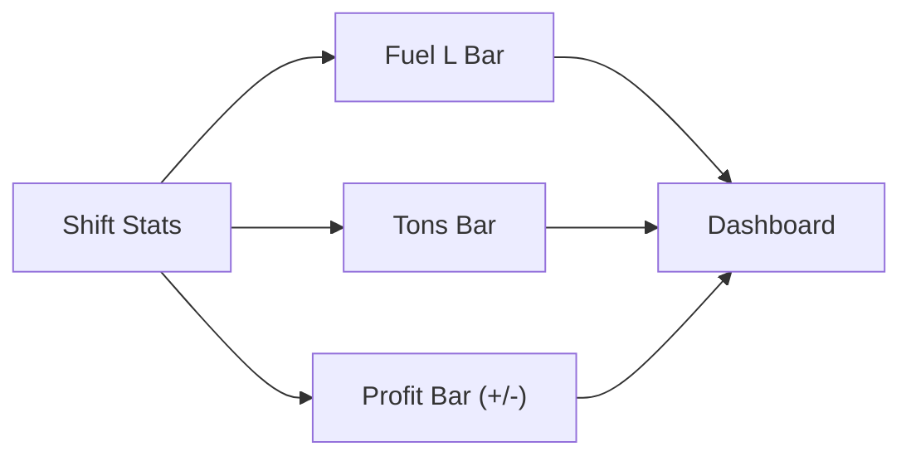

**Diagram sources**
- [ui.js:142-154](file://ui.js#L142-L154)
- [renderer.js:402-434](file://renderer.js#L402-L434)

**Section sources**
- [ui.js:142-154](file://ui.js#L142-L154)
- [renderer.js:402-434](file://renderer.js#L402-L434)

### Reporting Workflows
- Manual mode actions (loading, unloading, refueling, maintenance) trigger economy recordings and state transitions.
- UI periodically requests shift stats and updates cards and charts.
- CSV export captures a snapshot of current shift metrics.

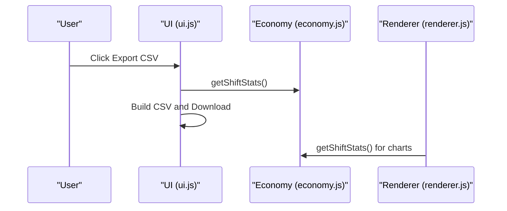

**Diagram sources**
- [ui.js:175-198](file://ui.js#L175-L198)
- [economy.js:45-64](file://economy.js#L45-L64)
- [renderer.js:390-435](file://renderer.js#L390-L435)

**Section sources**
- [ui.js:175-198](file://ui.js#L175-L198)
- [main.js:148-207](file://main.js#L148-L207)

## Dependency Analysis
- Simulation depends on MapManager for routing and zones, Fleet for per-truck orchestration, Economy for financial metrics, and Renderer/UI for visualization.
- Truck depends on Sensors for perception and MapManager for spatial queries.
- UI and Renderer depend on Economy for shift stats and on Fleet for per-truck data.

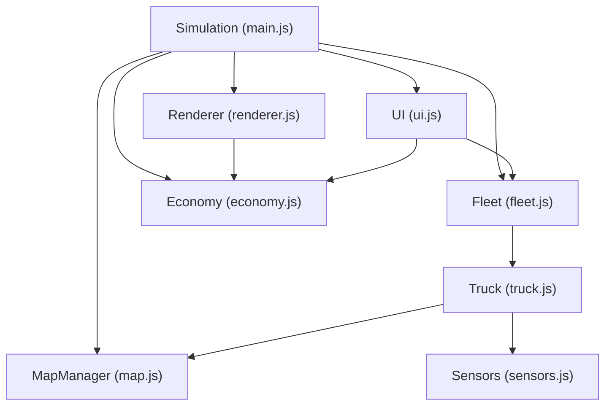

**Diagram sources**
- [main.js:1-45](file://main.js#L1-L45)
- [map.js:1-7](file://map.js#L1-L7)
- [fleet.js:1-7](file://fleet.js#L1-L7)
- [truck.js:1-31](file://truck.js#L1-L31)
- [economy.js:1-5](file://economy.js#L1-L5)
- [renderer.js:24-36](file://renderer.js#L24-L36)
- [ui.js:1-28](file://ui.js#L1-L28)

**Section sources**
- [main.js:1-45](file://main.js#L1-L45)
- [map.js:1-7](file://map.js#L1-L7)
- [fleet.js:1-7](file://fleet.js#L1-L7)
- [truck.js:1-31](file://truck.js#L1-L31)
- [economy.js:1-5](file://economy.js#L1-L5)
- [renderer.js:24-36](file://renderer.js#L24-L36)
- [ui.js:1-28](file://ui.js#L1-L28)

## Performance Considerations
- Fuel and wear computations are O(1) per tick and depend on speed, terrain, and cargo.
- Route planning uses A* with a priority queue; path smoothing reduces waypoints.
- Sensor casting loops are bounded by ray counts; weather introduces noise and range adjustments.
- Rendering charts and UI updates occur once per frame; CSV export is synchronous and lightweight.

[No sources needed since this section provides general guidance]

## Troubleshooting Guide
- CSV export does nothing: ensure the economy module is initialized and available in the global scope.
- Fuel or wear not updating: verify movement ticks and that speed exceeds thresholds.
- Efficiency appears zero: confirm tonnes-per-hour is non-zero to avoid division by zero in the efficiency formula.
- Charts not appearing: check that the chart canvas exists and the context is available.

**Section sources**
- [ui.js:175-198](file://ui.js#L175-L198)
- [truck.js:358-367](file://truck.js#L358-L367)
- [economy.js:62](file://economy.js#L62)
- [renderer.js:390-435](file://renderer.js#L390-L435)

## Conclusion
The system provides a robust foundation for autonomous fleet performance analytics, combining real-time telemetry, economic accounting, and visual dashboards. It supports CSV exports for external reporting, historical event tracking, and comparative analysis across trucks. The modular design enables straightforward extension for additional KPIs and reporting formats.

[No sources needed since this section summarizes without analyzing specific files]

## Appendices

### Key Metrics and Definitions
- Shift time: seconds elapsed since shift start.
- Trips: number of completed deliveries.
- Tons: total delivered tonnes.
- Avg fuel per trip: total fuel consumed during trips divided by trips.
- Total fuel liters: total liters purchased.
- Maintenance cost: total cost of planned/unplanned maintenance.
- Profit: income minus maintenance cost.
- Efficiency: normalized profit metric to prevent division by zero.

**Section sources**
- [economy.js:45-64](file://economy.js#L45-L64)