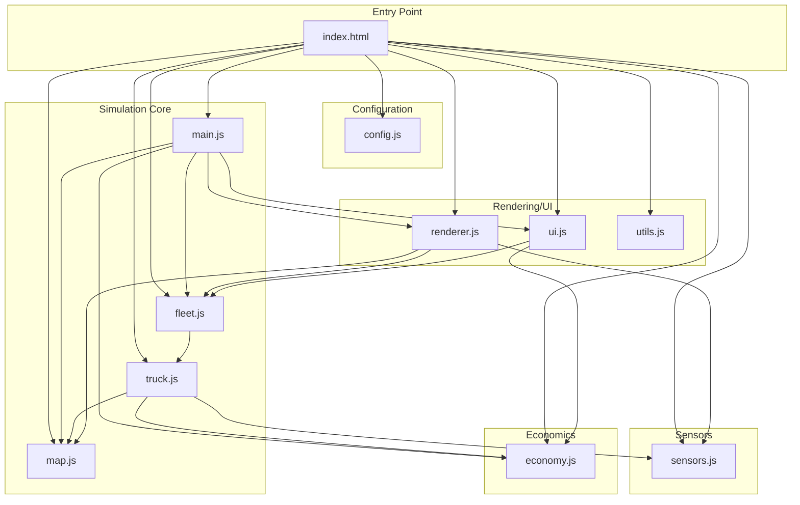
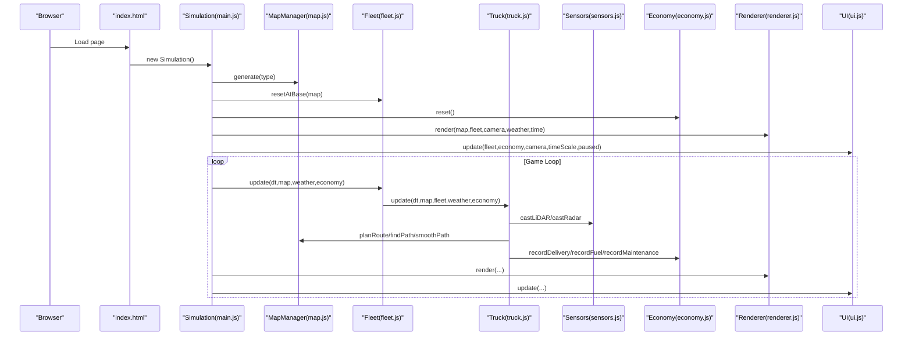
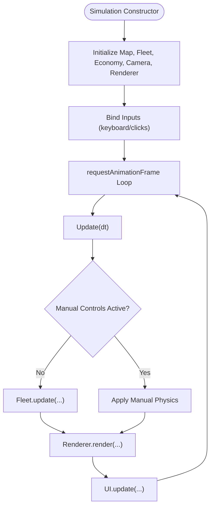
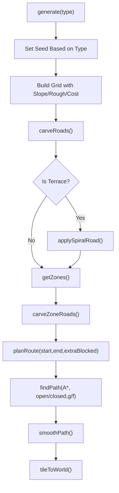
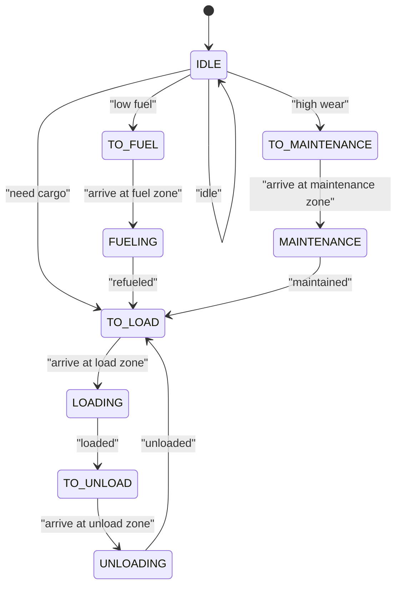
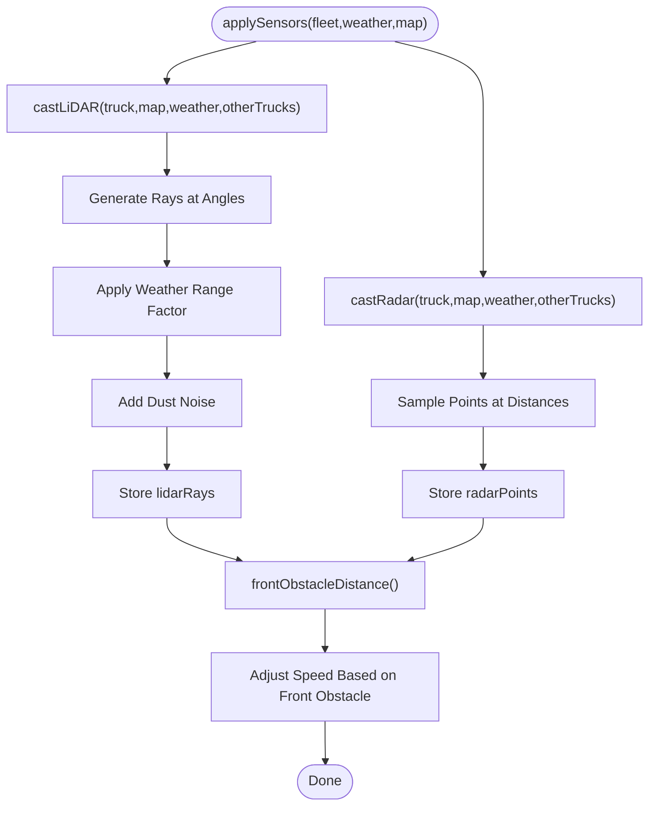
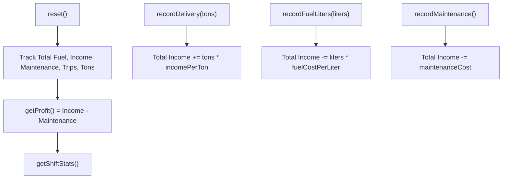
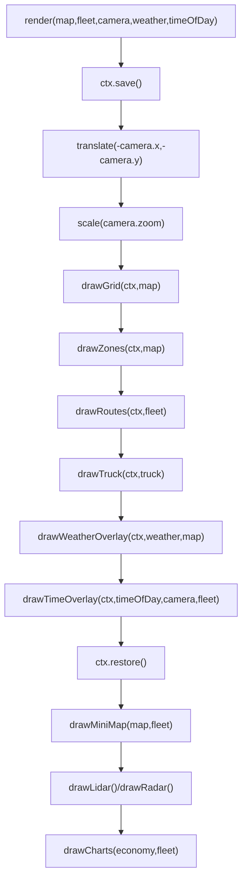
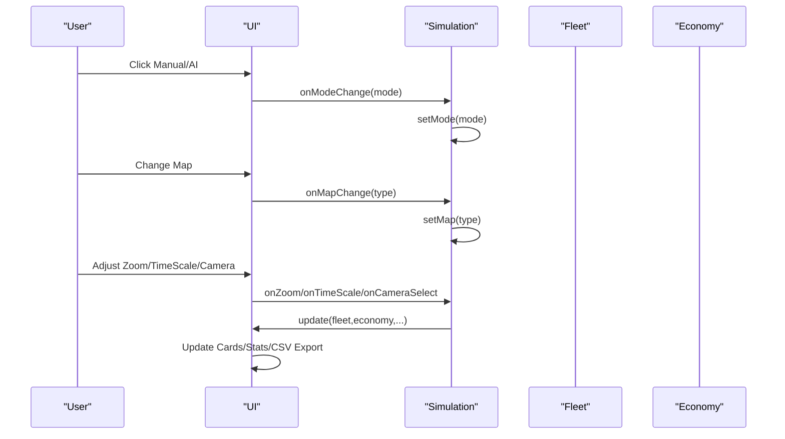
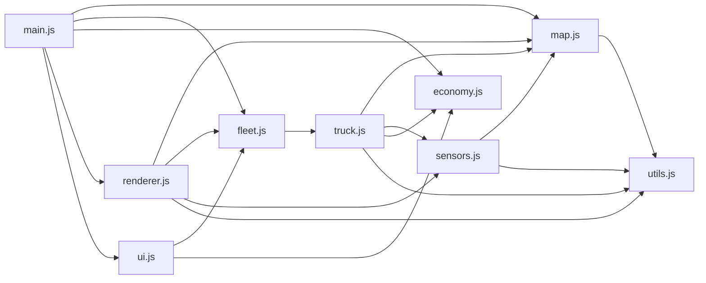

# Project Overview

<cite>
**Referenced Files in This Document**
- [README.txt](file://README.txt)
- [index.html](file://index.html)
- [config.js](file://config.js)
- [main.js](file://main.js)
- [map.js](file://map.js)
- [truck.js](file://truck.js)
- [sensors.js](file://sensors.js)
- [economy.js](file://economy.js)
- [fleet.js](file://fleet.js)
- [renderer.js](file://renderer.js)
- [ui.js](file://ui.js)
- [utils.js](file://utils.js)
</cite>

## Table of Contents
1. [Introduction](#introduction)
2. [Project Structure](#project-structure)
3. [Core Components](#core-components)
4. [Architecture Overview](#architecture-overview)
5. [Detailed Component Analysis](#detailed-component-analysis)
6. [Dependency Analysis](#dependency-analysis)
7. [Performance Considerations](#performance-considerations)
8. [Troubleshooting Guide](#troubleshooting-guide)
9. [Conclusion](#conclusion)
10. [Appendices](#appendices)

## Introduction
This autonomous dump truck simulator is an educational interactive application designed to teach students, educators, and researchers how autonomous vehicles navigate in real-world mining environments. It demonstrates dual control modes (AI and manual), A* pathfinding with dynamic obstacle avoidance, multi-modal sensor simulation (LiDAR and radar), economic modeling with fuel consumption tracking, and realistic terrain generation. The simulation runs entirely in a modern browser without requiring external libraries or installations.

Key learning outcomes include understanding autonomous navigation, sensor fusion, path planning, resource management, and production economics in constrained industrial environments.

## Project Structure
The project is organized into 12 modular JavaScript files that collaborate to deliver a cohesive simulation experience. The structure follows a clear separation of concerns:
- Configuration and constants
- Simulation orchestration
- Map generation and pathfinding
- Vehicle dynamics and AI behavior
- Sensor simulation
- Economic modeling
- Rendering and UI
- Utility helpers

**Diagram sources**
- [index.html:245-254](file://index.html#L245-L254)
- [main.js:1-45](file://main.js#L1-L45)
- [map.js:1-74](file://map.js#L1-L74)
- [truck.js:1-31](file://truck.js#L1-L31)
- [sensors.js:1-103](file://sensors.js#L1-L103)
- [economy.js:1-66](file://economy.js#L1-L66)
- [fleet.js:1-65](file://fleet.js#L1-L65)
- [renderer.js:24-66](file://renderer.js#L24-L66)
- [ui.js:1-29](file://ui.js#L1-L29)
- [utils.js:1-102](file://utils.js#L1-L102)

**Section sources**
- [index.html:1-257](file://index.html#L1-L257)
- [config.js:1-93](file://config.js#L1-L93)

## Core Components
- Configuration module defines constants for physics, fuel, wear, sensors, operations, economy, finite-state machine behavior, fleet coordination, camera, and time scaling.
- Simulation orchestrator manages global state, input handling, time stepping, pause/resume, and rendering updates.
- Map manager generates realistic mining terrains, carves roads, defines operational zones, and computes A* routes with smoothing.
- Fleet coordinates multiple trucks, handles collision avoidance, and exposes obstacle tiles for dynamic path replanning.
- Truck encapsulates vehicle state, AI transitions, route following, sensor application, fuel/wear accumulation, and operation scheduling.
- Sensors simulate LiDAR and radar with weather-dependent range and noise characteristics.
- Economy tracks deliveries, fuel purchases, maintenance costs, and computes profitability metrics.
- Renderer draws the grid, zones, routes, trucks, weather/time overlays, and auxiliary sensor displays.
- UI presents controls, status cards, charts, and export functionality.
- Utilities provide vector math, priority queues, and helper functions.

**Section sources**
- [config.js:1-93](file://config.js#L1-L93)
- [main.js:1-266](file://main.js#L1-L266)
- [map.js:1-438](file://map.js#L1-L438)
- [fleet.js:1-65](file://fleet.js#L1-L65)
- [truck.js:1-406](file://truck.js#L1-L406)
- [sensors.js:1-103](file://sensors.js#L1-L103)
- [economy.js:1-66](file://economy.js#L1-L66)
- [renderer.js:24-437](file://renderer.js#L24-L437)
- [ui.js:1-200](file://ui.js#L1-L200)
- [utils.js:1-102](file://utils.js#L1-L102)

## Architecture Overview
The simulation uses a central Simulation class that initializes subsystems, processes user input, updates physics and AI, and renders the scene. The rendering pipeline translates world coordinates to screen space, applies camera transforms, and draws grid tiles, zones, routes, and vehicles. Auxiliary canvases visualize LiDAR and radar data, while UI panels display fleet status, economic metrics, and environmental controls.

**Diagram sources**
- [main.js:1-266](file://main.js#L1-L266)
- [map.js:25-74](file://map.js#L25-L74)
- [fleet.js:20-24](file://fleet.js#L20-L24)
- [truck.js:78-116](file://truck.js#L78-L116)
- [sensors.js:9-103](file://sensors.js#L9-L103)
- [economy.js:6-15](file://economy.js#L6-L15)
- [renderer.js:38-66](file://renderer.js#L38-L66)
- [ui.js:122-158](file://ui.js#L122-L158)

## Detailed Component Analysis

### Simulation Orchestration
The Simulation class coordinates initialization, input binding, map selection, camera control, and the main game loop. It toggles between manual and AI modes, handles keyboard input for manual driving, and triggers operations at designated zones.

**Diagram sources**
- [main.js:1-45](file://main.js#L1-L45)
- [main.js:67-80](file://main.js#L67-L80)
- [main.js:114-146](file://main.js#L114-L146)
- [main.js:209-223](file://main.js#L209-L223)

**Section sources**
- [main.js:1-266](file://main.js#L1-L266)

### Map Generation and Pathfinding
The MapManager generates procedurally generated mining terrains with varied slopes and roughness, carves roads and zone connections, and implements A* pathfinding with diagonal movement cost heuristics. It smooths paths and computes deviations to trigger replanning.

**Diagram sources**
- [map.js:25-74](file://map.js#L25-L74)
- [map.js:76-194](file://map.js#L76-L194)
- [map.js:196-293](file://map.js#L196-L293)
- [map.js:414-430](file://map.js#L414-L430)

**Section sources**
- [map.js:1-438](file://map.js#L1-L438)

### Truck AI and Behavior
Each Truck implements a finite state machine transitioning between idle, moving to destinations, and performing operations. It plans routes, follows waypoints, avoids obstacles using LiDAR, and consumes fuel/wears parts based on speed, terrain, and cargo.

**Diagram sources**
- [truck.js:118-157](file://truck.js#L118-L157)
- [truck.js:159-222](file://truck.js#L159-L222)
- [truck.js:246-266](file://truck.js#L246-L266)
- [truck.js:268-318](file://truck.js#L268-L318)

**Section sources**
- [truck.js:1-406](file://truck.js#L1-L406)

### Sensor Simulation (LiDAR and Radar)
Sensors cast rays around the vehicle to detect walls and other trucks, with weather affecting visibility and adding noise. Front-sector analysis enables braking logic and avoidance steering.

**Diagram sources**
- [sensors.js:9-103](file://sensors.js#L9-L103)
- [truck.js:320-324](file://truck.js#L320-L324)
- [truck.js:285-289](file://truck.js#L285-L289)

**Section sources**
- [sensors.js:1-103](file://sensors.js#L1-L103)
- [truck.js:320-324](file://truck.js#L320-L324)

### Economic Modeling
The Economy class tracks deliveries, fuel purchases, and maintenance costs, computing profit and shift statistics including average fuel per trip, tons per hour, and efficiency metrics.

**Diagram sources**
- [economy.js:6-15](file://economy.js#L6-L15)
- [economy.js:17-39](file://economy.js#L17-L39)
- [economy.js:41-64](file://economy.js#L41-L64)

**Section sources**
- [economy.js:1-66](file://economy.js#L1-L66)

### Rendering Pipeline
Renderer translates world coordinates to screen space, draws grid tiles with shading based on slope and roughness, overlays zones and routes, and renders trucks with state indicators. It also draws mini-map, LiDAR, radar, and economic charts.

**Diagram sources**
- [renderer.js:38-66](file://renderer.js#L38-L66)
- [renderer.js:68-128](file://renderer.js#L68-L128)
- [renderer.js:130-151](file://renderer.js#L130-L151)
- [renderer.js:153-172](file://renderer.js#L153-L172)
- [renderer.js:174-219](file://renderer.js#L174-L219)
- [renderer.js:230-276](file://renderer.js#L230-L276)
- [renderer.js:278-316](file://renderer.js#L278-L316)
- [renderer.js:318-388](file://renderer.js#L318-L388)
- [renderer.js:390-435](file://renderer.js#L390-L435)

**Section sources**
- [renderer.js:24-437](file://renderer.js#L24-L437)

### User Interface
The UI provides mode switching (manual/ai), map selection, camera control, time scale adjustment, zoom slider, time/weather controls, and export to CSV. It updates fleet cards with fuel/wear/status and shift statistics.

**Diagram sources**
- [ui.js:30-62](file://ui.js#L30-L62)
- [ui.js:122-158](file://ui.js#L122-L158)
- [main.js:47-60](file://main.js#L47-L60)
- [main.js:94-98](file://main.js#L94-L98)
- [main.js:86-89](file://main.js#L86-L89)

**Section sources**
- [ui.js:1-200](file://ui.js#L1-L200)
- [main.js:1-266](file://main.js#L1-L266)

## Dependency Analysis
The modules exhibit clear coupling and cohesion:
- main.js depends on map.js, fleet.js, economy.js, renderer.js, ui.js, and config.js.
- fleet.js depends on truck.js and map.js for reset positions and obstacle sets.
- truck.js depends on map.js for routing, sensors.js for perception, and economy.js for recording events.
- sensors.js depends on map.js for tile queries and utils for angle math.
- renderer.js depends on map.js, fleet.js, and sensors.js for drawing.
- ui.js depends on fleet.js and economy.js for status display.
- utils.js provides shared primitives used across modules.

**Diagram sources**
- [main.js:1-45](file://main.js#L1-L45)
- [fleet.js:1-65](file://fleet.js#L1-L65)
- [truck.js:1-31](file://truck.js#L1-L31)
- [sensors.js:1-103](file://sensors.js#L1-L103)
- [renderer.js:24-66](file://renderer.js#L24-L66)
- [ui.js:1-29](file://ui.js#L1-L29)
- [utils.js:1-102](file://utils.js#L1-L102)

**Section sources**
- [main.js:1-45](file://main.js#L1-L45)
- [fleet.js:1-65](file://fleet.js#L1-L65)
- [truck.js:1-31](file://truck.js#L1-L31)
- [sensors.js:1-103](file://sensors.js#L1-L103)
- [renderer.js:24-66](file://renderer.js#L24-L66)
- [ui.js:1-29](file://ui.js#L1-L29)
- [utils.js:1-102](file://utils.js#L1-L102)

## Performance Considerations
- Pathfinding uses a priority queue with A* and diagonal cost heuristics; smoothing reduces zigzags and improves performance.
- Sensor sampling counts are configurable; reducing ray counts can improve frame rates on lower-end devices.
- Weather effects add minimal overhead; rain/dust reduce traction rather than altering pathfinding.
- Rendering uses efficient canvas operations and caches computed route segments.
- Time scaling allows throttling simulation speed for performance tuning.

[No sources needed since this section provides general guidance]

## Troubleshooting Guide
Common issues and resolutions:
- Simulation does not start: Ensure the HTML file is opened directly in a modern browser; no server is required.
- Controls not responding: Verify focus is on the canvas area; manual mode requires clicking a truck to select it.
- Route planning fails: Check that the destination zone is reachable; replan cooldown prevents excessive recalculation.
- Fuel/wear not updating: Confirm the vehicle is moving; idle vehicles do not consume resources.
- Export CSV not saved: Ensure the browser allows downloads and that the economy module is initialized.

**Section sources**
- [README.txt:3-10](file://README.txt#L3-L10)
- [main.js:215-223](file://main.js#L215-L223)
- [truck.js:358-382](file://truck.js#L358-L382)

## Conclusion
This simulator provides a comprehensive educational platform for autonomous vehicle navigation in mining environments. Its modular architecture, realistic physics, and integrated economic modeling offer practical insights into path planning, sensor fusion, resource management, and production efficiency. Students and researchers can experiment with different maps, weather conditions, and operational strategies to deepen their understanding of autonomous systems.

[No sources needed since this section summarizes without analyzing specific files]

## Appendices

### Target Audience and Use Cases
- Students: Learn autonomous navigation, pathfinding, and sensor fusion through hands-on experimentation.
- Educators: Demonstrate real-time systems, AI decision-making, and economic modeling in a controlled environment.
- Researchers: Explore traffic coordination, multi-agent pathfinding, and adaptive control strategies.

### System Requirements and Compatibility
- Operating Systems: Windows, macOS, Linux, Android, iOS (via mobile browsers).
- Browser Compatibility: Modern desktop and mobile browsers with Canvas support.
- Hardware Recommendations: Mid-range laptop/desktop for smooth performance; higher-end devices for complex scenarios with many trucks.

### Key Features Summary
- Dual Control Modes: Manual driving with keyboard controls and AI-driven autonomous operation.
- A* Pathfinding: Dynamic route planning with obstacle avoidance and replanning.
- Multi-Modal Sensors: Realistic LiDAR and radar simulations with weather-dependent range and noise.
- Economic Modeling: Fuel consumption tracking, maintenance scheduling, and profitability metrics.
- Realistic Terrain: Procedural generation of varied mining landscapes with slopes and roughness.

**Section sources**
- [README.txt:12-20](file://README.txt#L12-L20)
- [config.js:8-92](file://config.js#L8-L92)
- [index.html:156-239](file://index.html#L156-L239)