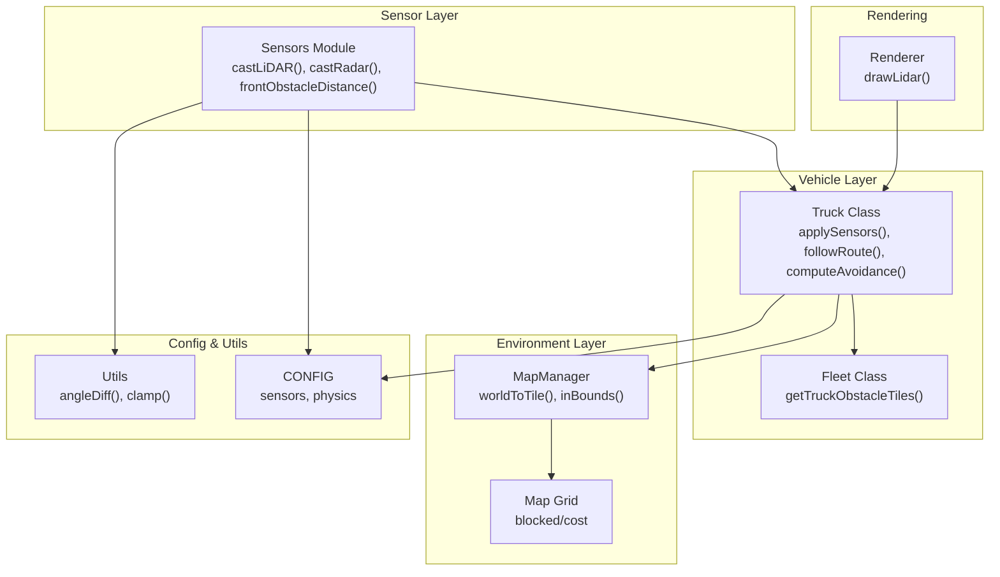
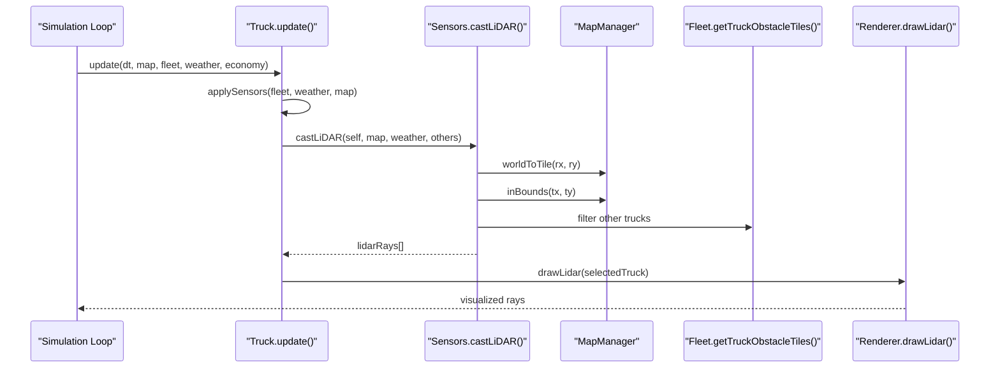
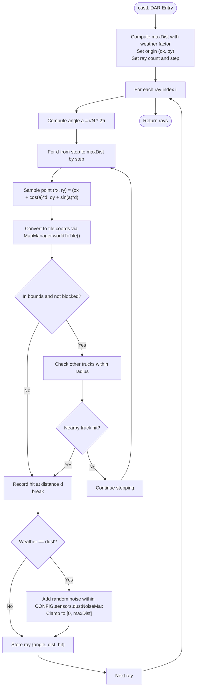
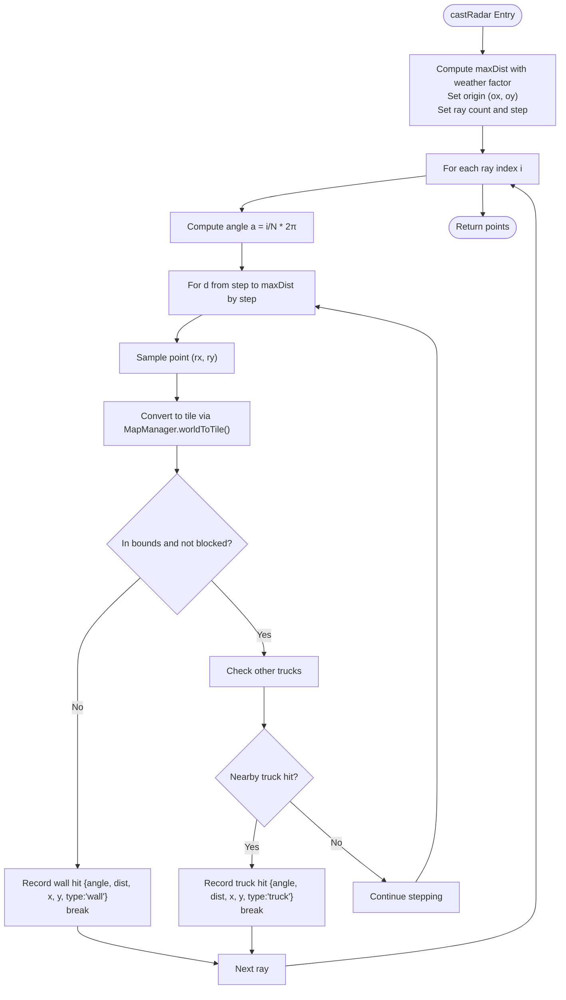
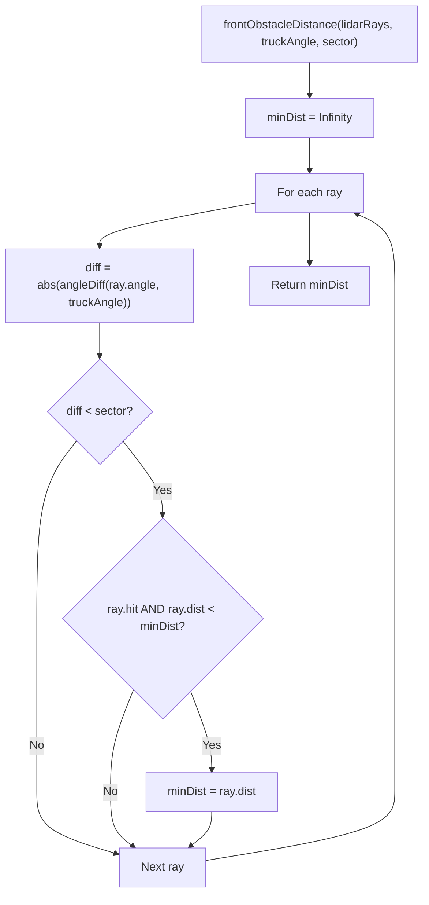
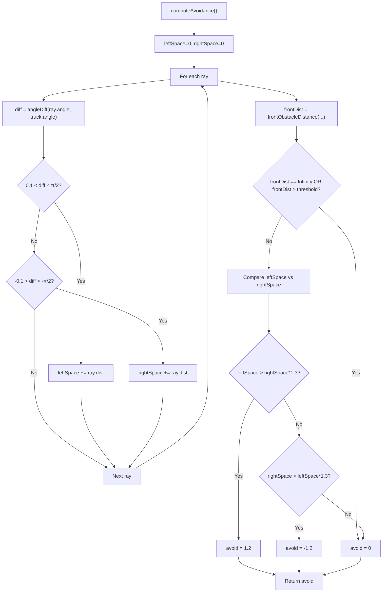
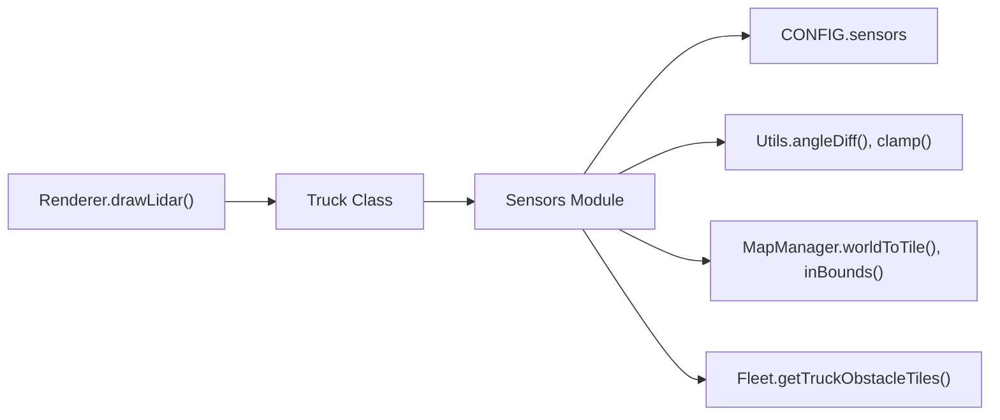

# LiDAR Simulation

<cite>
**Referenced Files in This Document**
- [sensors.js](file://sensors.js)
- [truck.js](file://truck.js)
- [map.js](file://map.js)
- [config.js](file://config.js)
- [utils.js](file://utils.js)
- [renderer.js](file://renderer.js)
- [main.js](file://main.js)
- [fleet.js](file://fleet.js)
- [README.txt](file://README.txt)
</cite>

## Table of Contents
1. [Introduction](#introduction)
2. [Project Structure](#project-structure)
3. [Core Components](#core-components)
4. [Architecture Overview](#architecture-overview)
5. [Detailed Component Analysis](#detailed-component-analysis)
6. [Dependency Analysis](#dependency-analysis)
7. [Performance Considerations](#performance-considerations)
8. [Troubleshooting Guide](#troubleshooting-guide)
9. [Conclusion](#conclusion)
10. [Appendices](#appendices)

## Introduction
This document describes the LiDAR simulation system that provides 360-degree environmental scanning for autonomous navigation. It explains the ray casting algorithm, collision detection with terrain and obstacles, distance calculation, weather impact modeling, noise simulation for dust storms, integration with the MapManager for terrain collision detection, and the collision avoidance system for detecting other trucks. It also documents sensor data interpretation, front obstacle detection algorithms, and how sensor readings influence vehicle decision-making, along with configuration parameters for sensor resolution, maximum range, and ray density.

## Project Structure
The LiDAR simulation is implemented primarily in the sensors module and integrated with the Truck and MapManager classes. The configuration constants define sensor parameters and physics behavior. Rendering displays the LiDAR visualization.

**Diagram sources**
- [sensors.js:1-103](file://sensors.js#L1-L103)
- [truck.js:1-406](file://truck.js#L1-L406)
- [map.js:1-438](file://map.js#L1-L438)
- [config.js:1-93](file://config.js#L1-L93)
- [utils.js:1-102](file://utils.js#L1-L102)
- [renderer.js:1-437](file://renderer.js#L1-L437)

**Section sources**
- [README.txt:1-20](file://README.txt#L1-L20)
- [sensors.js:1-103](file://sensors.js#L1-L103)
- [truck.js:1-406](file://truck.js#L1-L406)
- [map.js:1-438](file://map.js#L1-L438)
- [config.js:1-93](file://config.js#L1-L93)
- [utils.js:1-102](file://utils.js#L1-L102)
- [renderer.js:1-437](file://renderer.js#L1-L437)

## Core Components
- Sensors module: Implements ray casting for LiDAR and Radar, weather impact factors, and front obstacle detection.
- Truck class: Integrates sensor data, applies braking logic, computes avoidance offsets, and updates movement.
- MapManager: Provides grid-based collision checks and coordinate transformations.
- Configuration: Defines sensor resolution, maximum distances, ray step size, weather range factors, and noise parameters.
- Utilities: Provides angle difference computation, clamping, and other helpers used by sensors and trucks.
- Renderer: Visualizes LiDAR rays for debugging and demonstration.

**Section sources**
- [sensors.js:1-103](file://sensors.js#L1-L103)
- [truck.js:320-324](file://truck.js#L320-L324)
- [map.js:9-19](file://map.js#L9-L19)
- [config.js:39-49](file://config.js#L39-L49)
- [utils.js:75-82](file://utils.js#L75-L82)
- [renderer.js:318-350](file://renderer.js#L318-L350)

## Architecture Overview
The LiDAR simulation runs each frame inside the Truck’s update cycle. The Sensors module casts rays around the truck’s position, checking for collisions with terrain tiles and other trucks. Weather conditions reduce effective sensor range and introduce noise for dust storms. The resulting ray data is used for front obstacle detection and collision avoidance decisions.

**Diagram sources**
- [main.js:67-80](file://main.js#L67-L80)
- [truck.js:78-116](file://truck.js#L78-L116)
- [truck.js:320-324](file://truck.js#L320-L324)
- [sensors.js:9-49](file://sensors.js#L9-L49)
- [map.js:13-15](file://map.js#L13-L15)
- [map.js:9-11](file://map.js#L9-L11)
- [fleet.js:26-44](file://fleet.js#L26-L44)
- [renderer.js:318-350](file://renderer.js#L318-L350)

## Detailed Component Analysis

### Ray Casting Algorithm (LiDAR)
The LiDAR implementation generates N equally spaced rays around the truck’s heading and steps outward in fixed increments until a collision occurs. Collisions are detected against:
- Terrain: blocked tiles determined by MapManager bounds and grid state.
- Other trucks: proximity checks against nearby trucks.

Key implementation references:
- Ray generation and stepping: [sensors.js:17-41](file://sensors.js#L17-L41)
- Terrain collision: [sensors.js:24-29](file://sensors.js#L24-L29)
- Truck collision: [sensors.js:30-41](file://sensors.js#L30-L41)
- Weather range factor: [sensors.js:11](file://sensors.js#L11)
- Dust noise: [sensors.js:42-45](file://sensors.js#L42-L45)

**Diagram sources**
- [sensors.js:9-49](file://sensors.js#L9-L49)
- [map.js:13-15](file://map.js#L13-L15)
- [map.js:9-11](file://map.js#L9-L11)

**Section sources**
- [sensors.js:9-49](file://sensors.js#L9-L49)
- [map.js:9-19](file://map.js#L9-L19)

### Radar Implementation
The Radar module samples the same angular grid but records all collision points along each ray, distinguishing between terrain “wall” hits and “truck” hits. This provides a point cloud for visualization and potential higher-level perception tasks.

Key implementation references:
- Ray sampling and collision recording: [sensors.js:51-78](file://sensors.js#L51-L78)
- Terrain vs truck distinction: [sensors.js:65-75](file://sensors.js#L65-L75)

**Diagram sources**
- [sensors.js:51-78](file://sensors.js#L51-L78)
- [map.js:13-15](file://map.js#L13-L15)

**Section sources**
- [sensors.js:51-78](file://sensors.js#L51-L78)

### Weather Impact Modeling
Weather conditions modify sensor range and introduce noise:
- Range reduction: fog reduces effective range by a configured factor; rain and dust have moderate reductions.
- Noise addition: dust introduces random noise to measured distances, simulating degraded sensor accuracy.

Implementation references:
- Weather range factor: [sensors.js:2-7](file://sensors.js#L2-L7)
- Dust noise application: [sensors.js:42-45](file://sensors.js#L42-L45)
- Physics traction effects (context): [truck.js:291-294](file://truck.js#L291-L294)

**Section sources**
- [sensors.js:2-7](file://sensors.js#L2-L7)
- [sensors.js:42-45](file://sensors.js#L42-L45)
- [truck.js:291-294](file://truck.js#L291-L294)

### Front Obstacle Detection and Braking Logic
The system computes the minimum distance to an obstacle within a front sector centered on the truck’s heading. If this distance falls below a threshold derived from maximum range and a brake factor, the truck reduces speed proportionally to the proximity.

Braking logic in the Truck’s route-following:
- Computes front distance and scales desired speed by proximity to the threshold.

References:
- Front sector computation: [sensors.js:81-89](file://sensors.js#L81-L89)
- Nearest ahead: [sensors.js:92-101](file://sensors.js#L92-L101)
- Speed scaling based on front distance: [truck.js:285-289](file://truck.js#L285-L289)

**Diagram sources**
- [sensors.js:81-89](file://sensors.js#L81-L89)
- [utils.js:77-82](file://utils.js#L77-L82)

**Section sources**
- [sensors.js:81-89](file://sensors.js#L81-L89)
- [sensors.js:92-101](file://sensors.js#L92-L101)
- [truck.js:285-289](file://truck.js#L285-L289)

### Collision Avoidance and Sensor Interpretation
The avoidance system evaluates lateral space around the truck by summing distances from rays within left/right sectors. If the front distance is low, it biases steering to the side with more space.

References:
- Lateral space summation and front distance: [truck.js:326-339](file://truck.js#L326-L339)
- Sector definition: [config.js:46](file://config.js#L46)

**Diagram sources**
- [truck.js:326-339](file://truck.js#L326-L339)
- [config.js:46](file://config.js#L46)

**Section sources**
- [truck.js:326-339](file://truck.js#L326-L339)
- [config.js:46](file://config.js#L46)

### Integration with MapManager and Fleet
- Terrain collision detection: MapManager converts world coordinates to grid indices and checks bounds and blocked state.
- Other trucks: The Fleet module provides obstacle tiles for pathfinding and collision avoidance; the Sensors module also performs direct proximity checks for immediate ray hits.

References:
- Coordinate conversion and bounds: [map.js:13-15](file://map.js#L13-L15), [map.js:9-11](file://map.js#L9-L11)
- Obstacle tiles for routing: [fleet.js:26-44](file://fleet.js#L26-L44)
- Proximity checks in ray casting: [sensors.js:30-41](file://sensors.js#L30-L41)

**Section sources**
- [map.js:9-19](file://map.js#L9-L19)
- [fleet.js:26-44](file://fleet.js#L26-L44)
- [sensors.js:30-41](file://sensors.js#L30-L41)

### Sensor Data Interpretation and Decision-Making
- LiDAR rays are stored per truck and visualized in the renderer.
- Decision-making integrates:
  - Front obstacle detection for braking.
  - Lateral space evaluation for avoidance steering.
  - Route-following logic that considers sensor braking and weather traction.

References:
- Storage and application: [truck.js:18](file://truck.js#L18), [truck.js:320-324](file://truck.js#L320-L324)
- Visualization: [renderer.js:318-350](file://renderer.js#L318-L350)
- Route-following integration: [truck.js:268-318](file://truck.js#L268-L318)

**Section sources**
- [truck.js:18](file://truck.js#L18)
- [truck.js:320-324](file://truck.js#L320-L324)
- [renderer.js:318-350](file://renderer.js#L318-L350)
- [truck.js:268-318](file://truck.js#L268-L318)

## Dependency Analysis
The following diagram shows how the sensor subsystem depends on configuration, utilities, and environment modules.

**Diagram sources**
- [sensors.js:1-103](file://sensors.js#L1-L103)
- [config.js:39-49](file://config.js#L39-L49)
- [utils.js:75-82](file://utils.js#L75-L82)
- [map.js:13-15](file://map.js#L13-L15)
- [fleet.js:26-44](file://fleet.js#L26-L44)
- [truck.js:320-324](file://truck.js#L320-L324)
- [renderer.js:318-350](file://renderer.js#L318-L350)

**Section sources**
- [sensors.js:1-103](file://sensors.js#L1-L103)
- [config.js:39-49](file://config.js#L39-L49)
- [utils.js:75-82](file://utils.js#L75-L82)
- [map.js:13-15](file://map.js#L13-L15)
- [fleet.js:26-44](file://fleet.js#L26-L44)
- [truck.js:320-324](file://truck.js#L320-L324)
- [renderer.js:318-350](file://renderer.js#L318-L350)

## Performance Considerations
- Ray density and step size: Increasing ray count or decreasing step size increases computational cost linearly with ray count.
- Weather range factor: Reduces effective ray length; combined with larger ray counts, can increase total steps.
- Dust noise: Adds a small per-ray computation; negligible compared to traversal cost.
- Rendering overhead: Drawing LiDAR rays is lightweight but still adds to the rendering pipeline.

Recommendations:
- Tune CONFIG.sensors.lidarRays and lidarStep to balance fidelity and performance.
- Consider adaptive ray density based on speed or terrain complexity.
- Cache angle computations if extending to dynamic ray counts.

[No sources needed since this section provides general guidance]

## Troubleshooting Guide
Common issues and diagnostics:
- Rays not hitting expected obstacles:
  - Verify MapManager.inBounds and grid blocked state.
  - Confirm worldToTile conversion and step increment align with CONFIG.sensors.lidarStep.
- Incorrect front obstacle detection:
  - Check angleDiff normalization and front sector width.
  - Ensure ray angles are normalized to [0, 2π) and differences computed correctly.
- Excessive noise in dust:
  - Adjust CONFIG.sensors.dustNoiseMax and verify clamping to [0, maxDist].
- Avoidance bias feels off:
  - Review sector thresholds and lateral space summation logic.
  - Confirm front distance threshold alignment with CONFIG.sensors.lidarMaxDist and CONFIG.sensors.brakeDistFactor.

**Section sources**
- [map.js:9-19](file://map.js#L9-L19)
- [utils.js:77-82](file://utils.js#L77-L82)
- [sensors.js:42-45](file://sensors.js#L42-L45)
- [truck.js:326-339](file://truck.js#L326-L339)

## Conclusion
The LiDAR simulation provides robust 360-degree sensing for autonomous navigation, integrating terrain and truck collision detection, weather-aware range modeling, and noise injection for realistic dust storm scenarios. The system’s modular design allows straightforward extension and tuning of sensor parameters, while the Truck class orchestrates sensor data into actionable decisions such as braking and avoidance.

[No sources needed since this section summarizes without analyzing specific files]

## Appendices

### Configuration Parameters for Sensors
- lidarRays: Number of rays for 360° scan.
- lidarMaxDist: Maximum detection range before weather factor.
- lidarStep: Step size for ray traversal.
- radarMaxDist: Maximum detection range for radar point cloud.
- fogRangeFactor: Factor reducing effective range in fog.
- dustNoiseMax: Max noise magnitude for dust-induced distance errors.
- frontSector: Angular width of front obstacle detection.
- brakeDistFactor: Threshold factor for proximity-based braking.
- overtakeOffset: Offset for overtaking maneuvers (contextual).

**Section sources**
- [config.js:39-49](file://config.js#L39-L49)

### Mathematical Model Summary
- Ray generation: Equally spaced angles over 2π.
- Traversal: Increment distance by lidarStep until collision or max distance.
- Collision detection:
  - Terrain: tile in-bounds and not blocked.
  - Trucks: Euclidean distance within a small radius.
- Distance calculation: Euclidean distance along ray path.
- Weather impact:
  - Effective range = lidarMaxDist × weatherRangeFactor(weather).
  - Dust adds uniform random noise within ±dustNoiseMax, clamped to [0, maxDist].

**Section sources**
- [sensors.js:17-41](file://sensors.js#L17-L41)
- [sensors.js:24-29](file://sensors.js#L24-L29)
- [sensors.js:30-41](file://sensors.js#L30-L41)
- [sensors.js:11](file://sensors.js#L11)
- [sensors.js:42-45](file://sensors.js#L42-L45)