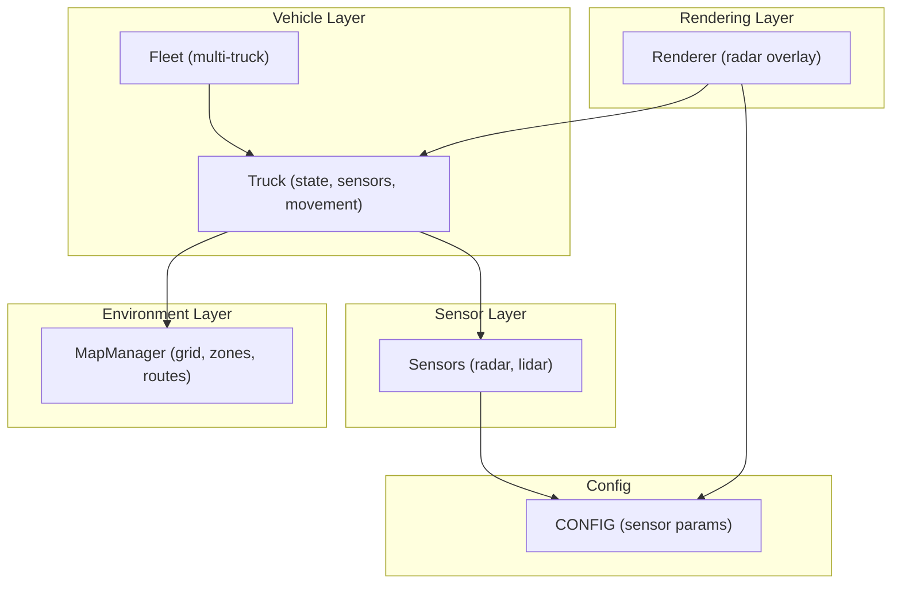
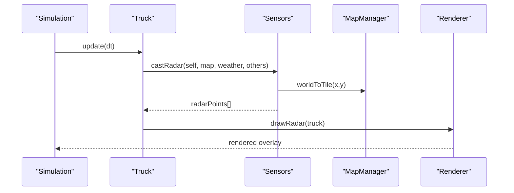
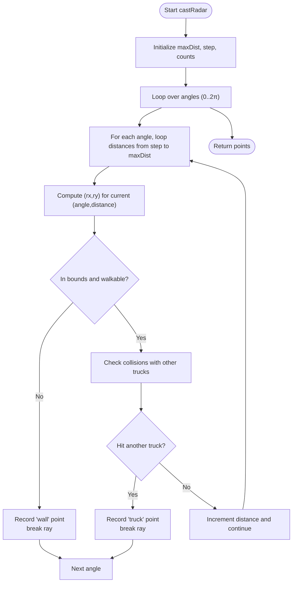
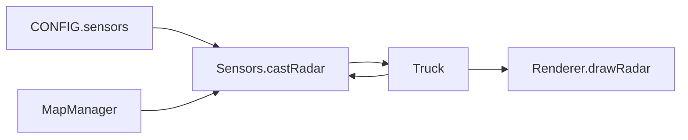

# Radar System

<cite>
**Referenced Files in This Document**
- [sensors.js](file://sensors.js)
- [truck.js](file://truck.js)
- [map.js](file://map.js)
- [config.js](file://config.js)
- [renderer.js](file://renderer.js)
- [main.js](file://main.js)
- [utils.js](file://utils.js)
- [fleet.js](file://fleet.js)
</cite>

## Table of Contents
1. [Introduction](#introduction)
2. [Project Structure](#project-structure)
3. [Core Components](#core-components)
4. [Architecture Overview](#architecture-overview)
5. [Detailed Component Analysis](#detailed-component-analysis)
6. [Dependency Analysis](#dependency-analysis)
7. [Performance Considerations](#performance-considerations)
8. [Troubleshooting Guide](#troubleshooting-guide)
9. [Conclusion](#conclusion)

## Introduction
This document describes the radar system that provides dynamic obstacle detection and proximity mapping for the autonomous truck fleet. It explains how the radar generates a continuous point cloud across 360 degrees, how it integrates with the MapManager for terrain collision detection, and how it contributes to traffic-awareness and collision avoidance alongside the LiDAR sensor. It also contrasts radar with LiDAR, documents weather impacts, and outlines practical usage in autonomous navigation.

## Project Structure
The radar system is implemented as part of the sensor subsystem and interacts with the truck state machine, the map grid, and the rendering pipeline. Key modules:
- Sensors module: radar and LiDAR casting routines, weather range factor, and front-sector distance helpers
- Truck class: stores sensor readings, applies sensors each frame, computes avoidance behavior
- MapManager: tile-to-world conversion, bounds checking, and terrain blocking
- Renderer: draws radar point clouds and overlays
- Configuration: sensor parameters, limits, and thresholds
- Fleet: manages multiple trucks and constructs obstacle tiles for routing

**Diagram sources**
- [sensors.js:1-103](file://sensors.js#L1-L103)
- [truck.js:1-406](file://truck.js#L1-L406)
- [map.js:1-438](file://map.js#L1-L438)
- [renderer.js:1-437](file://renderer.js#L1-L437)
- [config.js:1-93](file://config.js#L1-L93)
- [fleet.js:1-65](file://fleet.js#L1-L65)

**Section sources**
- [sensors.js:1-103](file://sensors.js#L1-L103)
- [truck.js:1-406](file://truck.js#L1-L406)
- [map.js:1-438](file://map.js#L1-L438)
- [renderer.js:1-437](file://renderer.js#L1-L437)
- [config.js:1-93](file://config.js#L1-L93)
- [fleet.js:1-65](file://fleet.js#L1-L65)

## Core Components
- Radar point cloud generator: scans 360 degrees around the truck at fixed angular intervals, sampling along radial lines at a fixed step size, and records collision points with terrain and other trucks
- Obstacle detection logic: distinguishes terrain collisions (“wall”) from dynamic truck objects (“truck”), enabling proximity mapping and traffic awareness
- Integration with MapManager: uses tile-based world-to-tile conversion and bounds checking to detect terrain collisions
- Proximity mapping and collision avoidance: leverages radar points to inform lateral avoidance offsets and front-distance braking decisions
- Weather impact: applies a range factor to reduce effective radar range under fog/dust/rain conditions

**Section sources**
- [sensors.js:51-79](file://sensors.js#L51-L79)
- [sensors.js:24-29](file://sensors.js#L24-L29)
- [truck.js:320-324](file://truck.js#L320-L324)
- [truck.js:326-339](file://truck.js#L326-L339)
- [config.js:39-49](file://config.js#L39-L49)

## Architecture Overview
The radar system operates each simulation tick:
- Sensors.castRadar computes a dense point cloud around the truck
- Truck.applySensors stores the points and rays for downstream use
- Renderer.drawRadar visualizes the radar points
- Collision avoidance logic uses radar-derived metrics to adjust steering and speed

**Diagram sources**
- [main.js:67-80](file://main.js#L67-L80)
- [truck.js:320-324](file://truck.js#L320-L324)
- [sensors.js:51-79](file://sensors.js#L51-L79)
- [map.js:13-19](file://map.js#L13-L19)
- [renderer.js:352-388](file://renderer.js#L352-L388)

## Detailed Component Analysis

### Radar Point Cloud Generation Algorithm
The radar algorithm performs a full 360-degree scan:
- Angular sampling: iterates over a fixed number of angles evenly distributed around the truck
- Radial sampling: for each angle, steps outward from the truck at a fixed step size until either:
  - Terrain collision detected (blocked tile) — records a “wall” point
  - Dynamic truck collision detected — records a “truck” point
- Termination: stops at the first hit per ray; does not collect multiple hits per ray
- Output: array of points with angle, distance, world coordinates, and type

Key parameters:
- Number of rays: controlled by the sensor configuration
- Step size: controls spatial resolution of the point cloud
- Maximum detection distance: scaled by weather range factor

**Diagram sources**
- [sensors.js:51-79](file://sensors.js#L51-L79)
- [map.js:9-11](file://map.js#L9-L11)
- [map.js:13-19](file://map.js#L13-L19)

**Section sources**
- [sensors.js:51-79](file://sensors.js#L51-L79)
- [config.js:39-49](file://config.js#L39-L49)

### Obstacle Detection Logic
- Static terrain: detected when the sampled world position falls outside walkable bounds or inside a blocked tile
- Dynamic trucks: detected when the sampled world position is within a small radius of another truck’s position
- Classification: points are tagged with a type field (“wall” vs “truck”) to enable different handling in downstream logic

Integration with MapManager:
- worldToTile converts world coordinates to grid indices
- inBounds ensures the coordinate is within the grid
- grid[y][x].blocked indicates terrain collision

**Section sources**
- [sensors.js:64-67](file://sensors.js#L64-L67)
- [sensors.js:69-75](file://sensors.js#L69-L75)
- [map.js:9-11](file://map.js#L9-L11)
- [map.js:13-19](file://map.js#L13-L19)

### Proximity Mapping and Traffic Awareness
- Proximity mapping: radar points form a continuous density field around the vehicle, enabling awareness of nearby obstacles and other trucks
- Traffic awareness: by tagging “truck” points, the system can infer presence and direction of nearby vehicles, aiding route planning and collision avoidance
- Rendering: the radar overlay displays points colored by distance and type, providing immediate situational awareness

**Section sources**
- [renderer.js:352-388](file://renderer.js#L352-L388)
- [sensors.js:66](file://sensors.js#L66)
- [sensors.js:72](file://sensors.js#L72)

### Radar vs LiDAR
- Data representation:
  - Radar: continuous point cloud with angular, radial, and spatial coordinates; supports classification of obstacle types
  - LiDAR: discrete ray measurements with angle and hit distance; used primarily for front-sector braking and lateral avoidance
- Scanning pattern:
  - Both sensors sample 360 degrees with fixed angular step sizes
  - Radar samples continuously along each ray; LiDAR samples at discrete steps and stops at first hit
- Obstacle classification:
  - Radar: explicit “wall” and “truck” types
  - LiDAR: binary hit/no-hit per ray; classification is implicit in ray structure
- Use cases:
  - Radar: broad situational awareness, proximity mapping, traffic awareness
  - LiDAR: precise front-obstacle detection, braking, and lateral avoidance

**Section sources**
- [sensors.js:9-49](file://sensors.js#L9-L49)
- [sensors.js:51-79](file://sensors.js#L51-L79)
- [truck.js:326-339](file://truck.js#L326-L339)

### Weather Impact on Radar Performance
- Range reduction: weatherRangeFactor reduces effective radar range under fog, dust, and rain
- Dust-specific noise: adds random noise to hit distances to simulate sensor variability
- Effects:
  - Reduced detection range leads to fewer points at greater distances
  - Dust noise introduces scatter in close-range detections

**Section sources**
- [sensors.js:2-7](file://sensors.js#L2-L7)
- [sensors.js:42-45](file://sensors.js#L42-L45)
- [config.js:44](file://config.js#L44)

### Integration with MapManager and Route Planning
- MapManager provides:
  - worldToTile for converting radar sample positions to grid indices
  - inBounds checks to prevent sampling off-grid
  - grid[y][x].blocked to detect terrain collisions
- Fleet integration:
  - getTruckObstacleTiles builds a set of tiles occupied by moving trucks (excluding the current truck) for route planning
  - This helps avoid collisions during pathfinding while radar informs real-time obstacle avoidance

**Section sources**
- [map.js:13-19](file://map.js#L13-L19)
- [map.js:9-11](file://map.js#L9-L11)
- [map.js:61](file://map.js#L61)
- [fleet.js:26-44](file://fleet.js#L26-L44)

### Collision Avoidance and Braking
- Front-obstacle distance: computed from LiDAR rays in the front sector to trigger braking
- Lateral avoidance: computed from LiDAR ray sums in left/right sectors; radar points support traffic awareness but the avoidance logic is primarily driven by LiDAR
- Speed adjustment: braking is proportional to front distance threshold; lateral avoidance adjusts steering bias

**Section sources**
- [sensors.js:81-101](file://sensors.js#L81-L101)
- [truck.js:285-289](file://truck.js#L285-L289)
- [truck.js:326-339](file://truck.js#L326-L339)

### Practical Usage Examples
- Radar data processing:
  - Store points in Truck.radarPoints for visualization and later analysis
  - Use point density and type distribution to estimate local traffic density
- Obstacle clustering:
  - Group nearby “truck” points by angle and distance to estimate relative motion and intent
  - Combine with LiDAR front-sector distance for combined collision risk assessment
- Role in collision avoidance:
  - Use radar to detect lateral obstacles and inform steering adjustments
  - Use LiDAR for front braking; use radar for lateral evasive maneuvers

**Section sources**
- [truck.js:18](file://truck.js#L18)
- [truck.js:19](file://truck.js#L19)
- [sensors.js:51-79](file://sensors.js#L51-L79)

## Dependency Analysis
The radar system depends on configuration parameters, MapManager utilities, and the truck’s state machine. The rendering pipeline consumes radar points for visualization.

**Diagram sources**
- [config.js:39-49](file://config.js#L39-L49)
- [sensors.js:51-79](file://sensors.js#L51-L79)
- [map.js:13-19](file://map.js#L13-L19)
- [renderer.js:352-388](file://renderer.js#L352-L388)

**Section sources**
- [config.js:39-49](file://config.js#L39-L49)
- [sensors.js:51-79](file://sensors.js#L51-L79)
- [map.js:13-19](file://map.js#L13-L19)
- [renderer.js:352-388](file://renderer.js#L352-L388)

## Performance Considerations
- Computational cost: radar scans N angles × M distances per ray; with fixed step size and counts, cost scales linearly with angular and radial sampling
- Memory footprint: radarPoints grows with angular and radial sampling; consider limiting max distance or reducing step size for performance-critical scenarios
- Weather effects: fog/dust reduce effective range and introduce noise; adjust parameters to balance realism and performance
- Rendering overhead: drawing radar points is lightweight but can be disabled or simplified in performance-critical contexts

[No sources needed since this section provides general guidance]

## Troubleshooting Guide
Common issues and remedies:
- No radar points near edges:
  - Verify inBounds checks and ensure worldToTile is used consistently
- False positives on terrain:
  - Confirm grid[y][x].blocked semantics and tile size alignment
- Radar appears clipped at far distance:
  - Check max distance scaling with weather range factor
- Dust noise causing erratic behavior:
  - Adjust dust noise magnitude in configuration
- Radar not updating:
  - Ensure Sensors.castRadar is invoked in Truck.applySensors each frame

**Section sources**
- [map.js:9-11](file://map.js#L9-L11)
- [map.js:13-19](file://map.js#L13-L19)
- [sensors.js:51-79](file://sensors.js#L51-L79)
- [sensors.js:2-7](file://sensors.js#L2-L7)
- [sensors.js:42-45](file://sensors.js#L42-L45)
- [truck.js:320-324](file://truck.js#L320-L324)

## Conclusion
The radar system provides a robust, continuous 360-degree perception model that complements LiDAR for autonomous navigation. By generating dense point clouds with obstacle classification and integrating with MapManager and the rendering pipeline, it enables proximity mapping, traffic awareness, and collision avoidance. Weather impacts are modeled through range reduction and noise, and the system’s modular design allows for straightforward extension and tuning.