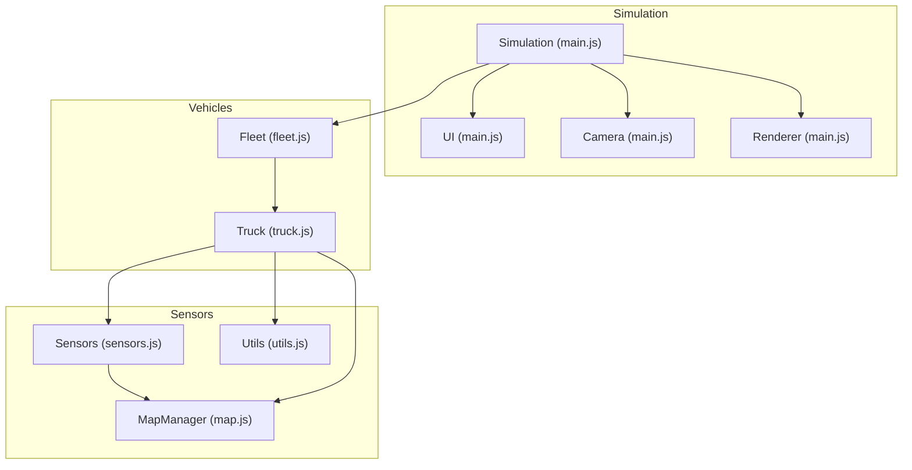
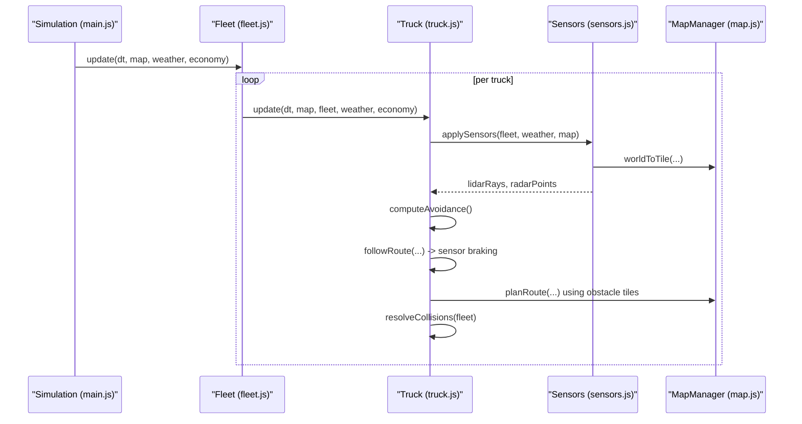
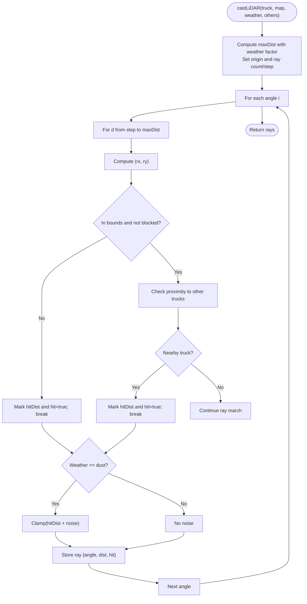
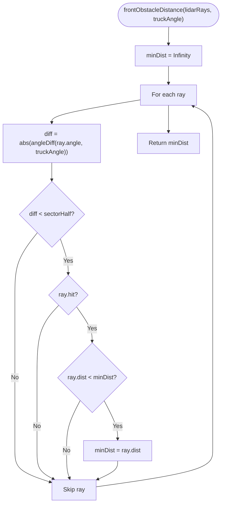
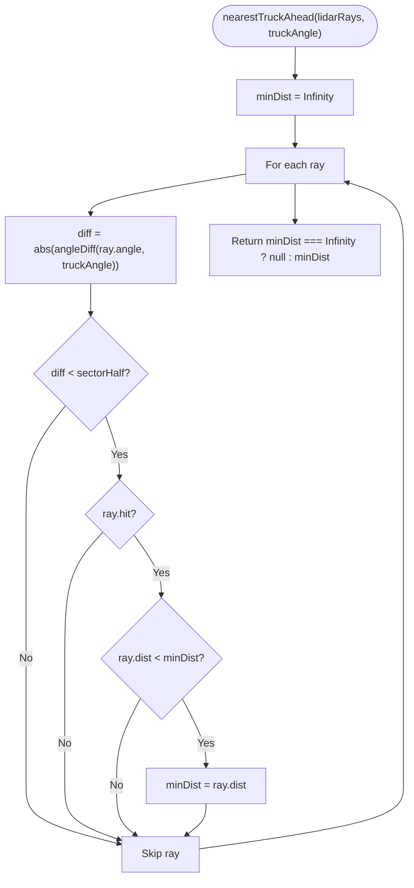
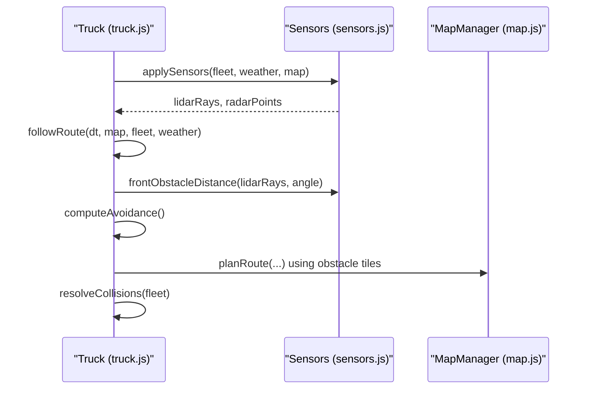
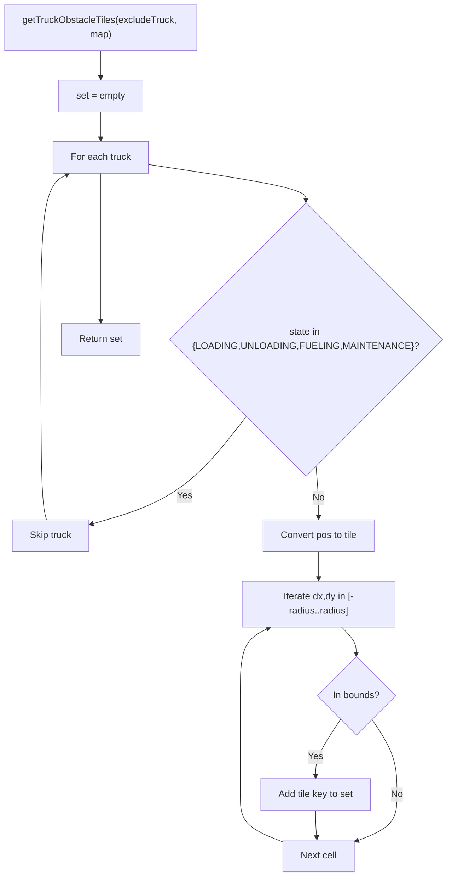
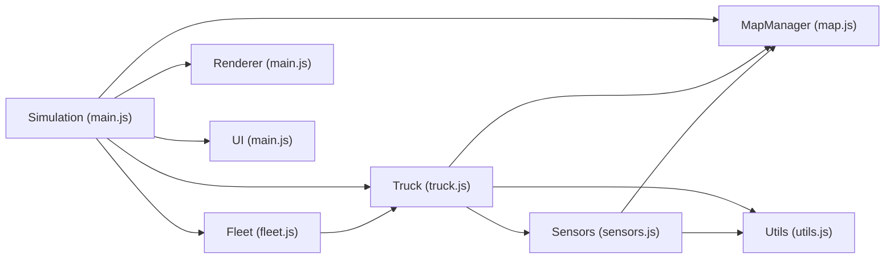

# Sensor Fusion and Data Processing

<cite>
**Referenced Files in This Document**
- [sensors.js](file://sensors.js)
- [truck.js](file://truck.js)
- [fleet.js](file://fleet.js)
- [main.js](file://main.js)
- [config.js](file://config.js)
- [utils.js](file://utils.js)
- [map.js](file://map.js)
</cite>

## Table of Contents
1. [Introduction](#introduction)
2. [Project Structure](#project-structure)
3. [Core Components](#core-components)
4. [Architecture Overview](#architecture-overview)
5. [Detailed Component Analysis](#detailed-component-analysis)
6. [Dependency Analysis](#dependency-analysis)
7. [Performance Considerations](#performance-considerations)
8. [Troubleshooting Guide](#troubleshooting-guide)
9. [Conclusion](#conclusion)

## Introduction
This document explains the sensor fusion system that combines LiDAR and radar data to create comprehensive environmental awareness for autonomous navigation. It covers:
- Data processing algorithms that merge sensor inputs and handle discrepancies
- Front obstacle detection using LiDAR to prevent collisions
- Nearest truck detection for fleet coordination and collision avoidance
- Angle difference calculations, sector-based analysis, and threshold-based decision making
- Integration with the truck’s state machine and navigation algorithms
- Sensor fusion workflows, data validation techniques, and the impact of sensor quality on vehicle behavior
- Computational efficiency and real-time performance considerations

## Project Structure
The simulation is composed of several modules:
- Sensors module: generates LiDAR rays and radar points, computes front obstacle distance and nearest truck ahead
- Truck module: encapsulates vehicle state, AI movement, sensor application, collision resolution, and navigation
- Fleet module: manages multiple trucks, obstacle tiles for pathfinding, and fleet-wide statistics
- Main simulation loop: orchestrates updates, rendering, and UI
- Configuration: centralizes constants for physics, fuel, wear, sensors, operations, FSM, and fleet
- Utilities: shared helpers like angle difference computation and interpolation
- Map manager: grid representation, world-to-tile conversion, pathfinding, and zone detection

**Diagram sources**
- [main.js:1-266](file://main.js#L1-L266)
- [fleet.js:1-65](file://fleet.js#L1-L65)
- [truck.js:1-406](file://truck.js#L1-L406)
- [sensors.js:1-103](file://sensors.js#L1-L103)
- [map.js:1-438](file://map.js#L1-L438)
- [utils.js:1-102](file://utils.js#L1-L102)

**Section sources**
- [main.js:1-266](file://main.js#L1-L266)
- [config.js:1-93](file://config.js#L1-L93)

## Core Components
- Sensors module
  - Weather-aware LiDAR casting: generates angular samples around the vehicle, stepping outward until terrain or another truck is hit
  - Radar point casting: collects wall and truck detections along radial lines
  - Front obstacle distance: finds minimum hit distance within a front sector
  - Nearest truck ahead: identifies closest truck ahead within a front sector
- Truck module
  - Sensor application: invokes Sensors to populate lidarRays and radarPoints
  - Navigation: computes desired angle/snapped angle, applies sensor braking thresholds, and moves the vehicle
  - Collision resolution: separates overlapping trucks and reduces speeds when necessary
  - State transitions: driven by zones, fuel, wear, and operation completion
- Fleet module
  - Obstacle tiles: converts moving trucks into a set of tiles for pathfinding
  - Truck lookup: finds a truck near a given position
- Utilities
  - Angle difference normalization for sector comparisons
  - Interpolation and clamping for smooth control

**Section sources**
- [sensors.js:1-103](file://sensors.js#L1-L103)
- [truck.js:78-324](file://truck.js#L78-L324)
- [fleet.js:26-51](file://fleet.js#L26-L51)
- [utils.js:75-82](file://utils.js#L75-L82)

## Architecture Overview
The sensor fusion pipeline integrates LiDAR and radar data to inform perception and control:
- Sensors cast rays/points and return structured data
- Truck.update applies sensors, computes front obstacle distance, and adjusts speed and steering
- Pathfinding uses obstacle tiles from the fleet to avoid static and dynamic obstacles
- State machine transitions are influenced by sensor-derived conditions and zone detection

**Diagram sources**
- [main.js:67-80](file://main.js#L67-L80)
- [fleet.js:20-24](file://fleet.js#L20-L24)
- [truck.js:78-116](file://truck.js#L78-L116)
- [truck.js:320-324](file://truck.js#L320-L324)
- [sensors.js:9-79](file://sensors.js#L9-L79)
- [map.js:13-19](file://map.js#L13-L19)

## Detailed Component Analysis

### Sensors Module
The Sensors module provides:
- Weather range factor: adapts sensor range under fog/dust/rain
- LiDAR casting: produces angular rays with hit distances and flags
- Radar casting: produces points with angles, distances, and types (wall/truck)
- Front obstacle distance: minimum hit distance within a front sector
- Nearest truck ahead: minimum distance to another truck ahead within a front sector

Key processing logic:
- Angular sampling: evenly distributed angles around the vehicle
- Step-wise ray marching: increments by a fixed step size up to a maximum distance
- Terrain and obstacle checks: uses world-to-tile conversion and grid blocked flags
- Truck proximity checks: detects nearby trucks to mark hits
- Dust noise: adds random noise to LiDAR distances under dusty conditions

**Diagram sources**
- [sensors.js:9-49](file://sensors.js#L9-L49)

**Section sources**
- [sensors.js:1-103](file://sensors.js#L1-L103)
- [map.js:9-19](file://map.js#L9-L19)

### Front Obstacle Detection
Front obstacle detection uses a sector-based approach:
- Sector half-angle: configured via frontSector
- Angle difference normalization: ensures robust comparison against vehicle orientation
- Minimum distance selection: among rays within the front sector that are hits

**Diagram sources**
- [sensors.js:81-89](file://sensors.js#L81-L89)
- [utils.js:77-82](file://utils.js#L77-L82)

**Section sources**
- [sensors.js:81-101](file://sensors.js#L81-L101)
- [utils.js:75-82](file://utils.js#L75-L82)

### Nearest Truck Ahead
Nearest truck ahead builds on front obstacle detection:
- Identifies the closest truck ahead within the front sector
- Returns null if no truck is detected within the sector

**Diagram sources**
- [sensors.js:92-101](file://sensors.js#L92-L101)
- [utils.js:77-82](file://utils.js#L77-L82)

**Section sources**
- [sensors.js:92-101](file://sensors.js#L92-L101)

### Truck Navigation and Sensor Integration
The Truck module integrates sensor data into navigation:
- applySensors: populates lidarRays and radarPoints
- followRoute: computes desired angle, applies sensor braking when front distance is below a threshold, and moves the vehicle
- computeAvoidance: evaluates lateral space and determines steering offset to avoid collisions
- resolveCollisions: separates overlapping trucks and reduces speeds when necessary

**Diagram sources**
- [truck.js:320-324](file://truck.js#L320-L324)
- [truck.js:268-318](file://truck.js#L268-L318)
- [truck.js:326-339](file://truck.js#L326-L339)
- [truck.js:384-404](file://truck.js#L384-L404)
- [fleet.js:26-44](file://fleet.js#L26-L44)

**Section sources**
- [truck.js:268-339](file://truck.js#L268-L339)
- [truck.js:320-324](file://truck.js#L320-L324)
- [fleet.js:26-44](file://fleet.js#L26-L44)

### Fleet Coordination and Obstacle Tiles
The Fleet module contributes to sensor fusion indirectly by providing obstacle tiles for pathfinding:
- getTruckObstacleTiles: excludes trucks in operation states and converts positions to tiles within a radius
- Used by MapManager.planRoute to avoid static and dynamic obstacles

**Diagram sources**
- [fleet.js:26-44](file://fleet.js#L26-L44)

**Section sources**
- [fleet.js:26-44](file://fleet.js#L26-L44)

### Sensor Quality Impact and Validation
Sensor quality affects:
- Range reduction under fog/dust/rain via weatherRangeFactor
- Dust noise addition to LiDAR distances
- Perception reliability and control decisions

Validation techniques:
- Sector-based filtering to focus on front region
- Threshold-based braking when front distance is below a configurable fraction of maximum distance
- Angle difference normalization to ensure consistent sector comparisons

**Section sources**
- [sensors.js:2-7](file://sensors.js#L2-L7)
- [sensors.js:42-45](file://sensors.js#L42-L45)
- [truck.js:285-289](file://truck.js#L285-L289)
- [utils.js:77-82](file://utils.js#L77-L82)

## Dependency Analysis
The following diagram shows key dependencies among components:

**Diagram sources**
- [sensors.js:1-103](file://sensors.js#L1-L103)
- [map.js:1-438](file://map.js#L1-L438)
- [utils.js:1-102](file://utils.js#L1-L102)
- [truck.js:1-406](file://truck.js#L1-L406)
- [fleet.js:1-65](file://fleet.js#L1-L65)
- [main.js:1-266](file://main.js#L1-L266)

**Section sources**
- [sensors.js:1-103](file://sensors.js#L1-L103)
- [truck.js:1-406](file://truck.js#L1-L406)
- [fleet.js:1-65](file://fleet.js#L1-L65)
- [main.js:1-266](file://main.js#L1-L266)

## Performance Considerations
- Computational efficiency
  - LiDAR: O(N_angular × N_step) per vehicle; configurable ray count and step size
  - Radar: O(N_angular × N_step) per vehicle; collects points until first hit per ray
  - Sector filtering reduces unnecessary comparisons
- Real-time performance
  - Fixed time step and bounded loop iterations
  - Clamping and interpolation reduce oscillation and stabilize control
  - Pathfinding uses a priority queue and heuristic; obstacle tiles limit search space
- Sensor quality trade-offs
  - Weather factors reduce effective range and introduce noise
  - Dust noise adds variability; fog drastically reduces range
- Practical tips
  - Tune CONFIG.sensors.lidarRays and CONFIG.sensors.lidarStep for balance between fidelity and performance
  - Adjust CONFIG.sensors.frontSector and CONFIG.sensors.brakeDistFactor to match vehicle dynamics and safety margins

[No sources needed since this section provides general guidance]

## Troubleshooting Guide
Common issues and remedies:
- No front obstacle detection
  - Verify frontSector configuration and angleDiff normalization
  - Ensure lidarRays are populated by applySensors
- Excessive oscillation or instability
  - Reduce CONFIG.sensors.frontSector or increase CONFIG.sensors.brakeDistFactor
  - Adjust traction factors for weather conditions
- Collision near obstacles
  - Confirm MapManager.inBounds and grid blocked flags are correct
  - Validate worldToTile conversions and tile indices
- Fleet pathfinding failures
  - Check getTruckObstacleTiles exclusion logic for operation states
  - Ensure obstacle tiles are passed to planRoute

**Section sources**
- [sensors.js:81-101](file://sensors.js#L81-L101)
- [truck.js:320-324](file://truck.js#L320-L324)
- [map.js:9-19](file://map.js#L9-L19)
- [fleet.js:26-44](file://fleet.js#L26-L44)

## Conclusion
The sensor fusion system integrates LiDAR and radar data to enable safe, efficient autonomous navigation. Sector-based front obstacle detection and nearest-truck-ahead analysis feed into the truck’s navigation and collision avoidance logic. Weather-aware sensor modeling and validated data structures ensure robust behavior across varying conditions. With careful tuning of configuration parameters and attention to computational efficiency, the system achieves real-time performance suitable for fleet-scale deployment.