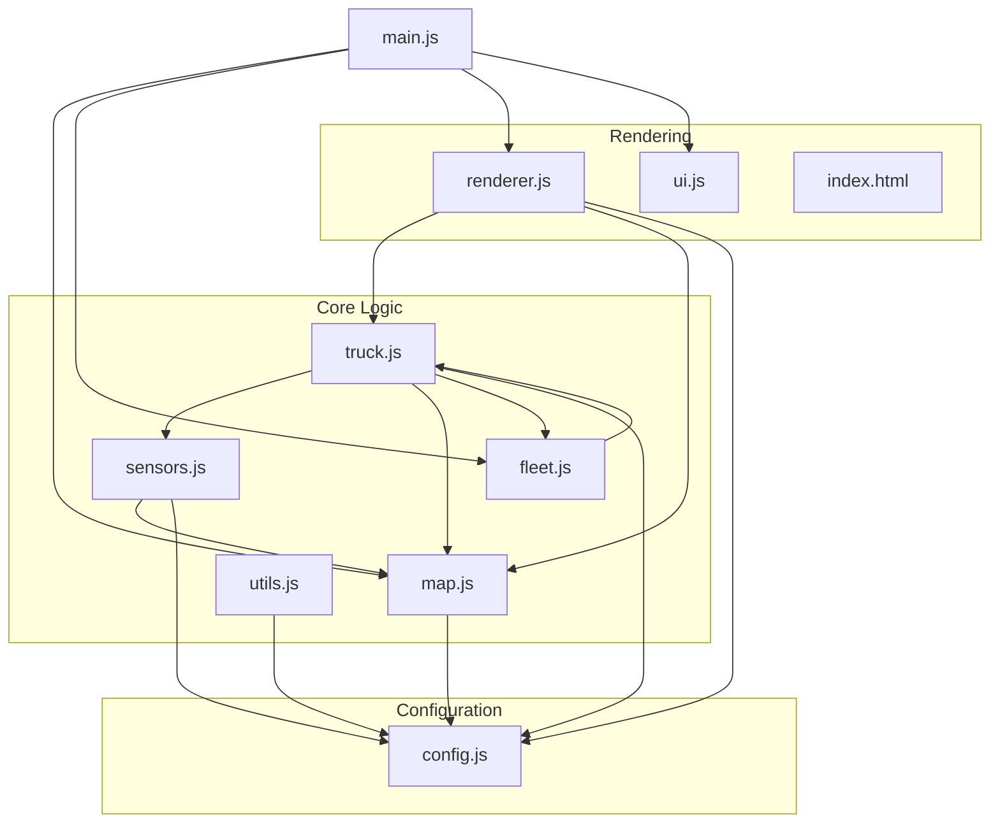
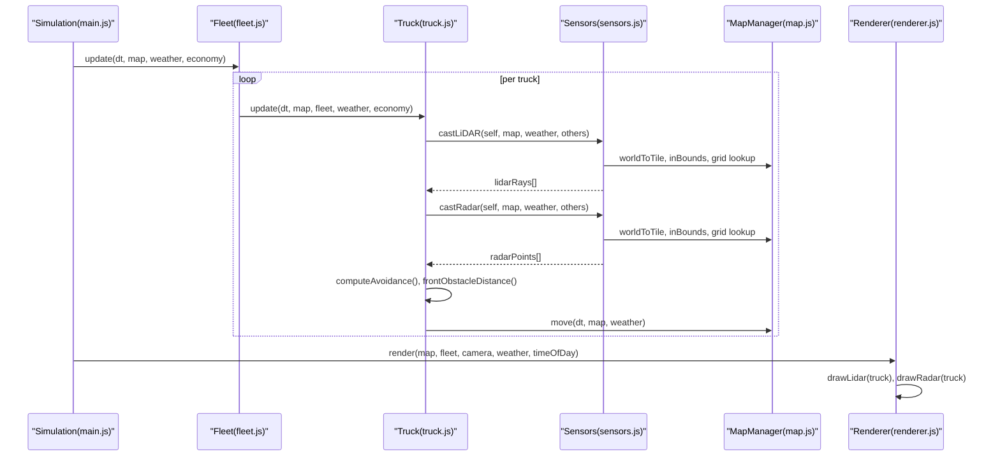
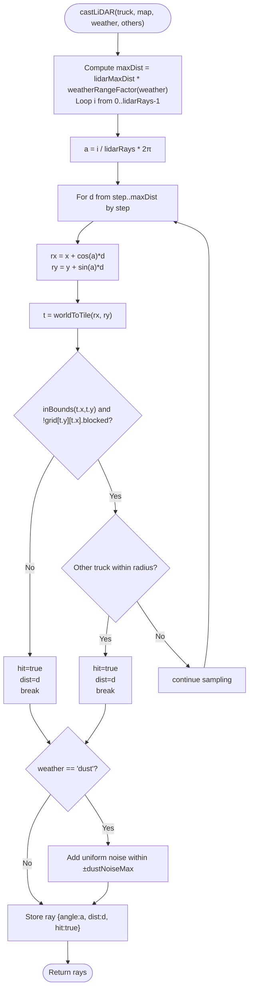
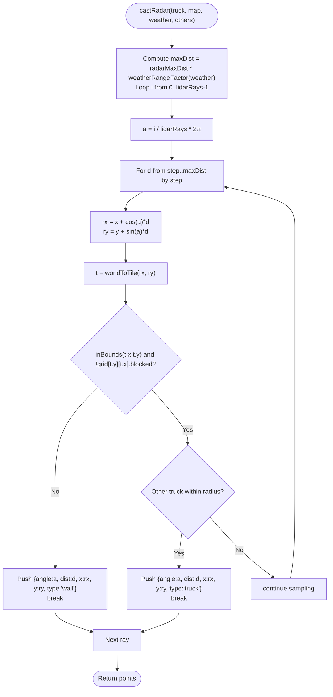
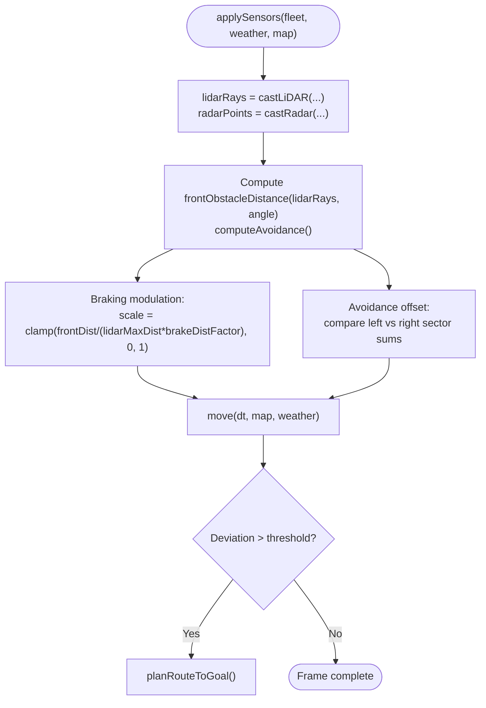
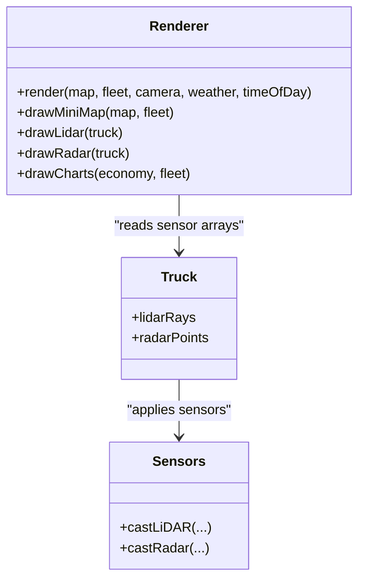
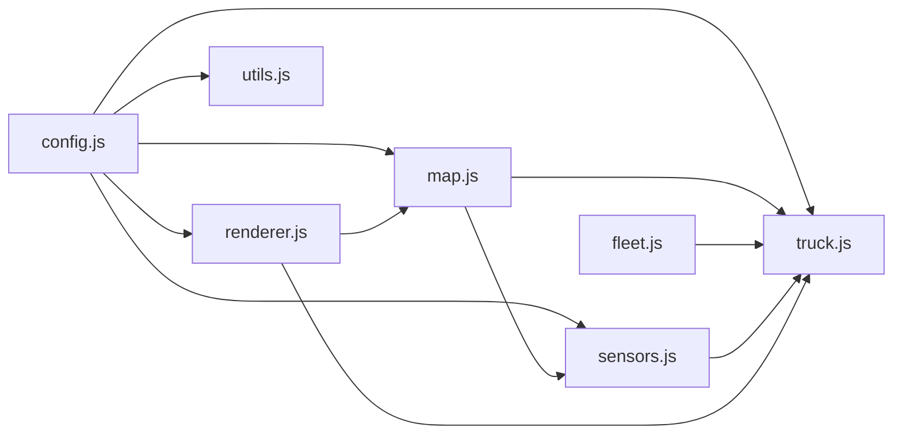

# Sensor Systems

<cite>
**Referenced Files in This Document**
- [index.html](file://index.html)
- [config.js](file://config.js)
- [utils.js](file://utils.js)
- [map.js](file://map.js)
- [sensors.js](file://sensors.js)
- [truck.js](file://truck.js)
- [fleet.js](file://fleet.js)
- [renderer.js](file://renderer.js)
- [main.js](file://main.js)
- [ui.js](file://ui.js)
</cite>

## Table of Contents
1. [Introduction](#introduction)
2. [Project Structure](#project-structure)
3. [Core Components](#core-components)
4. [Architecture Overview](#architecture-overview)
5. [Detailed Component Analysis](#detailed-component-analysis)
6. [Dependency Analysis](#dependency-analysis)
7. [Performance Considerations](#performance-considerations)
8. [Troubleshooting Guide](#troubleshooting-guide)
9. [Conclusion](#conclusion)
10. [Appendices](#appendices)

## Introduction
This document describes the multi-modal sensor systems that simulate LiDAR and radar technologies for autonomous navigation within a simulated autonomous haul truck fleet. It explains:
- 360-degree scanning implementation using ray casting
- Environmental obstacle detection and dynamic obstacle handling
- Weather impact modeling on sensor range and accuracy
- Radar system’s proximity mapping and obstacle classification
- Sensor fusion techniques used for perception-aware motion control
- Real-time visualization of sensor data integrated into the rendering pipeline
- Mathematical models for sensor accuracy, range limitations, and environmental degradation effects
- Practical examples of sensor data interpretation and visualization techniques

## Project Structure
The sensor system spans several modules:
- Configuration defines constants for sensor behavior, physics, and rendering
- Sensors module implements ray casting and radar sampling
- Truck encapsulates vehicle state, AI movement, and sensor application
- Fleet coordinates multiple trucks and obstacle modeling for pathfinding
- Renderer draws the main scene and overlays sensor visualizations
- Utilities provide shared math helpers and pathfinding primitives
- Main orchestrates updates and rendering loops
- UI exposes controls for weather/time and sensor canvases

**Diagram sources**
- [main.js:1-266](file://main.js#L1-L266)
- [config.js:1-93](file://config.js#L1-L93)
- [map.js:1-438](file://map.js#L1-L438)
- [sensors.js:1-103](file://sensors.js#L1-L103)
- [truck.js:1-406](file://truck.js#L1-L406)
- [fleet.js:1-65](file://fleet.js#L1-L65)
- [renderer.js:1-437](file://renderer.js#L1-L437)
- [utils.js:1-102](file://utils.js#L1-L102)
- [index.html:1-257](file://index.html#L1-L257)

**Section sources**
- [index.html:1-257](file://index.html#L1-L257)
- [config.js:1-93](file://config.js#L1-L93)

## Core Components
- Sensors module
  - Implements weather-aware LiDAR ray casting and radar proximity mapping
  - Provides front-sector obstacle distance and nearest-obstacle detection
- Truck module
  - Applies sensors each frame, computes avoidance offsets, and integrates sensor feedback into motion control
- Fleet module
  - Builds dynamic obstacle sets for pathfinding (excluding trucks in operation)
- Renderer module
  - Draws the main scene and overlays LiDAR and radar visualizations
- Configuration
  - Defines sensor parameters, physics, and rendering constants

Key responsibilities:
- Sensor simulation: ray casting, grid intersection, dynamic obstacles, weather effects
- Perception-to-motion fusion: braking modulation, steering adjustments, lane/obstacle awareness
- Visualization: polar plots for LiDAR, radial rings for radar, mini-map overlay

**Section sources**
- [sensors.js:1-103](file://sensors.js#L1-L103)
- [truck.js:320-340](file://truck.js#L320-L340)
- [fleet.js:26-44](file://fleet.js#L26-L44)
- [renderer.js:318-388](file://renderer.js#L318-L388)
- [config.js:39-49](file://config.js#L39-L49)

## Architecture Overview
The sensor system operates in a tight loop:
- Each frame, trucks apply sensors to gather environment data
- Sensor data influences motion control (speed/angle) and path replanning
- Renderer draws the world and overlays sensor visualizations

**Diagram sources**
- [main.js:67-80](file://main.js#L67-L80)
- [fleet.js:20-24](file://fleet.js#L20-L24)
- [truck.js:78-116](file://truck.js#L78-L116)
- [truck.js:320-324](file://truck.js#L320-L324)
- [sensors.js:9-49](file://sensors.js#L9-L49)
- [sensors.js:51-79](file://sensors.js#L51-L79)
- [map.js:13-19](file://map.js#L13-L19)
- [renderer.js:38-66](file://renderer.js#L38-L66)
- [renderer.js:318-388](file://renderer.js#L318-L388)

## Detailed Component Analysis

### Sensors Module
Responsibilities:
- Compute weather range factor affecting sensor maximum distances
- Cast LiDAR rays around the vehicle at discrete angles and step sizes
- Detect collisions with static map tiles and dynamic trucks
- Apply weather-induced noise to LiDAR readings
- Cast radar rays to collect proximity points and classify obstacle types
- Provide front-sector obstacle distance and nearest-obstacle detection

Implementation highlights:
- Ray casting uses polar sampling with configurable angular step and distance step
- Static obstacles are detected via tile grid lookup; dynamic obstacles are checked against nearby trucks
- Weather impacts:
  - Range reduction via fog/dust/rain factors
  - Dust adds random noise to measured distances
- Output formats:
  - LiDAR: array of { angle, dist, hit }
  - Radar: array of { angle, dist, x, y, type } where type is “wall” or “truck”

**Diagram sources**
- [sensors.js:9-49](file://sensors.js#L9-L49)
- [map.js:13-19](file://map.js#L13-L19)

Mathematical models and parameters:
- Ray sampling: angle increment Δθ = 2π / lidarRays
- Distance sampling: Δd = lidarStep
- Maximum range: lidarMaxDist × weatherRangeFactor(weather)
- Dynamic obstacle detection threshold: fixed radius around ray positions
- Weather range factors: fog affects lidarMaxDist by CONFIG.sensors.fogRangeFactor; dust and rain reduce visibility but do not alter radarMaxDist in the provided code

Accuracy and degradation:
- LiDAR noise under dust: uniform random perturbation within ±CONFIG.sensors.dustNoiseMax
- Radar does not include explicit noise model in the provided code

Sensor fusion examples:
- Front obstacle distance: minimum distance among rays within frontSector around vehicle heading
- Nearest obstacle ahead: returns closest hit within front sector

**Section sources**
- [sensors.js:1-103](file://sensors.js#L1-L103)
- [config.js:39-49](file://config.js#L39-L49)

### Radar System
Responsibilities:
- Cast radar rays at the same angular resolution as LiDAR
- Record proximity points up to radarMaxDist
- Classify detected obstacles as “wall” or “truck”
- Visualize radar points as colored dots on a polar canvas

Implementation highlights:
- Radar points include world coordinates for precise overlay positioning
- Visualization uses concentric circles and cross-hairs to frame the display

**Diagram sources**
- [sensors.js:51-79](file://sensors.js#L51-L79)
- [map.js:13-19](file://map.js#L13-L19)

Sensor fusion with LiDAR:
- Use radar points to augment obstacle density and classification
- Combine with LiDAR front-sector distance to inform braking and steering decisions

**Section sources**
- [sensors.js:51-79](file://sensors.js#L51-L79)
- [config.js:39-49](file://config.js#L39-L49)

### Sensor Fusion and Motion Control
How sensor data influences motion:
- Front obstacle distance scaling: desired speed modulated by ratio of observed distance to CONFIG.sensors.lidarMaxDist × CONFIG.sensors.brakeDistFactor
- Steering avoidance: sum of distances to obstacles on left/right sectors; bias toward wider open side
- Path replanning: triggered when deviation from planned route exceeds threshold

**Diagram sources**
- [truck.js:320-324](file://truck.js#L320-L324)
- [truck.js:285-289](file://truck.js#L285-L289)
- [truck.js:326-339](file://truck.js#L326-L339)
- [truck.js:300-305](file://truck.js#L300-L305)

**Section sources**
- [truck.js:285-289](file://truck.js#L285-L289)
- [truck.js:326-339](file://truck.js#L326-L339)
- [config.js:39-49](file://config.js#L39-L49)

### Sensor Visualization Pipeline
Visualization canvases:
- LiDAR canvas: polar plot with arcs and rays colored by danger level
- Radar canvas: concentric rings and cross-hairs with colored dots for obstacles
- Mini-map: top-down view of blocked tiles and routes

Renderer responsibilities:
- Draw world grid, zones, routes, trucks, weather/time overlays
- Overlay sensor canvases for the currently followed truck
- Render charts for economic metrics

**Diagram sources**
- [renderer.js:24-66](file://renderer.js#L24-L66)
- [renderer.js:318-388](file://renderer.js#L318-L388)
- [truck.js:18-19](file://truck.js#L18-L19)
- [sensors.js:9-79](file://sensors.js#L9-L79)

**Section sources**
- [renderer.js:318-388](file://renderer.js#L318-L388)
- [index.html:224-238](file://index.html#L224-L238)

## Dependency Analysis
Key dependencies:
- Sensors depends on MapManager for spatial queries and CONFIG for parameters
- Truck depends on Sensors, MapManager, and Fleet for perception and motion
- Renderer depends on Truck sensor arrays and CONFIG for visualization scaling
- Fleet provides dynamic obstacle modeling for pathfinding
- Utilities provide shared math helpers used across modules

**Diagram sources**
- [config.js:1-93](file://config.js#L1-L93)
- [sensors.js:1-103](file://sensors.js#L1-L103)
- [truck.js:1-406](file://truck.js#L1-L406)
- [map.js:1-438](file://map.js#L1-L438)
- [fleet.js:1-65](file://fleet.js#L1-L65)
- [renderer.js:1-437](file://renderer.js#L1-L437)
- [utils.js:1-102](file://utils.js#L1-L102)

**Section sources**
- [sensors.js:1-103](file://sensors.js#L1-L103)
- [truck.js:1-406](file://truck.js#L1-L406)
- [map.js:1-438](file://map.js#L1-L438)
- [fleet.js:1-65](file://fleet.js#L1-L65)
- [renderer.js:1-437](file://renderer.js#L1-L437)
- [utils.js:1-102](file://utils.js#L1-L102)

## Performance Considerations
- Ray casting cost scales with lidarRays × (lidarMaxDist/lidarStep) per vehicle
- Radar sampling mirrors LiDAR cost profile
- Weather-induced noise and range reduction add minimal overhead
- Rendering cost dominated by canvas drawing; polar plots are lightweight
- Pathfinding cost increases with dynamic obstacle modeling; fleet restricts to non-operational trucks

Recommendations:
- Reduce lidarRays or lidarStep for lower-end devices
- Cache ray results when sensor rate is decoupled from motion updates
- Use coarse-grained sectors for avoidance to minimize computation
- Limit radarMaxDist to reduce point density when needed

[No sources needed since this section provides general guidance]

## Troubleshooting Guide
Common issues and checks:
- No LiDAR/Radar visualization
  - Ensure the selected truck is being followed and its sensor arrays are populated
  - Verify canvas IDs and renderer initialization
- Incorrect obstacle detection
  - Confirm MapManager.inBounds and tile blocked flags
  - Check dynamic obstacle radius threshold
- Excessive braking or oscillation
  - Adjust CONFIG.sensors.brakeDistFactor and CONFIG.sensors.frontSector
- Poor avoidance behavior
  - Inspect sector summation logic and avoidance thresholds
- Weather not affecting sensors
  - Confirm weatherRangeFactor usage and dust noise application

**Section sources**
- [sensors.js:2-7](file://sensors.js#L2-L7)
- [sensors.js:42-45](file://sensors.js#L42-L45)
- [truck.js:285-289](file://truck.js#L285-L289)
- [truck.js:326-339](file://truck.js#L326-L339)
- [map.js:9-15](file://map.js#L9-L15)

## Conclusion
The sensor system combines efficient ray casting with weather-aware degradation and dynamic obstacle handling to support perception-driven autonomous navigation. The modular design cleanly separates simulation, perception, fusion, and visualization, enabling straightforward extension and tuning. The rendering pipeline provides immediate feedback on sensor performance, aiding development and operator training.

[No sources needed since this section summarizes without analyzing specific files]

## Appendices

### Mathematical Models and Parameters
- LiDAR ray sampling
  - Angular step: Δθ = 2π / lidarRays
  - Distance step: Δd = lidarStep
  - Max range: lidarMaxDist × weatherRangeFactor(weather)
- Radar ray sampling
  - Same angular resolution as LiDAR
  - Max range: radarMaxDist × weatherRangeFactor(weather)
- Weather effects
  - Fog: reduces effective lidar range by CONFIG.sensors.fogRangeFactor
  - Dust: adds uniform noise within ±CONFIG.sensors.dustNoiseMax to LiDAR distances
  - Rain: affects traction and indirectly sensor reliability; does not alter radarMaxDist in code
- Sensor fusion
  - Front obstacle distance: minimum hit distance within frontSector around vehicle heading
  - Braking modulation: desired speed scaled by observed front distance relative to CONFIG.sensors.lidarMaxDist × CONFIG.sensors.brakeDistFactor
  - Steering avoidance: compare cumulative distances in left/right sectors; bias toward wider side

**Section sources**
- [sensors.js:2-7](file://sensors.js#L2-L7)
- [sensors.js:42-45](file://sensors.js#L42-L45)
- [truck.js:285-289](file://truck.js#L285-L289)
- [config.js:39-49](file://config.js#L39-L49)