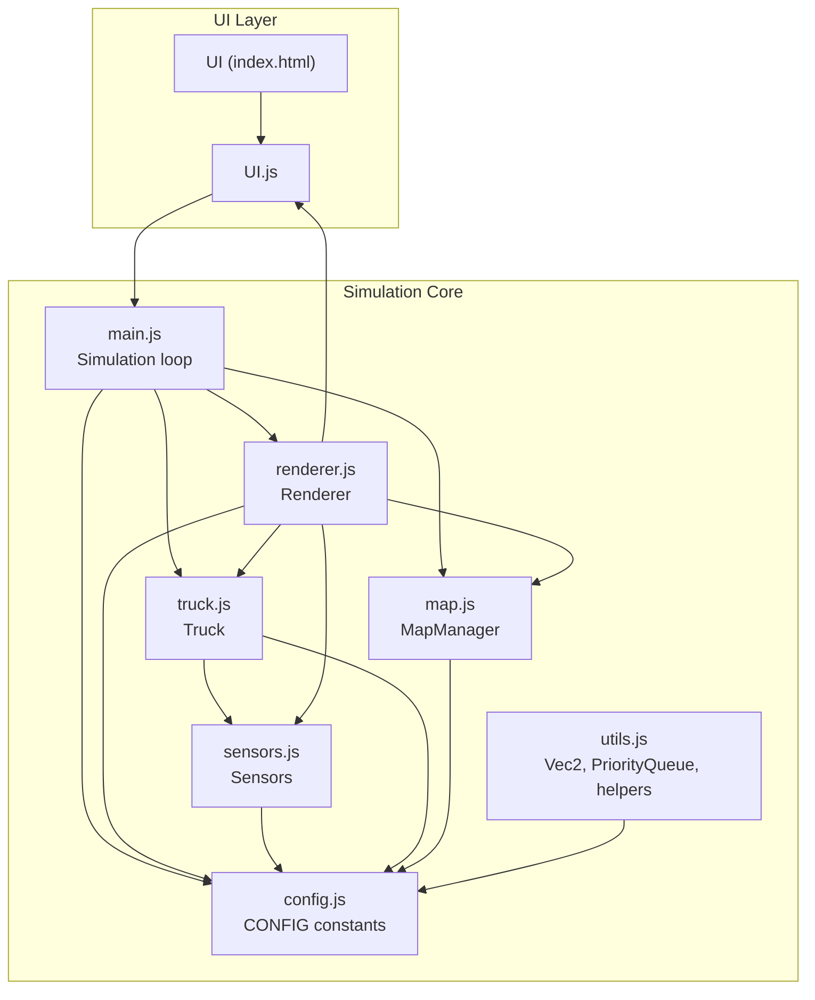
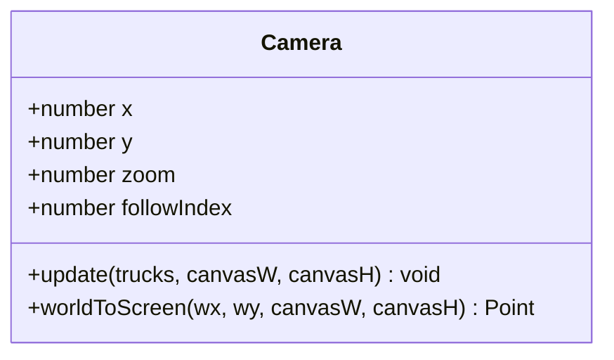
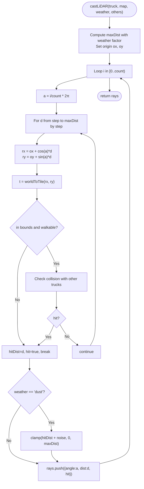
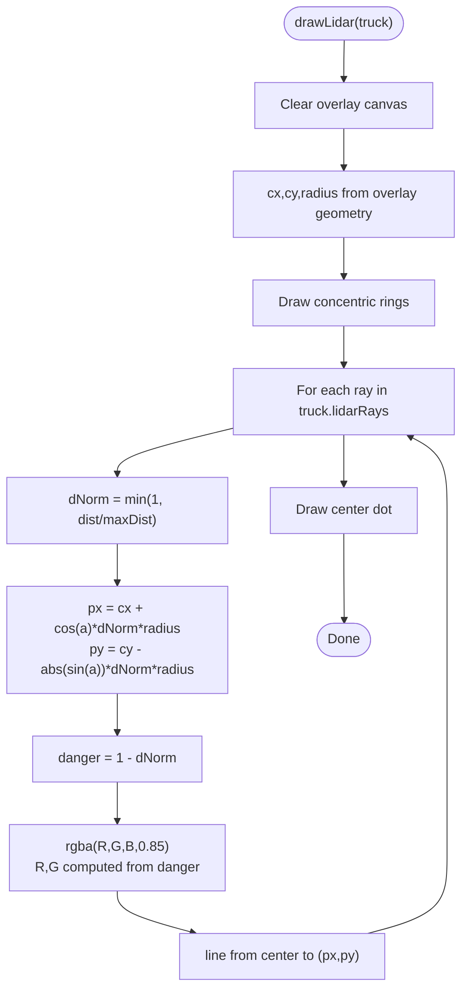
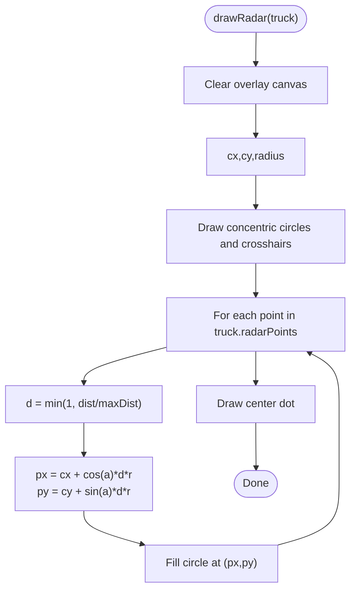
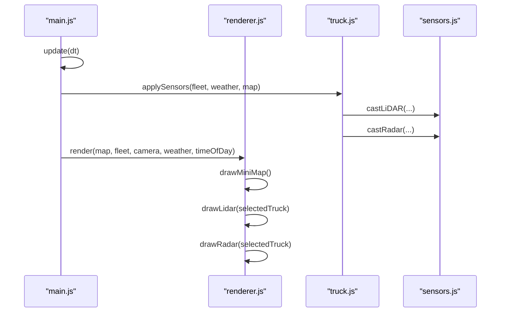
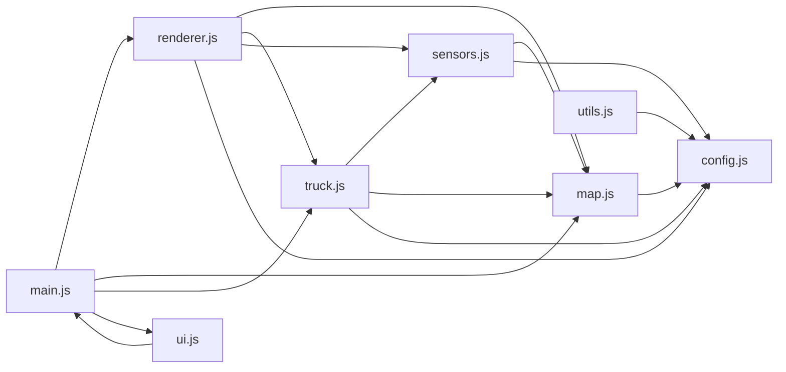

# Sensor Visualization and Rendering

<cite>
**Referenced Files in This Document**
- [index.html](file://index.html)
- [config.js](file://config.js)
- [utils.js](file://utils.js)
- [map.js](file://map.js)
- [sensors.js](file://sensors.js)
- [truck.js](file://truck.js)
- [renderer.js](file://renderer.js)
- [main.js](file://main.js)
- [ui.js](file://ui.js)
</cite>

## Table of Contents
1. [Introduction](#introduction)
2. [Project Structure](#project-structure)
3. [Core Components](#core-components)
4. [Architecture Overview](#architecture-overview)
5. [Detailed Component Analysis](#detailed-component-analysis)
6. [Dependency Analysis](#dependency-analysis)
7. [Performance Considerations](#performance-considerations)
8. [Troubleshooting Guide](#troubleshooting-guide)
9. [Conclusion](#conclusion)
10. [Appendices](#appendices)

## Introduction
This document describes the sensor visualization system that renders real-time sensor data feeds and integrates with the overall rendering pipeline. It covers:
- Canvas-based rendering of LiDAR ray projections, radar point clouds, and sensor coverage areas
- Coordinate transformation systems mapping world coordinates to screen coordinates
- Camera management for different viewing perspectives
- Color-coding schemes for obstacle types (terrain vs. vehicles), sensor range indicators, and weather effects
- Integration with the main rendering loop, performance optimization techniques, and overlay system for multiple sensor feeds
- User interface elements for sensor data display, zoom controls, and view manipulation
- Examples of sensor visualization patterns, debugging tools, and the relationship between raw sensor data and visual representations

## Project Structure
The simulation is organized around a central loop that updates the fleet and map state, then renders the scene and overlays. Sensor visualization is implemented as off-screen canvases for LiDAR and radar, plus a minimap, all integrated into the main renderer.



**Diagram sources**
- [index.html:123-243](file://index.html#L123-L243)
- [main.js:1-266](file://main.js#L1-L266)
- [renderer.js:1-437](file://renderer.js#L1-L437)
- [sensors.js:1-103](file://sensors.js#L1-L103)
- [truck.js:1-406](file://truck.js#L1-L406)
- [map.js:1-438](file://map.js#L1-L438)
- [ui.js:1-200](file://ui.js#L1-L200)
- [utils.js:1-102](file://utils.js#L1-L102)
- [config.js:1-93](file://config.js#L1-L93)

**Section sources**
- [index.html:123-243](file://index.html#L123-L243)
- [main.js:1-266](file://main.js#L1-L266)
- [renderer.js:1-437](file://renderer.js#L1-L437)

## Core Components
- Camera: Manages world-to-screen transform and follows a selected truck.
- Renderer: Draws the main simulation canvas, overlays (LiDAR/radar/minimap), and charts.
- Sensors: Computes LiDAR rays and radar points for a given truck and environment.
- Truck: Holds per-truck sensor data and applies sensor-derived behaviors.
- MapManager: Provides world-to-tile conversions, pathfinding, and zone definitions.
- UI: Controls camera selection, zoom, time/weather, and displays fleet and shift statistics.

Key responsibilities:
- Coordinate transforms: world -> camera -> screen
- Sensor computation: ray casting and point sampling
- Overlay rendering: polar plots for LiDAR and radar
- Weather/time overlays: atmospheric and lighting effects
- Real-time integration: called each frame in the animation loop

**Section sources**
- [renderer.js:1-437](file://renderer.js#L1-L437)
- [sensors.js:1-103](file://sensors.js#L1-L103)
- [truck.js:1-406](file://truck.js#L1-L406)
- [map.js:1-438](file://map.js#L1-L438)
- [ui.js:1-200](file://ui.js#L1-L200)
- [config.js:1-93](file://config.js#L1-L93)

## Architecture Overview
The rendering pipeline integrates sensor overlays with the main scene. The main canvas draws the map, routes, trucks, and environmental overlays. The sensor overlays (LiDAR, radar, minimap) are rendered on separate canvases positioned in the UI panel.

```mermaid
sequenceDiagram
participant Loop as "Animation Loop (main.js)"
participant Sim as "Simulation.update()"
participant Fleet as "Fleet.update()"
participant Truck as "Truck.update()"
participant S as "Sensors"
participant Cam as "Camera"
participant Ren as "Renderer"
participant UI as "UI.update()"
Loop->>Sim : loop()
Sim->>Sim : update(dt)
Sim->>Fleet : update(dt, map, weather, economy)
Sim->>Cam : update(trucks, canvasW, canvasH)
Sim->>Ren : render(map, fleet, camera, weather, timeOfDay)
Ren->>Ren : drawGrid(), drawZones(), drawRoutes()
Ren->>Ren : drawTruck() for each
Ren->>Ren : drawWeatherOverlay(), drawTimeOverlay()
Ren->>Ren : drawMiniMap()
Ren->>Ren : drawLidar(selectedTruck)
Ren->>Ren : drawRadar(selectedTruck)
Sim->>UI : update(fleet, economy, camera, timeScale, paused)
```

**Diagram sources**
- [main.js:209-223](file://main.js#L209-L223)
- [main.js:67-80](file://main.js#L67-L80)
- [renderer.js:38-66](file://renderer.js#L38-L66)
- [ui.js:122-158](file://ui.js#L122-L158)

## Detailed Component Analysis

### Camera and Coordinate Transform
The Camera class encapsulates the world-to-screen transform and follows a selected truck. The transform is applied to the main canvas context before drawing world-space elements.



Coordinate transform:
- Translate to center, scale by zoom, translate by negative camera position
- Convert world coordinates to screen coordinates for overlays using the same transform

Integration points:
- Main render loop applies camera transform to the main canvas context
- Overlays use camera zoom and position to convert world positions to overlay coordinates

**Diagram sources**
- [renderer.js:1-22](file://renderer.js#L1-L22)

**Section sources**
- [renderer.js:9-21](file://renderer.js#L9-L21)
- [main.js:79](file://main.js#L79)

### Sensor Data Generation
Sensors computes two primary overlays:
- LiDAR: ray-by-ray distance to nearest obstacle, with hit flags
- Radar: point cloud sampling along angular steps, recording wall vs. vehicle hits

Weather affects:
- Range reduction factors for fog/dust/rain
- Dust adds noise to ray distances



**Diagram sources**
- [sensors.js:9-48](file://sensors.js#L9-L48)

**Section sources**
- [sensors.js:2-7](file://sensors.js#L2-L7)
- [sensors.js:9-48](file://sensors.js#L9-L48)
- [sensors.js:51-79](file://sensors.js#L51-L79)

### LiDAR Overlay Rendering
The LiDAR overlay renders a semicircular plot centered near the bottom of the overlay canvas. Rays are drawn from the center outward, with color indicating proximity to obstacles.

Rendering details:
- Background: semi-circle concentric rings
- Rays: from center to outer circle, normalized by max distance
- Color: interpolated from green to red based on danger (1 - normalized distance)
- Center dot: indicates sensor position



**Diagram sources**
- [renderer.js:318-350](file://renderer.js#L318-L350)

**Section sources**
- [renderer.js:318-350](file://renderer.js#L318-L350)

### Radar Overlay Rendering
The radar overlay renders a circular plot with concentric circles and crosshairs. Points are plotted as small filled circles, colored by type (wall vs. truck).

Rendering details:
- Background: concentric circles and crosshairs
- Points: normalized by max distance, filled circles
- Types: wall vs. truck (color-coded)
- Center dot: indicates sensor position



**Diagram sources**
- [renderer.js:352-388](file://renderer.js#L352-L388)

**Section sources**
- [renderer.js:352-388](file://renderer.js#L352-L388)

### Minimap Rendering
The minimap renders a scaled view of the world grid and truck routes, with trucks as small circles.

Rendering details:
- Scale factors from world to minimap coordinates
- Blocked tiles highlighted
- Routes drawn as thin lines
- Trucks as filled circles

**Section sources**
- [renderer.js:278-316](file://renderer.js#L278-L316)

### Weather and Time Effects
Weather overlays:
- Fog: translucent blue overlay
- Dust: translucent brown overlay
- Rain: animated diagonal lines

Time overlays:
- Day: no overlay
- Dusk: orange overlay
- Night: dark radial gradient spotlight

**Section sources**
- [renderer.js:230-276](file://renderer.js#L230-L276)

### Integration with the Main Rendering Loop
The main loop updates the simulation state, then calls the renderer to draw the scene and overlays. The selected truck’s sensor data is used to render LiDAR and radar overlays.



**Diagram sources**
- [main.js:67-80](file://main.js#L67-L80)
- [truck.js:320-324](file://truck.js#L320-L324)
- [renderer.js:38-66](file://renderer.js#L38-L66)

**Section sources**
- [main.js:209-213](file://main.js#L209-L213)
- [renderer.js:38-66](file://renderer.js#L38-L66)

### User Interface Elements for Sensor Visualization
The UI provides:
- Camera selection dropdown to follow a specific truck
- Zoom slider controlling camera zoom
- Time and weather selectors affecting overlays
- Fleet cards showing per-truck status
- Charts for production metrics
- Dedicated canvases for LiDAR, radar, and minimap

These elements are bound to callbacks that update the simulation state and trigger re-rendering.

**Section sources**
- [index.html:160-238](file://index.html#L160-L238)
- [ui.js:30-62](file://ui.js#L30-L62)
- [main.js:225-260](file://main.js#L225-L260)

## Dependency Analysis
Key dependencies and relationships:
- Simulation depends on Renderer, MapManager, Fleet, UI, and CONFIG
- Renderer depends on Camera, MapManager, Truck, Sensors, and CONFIG
- Sensors depends on CONFIG and MapManager
- Truck depends on Sensors, MapManager, and CONFIG
- UI depends on Simulation callbacks and DOM elements



**Diagram sources**
- [main.js:1-45](file://main.js#L1-L45)
- [renderer.js:24-36](file://renderer.js#L24-L36)
- [sensors.js:1-7](file://sensors.js#L1-L7)
- [truck.js:1-31](file://truck.js#L1-L31)
- [map.js:1-7](file://map.js#L1-L7)
- [ui.js:1-28](file://ui.js#L1-L28)
- [utils.js:1-13](file://utils.js#L1-L13)
- [config.js:1-93](file://config.js#L1-L93)

**Section sources**
- [main.js:1-45](file://main.js#L1-L45)
- [renderer.js:24-36](file://renderer.js#L24-L36)
- [sensors.js:1-7](file://sensors.js#L1-L7)
- [truck.js:1-31](file://truck.js#L1-L31)
- [map.js:1-7](file://map.js#L1-L7)
- [ui.js:1-28](file://ui.js#L1-L28)
- [utils.js:1-13](file://utils.js#L1-L13)
- [config.js:1-93](file://config.js#L1-L93)

## Performance Considerations
- Off-screen canvases: LiDAR and radar are drawn to dedicated canvases, minimizing redraw of the main scene.
- Minimal recomputation: sensor data is updated per truck each frame; overlays are simple per-pixel operations.
- Efficient loops: ray casting uses fixed step sizes and early exits on hit.
- Camera transform reuse: the main canvas transform is applied once per frame.
- Weather effects: overlays are lightweight (fill rectangles or short lines).
- UI updates: DOM updates are batched in a single UI.update call per frame.

Optimization opportunities:
- Cache world-to-screen conversions for frequently accessed points.
- Use typed arrays for large overlay buffers if needed.
- Consider WebGL for high-frequency point clouds (not applicable here).
- Reduce overlay resolution for very large screens if necessary.

[No sources needed since this section provides general guidance]

## Troubleshooting Guide
Common issues and checks:
- No sensor overlay appears:
  - Verify the selected truck has non-empty sensor data
  - Confirm overlay canvases are present in the DOM
- Incorrect LiDAR colors:
  - Check distance normalization and danger calculation
  - Ensure max distance constants match configuration
- Radar points missing:
  - Verify radar step and max distance
  - Confirm obstacle detection logic for walls and trucks
- Weather range anomalies:
  - Validate weather range factor selection
  - Check dust noise clamping
- Camera not following:
  - Ensure follow index is set and camera.update is called
  - Verify zoom and canvas dimensions passed to update

Debugging aids:
- Inspect per-truck sensor arrays (lidarRays, radarPoints)
- Temporarily disable overlays to isolate issues
- Log computed angles/distances during ray casting

**Section sources**
- [sensors.js:2-7](file://sensors.js#L2-L7)
- [sensors.js:9-48](file://sensors.js#L9-L48)
- [sensors.js:51-79](file://sensors.js#L51-L79)
- [renderer.js:318-350](file://renderer.js#L318-L350)
- [renderer.js:352-388](file://renderer.js#L352-L388)
- [main.js:79](file://main.js#L79)

## Conclusion
The sensor visualization system integrates tightly with the rendering pipeline, using off-screen canvases to efficiently render LiDAR and radar overlays. Coordinate transformations, camera management, and weather/time effects are cleanly separated, enabling maintainable and extensible visualization. The UI provides intuitive controls for camera selection, zoom, and environmental conditions, while the main loop ensures real-time responsiveness.

[No sources needed since this section summarizes without analyzing specific files]

## Appendices

### Sensor Data Structures and Color Coding
- LiDAR rays: angle, distance, hit flag; color encodes proximity to obstacle
- Radar points: angle, distance, type ("wall" or "truck"); color encodes obstacle type
- Minimap: scaled representation of world grid and routes; trucks as circles
- Weather/time overlays: atmospheric and lighting effects applied to the main scene

**Section sources**
- [sensors.js:9-48](file://sensors.js#L9-L48)
- [sensors.js:51-79](file://sensors.js#L51-L79)
- [renderer.js:318-350](file://renderer.js#L318-L350)
- [renderer.js:352-388](file://renderer.js#L352-L388)
- [renderer.js:230-276](file://renderer.js#L230-L276)

### Configuration Constants Relevant to Sensor Visualization
- Sensor counts and ranges: lidarRays, lidarMaxDist, radarMaxDist, lidarStep
- Weather range factors and dust noise
- Camera zoom limits and follow interpolation
- UI canvas sizes for overlays

**Section sources**
- [config.js:39-86](file://config.js#L39-L86)
- [index.html:224-238](file://index.html#L224-L238)