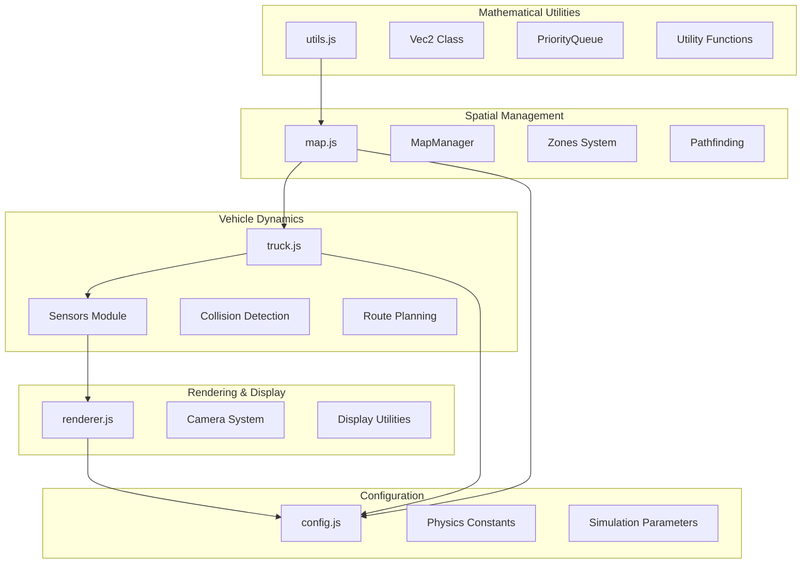
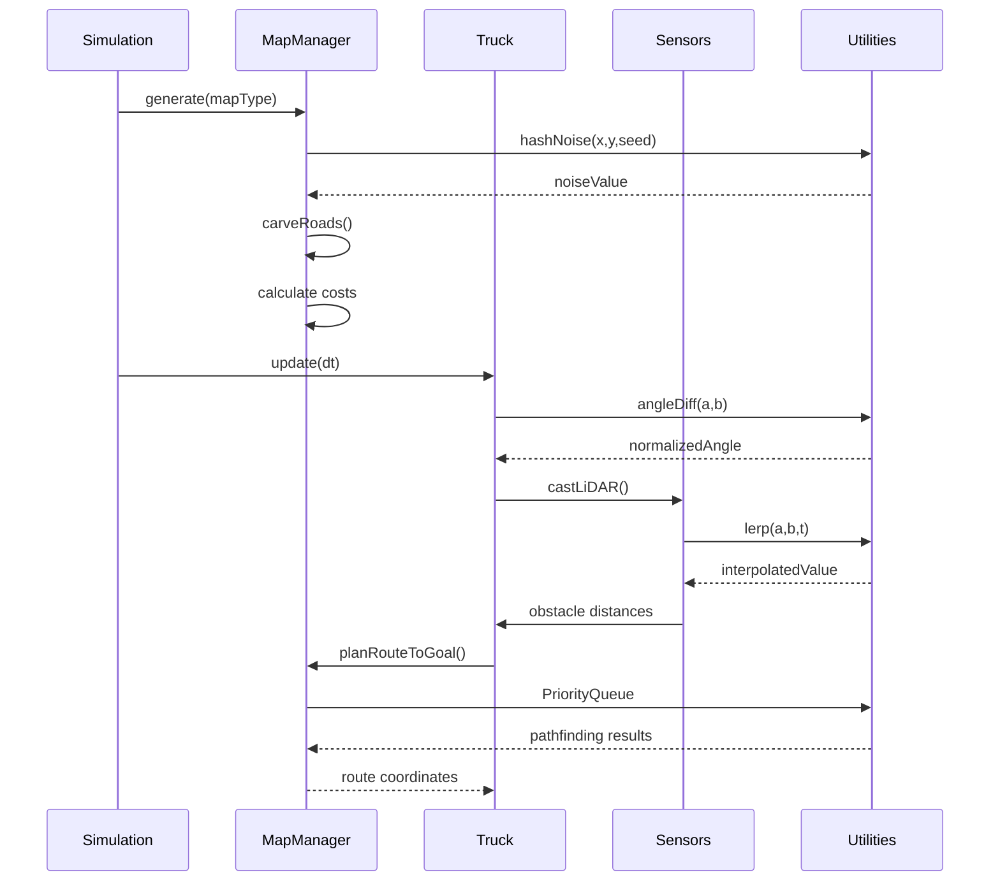
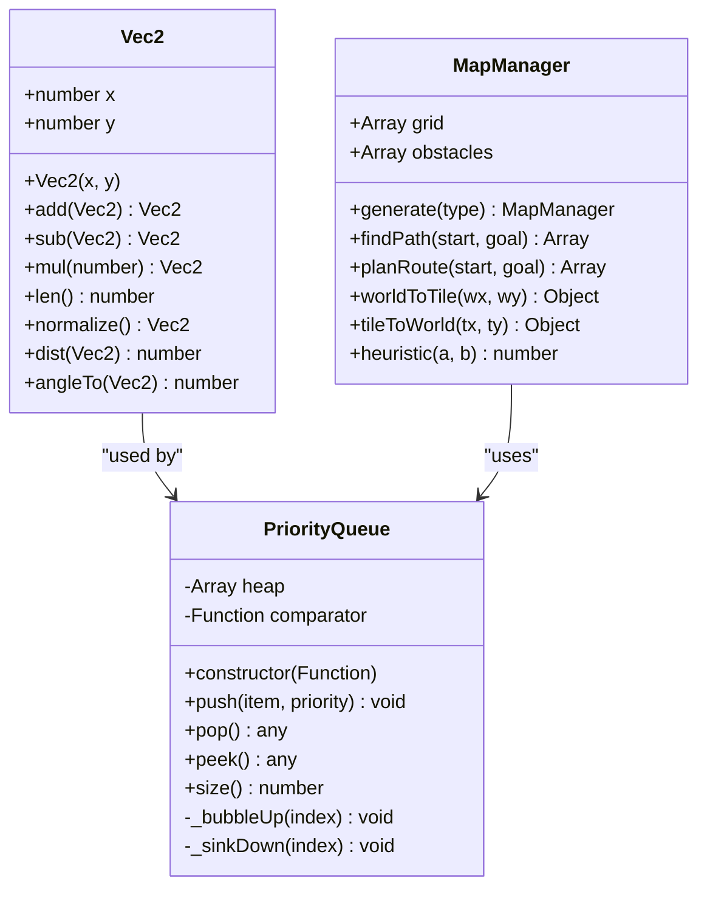
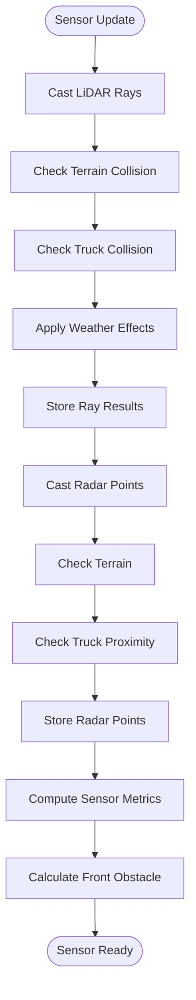
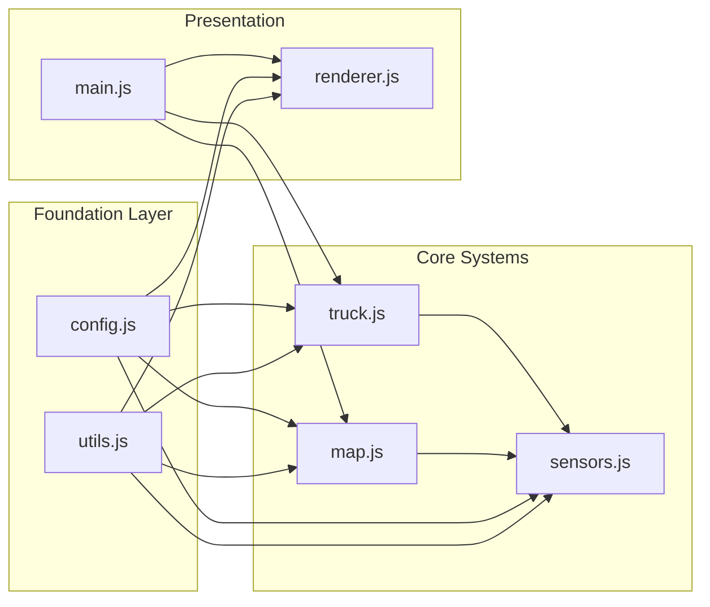

# Utilities and Helper Systems

<cite>
**Referenced Files in This Document**
- [utils.js](file://utils.js)
- [map.js](file://map.js)
- [truck.js](file://truck.js)
- [sensors.js](file://sensors.js)
- [renderer.js](file://renderer.js)
- [config.js](file://config.js)
- [main.js](file://main.js)
</cite>

## Table of Contents
1. [Introduction](#introduction)
2. [Project Structure](#project-structure)
3. [Core Components](#core-components)
4. [Architecture Overview](#architecture-overview)
5. [Detailed Component Analysis](#detailed-component-analysis)
6. [Dependency Analysis](#dependency-analysis)
7. [Performance Considerations](#performance-considerations)
8. [Troubleshooting Guide](#troubleshooting-guide)
9. [Conclusion](#conclusion)

## Introduction
This document provides comprehensive documentation for the mathematical utilities and helper systems that support the autonomous dump truck simulation. The system implements essential mathematical operations including vector mathematics, geometric calculations, random number generation, interpolation functions, and coordinate transformations. It also includes specialized data structures for pathfinding, collision avoidance, and performance optimization.

The utilities serve as the foundation for the simulation's core algorithms, enabling realistic vehicle dynamics, sensor simulations, path planning, and rendering systems. These components work together to create an efficient and mathematically sound simulation environment.

## Project Structure
The utility systems are distributed across several key modules, each serving specific mathematical and computational purposes:

**Diagram sources**
- [utils.js:1-102](file://utils.js#L1-L102)
- [map.js:1-438](file://map.js#L1-L438)
- [truck.js:1-406](file://truck.js#L1-L406)
- [sensors.js:1-103](file://sensors.js#L1-L103)
- [renderer.js:1-437](file://renderer.js#L1-L437)
- [config.js:1-93](file://config.js#L1-L93)

**Section sources**
- [utils.js:1-102](file://utils.js#L1-L102)
- [map.js:1-438](file://map.js#L1-L438)
- [truck.js:1-406](file://truck.js#L1-L406)
- [sensors.js:1-103](file://sensors.js#L1-L103)
- [renderer.js:1-437](file://renderer.js#L1-L437)
- [config.js:1-93](file://config.js#L1-L93)

## Core Components

### Vector Mathematics System
The vector mathematics system provides fundamental 2D vector operations essential for vehicle movement, collision detection, and spatial calculations.

**Vector Operations Implemented:**
- Vector addition and subtraction for position calculations
- Scalar multiplication for velocity and force applications
- Magnitude calculation using optimized hypot function
- Normalization for direction vectors
- Distance calculations between points
- Angle computation for orientation and navigation

**Section sources**
- [utils.js:1-13](file://utils.js#L1-L13)

### Priority Queue Implementation
A specialized heap-based priority queue optimized for pathfinding and scheduling operations.

**Key Features:**
- Customizable comparison functions for flexible priority ordering
- Efficient heap operations with O(log n) insertion and removal
- Bubble-up and sink-down mechanisms for maintaining heap property
- Support for dynamic priority updates during runtime

**Section sources**
- [utils.js:15-73](file://utils.js#L15-L73)

### Mathematical Utility Functions
Essential mathematical functions for simulation operations including clamping, interpolation, and angle calculations.

**Functions Provided:**
- Value clamping for bounds checking and safe operations
- Linear interpolation for smooth transitions and animations
- Angle difference calculation with proper normalization
- Random number generation for procedural content
- Hash-based noise generation for terrain creation

**Section sources**
- [utils.js:75-102](file://utils.js#L75-L102)

## Architecture Overview

The utility systems follow a layered architecture where mathematical foundations support higher-level simulation components:

**Diagram sources**
- [main.js:1-266](file://main.js#L1-L266)
- [map.js:25-74](file://map.js#L25-L74)
- [truck.js:78-116](file://truck.js#L78-L116)
- [sensors.js:9-49](file://sensors.js#L9-L49)
- [utils.js:75-82](file://utils.js#L75-L82)

## Detailed Component Analysis

### Vector2 Class Implementation

The Vec2 class provides comprehensive 2D vector mathematics optimized for game development scenarios:

**Diagram sources**
- [utils.js:1-73](file://utils.js#L1-L73)
- [map.js:1-438](file://map.js#L1-L438)

**Section sources**
- [utils.js:1-13](file://utils.js#L1-L13)
- [utils.js:15-73](file://utils.js#L15-L73)

### Pathfinding and Spatial Indexing

The MapManager implements sophisticated spatial indexing and pathfinding capabilities:

**Spatial Indexing Features:**
- Grid-based spatial partitioning for O(1) tile access
- Obstacle detection and cost calculation
- Zone-based area management
- Dynamic path recalculation

**Pathfinding Algorithm:**
- A* algorithm with diagonal movement support
- Heuristic function using Euclidean distance
- Smooth path post-processing
- Real-time obstacle avoidance

**Section sources**
- [map.js:332-430](file://map.js#L332-L430)

### Sensor Simulation System

The sensors module implements realistic sensor simulation for autonomous driving:

**Diagram sources**
- [sensors.js:9-79](file://sensors.js#L9-L79)

**Section sources**
- [sensors.js:1-103](file://sensors.js#L1-L103)

### Vehicle Physics and Collision Detection

The truck system implements comprehensive physics simulation with collision avoidance:

**Physics Model:**
- Acceleration and deceleration mechanics
- Steering dynamics with speed-dependent turning
- Friction and momentum calculations
- Weather impact on traction

**Collision Detection:**
- Separation-based collision resolution
- Predictive collision avoidance
- Multi-truck collision handling
- Boundary constraint enforcement

**Section sources**
- [truck.js:341-404](file://truck.js#L341-L404)

### Rendering and Coordinate Transformations

The renderer provides comprehensive coordinate transformation and visualization:

**Coordinate Systems:**
- World coordinates for simulation
- Screen coordinates for rendering
- Camera-relative transformations
- Zoom and pan adjustments

**Rendering Pipeline:**
- Tile-based grid rendering
- Route visualization
- Sensor data overlay
- Real-time statistics display

**Section sources**
- [renderer.js:17-66](file://renderer.js#L17-L66)

## Dependency Analysis

The utility systems demonstrate excellent modularity with clear dependency relationships:

**Diagram sources**
- [utils.js:1-102](file://utils.js#L1-L102)
- [map.js:1-438](file://map.js#L1-L438)
- [truck.js:1-406](file://truck.js#L1-L406)
- [sensors.js:1-103](file://sensors.js#L1-L103)
- [renderer.js:1-437](file://renderer.js#L1-L437)
- [config.js:1-93](file://config.js#L1-L93)
- [main.js:1-266](file://main.js#L1-L266)

**Section sources**
- [utils.js:1-102](file://utils.js#L1-L102)
- [map.js:1-438](file://map.js#L1-L438)
- [truck.js:1-406](file://truck.js#L1-L406)
- [sensors.js:1-103](file://sensors.js#L1-L103)
- [renderer.js:1-437](file://renderer.js#L1-L437)
- [config.js:1-93](file://config.js#L1-L93)
- [main.js:1-266](file://main.js#L1-L266)

## Performance Considerations

### Computational Geometry Optimizations
The simulation employs several optimization strategies for mathematical operations:

**Vector Operations:**
- Direct coordinate manipulation avoiding object creation
- Optimized magnitude calculation using Math.hypot
- Early termination in collision detection loops

**Pathfinding Efficiency:**
- Bidirectional pruning of impossible paths
- Cached heuristic calculations
- Efficient open/closed set management

**Sensor Processing:**
- Ray casting with early exit conditions
- Sector-based filtering for obstacle detection
- Weather effect application with minimal overhead

### Memory Management
- Object pooling for frequently allocated objects
- Reusable arrays for pathfinding operations
- Minimal garbage collection through object reuse

### Numerical Precision
- Consistent use of floating-point arithmetic
- Proper angle normalization to prevent drift
- Safe division operations with zero-checks

## Troubleshooting Guide

### Common Mathematical Issues

**Vector Normalization Problems:**
- Symptom: Division by zero errors
- Solution: Check for zero-length vectors before normalization
- Prevention: Use epsilon comparisons for near-zero magnitudes

**Angle Calculation Anomalies:**
- Symptom: Sudden angle jumps of ±π radians
- Solution: Use angleDiff function for proper normalization
- Prevention: Always normalize angles in the [-π, π] range

**Pathfinding Failures:**
- Symptom: Infinite loops or missing solutions
- Solution: Verify heuristic consistency and obstacle detection
- Prevention: Implement path validation and timeout mechanisms

### Performance Bottlenecks

**Sensor Simulation Slowness:**
- Monitor ray count and maximum distance parameters
- Consider reducing ray density for real-time performance
- Optimize weather effect calculations

**Collision Detection Lag:**
- Reduce separation radius for fewer collision checks
- Implement spatial partitioning for large fleets
- Use simplified collision shapes for performance

**Section sources**
- [utils.js:75-82](file://utils.js#L75-L82)
- [map.js:332-385](file://map.js#L332-L385)
- [sensors.js:81-101](file://sensors.js#L81-L101)

## Conclusion

The utility and helper systems provide a robust mathematical foundation for the autonomous dump truck simulation. The implementation demonstrates excellent engineering practices with clear separation of concerns, efficient algorithms, and comprehensive coverage of essential mathematical operations.

Key strengths include:
- Well-designed vector mathematics system supporting all simulation needs
- Efficient pathfinding implementation with A* algorithm
- Realistic sensor simulation with weather effects
- Comprehensive collision detection and resolution
- Optimized rendering pipeline with coordinate transformations

The modular architecture enables easy extension and modification while maintaining performance and reliability. The mathematical precision and computational efficiency ensure smooth operation even with multiple vehicles and complex environments.

Future enhancements could include additional geometric primitives, more sophisticated physics models, and advanced optimization techniques for larger-scale deployments.