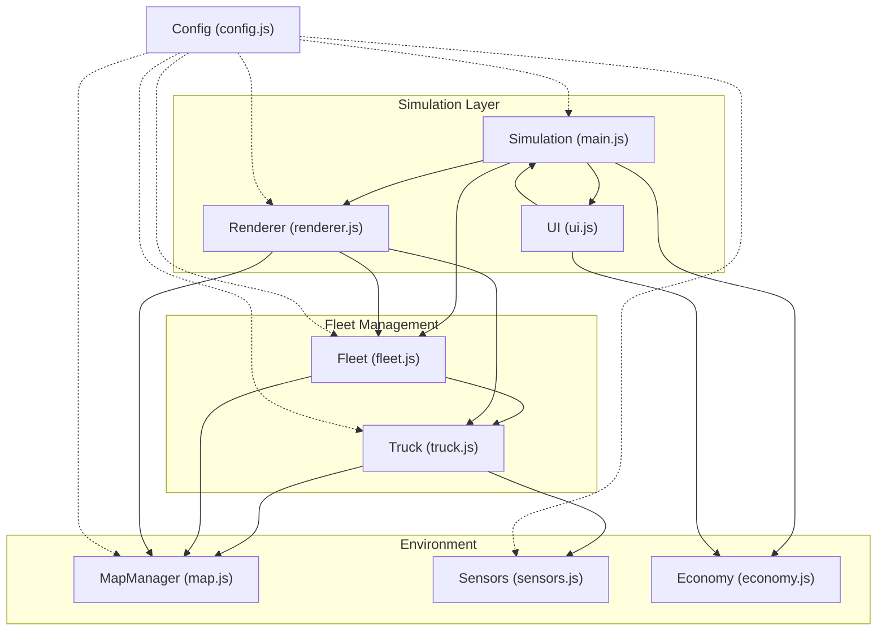
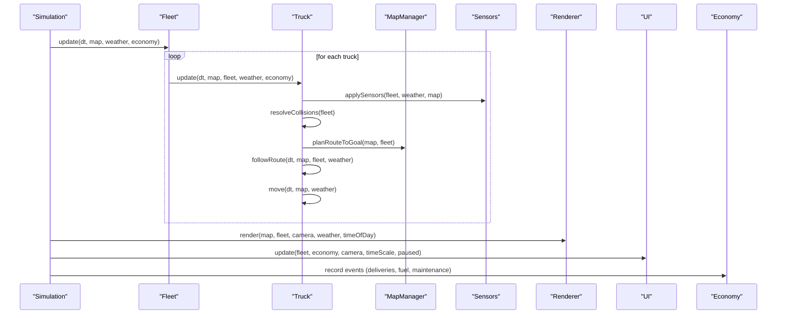
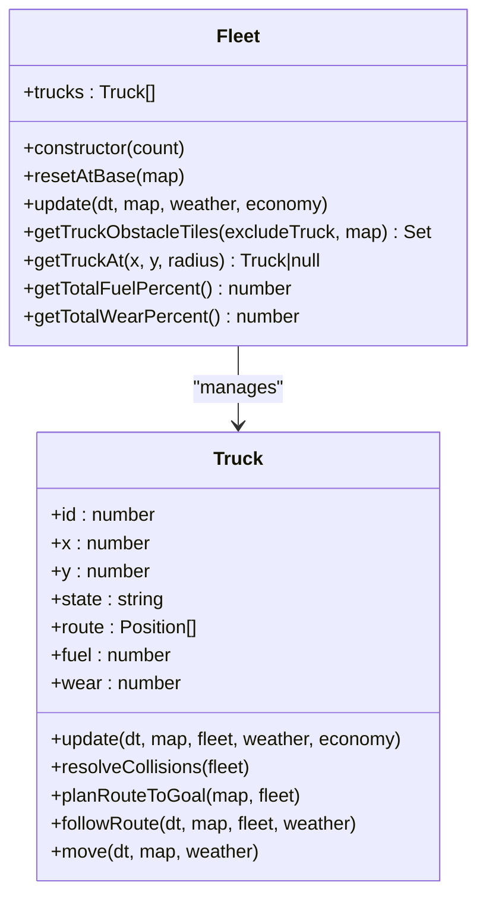
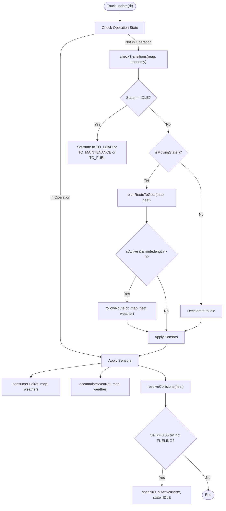
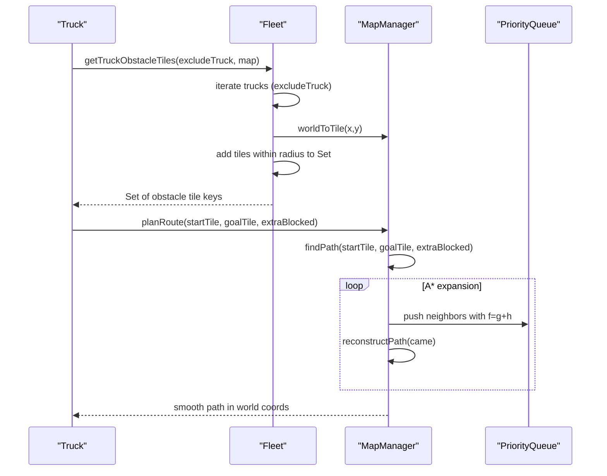
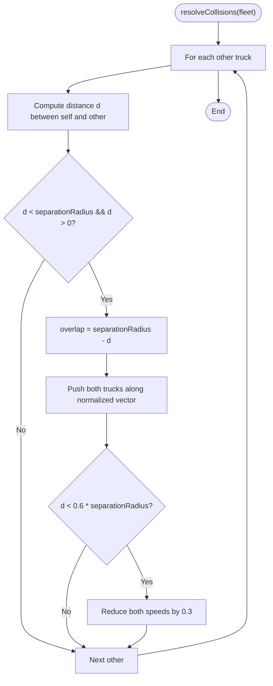
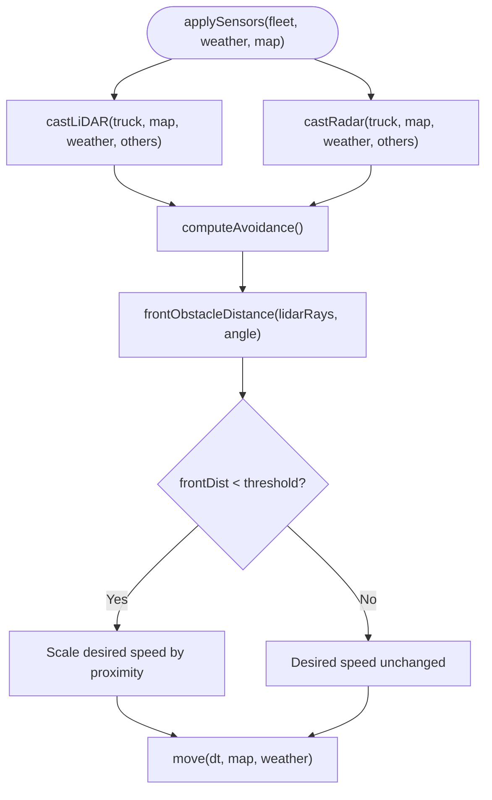
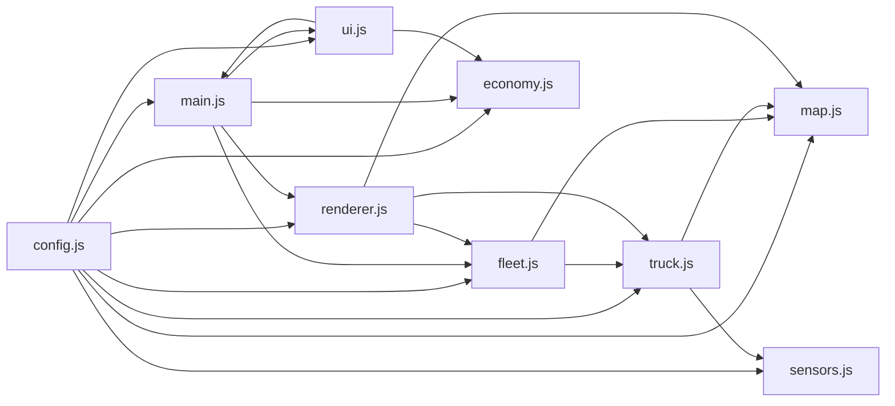

# Fleet Coordination System

<cite>
**Referenced Files in This Document**
- [index.html](file://index.html)
- [config.js](file://config.js)
- [main.js](file://main.js)
- [fleet.js](file://fleet.js)
- [truck.js](file://truck.js)
- [map.js](file://map.js)
- [renderer.js](file://renderer.js)
- [sensors.js](file://sensors.js)
- [economy.js](file://economy.js)
- [ui.js](file://ui.js)
- [utils.js](file://utils.js)
</cite>

## Table of Contents
1. [Introduction](#introduction)
2. [Project Structure](#project-structure)
3. [Core Components](#core-components)
4. [Architecture Overview](#architecture-overview)
5. [Detailed Component Analysis](#detailed-component-analysis)
6. [Dependency Analysis](#dependency-analysis)
7. [Performance Considerations](#performance-considerations)
8. [Troubleshooting Guide](#troubleshooting-guide)
9. [Conclusion](#conclusion)
10. [Appendices](#appendices)

## Introduction
This document describes the fleet management system that coordinates multiple autonomous trucks in a mining operation simulation. The system manages truck positions, calculates collision avoidance maneuvers, prevents collisions through spatial separation algorithms, generates obstacle tiles for pathfinding, maintains fleet-wide state coordination, and optimizes multi-truck routes. It integrates with individual truck state machines and provides an overall fleet strategy for efficient mining operations under normal conditions, peak load/unload scenarios, and emergency situations.

## Project Structure
The project is organized around a central simulation loop that orchestrates the map, fleet, trucks, rendering, sensors, and UI. Key modules include:
- Simulation controller: initializes and runs the simulation loop
- Fleet manager: creates and coordinates multiple trucks
- Truck AI: state machine and motion control
- Pathfinding and map management: grid-based navigation with zones
- Sensors: LiDAR and radar simulation
- Rendering and UI: visualization, charts, and controls
- Economy: production metrics and profitability tracking

**Diagram sources**
- [main.js:1-266](file://main.js#L1-L266)
- [fleet.js:1-65](file://fleet.js#L1-L65)
- [truck.js:1-406](file://truck.js#L1-L406)
- [map.js:1-438](file://map.js#L1-L438)
- [renderer.js:1-437](file://renderer.js#L1-L437)
- [sensors.js:1-103](file://sensors.js#L1-L103)
- [economy.js:1-66](file://economy.js#L1-L66)
- [ui.js:1-200](file://ui.js#L1-L200)
- [config.js:1-93](file://config.js#L1-L93)

**Section sources**
- [index.html:1-257](file://index.html#L1-L257)
- [config.js:1-93](file://config.js#L1-L93)
- [main.js:1-266](file://main.js#L1-L266)

## Core Components
- Fleet: Manages a collection of trucks, resets positions at base, updates all trucks, generates obstacle tiles for pathfinding, and provides fleet-wide statistics.
- Truck: Individual autonomous vehicle with state machine, route planning, collision avoidance, sensor integration, movement dynamics, fuel and wear tracking, and operation scheduling.
- MapManager: Grid-based world representation with zones, pathfinding, smoothing, and tile cost computation.
- Sensors: Simulated LiDAR and radar for obstacle detection and collision avoidance.
- Renderer/UI/Economy: Visualization, user controls, charts, and economic metrics.

**Section sources**
- [fleet.js:1-65](file://fleet.js#L1-L65)
- [truck.js:1-406](file://truck.js#L1-L406)
- [map.js:1-438](file://map.js#L1-L438)
- [sensors.js:1-103](file://sensors.js#L1-L103)
- [renderer.js:1-437](file://renderer.js#L1-L437)
- [ui.js:1-200](file://ui.js#L1-L200)
- [economy.js:1-66](file://economy.js#L1-L66)

## Architecture Overview
The fleet operates as a distributed yet coordinated system:
- Simulation loop drives updates for trucks, rendering, UI, and economy.
- Each truck independently executes its state machine, computes avoidance, applies sensors, and moves.
- Fleet aggregates truck obstacle tiles to inform pathfinding for other trucks.
- MapManager provides pathfinding with A* and smoothing, plus zone-based routing.
- Sensors feed real-time collision avoidance and braking logic.
- Economy tracks productivity and profitability for operational insights.

**Diagram sources**
- [main.js:67-80](file://main.js#L67-L80)
- [fleet.js:20-24](file://fleet.js#L20-L24)
- [truck.js:78-116](file://truck.js#L78-L116)
- [truck.js:246-266](file://truck.js#L246-L266)
- [truck.js:268-318](file://truck.js#L268-L318)
- [truck.js:341-356](file://truck.js#L341-L356)
- [sensors.js:9-49](file://sensors.js#L9-L49)
- [renderer.js:38-66](file://renderer.js#L38-L66)
- [ui.js:122-158](file://ui.js#L122-L158)
- [economy.js:17-39](file://economy.js#L17-L39)

## Detailed Component Analysis

### Fleet Management
The Fleet class encapsulates:
- Truck instantiation and reset at base locations
- Fleet-wide update cycle
- Obstacle tile generation for pathfinding (excluding trucks in operation states)
- Spatial queries for nearby trucks
- Fleet-wide fuel and wear averages

Key responsibilities:
- Reset trucks at base with offsets to prevent initial clustering
- Generate obstacle tiles around moving trucks for pathfinding
- Provide spatial queries for collision detection and avoidance
- Compute fleet-wide metrics for monitoring and reporting

**Diagram sources**
- [fleet.js:1-65](file://fleet.js#L1-L65)
- [truck.js:1-406](file://truck.js#L1-L406)

**Section sources**
- [fleet.js:1-65](file://fleet.js#L1-L65)

### Truck State Machine and Motion Control
Each Truck implements a finite state machine with transitions driven by:
- Zone arrival detection
- Fuel level thresholds
- Wear thresholds and planned maintenance
- Manual mode overrides

Movement logic includes:
- Route planning to target zones
- Waypoint following with snapping and deviation replanning
- Speed and steering control with traction adjustments
- Sensor-based braking and avoidance
- Collision resolution with overlap correction and speed damping

**Diagram sources**
- [truck.js:78-116](file://truck.js#L78-L116)
- [truck.js:118-157](file://truck.js#L118-L157)
- [truck.js:246-266](file://truck.js#L246-L266)
- [truck.js:268-318](file://truck.js#L268-L318)
- [truck.js:358-382](file://truck.js#L358-L382)
- [truck.js:384-404](file://truck.js#L384-L404)

**Section sources**
- [truck.js:1-406](file://truck.js#L1-L406)

### Pathfinding and Obstacle Tile Generation
Pathfinding uses A* with:
- Heuristic distance
- Diagonal movement cost adjustment
- Extra blocked tiles from moving trucks
- Path smoothing

Obstacle tiles are generated by sampling the surrounding area of moving trucks to influence pathfinding for other vehicles.

**Diagram sources**
- [fleet.js:26-44](file://fleet.js#L26-L44)
- [map.js:414-419](file://map.js#L414-L419)
- [map.js:332-385](file://map.js#L332-L385)
- [map.js:396-412](file://map.js#L396-L412)

**Section sources**
- [map.js:1-438](file://map.js#L1-L438)
- [fleet.js:26-44](file://fleet.js#L26-L44)

### Collision Resolution Mechanisms
Collision resolution enforces spatial separation:
- Overlap correction: pushes colliding trucks apart along the normalized vector between centers
- Speed damping: reduces speeds when separation is below a threshold
- Separation radius enforcement: maintains minimum distance between trucks

**Diagram sources**
- [truck.js:384-404](file://truck.js#L384-L404)
- [config.js:73-79](file://config.js#L73-L79)

**Section sources**
- [truck.js:384-404](file://truck.js#L384-L404)

### Sensor-Based Avoidance and Braking
Sensors provide:
- LiDAR: 360° scan with weather range factors and noise
- Radar: 360° point cloud of obstacles
- Front obstacle detection for braking

Avoidance logic:
- Computes left/right open space from LiDAR rays
- Applies lateral offset to avoid collisions
- Adjusts speed based on front obstacle distance and weather traction

**Diagram sources**
- [sensors.js:9-49](file://sensors.js#L9-L49)
- [sensors.js:51-79](file://sensors.js#L51-L79)
- [sensors.js:81-90](file://sensors.js#L81-L90)
- [truck.js:320-324](file://truck.js#L320-L324)
- [truck.js:326-339](file://truck.js#L326-L339)
- [truck.js:285-289](file://truck.js#L285-L289)

**Section sources**
- [sensors.js:1-103](file://sensors.js#L1-L103)
- [truck.js:285-339](file://truck.js#L285-L339)

### Fleet-Wide State Coordination and Multi-Truck Route Optimization
- Base reset: Trucks spawn near base with offsets to avoid congestion
- Route replanning: Trucks replan periodically and when deviation exceeds threshold
- Shared obstacle tiles: Moving trucks contribute obstacle tiles to prevent path conflicts
- Operation states: Loading, unloading, refueling, and maintenance states are excluded from obstacle generation

Operational patterns:
- Normal operation: Idle -> TO_LOAD -> LOADING -> TO_UNLOAD -> UNLOADING -> TO_LOAD...
- Peak load/unload: Multiple trucks converge on zones; obstacle tiles reduce path conflicts; sensors enforce braking and avoidance
- Emergency: Urgent maintenance triggers immediate TO_MAINTENANCE; fuel critical state forces TO_FUEL

**Section sources**
- [fleet.js:9-18](file://fleet.js#L9-L18)
- [fleet.js:26-44](file://fleet.js#L26-L44)
- [truck.js:118-157](file://truck.js#L118-L157)
- [truck.js:246-266](file://truck.js#L246-L266)
- [truck.js:300-305](file://truck.js#L300-L305)

### Integration with Individual Truck State Machines
The fleet integrates with each truck’s state machine by:
- Passing the fleet reference to sensors and pathfinding
- Using fleet obstacle tiles to influence route planning
- Coordinating operation states to avoid simultaneous zone occupancy
- Providing spatial queries for collision detection

**Section sources**
- [truck.js:78-116](file://truck.js#L78-L116)
- [truck.js:246-266](file://truck.js#L246-L266)
- [truck.js:320-324](file://truck.js#L320-L324)

## Dependency Analysis
The system exhibits layered dependencies:
- Simulation depends on Fleet, Renderer, UI, and Economy
- Fleet depends on MapManager and Truck
- Truck depends on Sensors, MapManager, and Config
- Renderer depends on MapManager, Fleet, and Truck
- UI depends on Simulation and Economy
- Economy is standalone but records events triggered by trucks

**Diagram sources**
- [config.js:1-93](file://config.js#L1-L93)
- [main.js:1-266](file://main.js#L1-L266)
- [fleet.js:1-65](file://fleet.js#L1-L65)
- [truck.js:1-406](file://truck.js#L1-L406)
- [map.js:1-438](file://map.js#L1-L438)
- [sensors.js:1-103](file://sensors.js#L1-L103)
- [renderer.js:1-437](file://renderer.js#L1-L437)
- [ui.js:1-200](file://ui.js#L1-L200)
- [economy.js:1-66](file://economy.js#L1-L66)

**Section sources**
- [main.js:1-266](file://main.js#L1-L266)
- [fleet.js:1-65](file://fleet.js#L1-L65)
- [truck.js:1-406](file://truck.js#L1-L406)
- [map.js:1-438](file://map.js#L1-L438)
- [sensors.js:1-103](file://sensors.js#L1-L103)
- [renderer.js:1-437](file://renderer.js#L1-L437)
- [ui.js:1-200](file://ui.js#L1-L200)
- [economy.js:1-66](file://economy.js#L1-L66)

## Performance Considerations
- Pathfinding cost: A* with diagonal movement and extra blocked tiles scales with grid size and number of trucks contributing obstacles.
- Sensor computation: LiDAR and radar scans per frame depend on ray counts and weather factors.
- Rendering overhead: Drawing multiple trucks, routes, and sensor canvases impacts frame rate.
- Optimization opportunities:
  - Cache obstacle tiles per frame and invalidate only when trucks move significantly.
  - Limit replan frequency and use deviation thresholds to reduce path recomputation.
  - Use spatial partitioning (grid or quadtree) for collision checks among trucks.
  - Batch sensor updates and reuse computed ray arrays.

[No sources needed since this section provides general guidance]

## Troubleshooting Guide
Common issues and resolutions:
- Trucks stuck in place:
  - Verify fuel levels and state transitions; ensure fuel critical logic does not indefinitely block movement.
  - Check pathfinding failures and replan cooldown settings.
- Collisions persist:
  - Confirm separation radius and overlap correction thresholds.
  - Validate that operation states are excluded from obstacle generation.
- Poor pathfinding:
  - Inspect extraBlocked tiles and ensure they reflect moving trucks accurately.
  - Review smoothing and waypoint snapping thresholds.
- Sensor anomalies:
  - Check weather range factors and noise parameters.
  - Verify front sector and brake distance factor settings.

**Section sources**
- [truck.js:111-116](file://truck.js#L111-L116)
- [truck.js:246-266](file://truck.js#L246-L266)
- [truck.js:300-305](file://truck.js#L300-L305)
- [truck.js:384-404](file://truck.js#L384-L404)
- [sensors.js:2-7](file://sensors.js#L2-L7)
- [sensors.js:81-90](file://sensors.js#L81-L90)

## Conclusion
The fleet coordination system integrates autonomous truck state machines with shared pathfinding and collision avoidance to enable efficient mining operations. By leveraging obstacle tile generation, spatial separation algorithms, and sensor-driven braking, the system maintains safe and productive multi-truck operations under normal, peak, and emergency conditions. The modular design allows for performance tuning and future enhancements such as dynamic lane management and adaptive replanning.

[No sources needed since this section summarizes without analyzing specific files]

## Appendices

### Example Operations Scenarios
- Normal operational pattern:
  - Trucks cycle through IDLE -> TO_LOAD -> LOADING -> TO_UNLOAD -> UNLOADING -> TO_LOAD.
  - Fleet ensures spatial separation and uses obstacle tiles to prevent path conflicts.
- Peak load/unload:
  - Multiple trucks converge on load/unload zones; sensors enforce braking and avoidance; fleet replans routes to minimize congestion.
- Emergency situations:
  - Urgent maintenance triggers immediate TO_MAINTENANCE; fuel critical state forces TO_FUEL; trucks decelerate and re-route accordingly.

[No sources needed since this section provides conceptual examples]