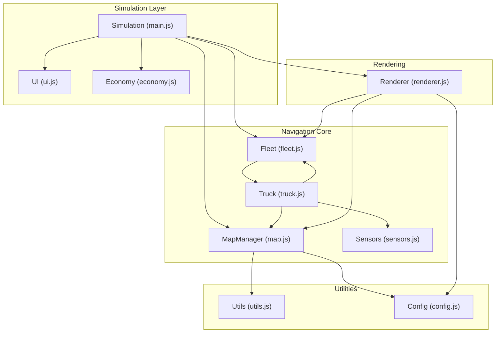
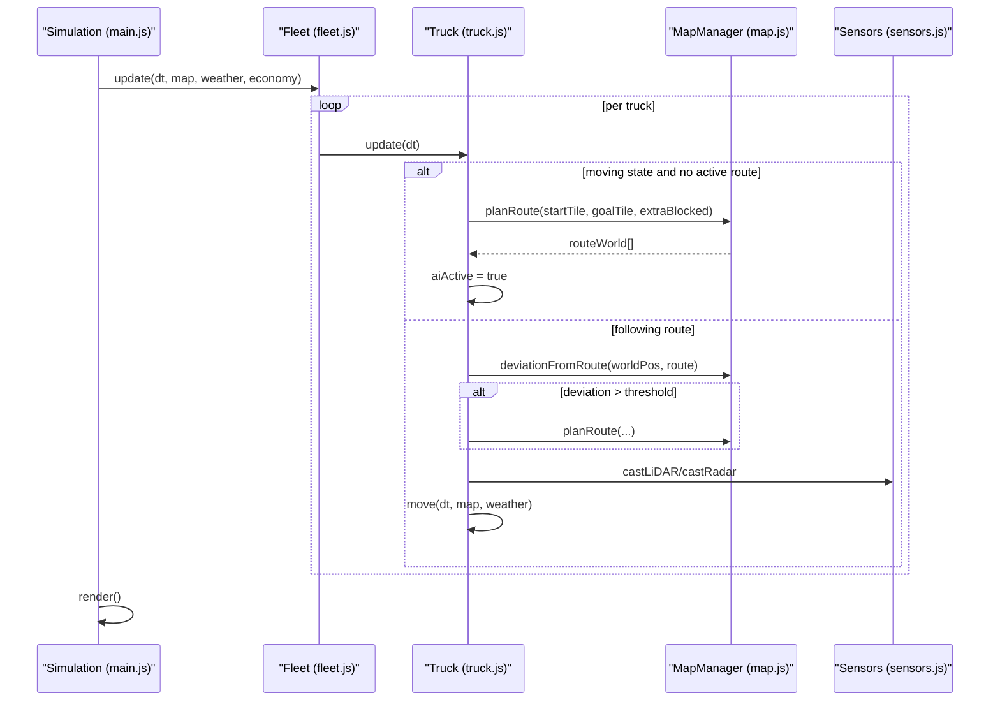
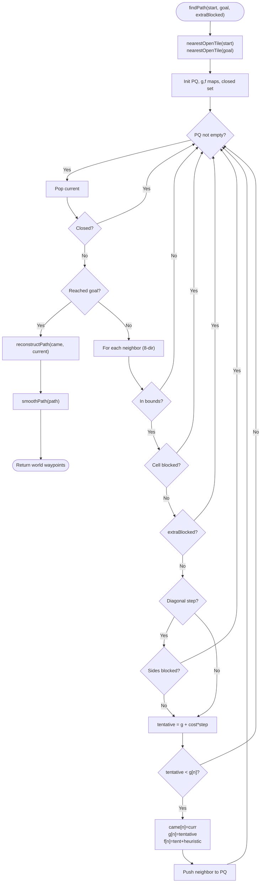
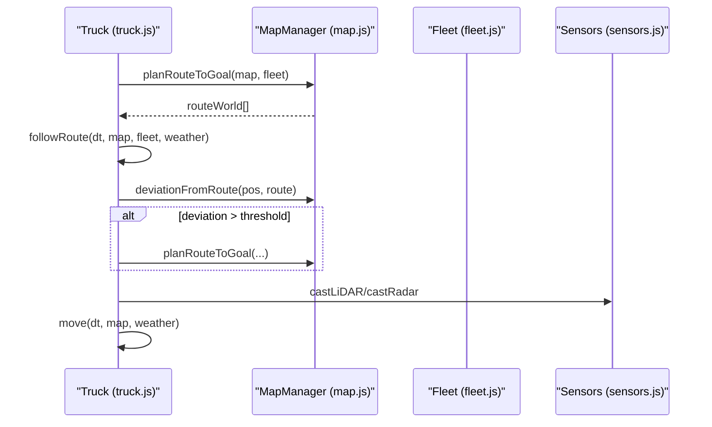
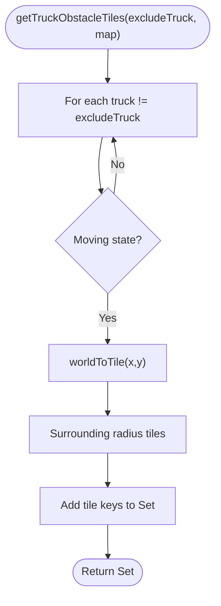
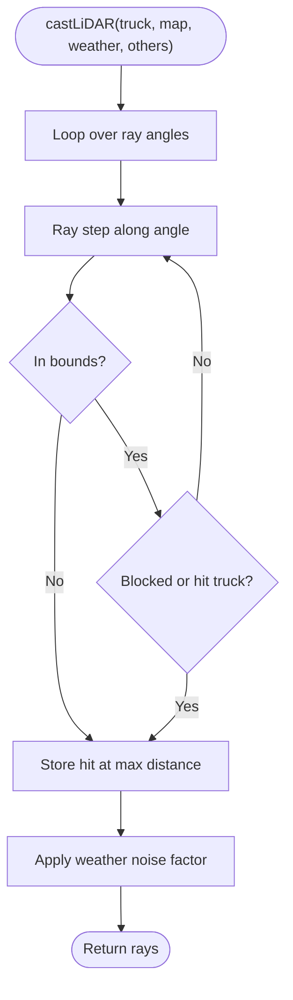
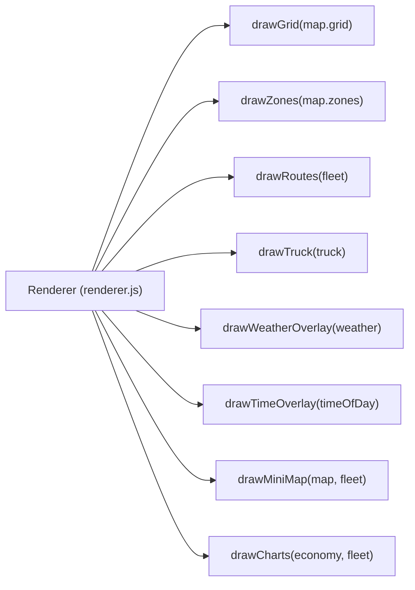
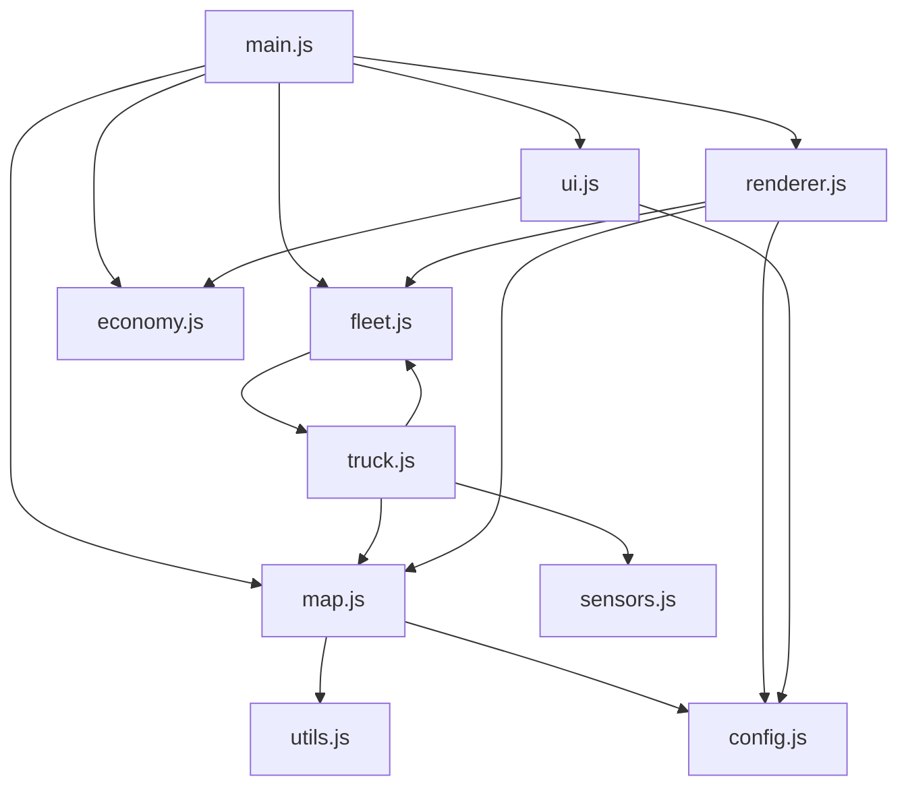

# Navigation and Pathfinding System

<cite>
**Referenced Files in This Document**
- [main.js](file://main.js)
- [map.js](file://map.js)
- [truck.js](file://truck.js)
- [fleet.js](file://fleet.js)
- [sensors.js](file://sensors.js)
- [renderer.js](file://renderer.js)
- [config.js](file://config.js)
- [utils.js](file://utils.js)
- [economy.js](file://economy.js)
- [ui.js](file://ui.js)
</cite>

## Table of Contents
1. [Introduction](#introduction)
2. [Project Structure](#project-structure)
3. [Core Components](#core-components)
4. [Architecture Overview](#architecture-overview)
5. [Detailed Component Analysis](#detailed-component-analysis)
6. [Dependency Analysis](#dependency-analysis)
7. [Performance Considerations](#performance-considerations)
8. [Troubleshooting Guide](#troubleshooting-guide)
9. [Conclusion](#conclusion)
10. [Appendices](#appendices)

## Introduction
This document explains the navigation and pathfinding system that powers autonomous truck routing and terrain navigation in the simulation. It covers:
- A* pathfinding with heuristic functions, node expansion, and dynamic replanning
- Grid-based map generation, roads, zones, and blocked terrain
- Route optimization including waypoint following, deviation detection, and replanning
- Integration with fleet management for obstacle avoidance tiles
- Coordination between individual truck routes and overall mining operation efficiency

## Project Structure
The system is organized around a central simulation loop, a map manager, a fleet of trucks, and supporting utilities and rendering.

**Diagram sources**
- [main.js:1-266](file://main.js#L1-L266)
- [map.js:1-438](file://map.js#L1-L438)
- [truck.js:1-406](file://truck.js#L1-L406)
- [fleet.js:1-65](file://fleet.js#L1-L65)
- [sensors.js:1-103](file://sensors.js#L1-L103)
- [renderer.js:1-437](file://renderer.js#L1-L437)
- [config.js:1-93](file://config.js#L1-L93)
- [utils.js:1-102](file://utils.js#L1-L102)
- [economy.js:1-66](file://economy.js#L1-L66)
- [ui.js:1-200](file://ui.js#L1-L200)

**Section sources**
- [main.js:1-266](file://main.js#L1-L266)
- [map.js:1-438](file://map.js#L1-L438)
- [truck.js:1-406](file://truck.js#L1-L406)
- [fleet.js:1-65](file://fleet.js#L1-L65)
- [sensors.js:1-103](file://sensors.js#L1-L103)
- [renderer.js:1-437](file://renderer.js#L1-L437)
- [config.js:1-93](file://config.js#L1-L93)
- [utils.js:1-102](file://utils.js#L1-L102)
- [economy.js:1-66](file://economy.js#L1-L66)
- [ui.js:1-200](file://ui.js#L1-L200)

## Core Components
- MapManager: Generates terrain, carves roads/zones, computes costs, and runs A* pathfinding with smoothing.
- Truck: Drives along routes, replans on deviation, avoids obstacles, and manages operations.
- Fleet: Coordinates multiple trucks, provides obstacle tiles for A*, and aggregates metrics.
- Sensors: Provides LiDAR/Radar data for collision avoidance and braking.
- Renderer/UI/Economy: Visual feedback, controls, and operational metrics.

**Section sources**
- [map.js:1-438](file://map.js#L1-L438)
- [truck.js:1-406](file://truck.js#L1-L406)
- [fleet.js:1-65](file://fleet.js#L1-L65)
- [sensors.js:1-103](file://sensors.js#L1-L103)
- [renderer.js:1-437](file://renderer.js#L1-L437)
- [ui.js:1-200](file://ui.js#L1-L200)
- [economy.js:1-66](file://economy.js#L1-L66)

## Architecture Overview
The simulation loop updates trucks, replanning routes when needed, and renders the map, routes, and sensor overlays.

**Diagram sources**
- [main.js:67-80](file://main.js#L67-L80)
- [truck.js:78-116](file://truck.js#L78-L116)
- [truck.js:246-266](file://truck.js#L246-L266)
- [map.js:332-385](file://map.js#L332-L385)
- [sensors.js:9-49](file://sensors.js#L9-L49)

## Detailed Component Analysis

### MapManager: Terrain, Roads, Zones, and A* Pathfinding
- Grid generation: Randomized height/slope/roughness with blocked terrain rules per map type.
- Road carving: Straight-line corridors and special spiral roads for “terrace” map.
- Zone placement: Base, loading, unloading, fuel, and maintenance zones with centers.
- Blocked terrain detection: Uses grid bounds and blocked flags.
- A* pathfinding:
  - Heuristic: Euclidean distance.
  - Node expansion: 8-directional with diagonal cost adjustment and blocked/diagonal-side checks.
  - Reconstruct path and smooth path by removing collinear waypoints.
  - Dynamic replanning support via extraBlocked tiles from fleet.
- Route planning: Converts tile-path to world waypoints and smooths.

**Diagram sources**
- [map.js:332-385](file://map.js#L332-L385)
- [map.js:387-394](file://map.js#L387-L394)
- [map.js:396-412](file://map.js#L396-L412)
- [map.js:316-330](file://map.js#L316-L330)

Key implementation references:
- Heuristic and A*: [map.js:21-23](file://map.js#L21-L23), [map.js:332-385](file://map.js#L332-L385)
- Smoothing: [map.js:396-412](file://map.js#L396-L412)
- Road carving: [map.js:76-111](file://map.js#L76-L111), [map.js:113-194](file://map.js#L113-L194)
- Zone roads: [map.js:260-293](file://map.js#L260-L293)
- Zone centers and names: [map.js:295-314](file://map.js#L295-L314)

**Section sources**
- [map.js:1-438](file://map.js#L1-L438)

### Truck: Route Following, Deviation Detection, and Replanning
- State machine: IDLE → TO_LOAD/TO_UNLOAD/TO_FUEL/TO_MAINTENANCE → operations → back to IDLE.
- Route planning: Computes target zone center and requests route from MapManager, excluding nearby trucks via Fleet.
- Waypoint following: Snaps to target waypoint within a distance threshold; adjusts speed based on proximity.
- Deviation detection: Measures distance to recent route segment; replans if exceeded.
- Obstacle avoidance: Computes lateral avoidance offset from LiDAR; applies braking near obstacles.
- Movement: Integrates speed and angle with terrain traction and collision checks.

**Diagram sources**
- [truck.js:246-266](file://truck.js#L246-L266)
- [truck.js:268-318](file://truck.js#L268-L318)
- [truck.js:320-324](file://truck.js#L320-L324)
- [truck.js:341-356](file://truck.js#L341-L356)
- [map.js:421-430](file://map.js#L421-L430)

Key implementation references:
- State transitions and arrivals: [truck.js:118-157](file://truck.js#L118-L157), [truck.js:159-222](file://truck.js#L159-L222)
- Route planning: [truck.js:246-266](file://truck.js#L246-L266)
- Waypoint snapping and replan: [truck.js:268-318](file://truck.js#L268-L318)
- Sensors and braking: [sensors.js:9-49](file://sensors.js#L9-L49), [truck.js:285-289](file://truck.js#L285-L289)
- Movement and collisions: [truck.js:341-356](file://truck.js#L341-L356), [truck.js:384-404](file://truck.js#L384-L404)

**Section sources**
- [truck.js:1-406](file://truck.js#L1-L406)
- [sensors.js:1-103](file://sensors.js#L1-L103)

### Fleet: Obstacle Avoidance Tiles and Coordination
- Excludes moving trucks from pathfinding by marking nearby tiles as blocked.
- Provides aggregated metrics for UI and economy.

**Diagram sources**
- [fleet.js:26-44](file://fleet.js#L26-L44)

Key implementation references:
- Obstacle tiles: [fleet.js:26-44](file://fleet.js#L26-L44)
- Reset trucks at base: [fleet.js:9-18](file://fleet.js#L9-L18)

**Section sources**
- [fleet.js:1-65](file://fleet.js#L1-L65)

### Sensors: LiDAR and Radar for Collision Avoidance
- LiDAR: Casts rays around the truck, measures distances to walls/trucks, with weather range factors and noise.
- Radar: Detects nearby trucks/walls for visualization.
- Front obstacle detection: Finds nearest obstacle in front sector for braking.

**Diagram sources**
- [sensors.js:9-49](file://sensors.js#L9-L49)

Key implementation references:
- LiDAR/Radar casting: [sensors.js:9-79](file://sensors.js#L9-L79)
- Front obstacle: [sensors.js:81-90](file://sensors.js#L81-L90)

**Section sources**
- [sensors.js:1-103](file://sensors.js#L1-L103)

### Rendering and UI: Routes, Zones, Charts, and Controls
- Renders grid, zones, routes, trucks, and overlays (weather/time).
- Mini-map shows blocked tiles and truck routes.
- Charts show fuel, tons, and profit metrics.
- UI controls mode, time scale, camera, and map selection.

**Diagram sources**
- [renderer.js:38-66](file://renderer.js#L38-L66)
- [renderer.js:68-128](file://renderer.js#L68-L128)
- [renderer.js:153-172](file://renderer.js#L153-L172)
- [renderer.js:278-316](file://renderer.js#L278-L316)
- [renderer.js:390-435](file://renderer.js#L390-L435)

Key implementation references:
- Route drawing: [renderer.js:153-172](file://renderer.js#L153-L172)
- Mini-map: [renderer.js:278-316](file://renderer.js#L278-L316)
- Charts: [renderer.js:390-435](file://renderer.js#L390-L435)

**Section sources**
- [renderer.js:1-437](file://renderer.js#L1-L437)
- [ui.js:1-200](file://ui.js#L1-L200)

## Dependency Analysis
- Simulation orchestrates MapManager, Fleet, Economy, Renderer, and UI.
- Truck depends on MapManager for pathfinding and on Sensors for collision avoidance.
- Fleet provides obstacle tiles to MapManager during A* planning.
- Renderer depends on MapManager and Fleet for visualization.
- Config centralizes constants for physics, fuel, wear, sensors, operations, and FSM.

**Diagram sources**
- [main.js:1-266](file://main.js#L1-L266)
- [map.js:1-438](file://map.js#L1-L438)
- [truck.js:1-406](file://truck.js#L1-L406)
- [fleet.js:1-65](file://fleet.js#L1-L65)
- [sensors.js:1-103](file://sensors.js#L1-L103)
- [renderer.js:1-437](file://renderer.js#L1-L437)
- [config.js:1-93](file://config.js#L1-L93)
- [utils.js:1-102](file://utils.js#L1-L102)
- [economy.js:1-66](file://economy.js#L1-L66)
- [ui.js:1-200](file://ui.js#L1-L200)

**Section sources**
- [main.js:1-266](file://main.js#L1-L266)
- [map.js:1-438](file://map.js#L1-L438)
- [truck.js:1-406](file://truck.js#L1-L406)
- [fleet.js:1-65](file://fleet.js#L1-L65)
- [sensors.js:1-103](file://sensors.js#L1-L103)
- [renderer.js:1-437](file://renderer.js#L1-L437)
- [config.js:1-93](file://config.js#L1-L93)
- [utils.js:1-102](file://utils.js#L1-L102)
- [economy.js:1-66](file://economy.js#L1-L66)
- [ui.js:1-200](file://ui.js#L1-L200)

## Performance Considerations
- A* complexity: O(B^d) with branching factor B and depth d; diagonal movement increases B slightly.
- Optimizations present:
  - Diagonal step cost tuned to prevent unnecessary long diagonal paths.
  - Side-blocking checks to avoid cutting corners through walls.
  - Priority queue with custom comparator for efficient frontier management.
  - Smoothing reduces path length and improves steering stability.
- Route replanning cooldown prevents frequent recomputation.
- Rendering draws only visible segments and uses efficient loops over grid and routes.

[No sources needed since this section provides general guidance]

## Troubleshooting Guide
Common issues and diagnostics:
- Truck stuck on blocked terrain:
  - Verify nearest open tile resolution and blocked flags around spawn/destination.
  - Check map boundaries and blocked terrain rules per map type.
  - References: [map.js:316-330](file://map.js#L316-L330), [map.js:414-419](file://map.js#L414-L419)
- No route found:
  - Confirm goal is reachable; consider increasing search radius or adjusting extraBlocked.
  - References: [map.js:332-385](file://map.js#L332-L385)
- Excessive replanning:
  - Increase deviation threshold or replan cooldown to stabilize.
  - References: [truck.js:300-305](file://truck.js#L300-L305), [config.js:65-71](file://config.js#L65-L71)
- Sensor misreads:
  - Adjust LiDAR max distance and weather range factors.
  - References: [sensors.js:2-7](file://sensors.js#L2-L7), [sensors.js:11](file://sensors.js#L11)
- Rendering artifacts:
  - Ensure grid dimensions and tile sizes match configuration.
  - References: [config.js:2-4](file://config.js#L2-L4), [renderer.js:68-128](file://renderer.js#L68-L128)

**Section sources**
- [map.js:316-330](file://map.js#L316-L330)
- [map.js:332-385](file://map.js#L332-L385)
- [map.js:414-419](file://map.js#L414-L419)
- [truck.js:300-305](file://truck.js#L300-L305)
- [config.js:65-71](file://config.js#L65-L71)
- [sensors.js:2-7](file://sensors.js#L2-L7)
- [sensors.js:11](file://sensors.js#L11)
- [renderer.js:68-128](file://renderer.js#L68-L128)

## Conclusion
The navigation system combines procedural map generation, robust A* pathfinding, and real-time route optimization to enable efficient autonomous truck operation across varied mining terrains. Integration with fleet obstacle avoidance and sensor feedback ensures safe, adaptive driving. The modular architecture allows easy extension to new maps, operations, and performance tuning.

[No sources needed since this section summarizes without analyzing specific files]

## Appendices

### Pathfinding Scenarios and Examples
- Scenario A: Straight-line corridor with minimal slope
  - Expected: Short A* path with few waypoints; smoothing removes redundant nodes.
  - References: [map.js:76-111](file://map.js#L76-L111), [map.js:396-412](file://map.js#L396-L412)
- Scenario B: Spiral road (“terrace”) with constrained diagonals
  - Expected: A* avoids sharp diagonals; side-blocking logic maintains road integrity.
  - References: [map.js:113-194](file://map.js#L113-L194)
- Scenario C: Dense fleet with dynamic replanning
  - Expected: Trucks avoid each other via extraBlocked; replan when deviation exceeds threshold.
  - References: [fleet.js:26-44](file://fleet.js#L26-L44), [truck.js:300-305](file://truck.js#L300-L305)

### Terrain Navigation Challenges and Strategies
- Challenge: Steep slopes and rough terrain increase cost
  - Strategy: A* cost incorporates slope and roughness; trucks reduce speed and adjust traction.
  - References: [map.js:62](file://map.js#L62), [truck.js:291-295](file://truck.js#L291-L295)
- Challenge: Narrow roads and tight turns
  - Strategy: Diagonal step cost discourages long diagonal moves; smoothing improves turn radii.
  - References: [map.js:372](file://map.js#L372), [map.js:396-412](file://map.js#L396-L412)
- Challenge: Dynamic obstacles (other trucks)
  - Strategy: extraBlocked tiles; LiDAR-based braking and lateral avoidance.
  - References: [fleet.js:26-44](file://fleet.js#L26-L44), [sensors.js:9-49](file://sensors.js#L9-L49), [truck.js:326-339](file://truck.js#L326-L339)

### Route Optimization Strategies
- Waypoint following: Snap to targets within a distance threshold to improve stability.
  - References: [truck.js:307-317](file://truck.js#L307-L317)
- Deviation detection: Replan when drift exceeds configured tolerance.
  - References: [map.js:421-430](file://map.js#L421-L430), [truck.js:300-305](file://truck.js#L300-L305)
- Automatic replanning cooldown: Prevents oscillation and excessive recomputation.
  - References: [truck.js:246-249](file://truck.js#L246-L249), [config.js:68](file://config.js#L68)