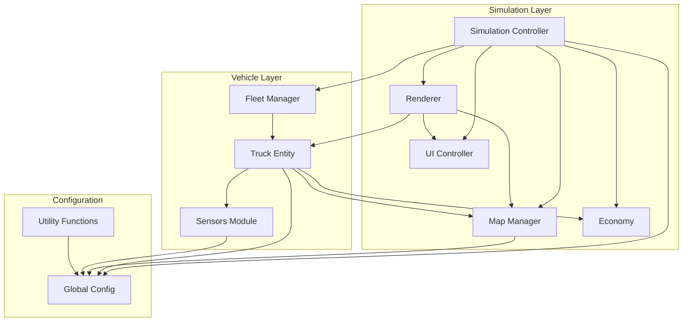
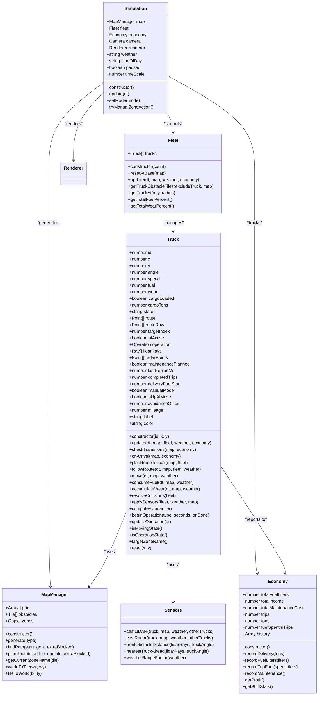
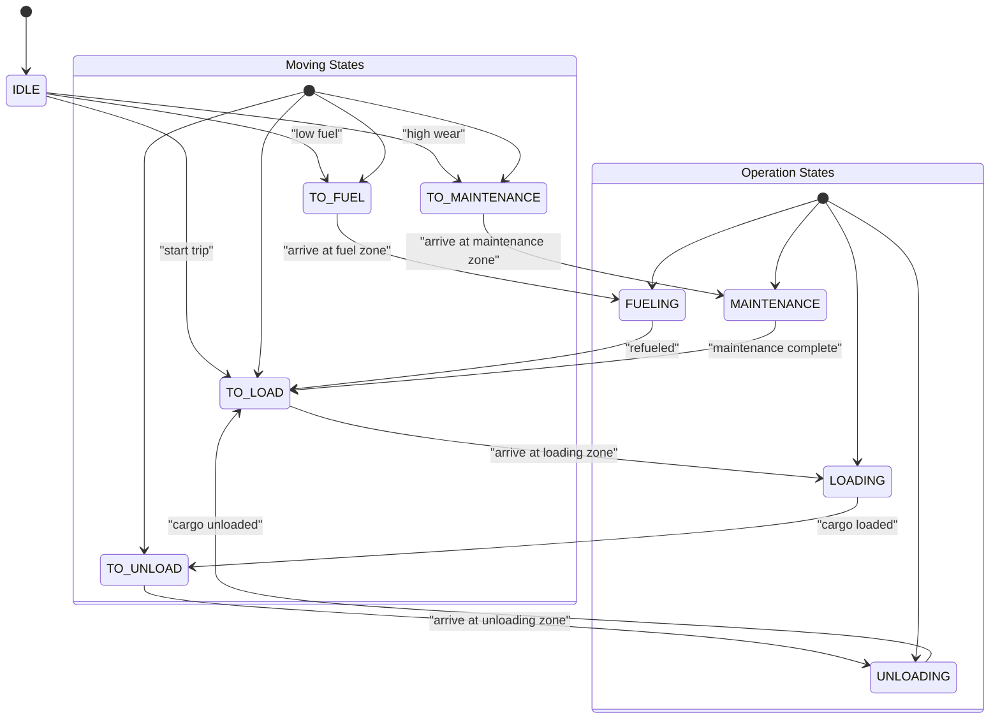
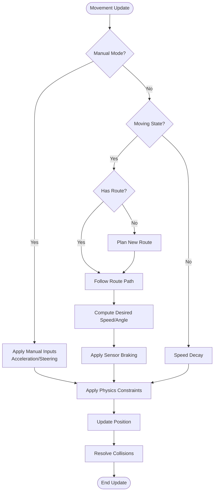
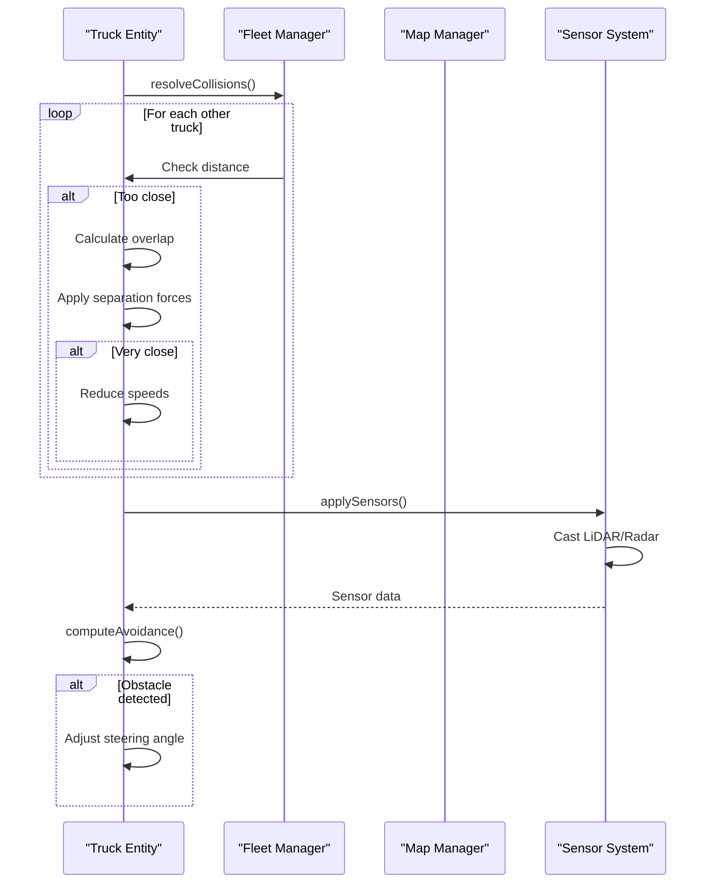
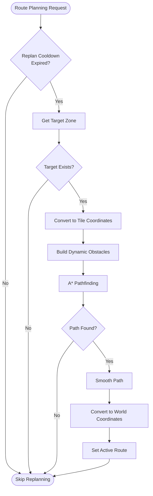
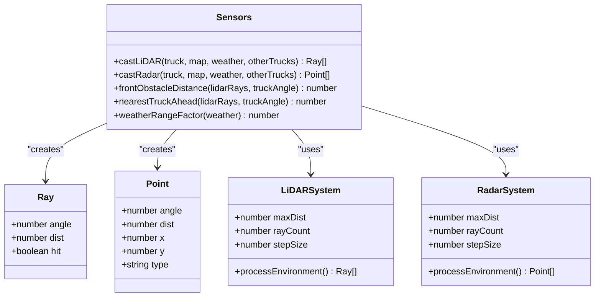
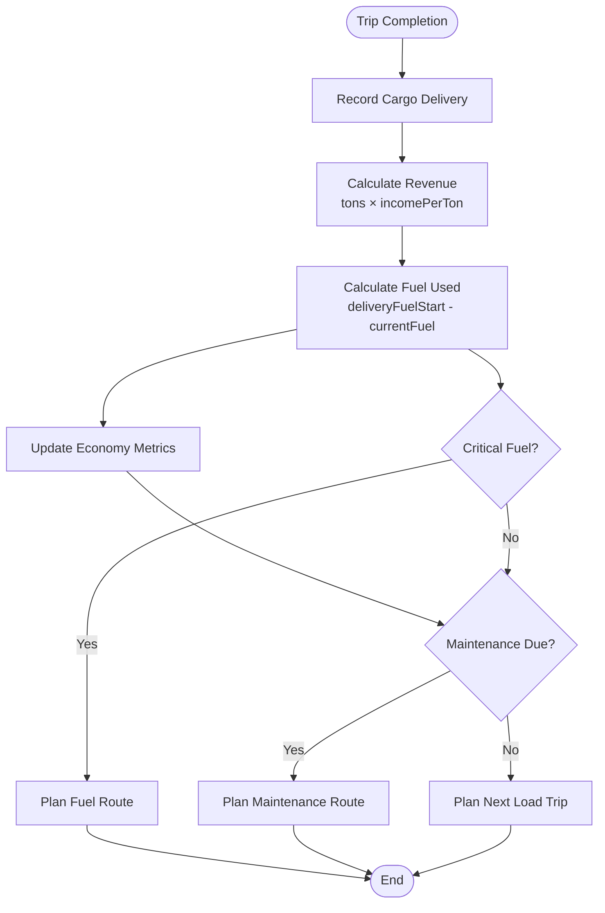
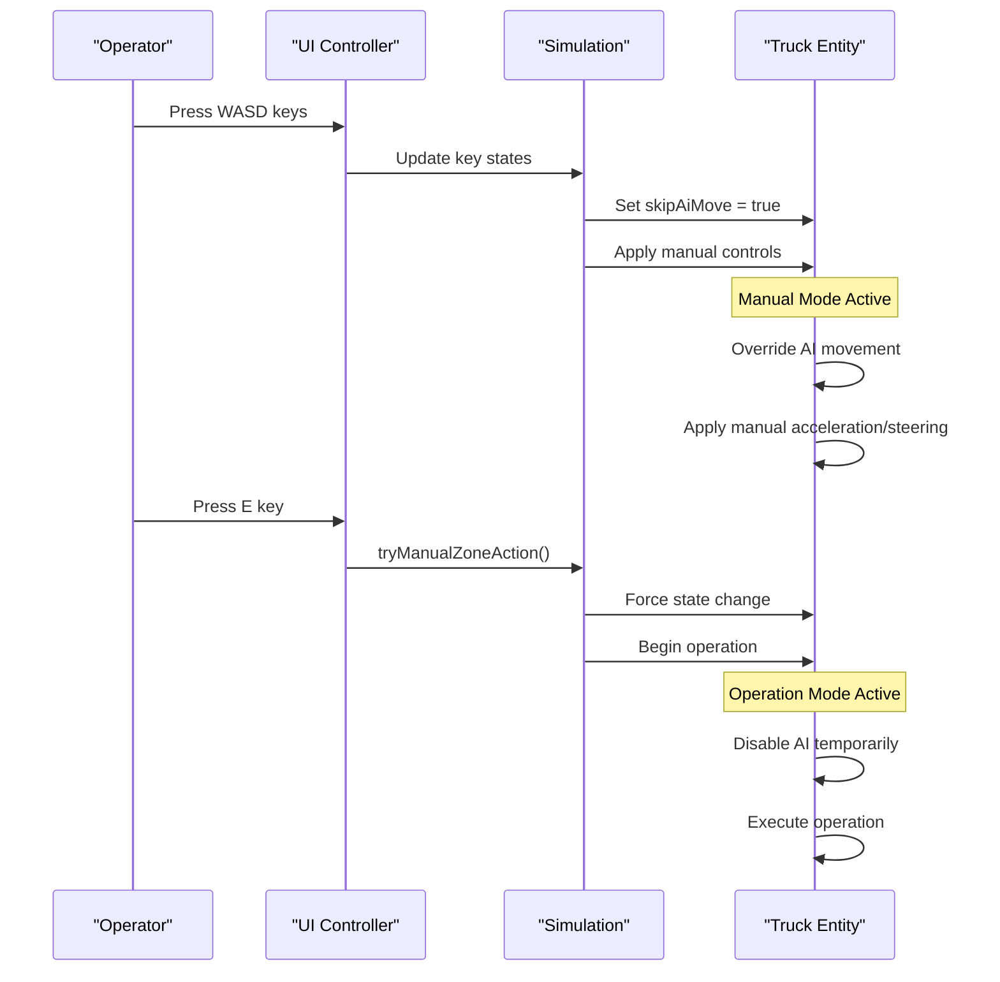
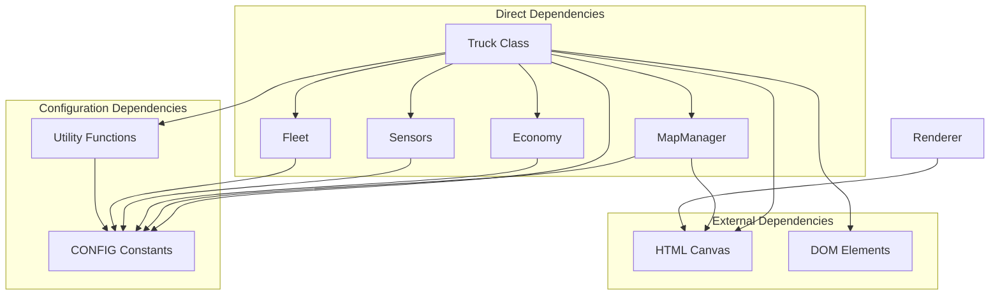

# Truck Entity Implementation

<cite>
**Referenced Files in This Document**
- [truck.js](file://truck.js)
- [main.js](file://main.js)
- [fleets.js](file://fleet.js)
- [map.js](file://map.js)
- [sensors.js](file://sensors.js)
- [config.js](file://config.js)
- [economy.js](file://economy.js)
- [ui.js](file://ui.js)
- [renderer.js](file://renderer.js)
- [utils.js](file://utils.js)
</cite>

## Table of Contents
1. [Introduction](#introduction)
2. [Project Structure](#project-structure)
3. [Core Components](#core-components)
4. [Architecture Overview](#architecture-overview)
5. [Detailed Component Analysis](#detailed-component-analysis)
6. [Dependency Analysis](#dependency-analysis)
7. [Performance Considerations](#performance-considerations)
8. [Troubleshooting Guide](#troubleshooting-guide)
9. [Conclusion](#conclusion)

## Introduction
This document provides comprehensive documentation for the Truck entity class that represents individual autonomous dump trucks in the offline autonomous truck simulator. The Truck class implements a complete finite state machine (FSM) with states for idle, travel-to-operation, operation execution, and maintenance. It includes physics-based movement mechanics with acceleration, deceleration, collision detection, and terrain-based resistance. The AI decision-making process covers state transitions, route planning triggers, and operation scheduling. The document details the truck's attributes (position, velocity, fuel, wear, cargo), methods for route following, collision avoidance, sensor processing, and economic impact calculations. It also provides examples of state transitions, operation sequences, and manual versus autonomous control modes.

## Project Structure
The simulator is organized around a central Simulation controller that manages the map, fleet of trucks, economy, rendering, and user interface. The Truck class is the primary entity representing autonomous vehicles with integrated AI behavior.

**Diagram sources**
- [main.js:1-266](file://main.js#L1-L266)
- [truck.js:1-406](file://truck.js#L1-L406)
- [fleets.js:1-65](file://fleet.js#L1-L65)
- [config.js:1-93](file://config.js#L1-L93)

**Section sources**
- [main.js:1-266](file://main.js#L1-L266)
- [config.js:1-93](file://config.js#L1-L93)

## Core Components
The Truck entity is the central component implementing autonomous vehicle behavior. It maintains state, position, and operational metrics while executing AI-driven navigation and operations.

Key responsibilities include:
- Finite state machine management (IDLE, TO_LOAD, LOADING, TO_UNLOAD, UNLOADING, TO_FUEL, FUELING, TO_MAINTENANCE, MAINTENANCE)
- Physics-based movement with acceleration, deceleration, and collision handling
- Route planning and navigation using A* pathfinding
- Sensor processing (LiDAR and radar) for obstacle detection and avoidance
- Fuel consumption and wear accumulation calculations
- Economic impact tracking through the Economy module
- Manual control mode support for operator intervention

**Section sources**
- [truck.js:1-406](file://truck.js#L1-L406)
- [fleets.js:1-65](file://fleet.js#L1-L65)

## Architecture Overview
The Truck class integrates with multiple subsystems through well-defined interfaces, creating a cohesive autonomous vehicle system.

**Diagram sources**
- [truck.js:1-406](file://truck.js#L1-L406)
- [fleets.js:1-65](file://fleet.js#L1-L65)
- [map.js:1-438](file://map.js#L1-L438)
- [economy.js:1-66](file://economy.js#L1-L66)
- [sensors.js:1-103](file://sensors.js#L1-L103)
- [main.js:1-266](file://main.js#L1-L266)

## Detailed Component Analysis

### State Machine Implementation
The Truck implements a comprehensive finite state machine with eight distinct states covering idle, travel, and operation phases.

**Diagram sources**
- [truck.js:118-157](file://truck.js#L118-L157)
- [truck.js:159-222](file://truck.js#L159-L222)

#### State Transition Logic
The state machine follows a priority-based decision tree:

1. **Urgent Maintenance**: Immediate transition to maintenance when wear reaches critical threshold
2. **Critical Fuel**: Automatic transition to fuel station when fuel drops below critical level
3. **Arrival Detection**: Zone-based state transitions when entering operational areas
4. **Idle Decision**: New trip initiation based on resource availability

**Section sources**
- [truck.js:118-157](file://truck.js#L118-L157)
- [truck.js:159-222](file://truck.js#L159-L222)

### Physics-Based Movement Mechanics
The Truck implements realistic vehicle dynamics with configurable parameters for acceleration, braking, and steering.

**Diagram sources**
- [truck.js:78-116](file://truck.js#L78-L116)
- [truck.js:268-318](file://truck.js#L268-L318)
- [truck.js:341-356](file://truck.js#L341-L356)

#### Acceleration and Deceleration
The movement system applies realistic acceleration physics with configurable parameters:

- **Acceleration**: Controlled by driver input and weather conditions
- **Friction**: Continuous speed decay for realistic stopping
- **Reverse Speed Limit**: Separate maximum for backward movement
- **Steering**: Angle adjustment based on speed and input

**Section sources**
- [truck.js:268-318](file://truck.js#L268-L318)
- [main.js:114-146](file://main.js#L114-L146)

### Collision Detection and Avoidance
The Truck implements sophisticated collision avoidance using both proximity-based separation and sensor-based detection.

**Diagram sources**
- [truck.js:384-404](file://truck.js#L384-L404)
- [sensors.js:9-103](file://sensors.js#L9-L103)

#### Collision Resolution Algorithm
The collision system uses a two-tier approach:
1. **Proximity Separation**: Maintains minimum distance between vehicles
2. **Sensor-Based Avoidance**: Uses LiDAR and radar data for dynamic obstacle avoidance
3. **Speed Damping**: Reduces speed when vehicles are too close

**Section sources**
- [truck.js:384-404](file://truck.js#L384-L404)
- [sensors.js:9-103](file://sensors.js#L9-L103)

### Route Planning and Navigation
The Truck utilizes A* pathfinding with terrain-aware cost calculation and dynamic replanning capabilities.

**Diagram sources**
- [truck.js:246-266](file://truck.js#L246-L266)
- [map.js:414-430](file://map.js#L414-L430)

#### Pathfinding Features
- **Dynamic Obstacles**: Considers other moving trucks as temporary barriers
- **Terrain Cost**: Incorporates slope and roughness into path cost calculation
- **Path Smoothing**: Reduces zigzagging for smoother driving
- **Replanning**: Automatic route updates when significant deviations occur

**Section sources**
- [truck.js:246-266](file://truck.js#L246-L266)
- [map.js:414-430](file://map.js#L414-L430)

### Sensor Processing System
The Truck implements comprehensive sensor fusion combining LiDAR and radar data for environmental awareness.

**Diagram sources**
- [sensors.js:1-103](file://sensors.js#L1-L103)

#### Sensor Capabilities
- **LiDAR**: 360-degree obstacle detection with configurable ray count
- **Radar**: Environmental scanning with obstacle classification
- **Weather Impact**: Range reduction in fog, dust, and rain conditions
- **Dust Noise**: Simulated sensor noise for challenging conditions

**Section sources**
- [sensors.js:1-103](file://sensors.js#L1-L103)

### Economic Impact Calculations
The Truck contributes to economic metrics through fuel consumption, cargo transport, and maintenance scheduling.

**Diagram sources**
- [truck.js:177-182](file://truck.js#L177-L182)
- [economy.js:17-39](file://economy.js#L17-L39)

#### Economic Tracking
- **Revenue Generation**: Direct correlation between cargo weight and earnings
- **Fuel Consumption**: Realistic usage based on speed, terrain, and weather
- **Maintenance Costs**: Scheduled maintenance impacts profitability
- **Efficiency Metrics**: Production rates and resource utilization tracking

**Section sources**
- [truck.js:177-182](file://truck.js#L177-L182)
- [economy.js:17-39](file://economy.js#L17-L39)

### Manual vs Autonomous Control Modes
The system supports dual control modes allowing operator intervention during autonomous operation.

**Diagram sources**
- [main.js:67-80](file://main.js#L67-L80)
- [main.js:114-146](file://main.js#L114-L146)
- [main.js:148-207](file://main.js#L148-L207)

#### Control Mode Features
- **Manual Override**: Real-time operator control with AI suspension
- **Zone Actions**: Quick operations via keyboard shortcuts
- **Mode Switching**: Seamless transition between AI and manual modes
- **Visual Feedback**: Clear state indicators and operation progress

**Section sources**
- [main.js:67-80](file://main.js#L67-L80)
- [main.js:114-146](file://main.js#L114-L146)
- [main.js:148-207](file://main.js#L148-L207)

## Dependency Analysis
The Truck class has well-defined dependencies creating a modular and maintainable architecture.

**Diagram sources**
- [truck.js:1-406](file://truck.js#L1-L406)
- [config.js:1-93](file://config.js#L1-L93)
- [utils.js:1-102](file://utils.js#L1-L102)

### Coupling and Cohesion
- **High Cohesion**: Truck encapsulates all vehicle-related functionality
- **Moderate Coupling**: Well-defined interfaces minimize tight dependencies
- **Clear Contracts**: Methods have explicit input/output specifications
- **Configuration-Driven**: Behavior controlled through centralized configuration

**Section sources**
- [truck.js:1-406](file://truck.js#L1-L406)
- [config.js:1-93](file://config.js#L1-L93)

## Performance Considerations
The Truck implementation includes several performance optimizations for real-time simulation:

### Computational Efficiency
- **Early Termination**: Route planning checks cooldown timers to prevent excessive computation
- **Selective Updates**: Only active trucks receive AI updates during manual mode
- **Optimized Loops**: Efficient collision detection using spatial partitioning concepts
- **Configurable Complexity**: Adjustable sensor resolution for performance tuning

### Memory Management
- **Object Pooling**: Reuse of temporary objects to reduce garbage collection pressure
- **Efficient Data Structures**: Use of primitive arrays for route storage
- **Minimal Allocations**: Static configuration objects to avoid runtime allocations

### Rendering Optimizations
- **Selective Rendering**: Only active sensors and routes are drawn
- **Efficient Path Drawing**: Batch drawing operations for route visualization
- **Conditional Updates**: UI updates only when state changes significantly

## Troubleshooting Guide

### Common Issues and Solutions

#### Truck Stuck in Place
**Symptoms**: Truck shows movement but position remains unchanged
**Causes**: 
- Blocked path tiles in map grid
- Terrain cost blocking movement
- Collision with other trucks

**Solutions**:
- Verify pathfinding returns valid routes
- Check terrain cost calculations
- Review collision resolution logic

#### Route Planning Failures
**Symptoms**: Truck cannot find path to destination
**Causes**:
- All tiles blocked in destination area
- Excessive dynamic obstacles
- Pathfinding timeout conditions

**Solutions**:
- Verify destination zone coordinates
- Check dynamic obstacle generation
- Adjust pathfinding parameters

#### Sensor Malfunctions
**Symptoms**: Collision avoidance not working properly
**Causes**:
- Sensor ray count too low
- Weather conditions affecting sensor range
- Dust noise causing false positives

**Solutions**:
- Increase sensor ray count
- Adjust weather range factors
- Tune dust noise parameters

#### Fuel Consumption Anomalies
**Symptoms**: Unexpected fuel usage patterns
**Causes**:
- Incorrect terrain cost application
- Weather coefficient errors
- Cargo weight not affecting consumption

**Solutions**:
- Verify terrain cost calculations
- Check weather condition application
- Confirm cargo weight integration

**Section sources**
- [truck.js:358-367](file://truck.js#L358-L367)
- [truck.js:369-382](file://truck.js#L369-L382)
- [map.js:414-430](file://map.js#L414-L430)

## Conclusion
The Truck entity implementation provides a comprehensive foundation for autonomous vehicle simulation with robust AI behavior, realistic physics, and integrated economic modeling. The modular architecture supports easy extension and modification while maintaining performance and reliability. The implementation demonstrates advanced concepts in autonomous vehicle engineering including state machine design, pathfinding algorithms, sensor fusion, and economic optimization. The system provides a solid platform for research and development in autonomous vehicle technologies with practical applications in mining and construction simulation environments.