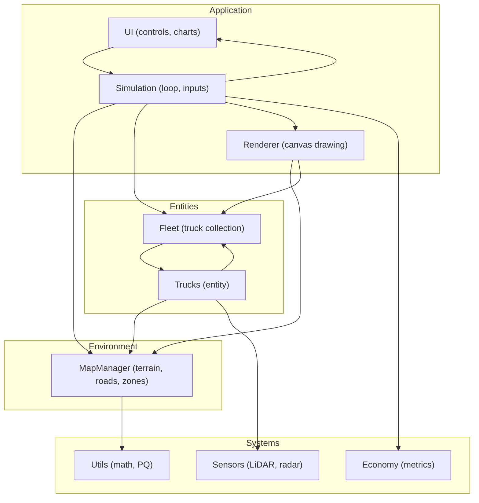
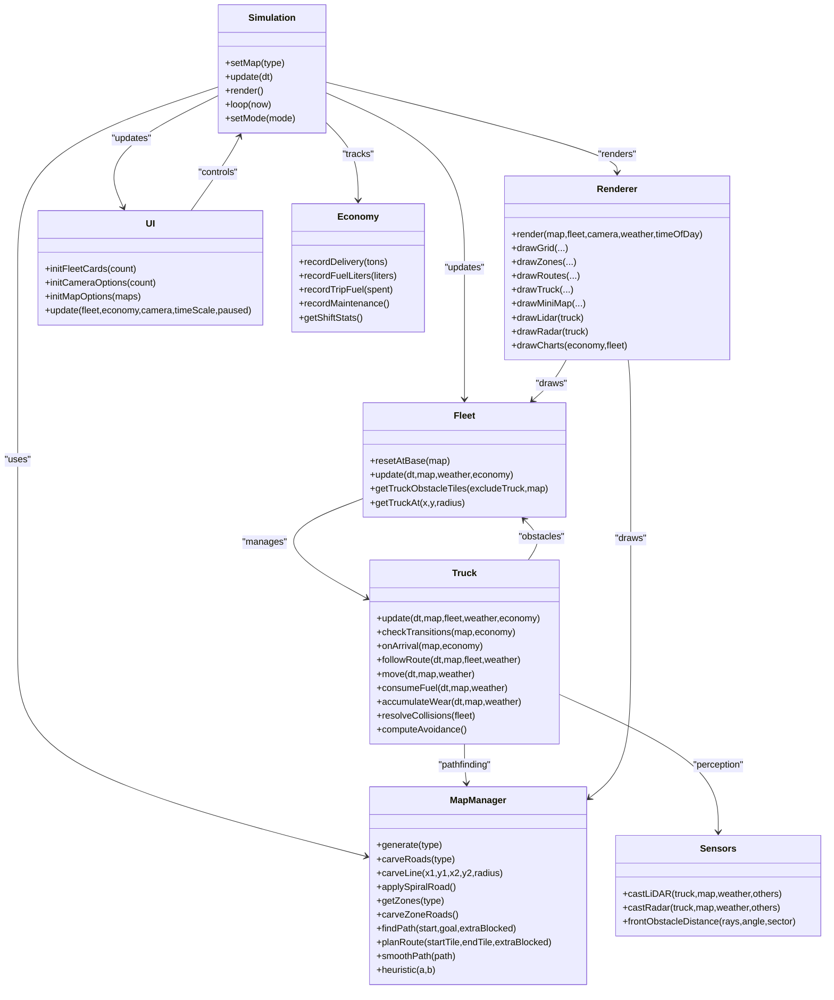
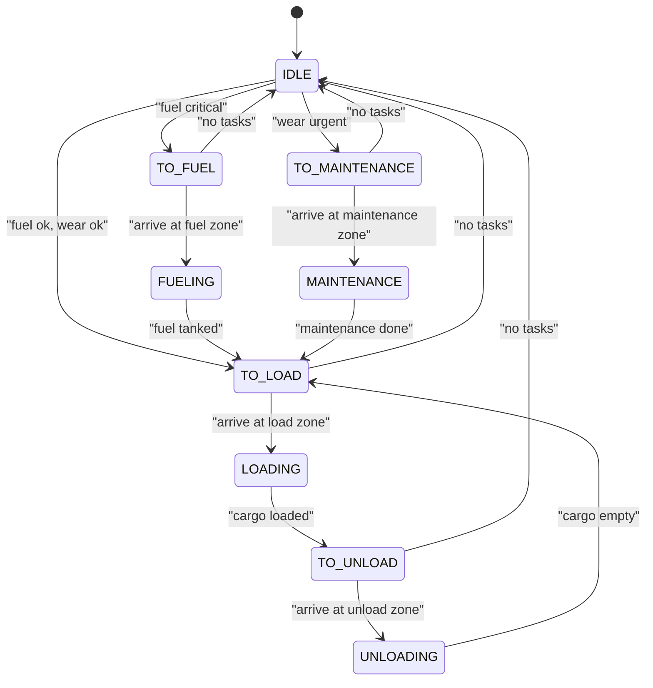
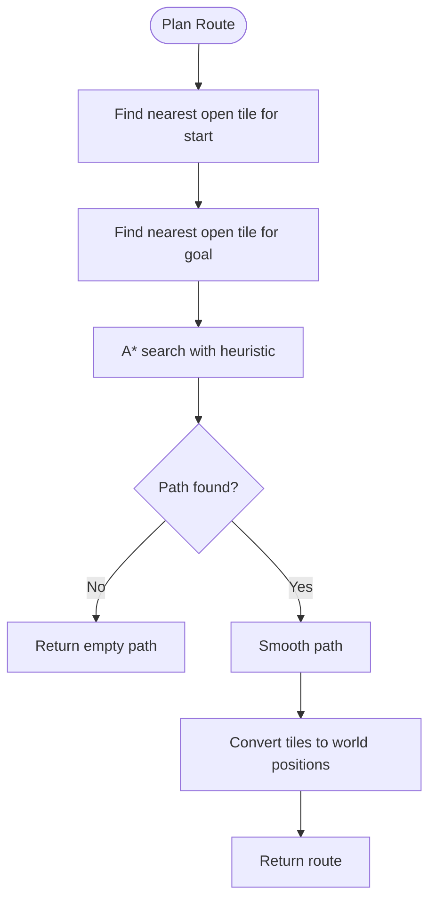
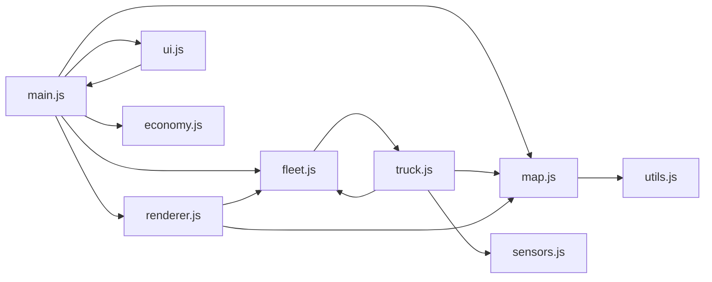

# Vehicle and Navigation System

<cite>
**Referenced Files in This Document**
- [index.html](file://index.html)
- [config.js](file://config.js)
- [main.js](file://main.js)
- [map.js](file://map.js)
- [truck.js](file://truck.js)
- [fleet.js](file://fleet.js)
- [sensors.js](file://sensors.js)
- [renderer.js](file://renderer.js)
- [ui.js](file://ui.js)
- [utils.js](file://utils.js)
- [economy.js](file://economy.js)
</cite>

## Table of Contents
1. [Introduction](#introduction)
2. [Project Structure](#project-structure)
3. [Core Components](#core-components)
4. [Architecture Overview](#architecture-overview)
5. [Detailed Component Analysis](#detailed-component-analysis)
6. [Dependency Analysis](#dependency-analysis)
7. [Performance Considerations](#performance-considerations)
8. [Troubleshooting Guide](#troubleshooting-guide)
9. [Conclusion](#conclusion)
10. [Appendices](#appendices)

## Introduction
This document describes the autonomous truck movement and navigation system for a simulated off-road quarry fleet. It covers the truck entity class with its finite state machine, physics-based movement, collision detection, and AI decision-making. It also documents the fleet management system coordinating multiple trucks with collision avoidance and traffic management, the map system with procedural terrain generation, road carving, zone placement, and A* pathfinding with dynamic replanning. Finally, it explains the sensor suite (LiDAR and radar), heuristic functions, route optimization strategies, and multi-truck coordination mechanisms, with examples of state transitions, pathfinding scenarios, and fleet operation patterns.

## Project Structure
The simulation is organized around a central simulation loop that updates the map, fleet, and UI, rendering the world and truck states. Key modules include:
- Simulation controller orchestrating update/render loops and input handling
- Map manager for procedural terrain, roads, zones, and pathfinding
- Truck entity with state machine, movement, sensors, and resource management
- Fleet coordinator managing multiple trucks and inter-truck obstacles
- Sensors module for LiDAR and radar simulations
- Renderer and UI for visualization and controls
- Utilities for math helpers and pathfinding primitives
- Economy tracker for operational metrics

**Diagram sources**
- [main.js:1-266](file://main.js#L1-L266)
- [map.js:1-438](file://map.js#L1-L438)
- [truck.js:1-406](file://truck.js#L1-L406)
- [fleet.js:1-65](file://fleet.js#L1-L65)
- [sensors.js:1-103](file://sensors.js#L1-L103)
- [renderer.js:1-437](file://renderer.js#L1-L437)
- [ui.js:1-200](file://ui.js#L1-L200)
- [utils.js:1-102](file://utils.js#L1-L102)
- [economy.js:1-66](file://economy.js#L1-L66)

**Section sources**
- [index.html:1-257](file://index.html#L1-L257)
- [config.js:1-93](file://config.js#L1-L93)
- [main.js:1-266](file://main.js#L1-L266)

## Core Components
- Simulation: Central loop, input handling, mode switching, and orchestration of update/render cycles.
- MapManager: Procedural terrain generation, road carving, zone placement, and A* pathfinding with smoothing.
- Truck: Entity with state machine, physics movement, sensors, fuel/wear consumption, and collision resolution.
- Fleet: Multi-truck coordinator with obstacle tiles for pathfinding and collision avoidance.
- Sensors: LiDAR and radar simulation with weather effects and collision detection.
- Renderer/UI: Canvas rendering, minimap, charts, and interactive controls.
- Economy: Operational metrics tracking and reporting.
- Utilities: Math helpers, priority queue, and pathfinding primitives.

**Section sources**
- [main.js:1-266](file://main.js#L1-L266)
- [map.js:1-438](file://map.js#L1-L438)
- [truck.js:1-406](file://truck.js#L1-L406)
- [fleet.js:1-65](file://fleet.js#L1-L65)
- [sensors.js:1-103](file://sensors.js#L1-L103)
- [renderer.js:1-437](file://renderer.js#L1-L437)
- [ui.js:1-200](file://ui.js#L1-L200)
- [economy.js:1-66](file://economy.js#L1-L66)
- [utils.js:1-102](file://utils.js#L1-L102)

## Architecture Overview
The system follows a modular architecture:
- Simulation drives the game loop and delegates to subsystems.
- MapManager encapsulates environment representation and pathfinding.
- Truck encapsulates autonomous behavior and resource management.
- Fleet coordinates inter-truck dynamics and pathfinding obstacles.
- Sensors provide perception data for movement and safety.
- Renderer/UI present the environment and metrics.

**Diagram sources**
- [main.js:1-266](file://main.js#L1-L266)
- [map.js:1-438](file://map.js#L1-L438)
- [truck.js:1-406](file://truck.js#L1-L406)
- [fleet.js:1-65](file://fleet.js#L1-L65)
- [sensors.js:1-103](file://sensors.js#L1-L103)
- [renderer.js:1-437](file://renderer.js#L1-L437)
- [ui.js:1-200](file://ui.js#L1-L200)
- [economy.js:1-66](file://economy.js#L1-L66)

## Detailed Component Analysis

### Truck Entity and State Machine
The Truck class implements a finite state machine governing autonomous behavior:
- States: IDLE, TO_LOAD, LOADING, TO_UNLOAD, UNLOADING, TO_FUEL, FUELING, TO_MAINTENANCE, MAINTENANCE
- Transitions are driven by fuel level, wear threshold, zone arrival, and critical conditions
- Movement is physics-based with steering snapping, traction modifiers, and sensor braking
- Collision avoidance resolves overlap with nearby trucks
- Resource consumption tracks fuel usage and wear accumulation

Key behaviors:
- State transitions and zone arrival handling
- Route planning and dynamic replanning
- Physics movement with terrain cost and weather effects
- Sensor-based braking and avoidance
- Operation timers for loading/unloading/fueling/TO

**Diagram sources**
- [truck.js:118-222](file://truck.js#L118-L222)

**Section sources**
- [truck.js:1-406](file://truck.js#L1-L406)

### Pathfinding and Navigation
The MapManager implements A* pathfinding with:
- Heuristic: Euclidean distance
- Grid graph with 8-direction movement and diagonal cost
- Extra blocked tiles from moving trucks during planning
- Path smoothing removes redundant waypoints
- Zone-aware routing and zone entry/exit connections

Dynamic replanning occurs when deviation from the planned route exceeds a threshold, and replan cooldown prevents excessive recalculation.

**Diagram sources**
- [map.js:414-430](file://map.js#L414-L430)
- [map.js:332-385](file://map.js#L332-L385)
- [map.js:396-412](file://map.js#L396-L412)

**Section sources**
- [map.js:1-438](file://map.js#L1-L438)

### Fleet Coordination and Traffic Management
The Fleet class:
- Spawns multiple trucks and resets them at the base zone
- Coordinates updates across all trucks
- Builds a set of obstacle tiles from moving trucks to avoid collisions in pathfinding
- Provides collision resolution between trucks and selection by click

Collision avoidance:
- Trucks separate when overlapping within a radius
- Speed reduction when overlap is tight
- Separate obstacle tiles prevent pathfinding conflicts

**Section sources**
- [fleet.js:1-65](file://fleet.js#L1-L65)

### Sensors and Perception
The Sensors module simulates:
- LiDAR: 360-degree scan with configurable rays and max distance, affected by weather
- Radar: 360-degree scan capturing walls and other trucks within range
- Front obstacle detection for braking logic
- Weather range factors and dust noise modeling

These sensors feed into:
- Sensor braking (speed reduction near obstacles)
- Avoidance offsets for lane keeping
- Rendering of sensor data

**Section sources**
- [sensors.js:1-103](file://sensors.js#L1-L103)

### Rendering and Visualization
The Renderer draws:
- Grid with terrain shading and road markings
- Zone overlays with labels
- Truck routes and individual trucks with orientation and state indicators
- Mini-map with routes and truck positions
- LiDAR and radar displays for the selected truck
- Time-of-day and weather overlays
- Charts for fuel, tons, and profit metrics

The UI presents:
- Mode toggles (AI/manual)
- Map selection and reset/pause controls
- Camera selection and zoom
- Shift statistics and CSV export
- Per-truck cards with fuel/wear/cargo status

**Section sources**
- [renderer.js:1-437](file://renderer.js#L1-L437)
- [ui.js:1-200](file://ui.js#L1-L200)
- [index.html:1-257](file://index.html#L1-L257)

### Economy and Metrics
The Economy class tracks:
- Delivery revenue and trip tonnage
- Fuel consumption and cost
- Maintenance costs
- Shift statistics including profit, efficiency, and productivity

**Section sources**
- [economy.js:1-66](file://economy.js#L1-L66)

## Dependency Analysis
The system exhibits clear layering:
- Simulation depends on MapManager, Fleet, Renderer, UI, Economy
- Truck depends on MapManager, Fleet, Sensors
- MapManager depends on Utils for math and pathfinding primitives
- Renderer/UI depend on configuration and simulation state
- Sensors depend on configuration and MapManager

**Diagram sources**
- [main.js:1-266](file://main.js#L1-L266)
- [map.js:1-438](file://map.js#L1-L438)
- [truck.js:1-406](file://truck.js#L1-L406)
- [fleet.js:1-65](file://fleet.js#L1-L65)
- [sensors.js:1-103](file://sensors.js#L1-L103)
- [renderer.js:1-437](file://renderer.js#L1-L437)
- [ui.js:1-200](file://ui.js#L1-L200)
- [utils.js:1-102](file://utils.js#L1-L102)
- [economy.js:1-66](file://economy.js#L1-L66)

**Section sources**
- [main.js:1-266](file://main.js#L1-L266)
- [map.js:1-438](file://map.js#L1-L438)
- [truck.js:1-406](file://truck.js#L1-L406)
- [fleet.js:1-65](file://fleet.js#L1-L65)
- [sensors.js:1-103](file://sensors.js#L1-L103)
- [renderer.js:1-437](file://renderer.js#L1-L437)
- [ui.js:1-200](file://ui.js#L1-L200)
- [utils.js:1-102](file://utils.js#L1-L102)
- [economy.js:1-66](file://economy.js#L1-L66)

## Performance Considerations
- Pathfinding complexity: A* on a grid with 8-connected neighbors; diagonal cost increases path length estimation. Smoothing reduces waypoints.
- Replanning cooldown: Prevents frequent recalculations; deviation threshold triggers replanning.
- Sensor sampling: Configurable ray counts and max distances; weather affects perceived range.
- Physics integration: Small time steps and damping improve stability; traction modifiers adjust acceleration.
- Rendering: Canvas batching and selective updates reduce overhead; minimap and charts are drawn separately.

[No sources needed since this section provides general guidance]

## Troubleshooting Guide
Common issues and resolutions:
- Truck stuck on obstacles: Verify replan cooldown and deviation thresholds; ensure extra blocked tiles are included for moving trucks.
- Excessive replanning: Increase replan cooldown or deviation threshold to stabilize long routes.
- Sensor misreads: Adjust LiDAR/radar max distances and weather range factors; confirm sector angles for front braking.
- Fuel/wear spikes: Review terrain cost coefficients and weather impacts; ensure cargo coefficients are applied when loaded.
- Collision jitter: Increase separation radius and ensure collision resolution runs before movement.
- UI not updating: Confirm UI initialization and periodic updates; check economy metrics availability.

**Section sources**
- [truck.js:246-318](file://truck.js#L246-L318)
- [map.js:414-430](file://map.js#L414-L430)
- [sensors.js:1-103](file://sensors.js#L1-L103)
- [ui.js:122-158](file://ui.js#L122-L158)

## Conclusion
The system integrates autonomous truck behavior, multi-truck coordination, and realistic environment modeling. The Truck state machine, physics-driven movement, and sensor suite enable robust navigation. The MapManager’s A* pathfinding with smoothing and dynamic replanning ensures efficient routing. The Fleet coordinator and collision avoidance mechanisms manage traffic. The Renderer and UI provide comprehensive visualization and metrics. Together, these components deliver a practical and instructive simulation of autonomous quarry operations.

[No sources needed since this section summarizes without analyzing specific files]

## Appendices

### Example Scenarios and Patterns
- State transitions:
  - IDLE → TO_LOAD when fuel and wear are acceptable
  - TO_LOAD → LOADING upon arrival at load zone
  - LOADING → TO_UNLOAD after cargo loading
  - TO_UNLOAD → UNLOADING upon arrival at unload zone
  - UNLOADING → TO_LOAD after cargo unloading
  - TO_FUEL → FUELING upon arrival at fuel zone
  - TO_MAINTENANCE → MAINTENANCE upon arrival at maintenance zone
- Pathfinding scenario:
  - Start and goal tiles resolved to nearest open tiles
  - A* computes path with heuristic and diagonal cost
  - Path smoothed and converted to world positions
  - Dynamic replanning triggered by deviation threshold
- Fleet operation pattern:
  - Base reset spreads trucks across base zone
  - Obstacle tiles built from moving trucks exclude them from pathfinding
  - Collision resolution separates overlapping trucks and reduces speed when necessary

**Section sources**
- [truck.js:118-222](file://truck.js#L118-L222)
- [map.js:414-430](file://map.js#L414-L430)
- [fleet.js:26-44](file://fleet.js#L26-L44)