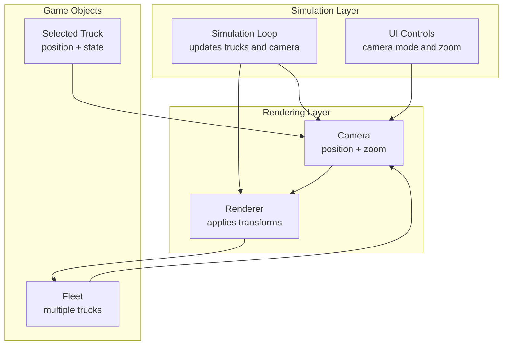
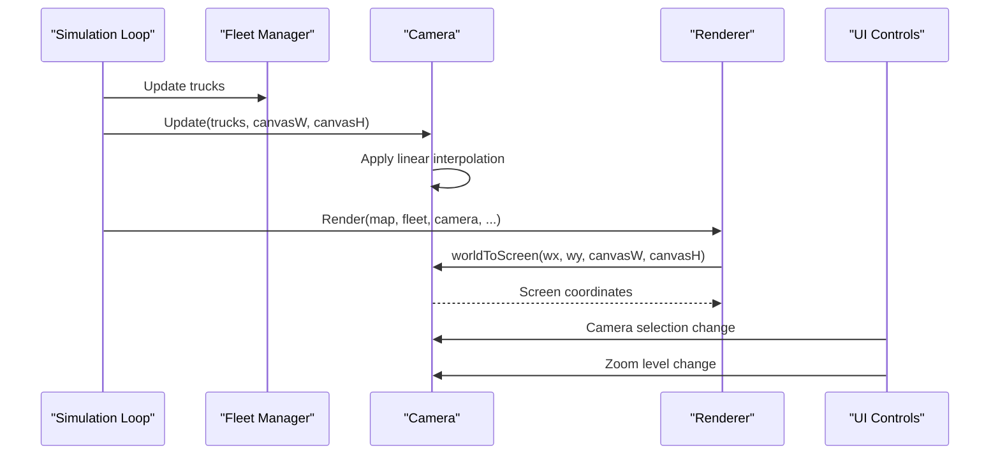
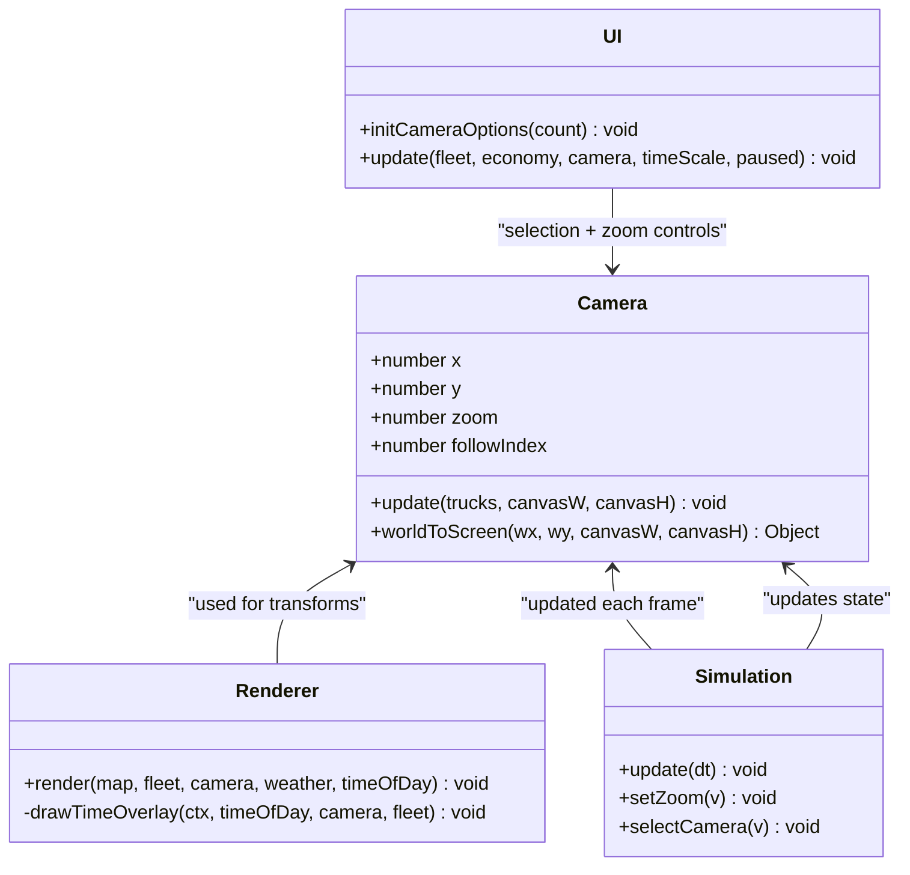
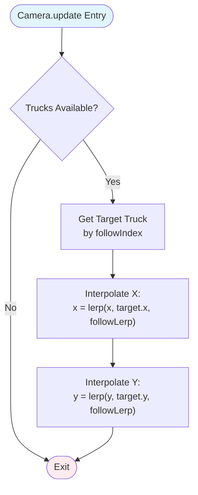
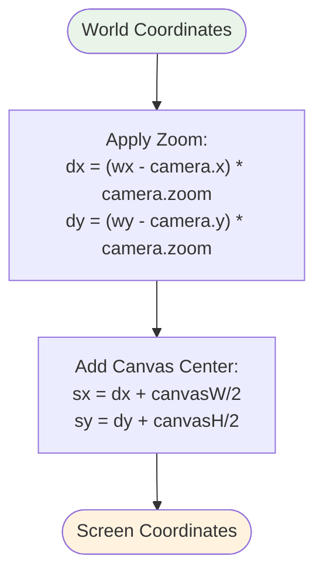
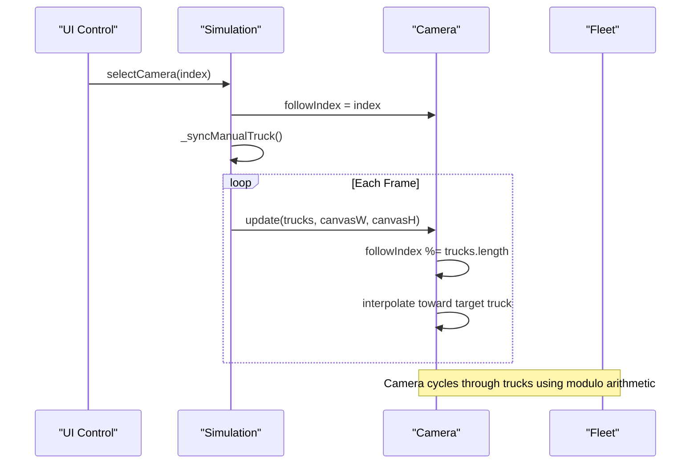
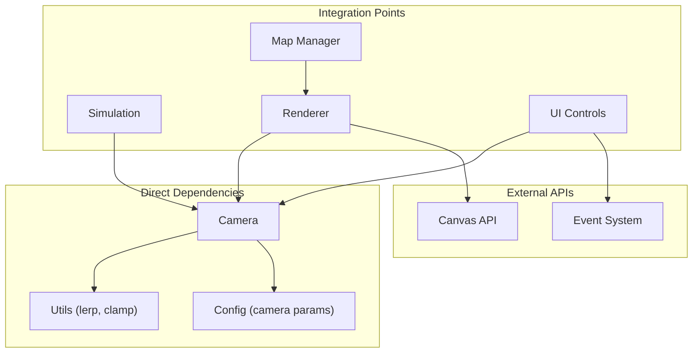

# Camera Management

<cite>
**Referenced Files in This Document**
- [config.js](file://config.js)
- [utils.js](file://utils.js)
- [renderer.js](file://renderer.js)
- [main.js](file://main.js)
- [ui.js](file://ui.js)
- [map.js](file://map.js)
</cite>

## Table of Contents
1. [Introduction](#introduction)
2. [Project Structure](#project-structure)
3. [Core Components](#core-components)
4. [Architecture Overview](#architecture-overview)
5. [Detailed Component Analysis](#detailed-component-analysis)
6. [Dependency Analysis](#dependency-analysis)
7. [Performance Considerations](#performance-considerations)
8. [Troubleshooting Guide](#troubleshooting-guide)
9. [Conclusion](#conclusion)

## Introduction
This document provides comprehensive documentation for the Camera class implementation that manages viewport positioning and zoom functionality in the autonomous dump truck simulator. The camera system enables smooth following of vehicles, world-to-screen coordinate transformations, and flexible camera selection modes suitable for both fleet-wide monitoring and individual vehicle tracking.

## Project Structure
The camera system is implemented as part of the rendering pipeline and integrates with the simulation loop, UI controls, and truck fleet management. The key components are organized as follows:
- Camera class: Handles position tracking, zoom, and world-to-screen conversion
- Renderer: Applies camera transforms during rendering and draws auxiliary views
- Simulation loop: Updates camera state each frame based on selected truck
- UI: Provides controls for camera mode selection and zoom adjustment
- Configuration: Defines camera parameters and global constants

**Diagram sources**
- [renderer.js:1-22](file://renderer.js#L1-L22)
- [main.js:67-80](file://main.js#L67-L80)
- [ui.js:50-57](file://ui.js#L50-L57)

**Section sources**
- [renderer.js:1-22](file://renderer.js#L1-L22)
- [main.js:67-80](file://main.js#L67-L80)
- [ui.js:50-57](file://ui.js#L50-L57)

## Core Components
The camera system consists of two primary components:
- Camera class: Manages viewport position, zoom level, and smooth following mechanics
- Renderer: Applies camera transforms during drawing operations and provides world-to-screen conversions

Key responsibilities:
- Smooth following: Linear interpolation between current camera position and target truck position
- Zoom control: Adjustable zoom level with configurable bounds
- Coordinate transformation: World-to-screen conversion for rendering and input handling
- Camera selection: Cycling through trucks for focused tracking

**Section sources**
- [renderer.js:1-22](file://renderer.js#L1-L22)
- [config.js:81-86](file://config.js#L81-L86)

## Architecture Overview
The camera system operates within the simulation-render-update cycle. Each frame, the simulation updates truck positions, then the camera follows the selected truck using linear interpolation. The renderer applies camera transforms during drawing and handles world-to-screen conversions for input events.

**Diagram sources**
- [main.js:67-80](file://main.js#L67-L80)
- [renderer.js:9-21](file://renderer.js#L9-L21)
- [renderer.js:38-66](file://renderer.js#L38-L66)
- [ui.js:50-57](file://ui.js#L50-L57)

## Detailed Component Analysis

### Camera Class Implementation
The Camera class encapsulates viewport management with smooth following mechanics and coordinate transformation capabilities.

**Diagram sources**
- [renderer.js:1-22](file://renderer.js#L1-L22)
- [renderer.js:24-66](file://renderer.js#L24-L66)
- [main.js:67-98](file://main.js#L67-L98)
- [ui.js:102-110](file://ui.js#L102-L110)

#### Position Tracking and Smooth Following
The camera implements smooth following using linear interpolation (lerp) to create fluid camera movement. The update method calculates the target truck position and interpolates the camera toward it.

**Diagram sources**
- [renderer.js:9-15](file://renderer.js#L9-L15)
- [utils.js:76](file://utils.js#L76)

#### World-to-Screen Coordinate Transformation
The worldToScreen function converts world coordinates to screen coordinates using camera position and zoom level. This transformation is essential for rendering and input event handling.

**Diagram sources**
- [renderer.js:17-21](file://renderer.js#L17-L21)

#### Camera Configuration Parameters
The camera system uses configurable parameters defined in the configuration file:

| Parameter | Type | Default Value | Description |
|-----------|------|---------------|-------------|
| zoomMin | number | 0.4 | Minimum zoom level |
| zoomMax | number | 2.0 | Maximum zoom level |
| zoomDefault | number | 1.0 | Default zoom level |
| followLerp | number | 0.08 | Interpolation factor for smooth following |

These parameters control the camera's behavior and provide flexibility for different display scenarios.

**Section sources**
- [renderer.js:1-22](file://renderer.js#L1-L22)
- [config.js:81-86](file://config.js#L81-L86)
- [utils.js:75-76](file://utils.js#L75-L76)

### Camera Following Logic
The camera cycling mechanism allows switching between multiple trucks while maintaining focus on the currently selected vehicle. The followIndex determines which truck the camera tracks.

**Diagram sources**
- [main.js:94-98](file://main.js#L94-L98)
- [main.js:108-112](file://main.js#L108-L112)
- [renderer.js:9-15](file://renderer.js#L9-L15)

### Camera Behavior Examples

#### Fleet Operations Scenario
During fleet operations, the camera provides an overview of all trucks moving through the mining operation:
- Camera follows the currently selected truck
- Zoom level remains at default for broad view
- Smooth interpolation creates fluid movement across the landscape
- UI allows switching between trucks for focused monitoring

#### Individual Truck Tracking Scenario
For detailed monitoring of a specific truck:
- User selects target truck from camera dropdown
- Camera immediately begins following the selected vehicle
- Zoom can be adjusted for close-up tracking
- Smooth interpolation ensures stable tracking during high-speed movement

**Section sources**
- [ui.js:102-110](file://ui.js#L102-L110)
- [main.js:94-98](file://main.js#L94-L98)
- [renderer.js:9-15](file://renderer.js#L9-L15)

## Dependency Analysis
The camera system has minimal dependencies and maintains clean separation of concerns:

**Diagram sources**
- [renderer.js:1-22](file://renderer.js#L1-L22)
- [utils.js:75-76](file://utils.js#L75-L76)
- [config.js:81-86](file://config.js#L81-L86)
- [main.js:67-80](file://main.js#L67-L80)

**Section sources**
- [renderer.js:1-22](file://renderer.js#L1-L22)
- [utils.js:75-76](file://utils.js#L75-L76)
- [config.js:81-86](file://config.js#L81-L86)

## Performance Considerations
The camera system is designed for optimal performance:
- Linear interpolation is computationally inexpensive
- Minimal memory allocation during updates
- Efficient modulo arithmetic for camera cycling
- Coordinate transformations performed only when needed

Optimization opportunities:
- Consider adaptive interpolation based on truck velocity
- Implement camera bounds to prevent excessive panning
- Add predictive interpolation for high-speed scenarios

## Troubleshooting Guide
Common camera-related issues and solutions:

**Camera not following trucks:**
- Verify camera.update is called each frame
- Check that followIndex is within valid range
- Ensure trucks array is populated before camera update

**Smoothness issues:**
- Adjust CONFIG.camera.followLerp parameter
- Verify frame rate stability affects interpolation timing
- Check for heavy computation blocking camera updates

**Coordinate transformation problems:**
- Confirm canvas dimensions are set before rendering
- Verify zoom level is within configured bounds
- Check for division by zero in coordinate calculations

**Section sources**
- [renderer.js:9-21](file://renderer.js#L9-L21)
- [config.js:81-86](file://config.js#L81-L86)

## Conclusion
The Camera class provides a robust foundation for viewport management in the autonomous dump truck simulator. Its smooth following mechanics, efficient coordinate transformations, and flexible configuration options enable both fleet-wide monitoring and detailed individual vehicle tracking. The implementation demonstrates good separation of concerns and integrates seamlessly with the broader simulation architecture.