# Graphics Rendering System

<cite>
**Referenced Files in This Document**
- [index.html](file://index.html)
- [config.js](file://config.js)
- [utils.js](file://utils.js)
- [map.js](file://map.js)
- [sensors.js](file://sensors.js)
- [truck.js](file://truck.js)
- [fleet.js](file://fleet.js)
- [economy.js](file://economy.js)
- [ui.js](file://ui.js)
- [main.js](file://main.js)
- [renderer.js](file://renderer.js)
</cite>

## Table of Contents
1. [Introduction](#introduction)
2. [Project Structure](#project-structure)
3. [Core Components](#core-components)
4. [Architecture Overview](#architecture-overview)
5. [Detailed Component Analysis](#detailed-component-analysis)
6. [Dependency Analysis](#dependency-analysis)
7. [Performance Considerations](#performance-considerations)
8. [Troubleshooting Guide](#troubleshooting-guide)
9. [Conclusion](#conclusion)
10. [Appendices](#appendices)

## Introduction
This document explains the graphics rendering system that powers the visual output of the autonomous truck simulator using HTML5 Canvas. It focuses on the Camera class for position tracking and smooth following, the Renderer class architecture with multiple canvases, and the rendering pipeline that draws terrain grids, zones, routes, trucks, and sensor overlays. It also covers weather and time-of-day effects, coordinate transformations, and performance optimization strategies.

## Project Structure
The rendering system is organized around a central Simulation controller that orchestrates updates and rendering. The Renderer manages multiple HTML5 Canvas contexts and draws the simulation scene, minimap, LiDAR/Radar overlays, and charts. Supporting modules provide configuration, utilities, map generation, sensors, truck behavior, fleet management, economy tracking, and UI.

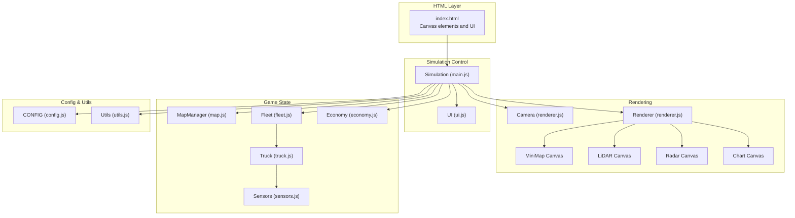

**Diagram sources**
- [index.html:129-243](file://index.html#L129-L243)
- [main.js:1-266](file://main.js#L1-L266)
- [renderer.js:24-66](file://renderer.js#L24-L66)
- [map.js:1-438](file://map.js#L1-L438)
- [fleet.js:1-65](file://fleet.js#L1-L65)
- [truck.js:1-406](file://truck.js#L1-L406)
- [sensors.js:1-103](file://sensors.js#L1-L103)
- [economy.js:1-66](file://economy.js#L1-L66)
- [ui.js:1-200](file://ui.js#L1-L200)
- [config.js:1-93](file://config.js#L1-L93)
- [utils.js:1-102](file://utils.js#L1-L102)

**Section sources**
- [index.html:129-243](file://index.html#L129-L243)
- [main.js:1-266](file://main.js#L1-L266)
- [renderer.js:24-66](file://renderer.js#L24-L66)

## Core Components
- Camera: Tracks world-space position and zoom, with smooth following of a selected truck.
- Renderer: Manages multiple Canvas contexts and draws the simulation scene, minimap, sensor overlays, and charts.
- MapManager: Generates terrain, roads, and zones; computes paths and tile costs.
- Truck/Fleet: Drive the simulation; provide route and sensor data for rendering.
- Sensors: Compute LiDAR and Radar data used by overlays.
- Economy/UI: Provide statistics for charts and UI updates.

**Section sources**
- [renderer.js:1-22](file://renderer.js#L1-L22)
- [renderer.js:24-436](file://renderer.js#L24-L436)
- [map.js:1-438](file://map.js#L1-L438)
- [truck.js:1-406](file://truck.js#L1-L406)
- [fleet.js:1-65](file://fleet.js#L1-L65)
- [sensors.js:1-103](file://sensors.js#L1-L103)
- [economy.js:1-66](file://economy.js#L1-L66)
- [ui.js:1-200](file://ui.js#L1-L200)

## Architecture Overview
The rendering pipeline is driven by Simulation.loop, which updates game state and triggers Renderer.render. Renderer applies camera transforms, draws the grid and zones, routes, trucks, and overlays, then renders auxiliary views (minimap, LiDAR, radar, charts). Coordinate transformations convert between world coordinates and screen coordinates using camera state.

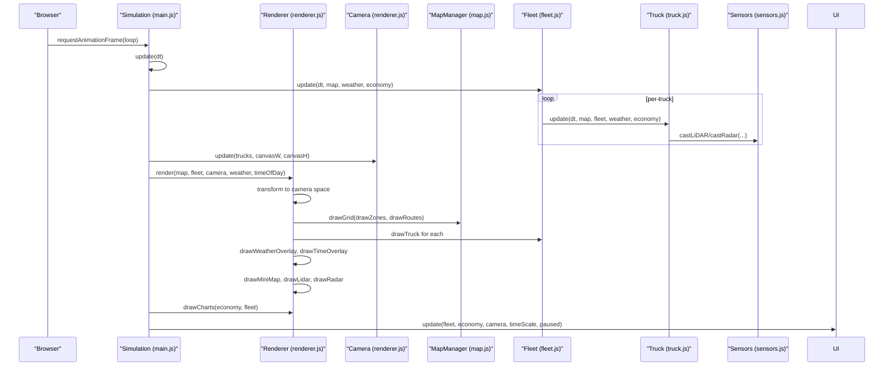

**Diagram sources**
- [main.js:209-223](file://main.js#L209-L223)
- [main.js:67-80](file://main.js#L67-L80)
- [renderer.js:38-66](file://renderer.js#L38-L66)
- [renderer.js:68-128](file://renderer.js#L68-L128)
- [renderer.js:130-172](file://renderer.js#L130-L172)
- [renderer.js:174-219](file://renderer.js#L174-L219)
- [renderer.js:230-276](file://renderer.js#L230-L276)
- [renderer.js:278-316](file://renderer.js#L278-L316)
- [renderer.js:318-350](file://renderer.js#L318-L350)
- [renderer.js:352-388](file://renderer.js#L352-L388)
- [renderer.js:390-435](file://renderer.js#L390-L435)

## Detailed Component Analysis

### Camera Class
The Camera tracks the world origin (x, y) and zoom level, and smoothly follows a selected truck. It exposes a world-to-screen conversion function for transforming world coordinates to screen coordinates.

Key behaviors:
- Smooth following: Uses interpolation toward the target truck’s position.
- World-to-screen transform: Applies translation and scaling centered on the viewport.

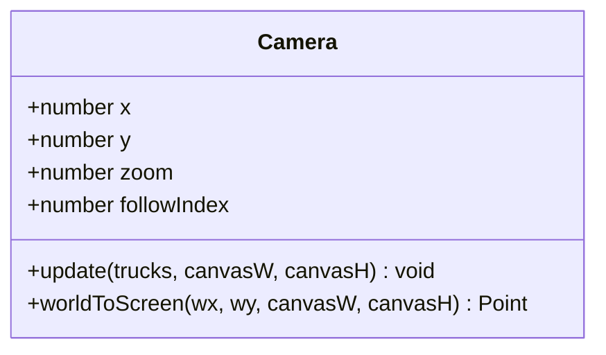

**Diagram sources**
- [renderer.js:1-22](file://renderer.js#L1-L22)

**Section sources**
- [renderer.js:9-21](file://renderer.js#L9-L21)

### Renderer Class and Multi-Canvas Architecture
Renderer initializes multiple Canvas contexts and orchestrates the rendering pipeline:
- simCanvas: Main simulation view with camera transforms.
- lidarCanvas: 360° LiDAR visualization for the selected truck.
- radarCanvas: 360° radar overlay for the selected truck.
- miniMapCanvas: Top-down minimap of the map and fleet routes/trucks.
- chartCanvas: Bar chart of shift statistics.

Rendering pipeline highlights:
- Grid drawing: Terrain tiles with slope/roughness shading and special “terrace” visuals.
- Zone visualization: Colored overlays with borders and labels.
- Route plotting: Two route sets (raw and smoothed) with distinct styles.
- Truck rendering: Body, lights, direction indicator, operation progress ring, labels.
- Weather overlays: Fog, dust, rain effects.
- Time-of-day lighting: Day/dusk/night overlays and spotlight effect.
- Auxiliary views: Minimap, LiDAR, radar, and charts.

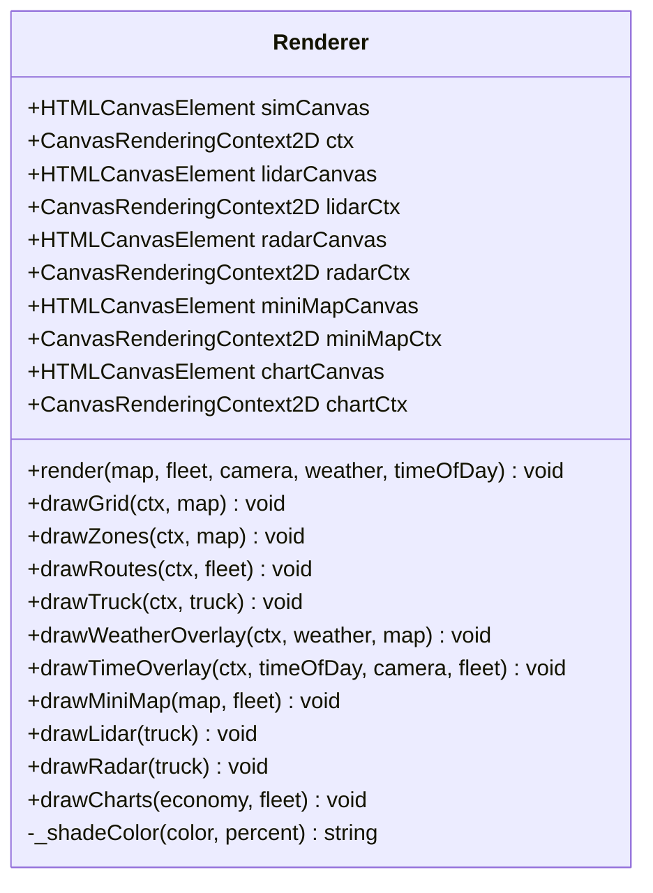

**Diagram sources**
- [renderer.js:24-436](file://renderer.js#L24-L436)

**Section sources**
- [renderer.js:24-66](file://renderer.js#L24-L66)
- [renderer.js:68-128](file://renderer.js#L68-L128)
- [renderer.js:130-172](file://renderer.js#L130-L172)
- [renderer.js:174-219](file://renderer.js#L174-L219)
- [renderer.js:230-276](file://renderer.js#L230-L276)
- [renderer.js:278-316](file://renderer.js#L278-L316)
- [renderer.js:318-388](file://renderer.js#L318-L388)
- [renderer.js:390-435](file://renderer.js#L390-L435)

### Rendering Pipeline Details

#### Grid Drawing with Terrain Variations
- Tile iteration over the grid with CONFIG constants for tile size and grid dimensions.
- Color selection based on blocked vs. passable, slope, roughness, and map type (terrace).
- Terrace mode adds concentric circles and a shaded region.
- Light grid lines overlay the tiles.

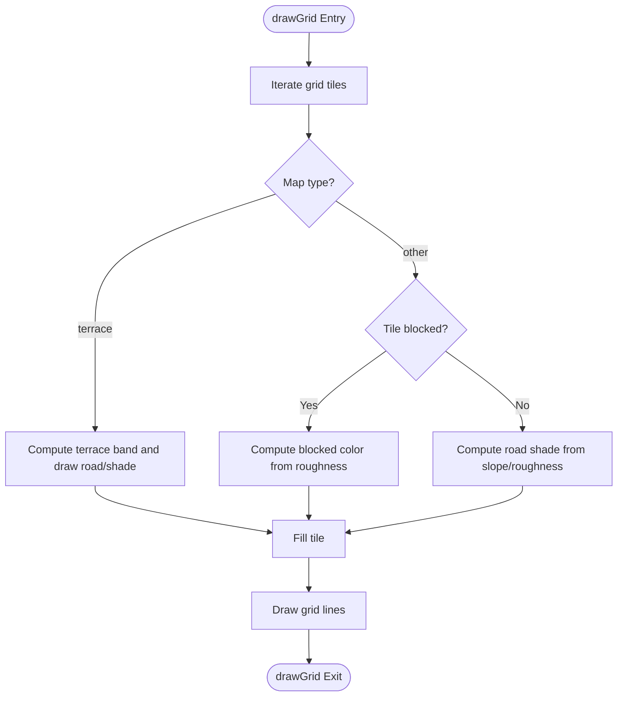

**Diagram sources**
- [renderer.js:68-128](file://renderer.js#L68-L128)
- [config.js:1-93](file://config.js#L1-L93)

**Section sources**
- [renderer.js:68-128](file://renderer.js#L68-L128)

#### Zone Visualization with Colored Overlays
- Draws each zone rectangle with a translucent fill and stroke.
- Adds a label inside each zone.
- Uses predefined zone rectangles from MapManager.

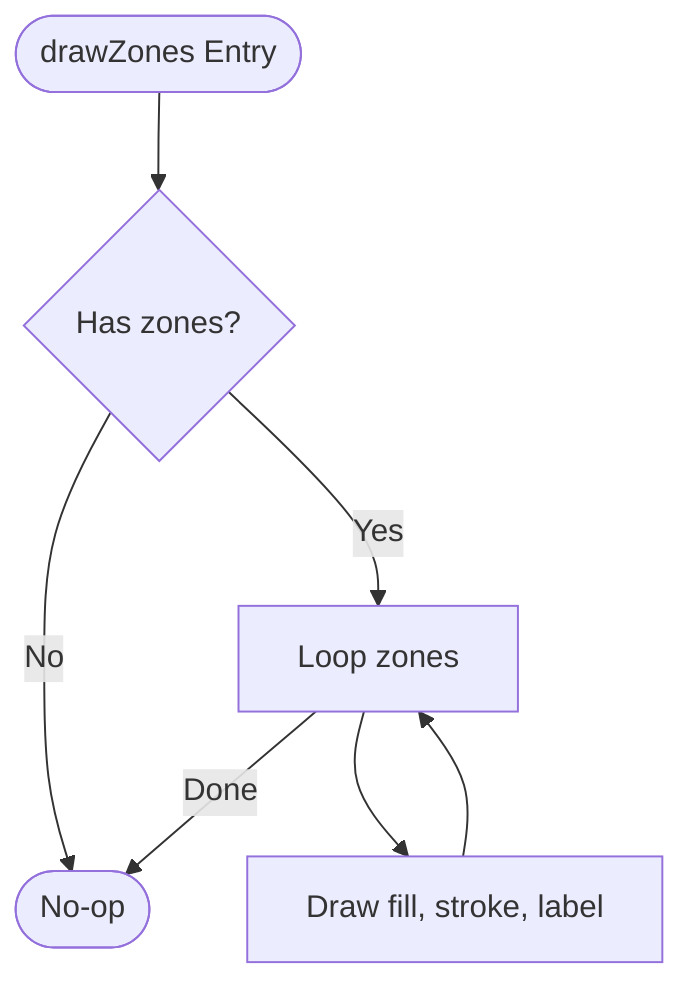

**Diagram sources**
- [renderer.js:130-151](file://renderer.js#L130-L151)
- [map.js:196-249](file://map.js#L196-L249)

**Section sources**
- [renderer.js:130-151](file://renderer.js#L130-L151)

#### Route Plotting with Different Styles
- Raw route: light blue, thin line.
- Smoothed route: per-truck color, thicker line.

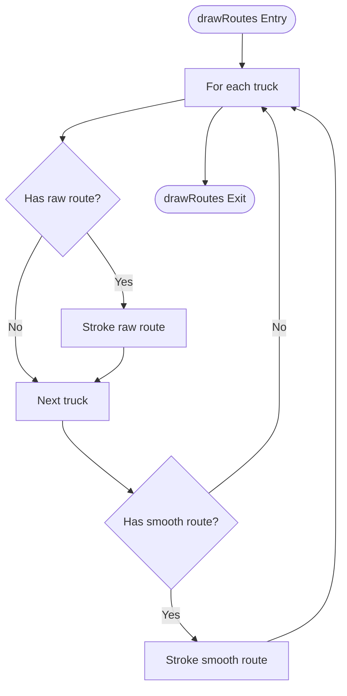

**Diagram sources**
- [renderer.js:153-172](file://renderer.js#L153-L172)

**Section sources**
- [renderer.js:153-172](file://renderer.js#L153-L172)

#### Truck Rendering with State Indicators
- Truck body and details drawn in local space, then rotated and translated by camera.
- Direction indicator and operation progress arc.
- Labels for name and state.

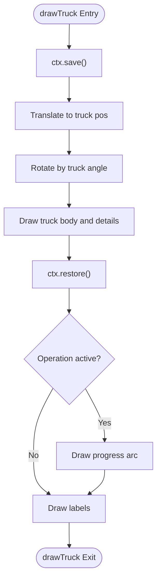

**Diagram sources**
- [renderer.js:174-219](file://renderer.js#L174-L219)

**Section sources**
- [renderer.js:174-219](file://renderer.js#L174-L219)

#### Weather Overlay Effects (Fog, Dust, Rain)
- Fog: Semi-transparent white overlay.
- Dust: Warm tint overlay.
- Rain: Animated streaks moving with time.

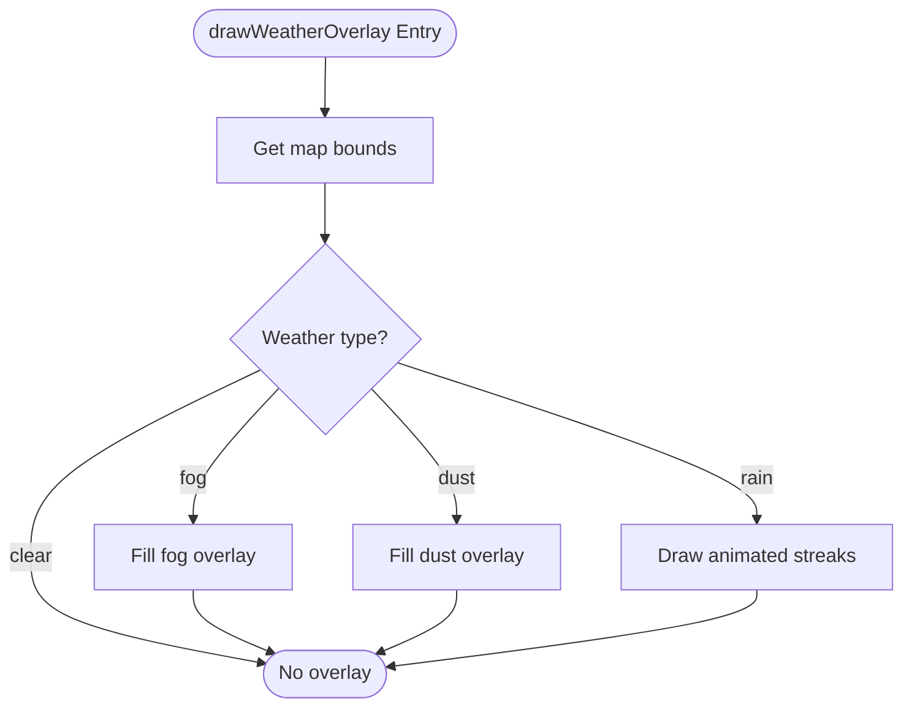

**Diagram sources**
- [renderer.js:230-252](file://renderer.js#L230-L252)

**Section sources**
- [renderer.js:230-252](file://renderer.js#L230-L252)

#### Time-of-Day Lighting Effects
- Day: No overlay.
- Dusk: Warm-orange overlay.
- Night: Dark overlay with radial gradient spotlight centered on the camera-followed truck.

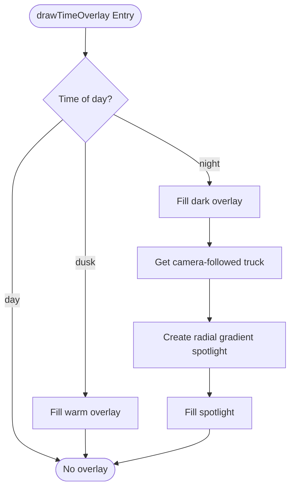

**Diagram sources**
- [renderer.js:254-276](file://renderer.js#L254-L276)

**Section sources**
- [renderer.js:254-276](file://renderer.js#L254-L276)

### Coordinate Transformation Functions and Projection Mathematics
The renderer applies camera transforms to draw in world coordinates:
- Translation to center of viewport.
- Scaling by zoom.
- Reverse translation by camera position.

World-to-screen conversion is exposed by Camera.worldToScreen and is also used for click-to-world conversion in Simulation.

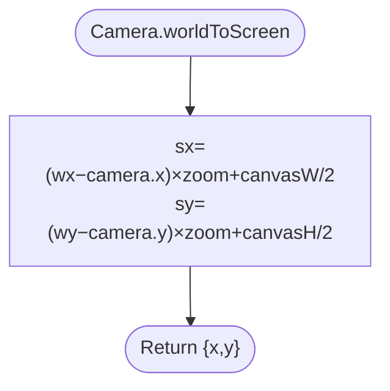

**Diagram sources**
- [renderer.js:17-21](file://renderer.js#L17-L21)
- [main.js:244-245](file://main.js#L244-L245)

**Section sources**
- [renderer.js:17-21](file://renderer.js#L17-L21)
- [main.js:244-245](file://main.js#L244-L245)

### Visual Effect Implementations
- Color shading: Helper to lighten/darken a hex color by percentage.
- Radial gradients: Spotlight effect during night.
- Animated overlays: Rain streaks with time-based offsets.

**Section sources**
- [renderer.js:221-228](file://renderer.js#L221-L228)
- [renderer.js:269-275](file://renderer.js#L269-L275)
- [renderer.js:243-250](file://renderer.js#L243-L250)

## Dependency Analysis
The rendering system exhibits clear separation of concerns:
- Simulation depends on Renderer, Camera, MapManager, Fleet, Sensors, Economy, and UI.
- Renderer depends on CONFIG and MapManager for geometry, and on Truck/Fleet for dynamic content.
- Sensors depend on MapManager and other trucks for raycasting.
- UI depends on Economy and Simulation state for display.

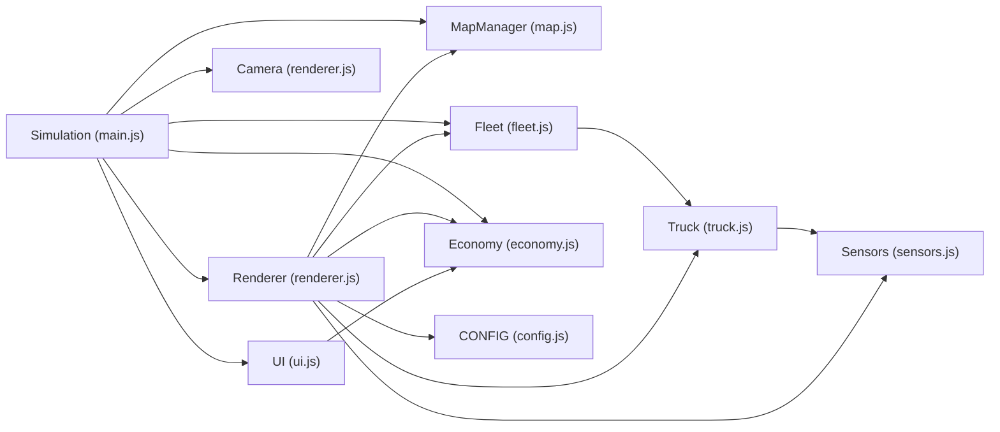

**Diagram sources**
- [main.js:1-266](file://main.js#L1-L266)
- [renderer.js:24-436](file://renderer.js#L24-L436)
- [map.js:1-438](file://map.js#L1-L438)
- [fleet.js:1-65](file://fleet.js#L1-L65)
- [truck.js:1-406](file://truck.js#L1-L406)
- [sensors.js:1-103](file://sensors.js#L1-L103)
- [economy.js:1-66](file://economy.js#L1-L66)
- [ui.js:1-200](file://ui.js#L1-L200)
- [config.js:1-93](file://config.js#L1-L93)

**Section sources**
- [main.js:1-266](file://main.js#L1-L266)
- [renderer.js:24-436](file://renderer.js#L24-L436)

## Performance Considerations
- Canvas context management: Clear canvases before drawing; minimize save/restore nesting; reuse contexts.
- Efficient drawing:
  - Batch operations: Use a single path per route or overlay to reduce state changes.
  - Conditional rendering: Skip expensive overlays when not needed.
  - Minimap: Use scaled tile coordinates to avoid per-tile loops.
- Coordinate transforms: Precompute constants and reuse where possible.
- Animation timing: Use performance.now() for smooth rain animation.
- Path smoothing: Reduce path complexity before rendering.
- Sensor overlays: Limit ray counts and steps to balance fidelity and performance.

[No sources needed since this section provides general guidance]

## Troubleshooting Guide
Common issues and remedies:
- Trucks not visible:
  - Verify camera.followIndex selects a valid truck and that Renderer.render is called.
  - Ensure simCanvas has nonzero width/height.
- Click-to-truck selection fails:
  - Confirm event coordinates are converted using the same scale factors and camera state.
- Minimap shows nothing:
  - Check that miniMapCanvas is initialized and that grid traversal uses correct bounds.
- Weather/rain artifacts:
  - Adjust CONFIG.sensors.lidarMaxDist and CONFIG.sensors.lidarRays to balance visibility and performance.
- Time overlay not appearing:
  - Ensure timeOfDay is set to dusk or night and that the camera-followed truck exists.

**Section sources**
- [main.js:236-252](file://main.js#L236-L252)
- [renderer.js:278-316](file://renderer.js#L278-L316)
- [config.js:39-49](file://config.js#L39-L49)

## Conclusion
The rendering system cleanly separates camera control, multi-canvas rendering, and auxiliary overlays. It leverages configuration-driven parameters, efficient coordinate transforms, and modular components to deliver a responsive and visually rich simulation. Following the optimization strategies and troubleshooting tips will help maintain performance and reliability.

[No sources needed since this section summarizes without analyzing specific files]

## Appendices

### Canvas Context Management Examples
- Clearing canvases before drawing ensures no residual artifacts.
- Using save/restore around per-draw operations isolates transforms.
- Minimap scaling uses simple multiplication by tile-to-canvas ratios.

**Section sources**
- [renderer.js:42-42](file://renderer.js#L42-L42)
- [renderer.js:278-282](file://renderer.js#L278-L282)
- [renderer.js:283-284](file://renderer.js#L283-L284)

### Coordinate Conversion Reference
- World-to-screen: Camera.worldToScreen(wx, wy, canvasW, canvasH)
- Screen-to-world click: Convert client coordinates to canvas coordinates, then apply inverse camera transform.

**Section sources**
- [renderer.js:17-21](file://renderer.js#L17-L21)
- [main.js:236-245](file://main.js#L236-L245)