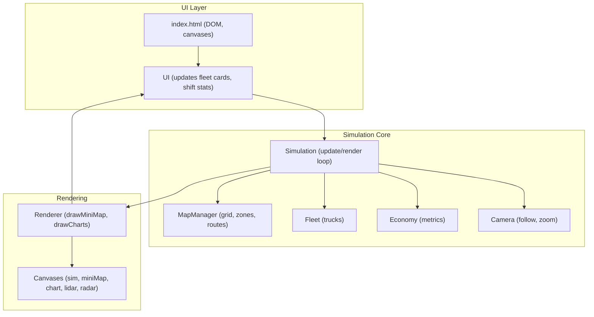
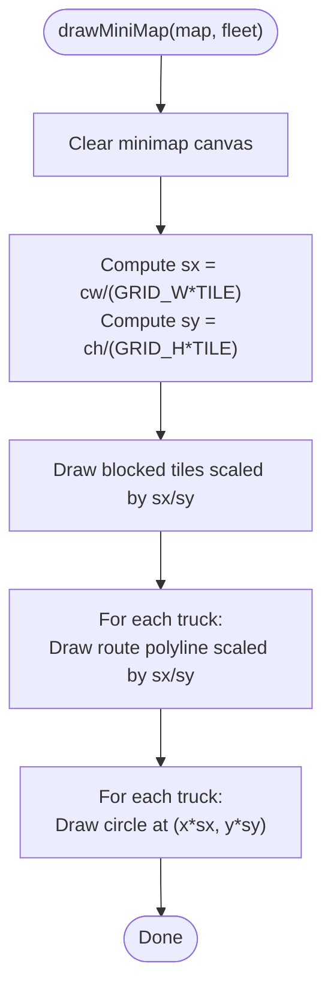
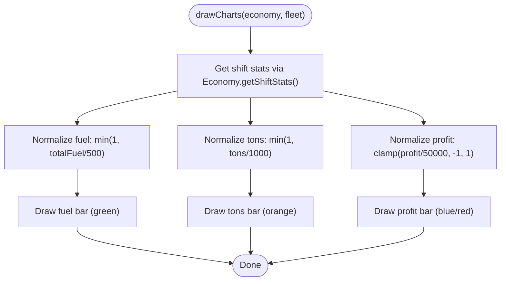
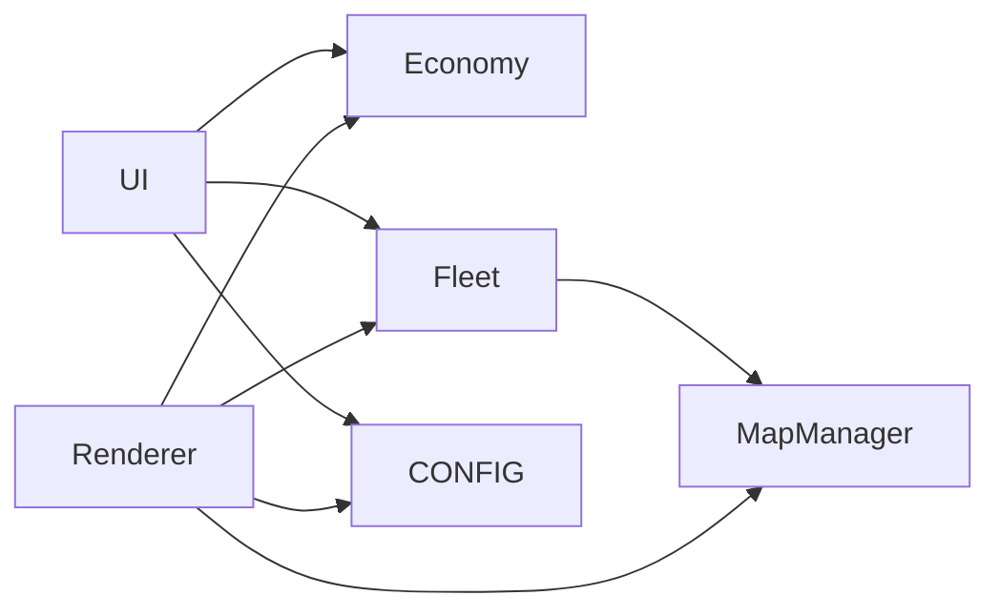

# MiniMap and Performance Charts

<cite>
**Referenced Files in This Document**
- [index.html](file://index.html)
- [config.js](file://config.js)
- [utils.js](file://utils.js)
- [map.js](file://map.js)
- [sensors.js](file://sensors.js)
- [economy.js](file://economy.js)
- [truck.js](file://truck.js)
- [fleet.js](file://fleet.js)
- [ui.js](file://ui.js)
- [renderer.js](file://renderer.js)
- [main.js](file://main.js)
</cite>

## Table of Contents
1. [Introduction](#introduction)
2. [Project Structure](#project-structure)
3. [Core Components](#core-components)
4. [Architecture Overview](#architecture-overview)
5. [Detailed Component Analysis](#detailed-component-analysis)
6. [Dependency Analysis](#dependency-analysis)
7. [Performance Considerations](#performance-considerations)
8. [Troubleshooting Guide](#troubleshooting-guide)
9. [Conclusion](#conclusion)
10. [Appendices](#appendices)

## Introduction
This document explains the minimap and performance visualization components of the autonomous truck simulator. It covers:
- The minimap rendering system that provides an overhead view of the entire mining operation, including scaled route visualization and truck positioning.
- The performance chart system that displays real-time economic metrics: fuel consumption, cargo tons transported, and profit analysis.
- The coordinate scaling system that maps world coordinates to minimap dimensions.
- The bar chart implementation for statistical data visualization.
- Chart color coding, normalization techniques for different metric scales, and the dynamic updating mechanism for real-time performance monitoring.
- Practical examples for interpreting charts and using the minimap for navigation assistance.

## Project Structure
The simulation is organized around a central loop that updates state, renders visuals, and updates UI panels. The minimap and performance charts are rendered via the Renderer class and updated through the UI layer.



**Diagram sources**
- [index.html:155-257](file://index.html#L155-L257)
- [main.js:1-266](file://main.js#L1-L266)
- [renderer.js:24-66](file://renderer.js#L24-L66)

**Section sources**
- [index.html:155-257](file://index.html#L155-L257)
- [main.js:1-45](file://main.js#L1-L45)

## Core Components
- Minimap: Overhead view of the grid and routes, with scaled truck positions.
- Performance Charts: Bar chart displaying normalized metrics (fuel, tons, profit).
- Coordinate Scaling: World-to-minimap mapping using canvas dimensions and grid size.
- Dynamic Updates: Real-time refresh driven by the simulation loop.

Key responsibilities:
- Minimap rendering: drawMiniMap in Renderer.
- Chart rendering: drawCharts in Renderer.
- Economic metrics: Economy.getShiftStats().
- UI integration: UI.update() and UI._exportCsv().

**Section sources**
- [renderer.js:278-316](file://renderer.js#L278-L316)
- [renderer.js:390-435](file://renderer.js#L390-L435)
- [economy.js:45-64](file://economy.js#L45-L64)
- [ui.js:122-158](file://ui.js#L122-L158)

## Architecture Overview
The minimap and performance charts are part of the rendering pipeline invoked each frame. The minimap draws a scaled grid and routes, then overlays truck positions. The performance chart draws three bars representing normalized metrics.

```mermaid
sequenceDiagram
participant Loop as "Simulation.loop()"
participant Render as "Renderer.render()"
participant Mini as "Renderer.drawMiniMap()"
participant Charts as "Renderer.drawCharts()"
participant UI as "UI.update()"
participant Econ as "Economy.getShiftStats()"
Loop->>Render : render(map, fleet, camera, weather, timeOfDay)
Render->>Mini : drawMiniMap(map, fleet)
Render->>Charts : drawCharts(economy, fleet)
Render->>UI : update(fleet, economy, camera, timeScale, paused)
Charts->>Econ : getShiftStats()
UI->>Econ : getShiftStats()
```

**Diagram sources**
- [main.js:209-223](file://main.js#L209-L223)
- [renderer.js:38-66](file://renderer.js#L38-L66)
- [renderer.js:278-316](file://renderer.js#L278-L316)
- [renderer.js:390-435](file://renderer.js#L390-L435)
- [ui.js:122-158](file://ui.js#L122-L158)
- [economy.js:45-64](file://economy.js#L45-L64)

## Detailed Component Analysis

### Minimap Rendering System
The minimap provides an overhead view of the grid, routes, and truck positions. It uses a simple scaling factor derived from canvas size and grid dimensions.

Key behaviors:
- Grid overlay: Draws blocked tiles in a distinct color.
- Route visualization: Draws each truck’s route as thin lines.
- Truck positioning: Draws each truck as a small circle at scaled coordinates.

Coordinate scaling:
- Scaling factors sx and sy convert world coordinates to minimap pixel coordinates.
- sx = miniMapCanvasWidth / (GRID_W * TILE)
- sy = miniMapCanvasHeight / (GRID_H * TILE)

Route and position drawing:
- Routes are drawn using scaled coordinates from truck.route.
- Trucks are drawn using scaled coordinates from truck.x, truck.y.



**Diagram sources**
- [renderer.js:278-316](file://renderer.js#L278-L316)
- [config.js:1-93](file://config.js#L1-L93)

**Section sources**
- [renderer.js:278-316](file://renderer.js#L278-L316)
- [config.js:1-93](file://config.js#L1-L93)

### Performance Chart System
The performance chart displays three normalized bars:
- Fuel consumption (liters): normalized against a fixed threshold.
- Cargo tons transported: normalized against a fixed threshold.
- Profit: normalized against a symmetric range centered at zero.

Normalization and layout:
- Each bar is computed with a normalized value between 0 and 1 (or -1 to 1 for profit).
- Bars are laid out horizontally with equal width and spacing.
- Profit bar is centered at zero and drawn upward for positive values and downward for negative values.

Color coding:
- Fuel: green.
- Tons: orange.
- Profit: blue for positive, red for negative.

Dynamic updates:
- drawCharts is called each frame and reads Economy.getShiftStats().



**Diagram sources**
- [renderer.js:390-435](file://renderer.js#L390-L435)
- [economy.js:45-64](file://economy.js#L45-L64)

**Section sources**
- [renderer.js:390-435](file://renderer.js#L390-L435)
- [economy.js:45-64](file://economy.js#L45-L64)

### Coordinate Scaling System
Minimap scaling converts world coordinates to screen coordinates using the canvas size and grid constants.

Scaling factors:
- sx = canvasWidth / (GRID_W * TILE)
- sy = canvasHeight / (GRID_H * TILE)

Route and truck positions:
- Route points are transformed by multiplying by sx and sy.
- Truck positions are similarly transformed.

This ensures that the minimap remains proportional to the world grid regardless of canvas size.

**Section sources**
- [renderer.js:283-284](file://renderer.js#L283-L284)
- [config.js:1-93](file://config.js#L1-L93)

### Bar Chart Implementation Details
The bar chart is implemented as three stacked horizontal bars with:
- Fixed bar width and spacing.
- Background bar (dark) and foreground bar (colored).
- Profit bar centered at the middle of the canvas height.

Normalization thresholds:
- Fuel: 500 liters.
- Tons: 1000 tons.
- Profit: ±50,000 rubles.

Zero-reference for profit:
- zeroY = pad + maxH * 0.5
- Positive profit extends upward from zeroY.
- Negative profit extends downward from zeroY.

**Section sources**
- [renderer.js:390-435](file://renderer.js#L390-L435)

### Chart Color Coding and Interpretation
Color scheme:
- Fuel: green.
- Tons: orange.
- Profit: blue (positive), red (negative).

Interpretation examples:
- Fuel bar near top indicates high consumption; consider refueling strategy.
- Tons bar near top indicates efficient loading/unloading cycles.
- Profit bar above zero indicates revenue exceeding costs; below zero indicates losses.

Exporting metrics:
- UI exposes CSV export of shift statistics for external analysis.

**Section sources**
- [renderer.js:403-434](file://renderer.js#L403-L434)
- [ui.js:175-198](file://ui.js#L175-L198)

### Dynamic Updating Mechanism
Real-time updates occur each frame:
- Simulation.update() advances fleet and economy.
- Renderer.render() draws the scene and charts.
- UI.update() refreshes fleet cards and shift stats.

Chart refresh cadence:
- drawCharts is invoked every frame, ensuring live updates of normalized metrics.

**Section sources**
- [main.js:67-80](file://main.js#L67-L80)
- [main.js:209-223](file://main.js#L209-L223)
- [renderer.js:390-435](file://renderer.js#L390-L435)
- [ui.js:122-158](file://ui.js#L122-L158)

### Minimap Navigation Assistance
How to use the minimap:
- Observe route lines to understand planned paths.
- Watch truck circles to track positions and direction.
- Use the minimap to identify deviations from routes and estimate traffic density.

Integration with camera:
- Clicking on a truck in the main sim view selects it for camera follow.
- The minimap does not directly control camera; it complements the main view.

**Section sources**
- [main.js:236-252](file://main.js#L236-L252)
- [renderer.js:278-316](file://renderer.js#L278-L316)

## Dependency Analysis
The minimap and performance charts depend on:
- Renderer for drawing.
- Economy for metrics.
- UI for display and export.
- MapManager for route planning and grid context.
- Fleet for truck positions and routes.



**Diagram sources**
- [renderer.js:24-66](file://renderer.js#L24-L66)
- [ui.js:1-28](file://ui.js#L1-L28)
- [map.js:1-74](file://map.js#L1-L74)
- [economy.js:1-15](file://economy.js#L1-L15)

**Section sources**
- [renderer.js:24-66](file://renderer.js#L24-L66)
- [ui.js:1-28](file://ui.js#L1-L28)
- [map.js:1-74](file://map.js#L1-L74)
- [economy.js:1-15](file://economy.js#L1-L15)

## Performance Considerations
- Minimap scaling is constant-time per frame; keep GRID_W and GRID_H reasonable.
- Route drawing iterates over each truck’s route; consider limiting route length or caching.
- Chart drawing computes normalized values each frame; keep normalization thresholds constant.
- UI updates are lightweight; ensure DOM updates are minimal.

[No sources needed since this section provides general guidance]

## Troubleshooting Guide
Common issues and resolutions:
- Minimap appears too small or large:
  - Verify canvas dimensions and CONFIG.TILE, CONFIG.GRID_W, CONFIG.GRID_H.
- Routes not visible:
  - Ensure trucks have computed routes and fleet.trucks is populated.
- Charts show unexpected values:
  - Confirm Economy.getShiftStats() returns expected values and normalization thresholds match expectations.
- Export CSV missing:
  - Ensure window.simEconomy is set and UI._exportCsv() is triggered.

**Section sources**
- [renderer.js:278-316](file://renderer.js#L278-L316)
- [renderer.js:390-435](file://renderer.js#L390-L435)
- [ui.js:175-198](file://ui.js#L175-L198)
- [main.js:25-37](file://main.js#L25-L37)

## Conclusion
The minimap and performance charts provide complementary views of the mining operation:
- The minimap offers an overhead perspective for situational awareness and route monitoring.
- The performance charts deliver normalized economic insights for operational decisions.
Together, they enable real-time monitoring and optimization of fleet performance.

[No sources needed since this section summarizes without analyzing specific files]

## Appendices

### Appendix A: Canvas Layout and DOM Elements
- Minimap canvas: miniMapCanvas.
- Performance chart canvas: chartCanvas.
- Sensor canvases: lidarCanvas, radarCanvas.
- UI panels: fleetCards, shiftStats.

**Section sources**
- [index.html:203-238](file://index.html#L203-L238)

### Appendix B: Configuration Constants Relevant to Minimap and Charts
- GRID_W, GRID_H, TILE define world grid size.
- camera.zoomDefault influences main view; minimap scaling is independent.
- Chart thresholds: fuel 500 L, tons 1000 t, profit ±50000 rubles.

**Section sources**
- [config.js:1-93](file://config.js#L1-L93)
- [renderer.js:403-434](file://renderer.js#L403-L434)