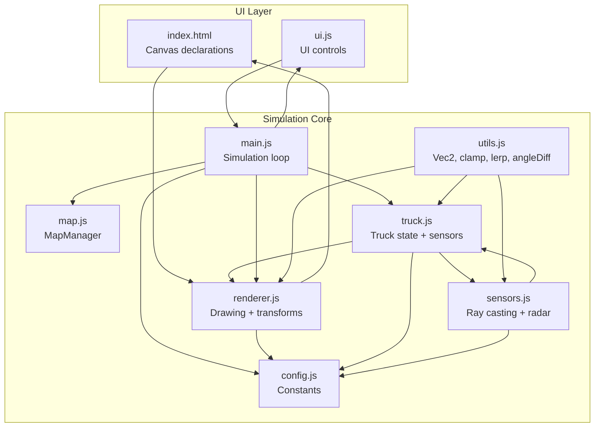
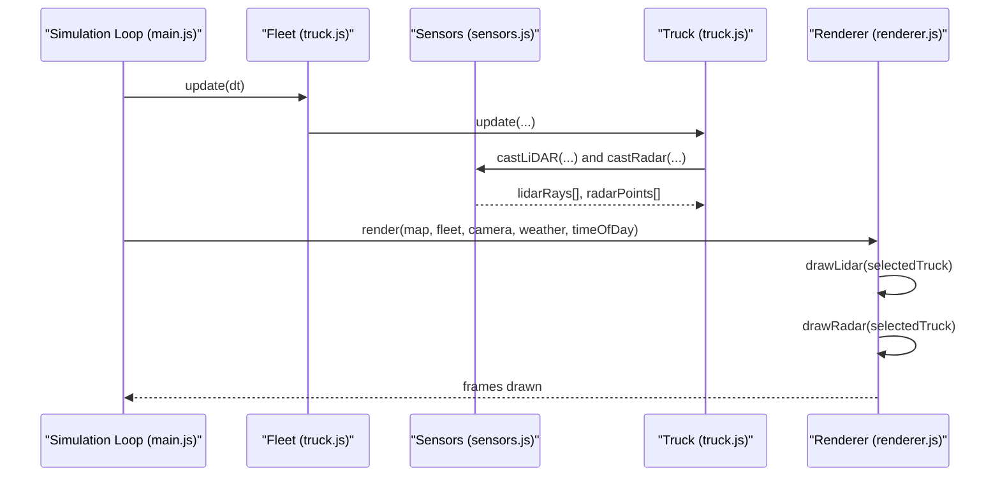
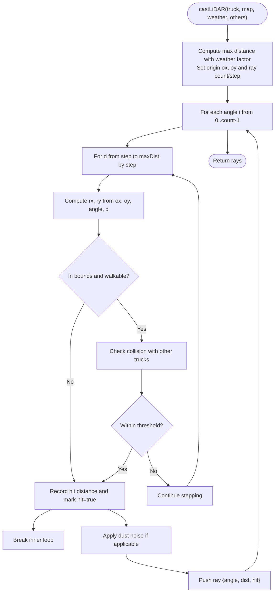
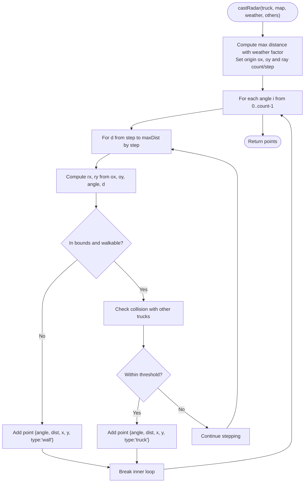
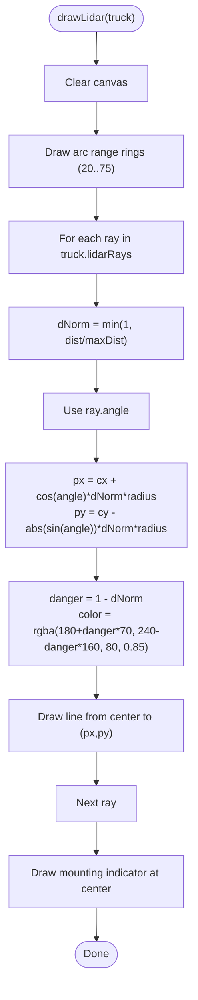
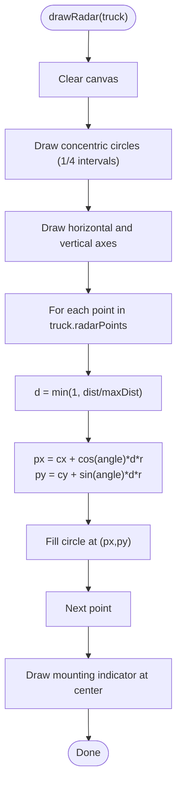
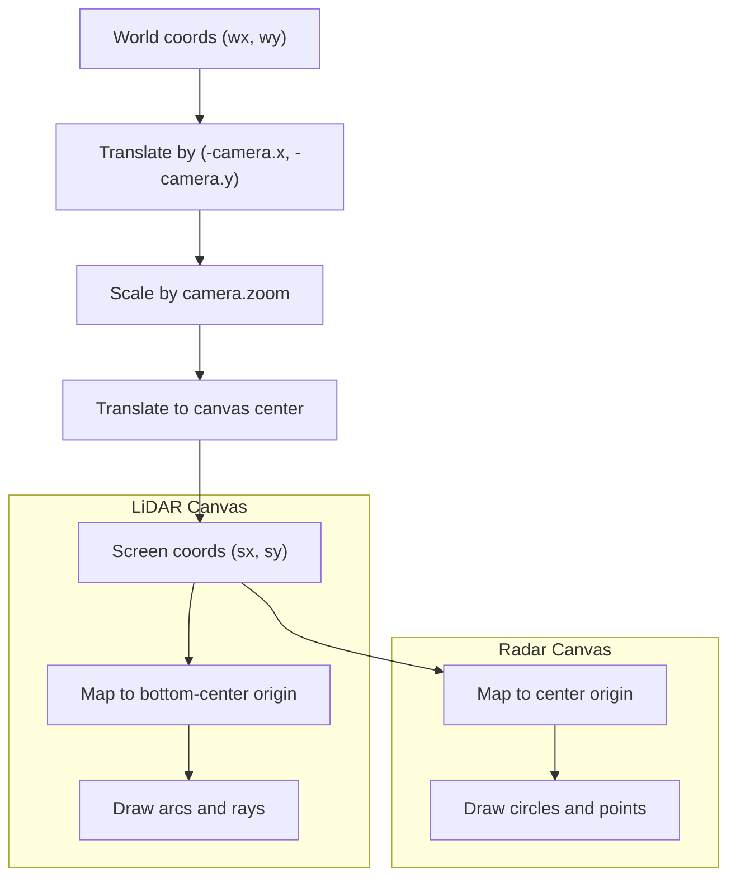
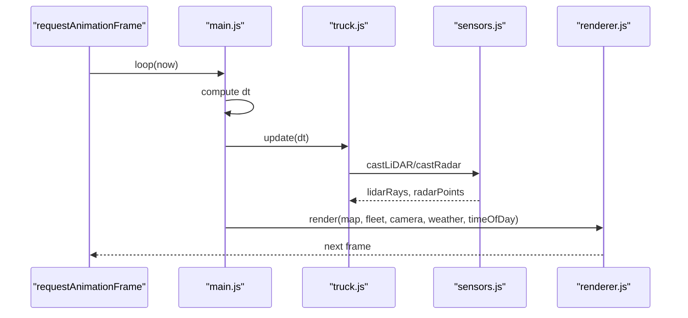
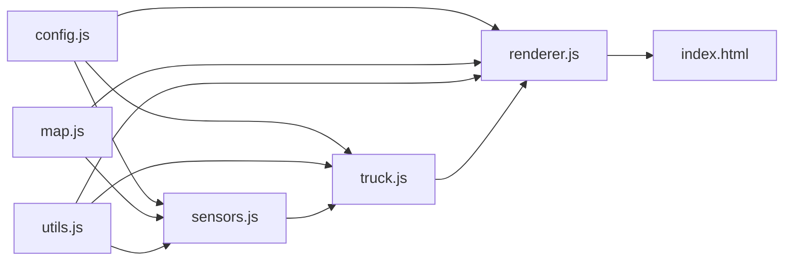

# Sensor Display System

<cite>
**Referenced Files in This Document**
- [index.html](file://index.html)
- [config.js](file://config.js)
- [utils.js](file://utils.js)
- [map.js](file://map.js)
- [sensors.js](file://sensors.js)
- [truck.js](file://truck.js)
- [renderer.js](file://renderer.js)
- [main.js](file://main.js)
- [ui.js](file://ui.js)
</cite>

## Table of Contents
1. [Introduction](#introduction)
2. [Project Structure](#project-structure)
3. [Core Components](#core-components)
4. [Architecture Overview](#architecture-overview)
5. [Detailed Component Analysis](#detailed-component-analysis)
6. [Dependency Analysis](#dependency-analysis)
7. [Performance Considerations](#performance-considerations)
8. [Troubleshooting Guide](#troubleshooting-guide)
9. [Conclusion](#conclusion)

## Introduction
This document describes the sensor visualization system responsible for real-time display of LiDAR and radar data for autonomous trucks. It explains how raw sensor readings are generated, transformed, and rendered onto dedicated canvases, including:
- LiDAR arc-based range rings, ray visualization with distance-based color coding, and a sensor mounting indicator
- Radar concentric range circles, point cloud visualization, and proximity mapping
- Coordinate transformations from world-space to screen-space and then to sensor-display canvases
- Real-time updates synchronized with the simulation loop
- Visual styling for danger assessment, sensor mounting indicators, and data point rendering

## Project Structure
The sensor visualization spans several modules:
- Configuration defines constants for sensor behavior and rendering
- Sensors module computes LiDAR rays and radar points
- Truck stores per-vehicle sensor data and applies sensor readings
- Renderer draws the main simulation and the two sensor displays
- Main orchestrates update/render loops and camera transforms
- HTML declares the canvases and UI layout
- Utilities provide math helpers used across the system

**Diagram sources**
- [index.html:129-238](file://index.html#L129-L238)
- [main.js:1-266](file://main.js#L1-L266)
- [renderer.js:24-66](file://renderer.js#L24-L66)
- [sensors.js:1-103](file://sensors.js#L1-L103)
- [truck.js:1-406](file://truck.js#L1-L406)
- [map.js:1-438](file://map.js#L1-L438)
- [utils.js:1-102](file://utils.js#L1-L102)
- [config.js:1-93](file://config.js#L1-L93)

**Section sources**
- [index.html:129-238](file://index.html#L129-L238)
- [main.js:1-266](file://main.js#L1-L266)
- [renderer.js:24-66](file://renderer.js#L24-L66)
- [sensors.js:1-103](file://sensors.js#L1-L103)
- [truck.js:1-406](file://truck.js#L1-L406)
- [map.js:1-438](file://map.js#L1-L438)
- [utils.js:1-102](file://utils.js#L1-L102)
- [config.js:1-93](file://config.js#L1-L93)

## Core Components
- Sensor computation:
  - LiDAR: casts N rays around the vehicle, stepping outward to detect obstacles and other trucks
  - Radar: samples points along N angles to collect wall and truck detections within a maximum distance
- Rendering:
  - LiDAR display: draws arc range rings, colored rays based on distance, and a small mounting indicator
  - Radar display: draws concentric range circles, radar cross-section lines, and filled points for detected obstacles
- Coordinate transforms:
  - World-to-screen transform via Camera
  - Screen-to-canvas transforms for drawing on sensor canvases
- Real-time updates:
  - Sensors are recomputed each frame per-truck
  - Renderer draws sensor displays for the currently followed truck

**Section sources**
- [sensors.js:9-103](file://sensors.js#L9-L103)
- [renderer.js:318-388](file://renderer.js#L318-L388)
- [truck.js:320-324](file://truck.js#L320-L324)
- [main.js:209-223](file://main.js#L209-L223)

## Architecture Overview
The sensor visualization pipeline integrates sensor computation, per-truck storage, and rendering into a cohesive real-time system.

**Diagram sources**
- [main.js:67-80](file://main.js#L67-L80)
- [main.js:209-223](file://main.js#L209-L223)
- [truck.js:320-324](file://truck.js#L320-L324)
- [sensors.js:9-79](file://sensors.js#L9-L79)
- [renderer.js:318-388](file://renderer.js#L318-L388)

## Detailed Component Analysis

### Sensor Computation: LiDAR
- Input: truck pose (x, y, angle), map grid, weather conditions, other trucks
- Output: array of rays, each with angle, distance, and hit flag
- Algorithm highlights:
  - Iterates over N angles uniformly distributed around 360 degrees
  - Steps outward from the sensor origin with fixed step size until:
    - Out-of-bounds or blocked tile encountered
    - Obstruction by another truck within a small radius
  - Applies weather-specific range factor and optional dust noise to distance
  - Computes a front-sector minimum distance for obstacle avoidance logic

**Diagram sources**
- [sensors.js:9-49](file://sensors.js#L9-L49)
- [map.js:9-15](file://map.js#L9-L15)

**Section sources**
- [sensors.js:9-49](file://sensors.js#L9-L49)
- [map.js:9-15](file://map.js#L9-L15)

### Sensor Computation: Radar
- Input: same as LiDAR
- Output: array of points, each with angle, distance, world coordinates, and type ("wall" or "truck")
- Algorithm highlights:
  - Iterates over N angles
  - Steps outward along each angle until encountering a wall or truck
  - Records the first hit per angle as a point with type
  - Produces a dense point cloud for visualization

**Diagram sources**
- [sensors.js:51-79](file://sensors.js#L51-L79)
- [map.js:9-15](file://map.js#L9-L15)

**Section sources**
- [sensors.js:51-79](file://sensors.js#L51-L79)
- [map.js:9-15](file://map.js#L9-L15)

### Rendering: LiDAR Display
- Canvas: lidarCanvas (width x height)
- Projection:
  - Origin at bottom-center of canvas
  - Radial range rings drawn as arcs from 20 to 75 pixels
  - Rays computed from normalized distances (0..1) scaled by radius
  - Danger color gradient from green to red based on inverse distance
- Mounting indicator: small circle at canvas origin

**Diagram sources**
- [renderer.js:318-350](file://renderer.js#L318-L350)

**Section sources**
- [renderer.js:318-350](file://renderer.js#L318-L350)

### Rendering: Radar Display
- Canvas: radarCanvas (width x height)
- Projection:
  - Origin at center of canvas
  - Concentric circles at 1/4 intervals of radius
  - Cross-hairs for axes
  - Points mapped by normalized distance and angle to screen coordinates
- Point rendering:
  - Color-coded based on detection type (e.g., wall vs truck)
  - Small filled circles sized by constant radius

**Diagram sources**
- [renderer.js:352-388](file://renderer.js#L352-L388)

**Section sources**
- [renderer.js:352-388](file://renderer.js#L352-L388)

### Coordinate Transformations
- World-to-screen:
  - Camera holds x, y, zoom and follows a selected truck
  - worldToScreen(wx, wy) applies translation and scaling to canvas center
- Sensor canvas transforms:
  - LiDAR: origin at bottom-center; positive Y upward for ray projection
  - Radar: origin at center; positive Y downward for canvas coordinates

**Diagram sources**
- [renderer.js:9-21](file://renderer.js#L9-L21)
- [renderer.js:318-388](file://renderer.js#L318-L388)

**Section sources**
- [renderer.js:9-21](file://renderer.js#L9-L21)
- [renderer.js:318-388](file://renderer.js#L318-L388)

### Real-Time Updating Mechanism
- Update cycle:
  - Simulation.update computes dt and advances fleet state
  - Trucks apply sensors each frame via Sensors.castLiDAR/castRadar
  - Renderer.render draws the main scene and sensor displays
- Camera follows the selected truck with smoothing
- UI controls mode, map, time-of-day, and weather affecting sensor range factors

**Diagram sources**
- [main.js:215-223](file://main.js#L215-L223)
- [main.js:67-80](file://main.js#L67-L80)
- [truck.js:320-324](file://truck.js#L320-L324)
- [sensors.js:9-79](file://sensors.js#L9-L79)
- [renderer.js:38-66](file://renderer.js#L38-L66)

**Section sources**
- [main.js:215-223](file://main.js#L215-L223)
- [main.js:67-80](file://main.js#L67-L80)
- [truck.js:320-324](file://truck.js#L320-L324)
- [sensors.js:9-79](file://sensors.js#L9-L79)
- [renderer.js:38-66](file://renderer.js#L38-L66)

### Visual Styling and Danger Assessment
- LiDAR:
  - Distance-based color: closer obstacles appear more red; farther appear greener
  - Arc rings provide depth cues at fixed distances
  - Mounting indicator at origin
- Radar:
  - Concentric circles and axes aid spatial orientation
  - Points represent detected obstacles; color distinguishes types
- Weather effects:
  - Fog/dust/rain reduce effective sensor range
  - Dust adds noise to LiDAR distances

**Section sources**
- [sensors.js:2-7](file://sensors.js#L2-L7)
- [sensors.js:42-45](file://sensors.js#L42-L45)
- [renderer.js:334-345](file://renderer.js#L334-L345)
- [renderer.js:374-382](file://renderer.js#L374-L382)

### Sensor Data Interpretation Examples
- LiDAR:
  - A single ray with small distance indicates a nearby obstacle directly ahead
  - Multiple close rays across a sector suggest a wall or obstacle in the front quadrant
  - Front-sector minimum distance drives braking logic
- Radar:
  - Dense clusters of points near the center indicate immediate obstacles
  - Sparse points at larger radii indicate open areas
  - Type differentiation helps distinguish static walls vs dynamic trucks

**Section sources**
- [sensors.js:81-101](file://sensors.js#L81-L101)
- [truck.js:285-289](file://truck.js#L285-L289)

## Dependency Analysis
Key dependencies and interactions:
- Configuration constants drive sensor behavior and rendering scales
- MapManager provides world-to-tile conversions and bounds checks
- Utilities support vector math and angle normalization
- Renderer depends on Camera for world-to-screen transforms and on CONFIG for scales
- Sensors depend on MapManager and CONFIG for geometry and thresholds
- Truck stores sensor arrays and uses Sensors outputs for AI decisions

**Diagram sources**
- [config.js:1-93](file://config.js#L1-L93)
- [sensors.js:1-103](file://sensors.js#L1-L103)
- [renderer.js:24-66](file://renderer.js#L24-L66)
- [truck.js:1-406](file://truck.js#L1-L406)
- [map.js:1-438](file://map.js#L1-L438)
- [utils.js:1-102](file://utils.js#L1-L102)
- [index.html:129-238](file://index.html#L129-L238)

**Section sources**
- [config.js:1-93](file://config.js#L1-L93)
- [sensors.js:1-103](file://sensors.js#L1-L103)
- [renderer.js:24-66](file://renderer.js#L24-L66)
- [truck.js:1-406](file://truck.js#L1-L406)
- [map.js:1-438](file://map.js#L1-L438)
- [utils.js:1-102](file://utils.js#L1-L102)
- [index.html:129-238](file://index.html#L129-L238)

## Performance Considerations
- Sensor sampling density and step size are configurable; reducing lidarRays or increasing lidarStep reduces computational load
- Weather range factors reduce effective sensor range, which can improve realism but may increase perceived occlusion
- Rendering uses simple canvas operations; keeping ray counts moderate ensures smooth frame rates
- Camera smoothing avoids jitter but introduces slight latency; adjust followLerp for responsiveness vs stability

[No sources needed since this section provides general guidance]

## Troubleshooting Guide
- No sensor data displayed:
  - Verify the selected truck is in manual or AI mode and that sensors are computed each frame
  - Ensure the lidarCanvas and radarCanvas elements exist and are visible
- Incorrect ray directions or distances:
  - Confirm world-to-tile conversion and bounds checks are functioning
  - Check that angle normalization and distance clamping are applied consistently
- Visual artifacts:
  - Adjust arc/ring radii and point sizes to match canvas dimensions
  - Verify color calculations for danger assessment and point types

**Section sources**
- [index.html:224-233](file://index.html#L224-L233)
- [sensors.js:9-49](file://sensors.js#L9-L49)
- [renderer.js:318-388](file://renderer.js#L318-L388)

## Conclusion
The sensor visualization system combines efficient ray casting and point cloud generation with straightforward canvas rendering to provide intuitive, real-time feedback for autonomous navigation. By leveraging configuration-driven parameters, robust coordinate transforms, and clear visual metaphors (arc rings, colored rays, concentric circles), operators can quickly assess environmental hazards and vehicle proximity. Extending the system could include configurable color schemes, dynamic range scaling, and additional sensor modalities.