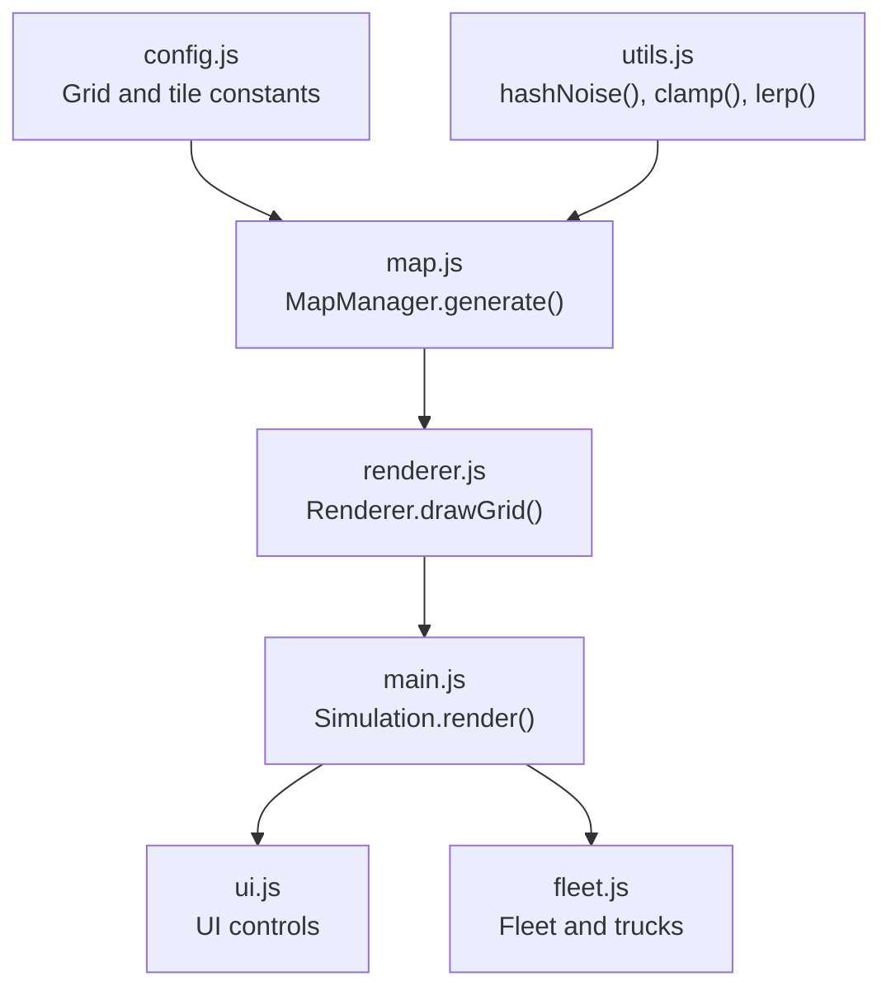
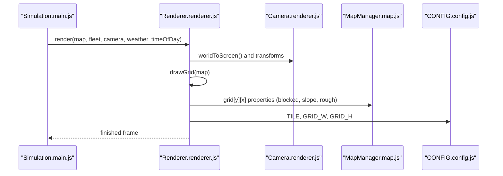
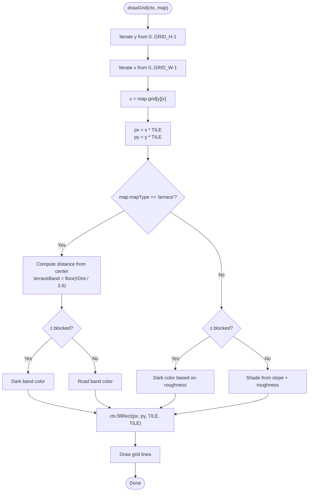
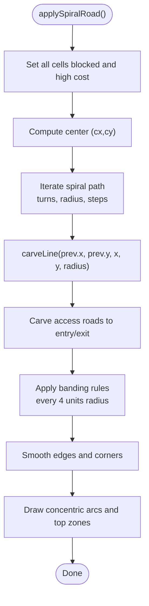
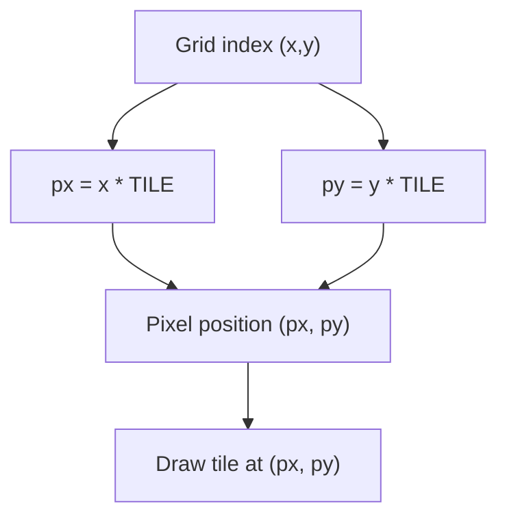
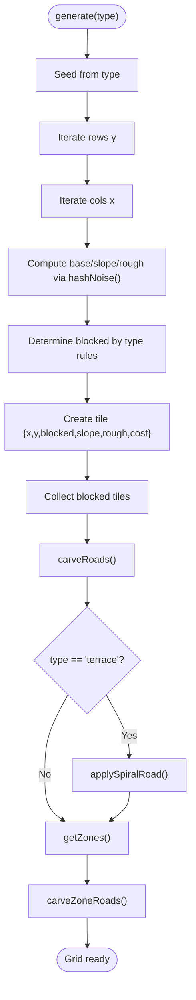
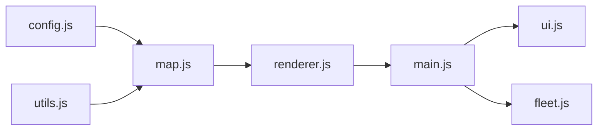

# Terrain and Grid Rendering

<cite>
**Referenced Files in This Document**
- [config.js](file://config.js)
- [renderer.js](file://renderer.js)
- [map.js](file://map.js)
- [utils.js](file://utils.js)
- [main.js](file://main.js)
- [ui.js](file://ui.js)
- [fleet.js](file://fleet.js)
</cite>

## Table of Contents
1. [Introduction](#introduction)
2. [Project Structure](#project-structure)
3. [Core Components](#core-components)
4. [Architecture Overview](#architecture-overview)
5. [Detailed Component Analysis](#detailed-component-analysis)
6. [Dependency Analysis](#dependency-analysis)
7. [Performance Considerations](#performance-considerations)
8. [Troubleshooting Guide](#troubleshooting-guide)
9. [Conclusion](#conclusion)

## Introduction
This document explains the terrain rendering system that draws the mining map grid with realistic visual styling. It covers:
- The grid drawing algorithm iterating through all grid cells and applying coloring based on terrain properties (slope, roughness, blocked status)
- Two map types: standard terrain with slope and roughness-based coloring, and terrace-style terrain with concentric circles and zone markings
- Grid cell rendering details: blocked terrain darkening, road highlighting, and grid line drawing
- Coordinate transformation from grid indices to pixel positions and the tile-based rendering system
- Examples of terrain variation visualization and performance optimization techniques for large grids

## Project Structure
The rendering pipeline is centered around a renderer that draws the grid, zones, routes, and vehicles, and a map manager that generates terrain and roads. Supporting utilities provide mathematical helpers and noise functions.

**Diagram sources**
- [config.js:1-93](file://config.js#L1-L93)
- [map.js:1-438](file://map.js#L1-L438)
- [utils.js:1-102](file://utils.js#L1-L102)
- [renderer.js:1-437](file://renderer.js#L1-L437)
- [main.js:1-266](file://main.js#L1-L266)
- [ui.js:1-200](file://ui.js#L1-L200)
- [fleet.js:1-65](file://fleet.js#L1-L65)

**Section sources**
- [config.js:1-93](file://config.js#L1-L93)
- [renderer.js:38-66](file://renderer.js#L38-L66)
- [map.js:25-74](file://map.js#L25-L74)
- [utils.js:98-102](file://utils.js#L98-L102)

## Core Components
- Renderer: Draws the grid, zones, routes, trucks, and overlays; handles camera transforms and grid lines
- MapManager: Generates terrain with slope and roughness, carves roads, creates zones, and computes costs
- Utilities: Provides noise functions and math helpers used by terrain generation and rendering
- Simulation: Orchestrates updates and rendering, and exposes map selection and modes

Key rendering responsibilities:
- Grid rendering: Iterates grid cells, computes per-cell color based on blocked/slope/rough, draws tiles, and draws grid lines
- Terrace mode: Applies concentric circle bands and zone rectangles atop the base grid
- Coordinate transforms: Converts grid indices to pixel positions and world coordinates

**Section sources**
- [renderer.js:68-128](file://renderer.js#L68-L128)
- [map.js:25-74](file://map.js#L25-L74)
- [map.js:113-194](file://map.js#L113-L194)
- [map.js:196-249](file://map.js#L196-L249)
- [utils.js:98-102](file://utils.js#L98-L102)

## Architecture Overview
The rendering system follows a layered approach:
- Simulation manages game state and invokes Renderer.render()
- Renderer applies camera transforms and delegates drawing to specialized methods
- MapManager supplies terrain data and road network
- Utilities support deterministic noise and math operations

**Diagram sources**
- [main.js:209-213](file://main.js#L209-L213)
- [renderer.js:38-66](file://renderer.js#L38-L66)
- [renderer.js:68-128](file://renderer.js#L68-L128)
- [map.js:33-67](file://map.js#L33-L67)
- [config.js:1-93](file://config.js#L1-L93)

## Detailed Component Analysis

### Grid Drawing Algorithm and Coloring Schemes
The grid drawing routine iterates over all grid cells and applies distinct coloring depending on:
- Blocked terrain: Darker tones reflecting roughness
- Open terrain: Shade derived from slope and roughness
- Terrace mode: Concentric circles and zone markings

Rendering flow:
1. Iterate rows and columns
2. Compute pixel position from grid index and tile size
3. Choose coloring scheme based on map type and cell properties
4. Draw tile rectangle
5. Draw grid lines over the tiles

**Diagram sources**
- [renderer.js:68-128](file://renderer.js#L68-L128)
- [config.js:2-4](file://config.js#L2-L4)

**Section sources**
- [renderer.js:68-128](file://renderer.js#L68-L128)
- [config.js:2-4](file://config.js#L2-L4)

### Standard Terrain Coloring (Slope and Roughness)
Standard terrain uses:
- Blocked cells: Darker color scaled by roughness
- Open cells: Shade computed from slope and roughness

Color computation highlights realistic terrain variations:
- Slope contributes to lightness/darkness
- Roughness adds texture-like darkness

**Section sources**
- [renderer.js:86-94](file://renderer.js#L86-L94)

### Terrace-Style Terrain (Concentric Circles and Zone Markings)
Terrace mode:
- Centers a spiral road around a central point
- Creates concentric bands by distance from center
- Draws horizontal zone rectangles at the top of the grid
- Overlays grid lines with low opacity

Key steps:
- Initialize all cells as blocked and set high cost
- Carve a spiral path with decreasing radius and increasing turns
- Add access roads to entry/exit points
- Apply banding rules to create alternating blocks
- Smooth edges and remove unreachable corners
- Draw concentric arcs and zone rectangles

**Diagram sources**
- [map.js:113-194](file://map.js#L113-L194)
- [renderer.js:99-112](file://renderer.js#L99-L112)

**Section sources**
- [map.js:113-194](file://map.js#L113-L194)
- [renderer.js:99-112](file://renderer.js#L99-L112)

### Grid Cell Rendering Details
- Blocked terrain darkening: Uses roughness to modulate darkness for blocked cells
- Road highlighting: In terrace mode, road areas alternate between lighter and darker bands
- Grid line drawing: Thin white lines overlay the tiles for grid visibility

These effects are applied uniformly across the grid regardless of camera zoom or position.

**Section sources**
- [renderer.js:79-94](file://renderer.js#L79-L94)
- [renderer.js:114-127](file://renderer.js#L114-L127)

### Coordinate Transformation: Grid Indices to Pixel Positions
The tile-based rendering system uses:
- Tile size: CONFIG.TILE
- Grid dimensions: CONFIG.GRID_W × CONFIG.GRID_H
- World-to-tile conversion: integer division and rounding
- Tile-to-world conversion: center of tile

**Diagram sources**
- [config.js:2-4](file://config.js#L2-L4)
- [renderer.js:72-73](file://renderer.js#L72-L73)
- [map.js:13-19](file://map.js#L13-L19)

**Section sources**
- [config.js:2-4](file://config.js#L2-L4)
- [renderer.js:72-73](file://renderer.js#L72-L73)
- [map.js:13-19](file://map.js#L13-L19)

### Map Generation and Road Carving
MapManager.generate() builds terrain with:
- Noise-based slope and roughness
- Blocked regions determined by map type
- Road carving via straight-line corridors with smoothing
- Zone placement and connectivity

**Diagram sources**
- [map.js:25-74](file://map.js#L25-L74)
- [map.js:76-111](file://map.js#L76-L111)
- [map.js:113-194](file://map.js#L113-L194)
- [map.js:196-249](file://map.js#L196-L249)
- [map.js:260-293](file://map.js#L260-L293)
- [utils.js:98-102](file://utils.js#L98-L102)

**Section sources**
- [map.js:25-74](file://map.js#L25-L74)
- [map.js:76-111](file://map.js#L76-L111)
- [map.js:113-194](file://map.js#L113-L194)
- [map.js:196-249](file://map.js#L196-L249)
- [map.js:260-293](file://map.js#L260-L293)
- [utils.js:98-102](file://utils.js#L98-L102)

### Rendering Pipeline and Camera Transforms
Renderer.render() applies camera transforms before drawing:
- Save canvas state
- Translate to center, scale by zoom, translate by negative camera position
- Draw grid, zones, routes, trucks, overlays
- Restore canvas state
- Draw mini-map and sensor displays

Camera.worldToScreen() converts world coordinates to screen coordinates for overlays and UI interactions.

**Section sources**
- [renderer.js:38-66](file://renderer.js#L38-L66)
- [renderer.js:17-21](file://renderer.js#L17-L21)

## Dependency Analysis
- Renderer depends on CONFIG for tile/grid sizes and on MapManager.grid for terrain data
- MapManager depends on utilities for noise functions and on CONFIG for grid sizes
- Simulation orchestrates Renderer.render() and passes current map/fleet/camera/weather/time

**Diagram sources**
- [config.js:1-93](file://config.js#L1-L93)
- [map.js:1-438](file://map.js#L1-L438)
- [utils.js:1-102](file://utils.js#L1-L102)
- [renderer.js:1-437](file://renderer.js#L1-L437)
- [main.js:1-266](file://main.js#L1-L266)
- [ui.js:1-200](file://ui.js#L1-L200)
- [fleet.js:1-65](file://fleet.js#L1-L65)

**Section sources**
- [config.js:1-93](file://config.js#L1-L93)
- [map.js:1-438](file://map.js#L1-L438)
- [utils.js:1-102](file://utils.js#L1-L102)
- [renderer.js:1-437](file://renderer.js#L1-L437)
- [main.js:1-266](file://main.js#L1-L266)
- [ui.js:1-200](file://ui.js#L1-L200)
- [fleet.js:1-65](file://fleet.js#L1-L65)

## Performance Considerations
- Grid iteration: The renderer loops over all GRID_W × GRID_H cells each frame. For large grids, consider:
  - Viewport culling: Only draw tiles within the visible camera bounds
  - Tile batching: Reuse canvas contexts and minimize state changes
  - Color caching: Precompute color palettes for slope/rough/blocked combinations
- Noise computation: Map generation uses hashNoise() per cell. For dynamic terrain, cache noise values or reduce resolution
- Road carving: Spiral carving is O(steps × radius). For very large grids, reduce steps or radius
- Overlays: Weather/rain effects and time-of-day gradients are drawn each frame; keep drawing minimal and reuse gradients where possible

[No sources needed since this section provides general guidance]

## Troubleshooting Guide
Common rendering issues and checks:
- Grid appears too dark or too light:
  - Verify slope and roughness ranges and their contribution to shade
  - Confirm blocked vs open cell branches in drawGrid()
- Terrace mode artifacts:
  - Ensure applySpiralRoad() runs after carveRoads() and before getZones()
  - Check concentric arc radii and zone rectangle dimensions
- Coordinate mismatches:
  - Confirm worldToTile() and tileToWorld() conversions align with TILE size
  - Validate camera transforms before drawing grid
- Performance drops on large grids:
  - Implement viewport culling and reduce redraw area
  - Minimize per-frame allocations and re-use arrays

**Section sources**
- [renderer.js:68-128](file://renderer.js#L68-L128)
- [map.js:113-194](file://map.js#L113-L194)
- [map.js:13-19](file://map.js#L13-L19)
- [renderer.js:17-21](file://renderer.js#L17-L21)

## Conclusion
The terrain rendering system combines procedural map generation with a tile-based renderer to produce realistic mining landscapes. Standard terrain emphasizes slope and roughness, while terrace mode introduces concentric bands and zone markings. The grid drawing algorithm efficiently iterates all cells, applies appropriate coloring, and overlays grid lines. Coordinate transformations and camera transforms ensure consistent rendering across zoom levels. For large grids, viewport culling and color caching can significantly improve performance.