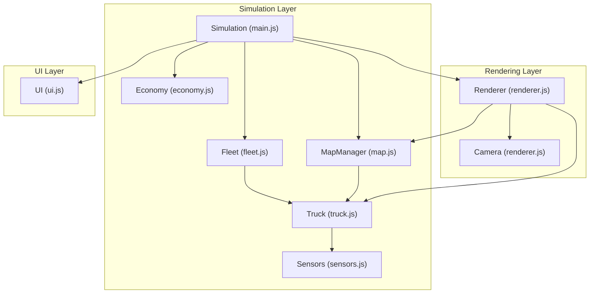
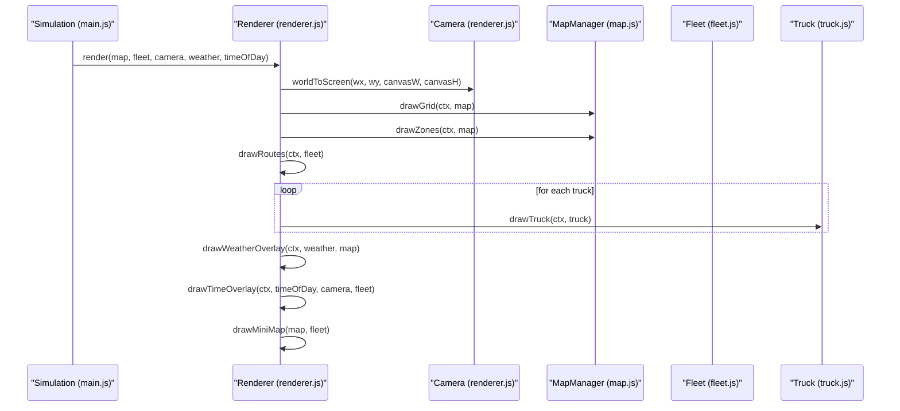
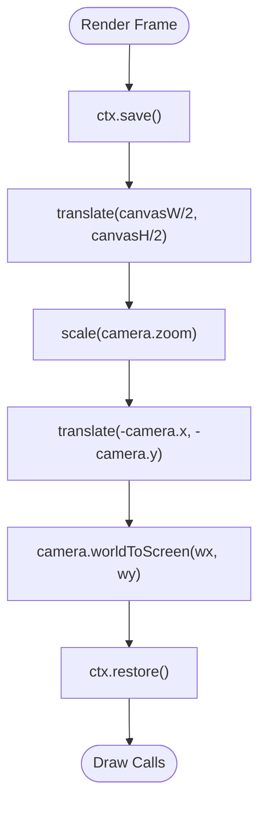
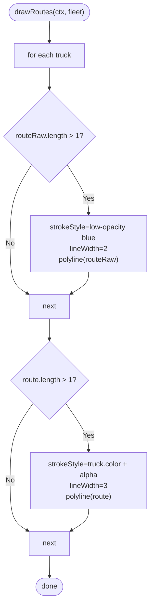
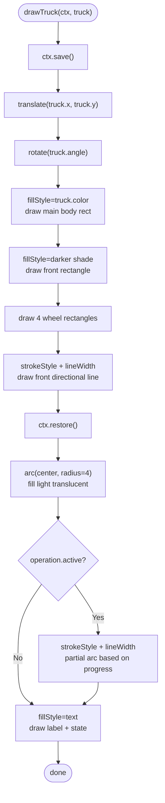
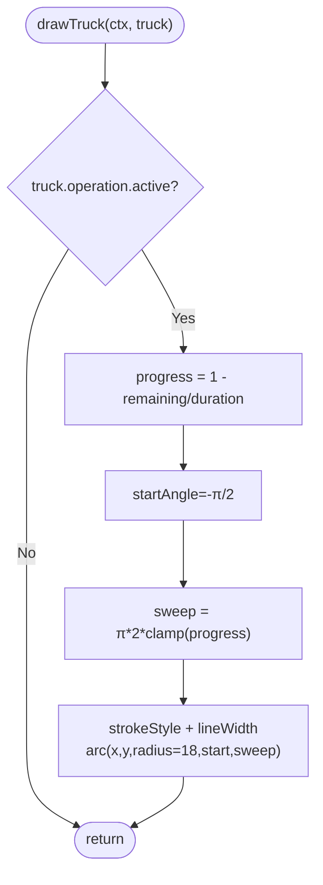
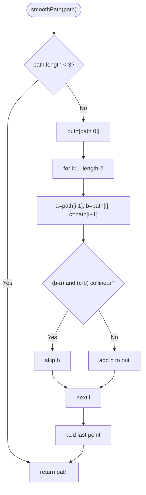
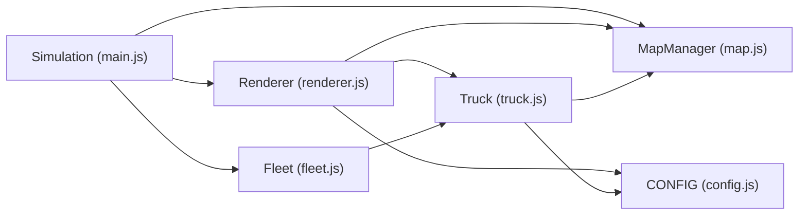

# Vehicle and Route Rendering

<cite>
**Referenced Files in This Document**
- [main.js](file://main.js)
- [config.js](file://config.js)
- [utils.js](file://utils.js)
- [map.js](file://map.js)
- [truck.js](file://truck.js)
- [renderer.js](file://renderer.js)
- [sensors.js](file://sensors.js)
- [ui.js](file://ui.js)
- [fleet.js](file://fleet.js)
- [economy.js](file://economy.js)
</cite>

## Table of Contents
1. [Introduction](#introduction)
2. [Project Structure](#project-structure)
3. [Core Components](#core-components)
4. [Architecture Overview](#architecture-overview)
5. [Detailed Component Analysis](#detailed-component-analysis)
6. [Dependency Analysis](#dependency-analysis)
7. [Performance Considerations](#performance-considerations)
8. [Troubleshooting Guide](#troubleshooting-guide)
9. [Conclusion](#conclusion)

## Introduction
This document explains the vehicle rendering system responsible for drawing individual trucks and their operational routes. It covers:
- The truck drawing function that renders vehicle bodies with perspective shading, wheel details, and directional indicators
- The route visualization system that displays both raw path data and smoothed routes with distinct visual styles per truck
- Operational state indicators including progress rings during loading/unloading operations and color-coded truck identification
- The vehicle labeling system showing truck names and current operational states
- Coordinate transformation for vehicle positioning, rotation handling, and visual effects for operational feedback

## Project Structure
The rendering pipeline integrates simulation updates, map/path planning, and rendering into a cohesive visualization stack. Key modules:
- Simulation orchestrator initializes map, fleet, camera, renderer, and UI
- Map manager generates terrain, zones, and computes routes
- Truck model encapsulates state, movement, operations, and sensors
- Renderer draws grid, zones, routes, trucks, and overlays
- Sensors provide LiDAR and radar data used by trucks and visualization
- UI presents fleet cards and statistics synchronized with the simulation

**Diagram sources**
- [main.js:1-266](file://main.js#L1-L266)
- [map.js:1-438](file://map.js#L1-L438)
- [fleet.js:1-65](file://fleet.js#L1-L65)
- [truck.js:1-406](file://truck.js#L1-L406)
- [sensors.js:1-103](file://sensors.js#L1-L103)
- [renderer.js:1-437](file://renderer.js#L1-L437)
- [ui.js:1-200](file://ui.js#L1-L200)
- [economy.js:1-66](file://economy.js#L1-L66)

**Section sources**
- [main.js:1-266](file://main.js#L1-L266)
- [config.js:1-93](file://config.js#L1-L93)

## Core Components
- Camera: Tracks viewport position and zoom, follows a selected truck
- Renderer: Draws grid, zones, routes, trucks, and overlays; manages coordinate transforms
- MapManager: Generates terrain, zones, computes routes, and smooths paths
- Truck: Encodes state machine, movement, operations, and sensors
- Sensors: Casts LiDAR and radar beams around trucks
- UI: Updates fleet cards and statistics

Key rendering responsibilities:
- Route visualization: raw dashed lines and smoothed solid lines per truck
- Truck body: simplified 2D rectangle with shading and directional indicator
- Operational feedback: progress ring around the truck during operations
- Labels: truck name and current state near the vehicle

**Section sources**
- [renderer.js:24-66](file://renderer.js#L24-L66)
- [renderer.js:153-172](file://renderer.js#L153-L172)
- [renderer.js:174-219](file://renderer.js#L174-L219)
- [truck.js:1-406](file://truck.js#L1-L406)
- [map.js:396-419](file://map.js#L396-L419)

## Architecture Overview
The rendering system operates within a frame loop that updates simulation state and redraws the scene. The renderer applies camera transforms to convert world coordinates to screen space, then draws grid tiles, zones, routes, trucks, and overlays. Route smoothing is computed by the map manager and stored per truck.

**Diagram sources**
- [main.js:209-213](file://main.js#L209-L213)
- [renderer.js:38-66](file://renderer.js#L38-L66)
- [renderer.js:174-219](file://renderer.js#L174-L219)
- [map.js:68-128](file://map.js#L68-L128)
- [map.js:130-151](file://map.js#L130-L151)

## Detailed Component Analysis

### Camera and Coordinate Transformation
The camera maintains world position and zoom, and provides a world-to-screen transform. The renderer applies translation and scaling to align the world origin with the camera’s view.

**Diagram sources**
- [renderer.js:44-58](file://renderer.js#L44-L58)
- [renderer.js:17-21](file://renderer.js#L17-L21)

**Section sources**
- [renderer.js:1-22](file://renderer.js#L1-L22)
- [renderer.js:38-66](file://renderer.js#L38-L66)

### Route Visualization System
Routes are drawn twice per truck:
- Raw path: dashed, low opacity, representing the planner’s path
- Smoothed path: solid, colored by truck, representing the final navigable route

The renderer iterates over trucks and draws both route sets. The map manager computes and smooths paths, returning world-space waypoints.

**Diagram sources**
- [renderer.js:153-172](file://renderer.js#L153-L172)
- [map.js:414-419](file://map.js#L414-L419)

**Section sources**
- [renderer.js:153-172](file://renderer.js#L153-L172)
- [map.js:396-419](file://map.js#L396-L419)

### Truck Drawing Function
The truck drawing routine translates to the truck’s world position, rotates by its angle, and draws:
- Main body: a central rectangle shaded darker on the front
- Wheels: small rectangles for four corners
- Directional indicator: a short horizontal line extending from the front
- Center dot: small translucent circle at the vehicle center
- Progress ring: during operations, a partial arc around the truck indicating completion
- Labels: truck name and current state text near the vehicle

**Diagram sources**
- [renderer.js:174-219](file://renderer.js#L174-L219)
- [renderer.js:221-228](file://renderer.js#L221-L228)

**Section sources**
- [renderer.js:174-219](file://renderer.js#L174-L219)
- [renderer.js:221-228](file://renderer.js#L221-L228)

### Operational State Indicators and Visual Effects
During operations, a progress ring is drawn around the truck:
- The ring’s start angle is fixed at -π/2
- The sweep angle is proportional to normalized operation progress
- The ring uses a bright semi-transparent stroke

The truck’s color is used to style the smoothed route and mini-map dots, enabling quick visual identification.

**Diagram sources**
- [renderer.js:204-211](file://renderer.js#L204-L211)
- [truck.js:224-244](file://truck.js#L224-L244)

**Section sources**
- [renderer.js:204-211](file://renderer.js#L204-L211)
- [truck.js:224-244](file://truck.js#L224-L244)

### Vehicle Labeling System
Labels are rendered as:
- Truck name: positioned to the right and above the vehicle body
- Current state: positioned below the name
- Color: name matches the truck’s color for strong visual association

These labels are updated alongside the truck’s state and color.

**Section sources**
- [renderer.js:213-218](file://renderer.js#L213-L218)
- [truck.js:29-30](file://truck.js#L29-L30)

### Route Smoothing Implementation
The map manager smooths raw A* paths by removing collinear intermediate waypoints, producing a cleaner curve for navigation and visualization.

**Diagram sources**
- [map.js:396-412](file://map.js#L396-L412)

**Section sources**
- [map.js:396-412](file://map.js#L396-L412)

### Mini-Map Route Visualization
The mini-map renders:
- Blocked tiles in red
- Smoothed routes per truck in truck color
- Truck positions as colored circles

This provides a top-down overview of fleet activity and routes.

**Section sources**
- [renderer.js:278-316](file://renderer.js#L278-L316)

## Dependency Analysis
The rendering system depends on:
- Simulation state (map, fleet, camera, weather, time-of-day)
- Truck state (position, angle, route, operation)
- Map path computation (raw and smoothed routes)
- Configuration constants for rendering and physics

**Diagram sources**
- [config.js:1-93](file://config.js#L1-L93)
- [main.js:1-266](file://main.js#L1-L266)
- [renderer.js:1-437](file://renderer.js#L1-L437)
- [map.js:1-438](file://map.js#L1-L438)
- [fleet.js:1-65](file://fleet.js#L1-L65)
- [truck.js:1-406](file://truck.js#L1-L406)

**Section sources**
- [config.js:1-93](file://config.js#L1-L93)
- [main.js:1-266](file://main.js#L1-L266)
- [renderer.js:1-437](file://renderer.js#L1-L437)
- [map.js:1-438](file://map.js#L1-L438)
- [fleet.js:1-65](file://fleet.js#L1-L65)
- [truck.js:1-406](file://truck.js#L1-L406)

## Performance Considerations
- Route rendering: Two polylines per truck; keep route lengths reasonable to minimize draw calls
- Camera transforms: Apply once per frame; avoid unnecessary save/restore cycles
- Weather overlays: Use lightweight canvas operations; limit particle counts for rain/fog
- Mini-map: Scale factor precomputed; draw only necessary segments
- Operation progress ring: Conditional rendering avoids overhead when idle

[No sources needed since this section provides general guidance]

## Troubleshooting Guide
Common rendering issues and checks:
- Trucks not visible:
  - Verify camera position and zoom are valid
  - Confirm world coordinates fall within grid bounds
- Routes missing:
  - Ensure trucks have non-empty route arrays
  - Check that smoothed routes are generated after path planning
- Incorrect colors:
  - Confirm truck color assignment and route color concatenation
- Labels not updating:
  - Ensure UI and renderer update label text with current state and color
- Progress ring not appearing:
  - Verify operation.active flag and progress calculation

**Section sources**
- [renderer.js:153-172](file://renderer.js#L153-L172)
- [renderer.js:174-219](file://renderer.js#L174-L219)
- [truck.js:224-244](file://truck.js#L224-L244)
- [ui.js:122-158](file://ui.js#L122-L158)

## Conclusion
The vehicle rendering system combines precise coordinate transformations, efficient route visualization, and clear operational feedback. Trucks are drawn with simple yet expressive shapes and shading, routes are shown in two complementary styles, and operational states are visually communicated through progress indicators and color coding. Together, these elements provide a clear and informative view of autonomous truck operations across varied terrain and dynamic conditions.