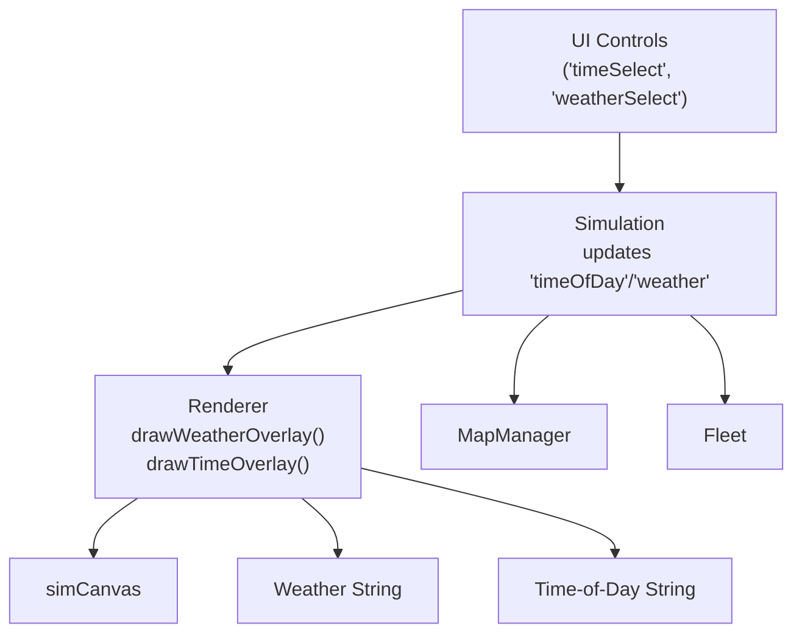
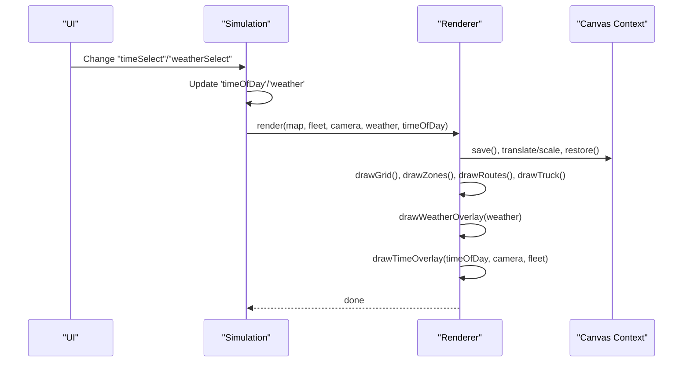
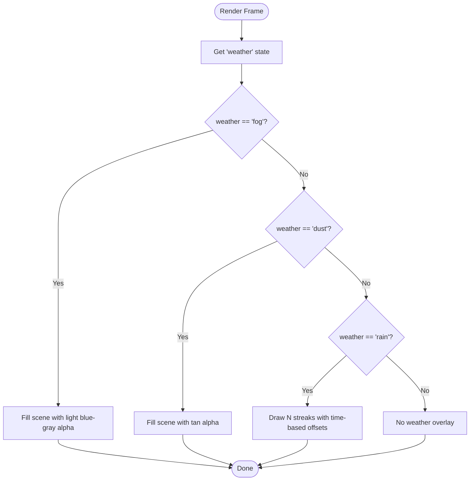
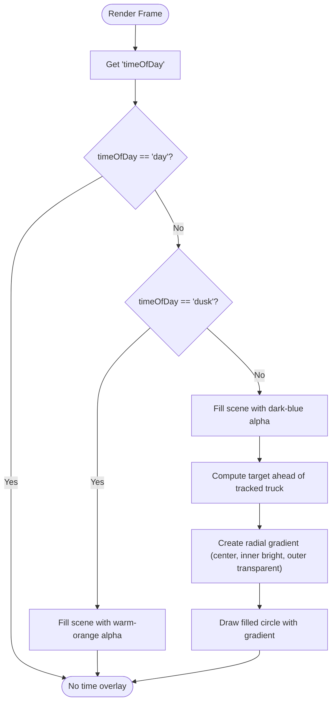
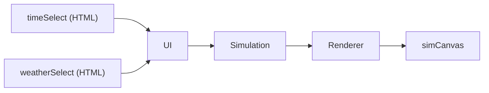

# Weather and Lighting Effects

<cite>
**Referenced Files in This Document**
- [index.html](file://index.html)
- [config.js](file://config.js)
- [utils.js](file://utils.js)
- [main.js](file://main.js)
- [renderer.js](file://renderer.js)
- [map.js](file://map.js)
- [sensors.js](file://sensors.js)
- [ui.js](file://ui.js)
</cite>

## Table of Contents
1. [Introduction](#introduction)
2. [Project Structure](#project-structure)
3. [Core Components](#core-components)
4. [Architecture Overview](#architecture-overview)
5. [Detailed Component Analysis](#detailed-component-analysis)
6. [Dependency Analysis](#dependency-analysis)
7. [Performance Considerations](#performance-considerations)
8. [Troubleshooting Guide](#troubleshooting-guide)
9. [Conclusion](#conclusion)
10. [Appendices](#appendices)

## Introduction
This document explains the special effects rendering system for weather overlays and time-of-day lighting in the autonomous truck simulator. It covers:
- Weather effects: fog density simulation, dust storm visualization, and rain streak rendering with animation
- Time-of-day system: day lighting, dusk ambiance, and night vision with spotlight effects
- Radial gradient implementation for nighttime lighting
- Overlay blending system that composes multiple visual effects efficiently
- Performance optimization techniques for animated effects
- Effect configuration, timing controls, and the mathematical functions used for smooth transitions between atmospheric conditions

## Project Structure
The rendering pipeline integrates a camera, map, fleet, and renderer to draw the scene and overlays. Weather and time-of-day are passed into the renderer and drawn as layered overlays.

**Diagram sources**
- [index.html:209-219](file://index.html#L209-L219)
- [main.js:254-259](file://main.js#L254-L259)
- [renderer.js:38-66](file://renderer.js#L38-L66)

**Section sources**
- [index.html:209-219](file://index.html#L209-L219)
- [main.js:254-259](file://main.js#L254-L259)
- [renderer.js:38-66](file://renderer.js#L38-L66)

## Core Components
- Simulation: orchestrates updates, renders, and binds UI events to change weather and time-of-day.
- Renderer: draws grid, routes, trucks, and overlays for weather and time-of-day.
- Camera: follows a selected truck and translates world coordinates to screen space.
- MapManager: generates terrain and zones; used by sensors and UI.
- Sensors: computes visibility range adjustments and noise for dust storms.

Key effect rendering functions:
- Weather overlay: [renderer.js:230-252](file://renderer.js#L230-L252)
- Time overlay: [renderer.js:254-276](file://renderer.js#L254-L276)

**Section sources**
- [main.js:1-266](file://main.js#L1-L266)
- [renderer.js:24-66](file://renderer.js#L24-L66)
- [sensors.js:1-103](file://sensors.js#L1-L103)

## Architecture Overview
The renderer composes multiple overlays on top of the base map and fleet drawing. Weather and time-of-day overlays are drawn last so they blend atop the scene.

**Diagram sources**
- [index.html:209-219](file://index.html#L209-L219)
- [main.js:209-213](file://main.js#L209-L213)
- [renderer.js:38-66](file://renderer.js#L38-L66)

## Detailed Component Analysis

### Weather Effects Rendering
The weather overlay is drawn after the base scene and uses simple fills or strokes to simulate atmospheric conditions. The overlay is cleared each frame and re-drawn based on the current weather setting.

- Fog: fills the entire scene with a light grayish-blue translucent color.
- Dust storm: fills the scene with a warm, earth-toned translucent color.
- Rain: draws animated streak lines moving diagonally across the scene using elapsed time to drive motion.

Animation technique:
- Uses elapsed time to animate rain streaks by advancing start positions along two axes per frame.

Performance note:
- Rain uses a fixed loop count; consider limiting to visible bounds for larger canvases.

**Diagram sources**
- [renderer.js:230-252](file://renderer.js#L230-L252)

**Section sources**
- [renderer.js:230-252](file://renderer.js#L230-L252)

### Time-of-Day Lighting
The time-of-day overlay adjusts the scene’s mood and visibility:
- Day: no overlay.
- Dusk: a warm orange overlay with moderate alpha.
- Night: a deep blue overlay plus a radial spotlight centered on the camera’s tracked truck.

Spotlight implementation:
- Computes a target position ahead of the tracked truck.
- Creates a radial gradient from a bright center to transparent outer radius.
- Draws a circle filled with the gradient to simulate a headlamp-like effect.

**Diagram sources**
- [renderer.js:254-276](file://renderer.js#L254-L276)

**Section sources**
- [renderer.js:254-276](file://renderer.js#L254-L276)

### Overlay Blending System
The renderer draws overlays after the base scene and before UI elements. The composition order ensures:
- Base scene (grid, zones, routes, trucks)
- Weather overlay
- Time-of-day overlay

Blending modes:
- Weather overlays use solid fills with alpha channels.
- Time overlay uses a solid fill for day/dusk and a radial gradient fill for night.

This approach avoids heavy blending operations because each overlay is drawn as a single shape or set of lines, minimizing per-pixel computations.

**Section sources**
- [renderer.js:38-66](file://renderer.js#L38-L66)

### Sensor Range Effects and Weather Interaction
While not part of the renderer’s overlay, sensors adjust detection range based on weather:
- Visibility factor for fog and dust reduces sensor range.
- Dust introduces random noise to detected distances.

These adjustments influence AI behavior and perception but do not alter the visual overlay itself.

**Section sources**
- [sensors.js:2-7](file://sensors.js#L2-L7)
- [sensors.js:42-45](file://sensors.js#L42-L45)

### Mathematical Functions Used
- Trigonometric functions: sine and cosine for directional vectors and gradient radii.
- Linear interpolation: used by camera following and other systems.
- Clamping: constrains values to safe ranges for color and distance calculations.

**Section sources**
- [renderer.js:267-275](file://renderer.js#L267-L275)
- [utils.js:75-82](file://utils.js#L75-L82)

## Dependency Analysis
Weather and time-of-day are controlled via UI selections and propagated to the simulation, which passes them to the renderer.

**Diagram sources**
- [index.html:209-219](file://index.html#L209-L219)
- [ui.js:30-62](file://ui.js#L30-L62)
- [main.js:254-259](file://main.js#L254-L259)

**Section sources**
- [index.html:209-219](file://index.html#L209-L219)
- [ui.js:30-62](file://ui.js#L30-L62)
- [main.js:254-259](file://main.js#L254-L259)

## Performance Considerations
- Animated rain: The renderer draws a fixed number of streaks each frame. On large canvases, consider culling streaks outside the visible area to reduce draw calls.
- Gradient spotlight: Creating gradients and drawing a circle is efficient; ensure the circle radius remains reasonable to avoid excessive pixel writes.
- Overlay order: Drawing overlays after base scene avoids expensive per-pixel blending operations.
- Sensor range factors: Reducing sensor range in poor weather prevents unnecessary computation downstream.

[No sources needed since this section provides general guidance]

## Troubleshooting Guide
- Weather overlay not visible:
  - Verify the weather selection is applied and the renderer receives the correct value.
  - Confirm the overlay is drawn after base scene elements.
- Time overlay incorrect:
  - Ensure the time-of-day selection is bound to the simulation state.
  - Check that the tracked truck exists when computing the spotlight target.
- Spotlight appears off-center:
  - Validate the computed target position ahead of the tracked truck.
  - Confirm camera translation and scaling are applied before drawing overlays.

**Section sources**
- [main.js:254-259](file://main.js#L254-L259)
- [renderer.js:265-275](file://renderer.js#L265-L275)

## Conclusion
The weather and lighting effects system uses straightforward, efficient rendering techniques:
- Weather overlays are drawn as simple fills or animated lines.
- Time-of-day overlays adjust tone and add a spotlight for night.
- The overlay blending system composes multiple effects without heavy per-pixel operations.
- Sensor range adjustments complement the visual effects by influencing AI perception.

[No sources needed since this section summarizes without analyzing specific files]

## Appendices

### Effect Configuration and Timing Controls
- Weather options: clear, fog, rain, dust
- Time-of-day options: day, dusk, night
- UI bindings update simulation state, which is passed to the renderer each frame.

**Section sources**
- [index.html:209-219](file://index.html#L209-L219)
- [main.js:254-259](file://main.js#L254-L259)

### Mathematical Functions Reference
- Trigonometry: sine, cosine for directional and gradient computations
- Interpolation: linear interpolation for camera following
- Clamping: bounds for color and distance values

**Section sources**
- [renderer.js:267-275](file://renderer.js#L267-L275)
- [utils.js:75-82](file://utils.js#L75-L82)