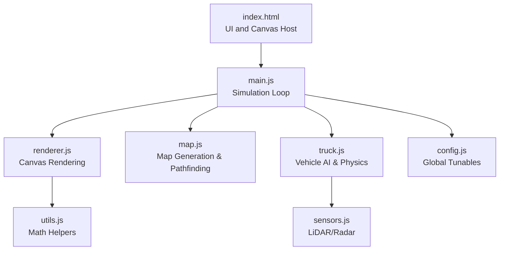
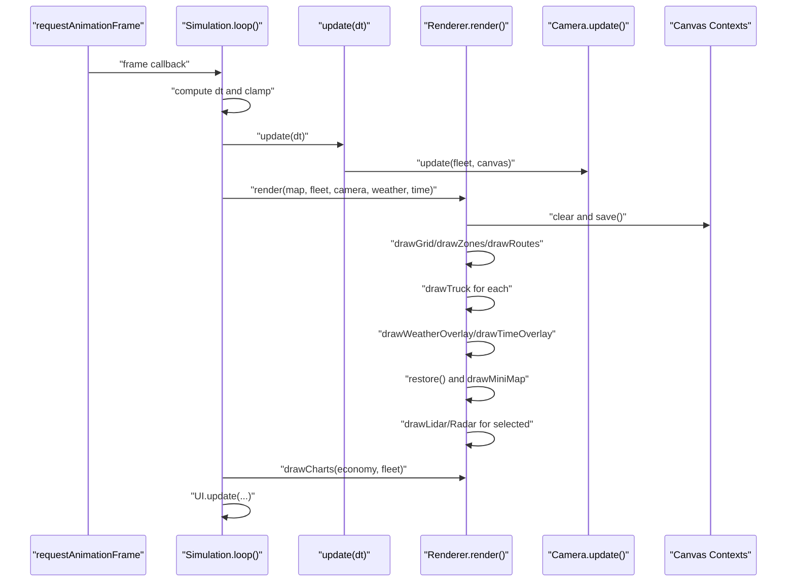
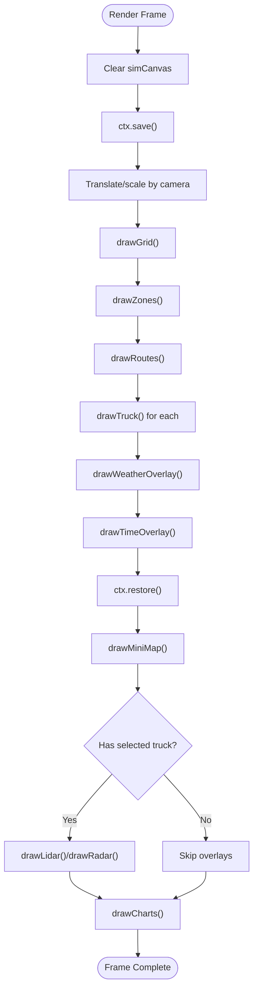
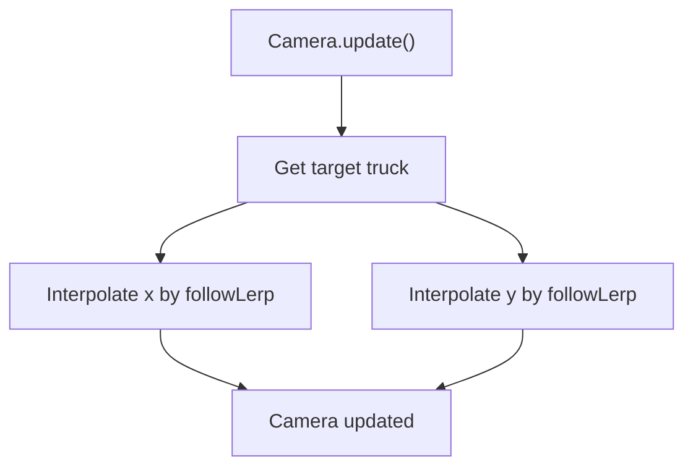
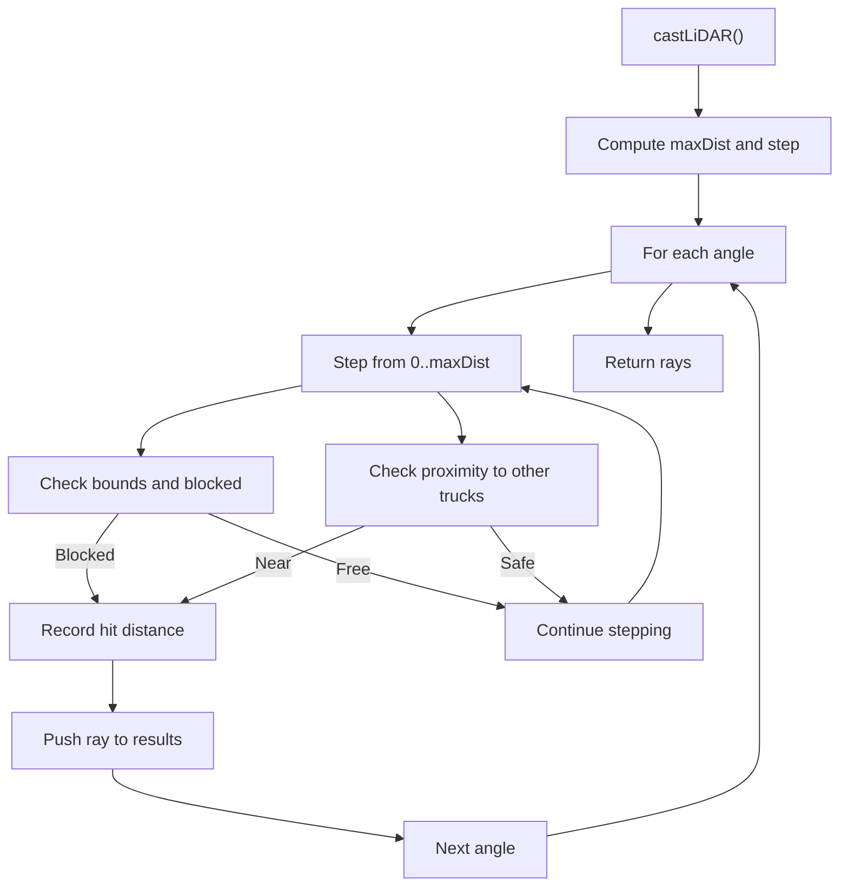
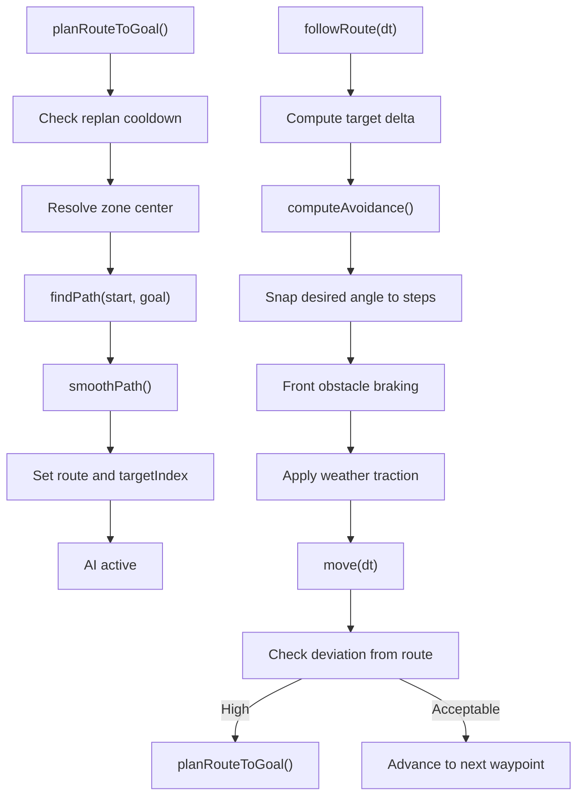
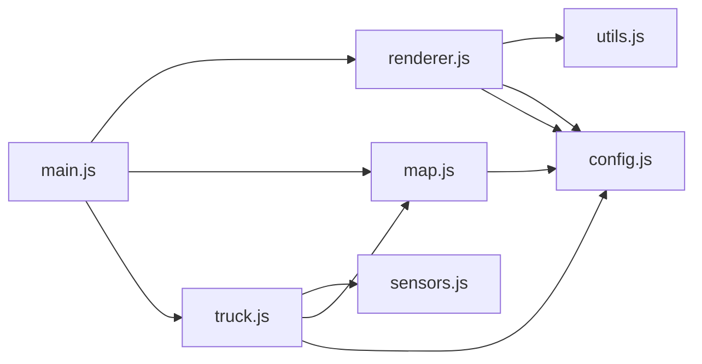

# Performance Optimization

<cite>
**Referenced Files in This Document**
- [index.html](file://index.html)
- [config.js](file://config.js)
- [main.js](file://main.js)
- [renderer.js](file://renderer.js)
- [utils.js](file://utils.js)
- [truck.js](file://truck.js)
- [map.js](file://map.js)
- [sensors.js](file://sensors.js)
</cite>

## Table of Contents
1. [Introduction](#introduction)
2. [Project Structure](#project-structure)
3. [Core Components](#core-components)
4. [Architecture Overview](#architecture-overview)
5. [Detailed Component Analysis](#detailed-component-analysis)
6. [Dependency Analysis](#dependency-analysis)
7. [Performance Considerations](#performance-considerations)
8. [Troubleshooting Guide](#troubleshooting-guide)
9. [Conclusion](#conclusion)

## Introduction
This document analyzes the performance optimization strategies and techniques implemented in the visualization system. It focuses on rendering optimization approaches such as canvas context reuse, efficient drawing patterns, selective redrawing, and math optimizations for smooth animations. It also covers memory management, object pooling strategies, and profiling/bottleneck identification methods, along with guidelines for maintaining 60fps performance across varying hardware configurations.

## Project Structure
The simulation is structured around a main loop that updates game state and renders frames. Rendering is handled by a dedicated Renderer class that draws the main simulation canvas, minimap, LiDAR/Radar overlays, and charts. Utility functions provide mathematical helpers and sensor computations. Configuration centralizes tunable parameters affecting performance and gameplay balance.

**Diagram sources**
- [index.html:129-243](file://index.html#L129-L243)
- [main.js:1-266](file://main.js#L1-L266)
- [renderer.js:24-66](file://renderer.js#L24-L66)
- [map.js:1-438](file://map.js#L1-L438)
- [truck.js:1-406](file://truck.js#L1-L406)
- [sensors.js:1-103](file://sensors.js#L1-L103)
- [utils.js:1-102](file://utils.js#L1-L102)
- [config.js:1-93](file://config.js#L1-L93)

**Section sources**
- [index.html:129-243](file://index.html#L129-L243)
- [main.js:1-266](file://main.js#L1-L266)
- [renderer.js:24-66](file://renderer.js#L24-L66)
- [map.js:1-438](file://map.js#L1-L438)
- [truck.js:1-406](file://truck.js#L1-L406)
- [sensors.js:1-103](file://sensors.js#L1-L103)
- [utils.js:1-102](file://utils.js#L1-L102)
- [config.js:1-93](file://config.js#L1-L93)

## Core Components
- Simulation loop and timing: Uses requestAnimationFrame with delta-time clamping and configurable time scaling to maintain stable frame rates and smooth motion.
- Renderer: Centralizes canvas drawing, camera transforms, and overlay rendering. Reuses contexts and minimizes redundant state changes.
- Camera: Smoothly follows a selected vehicle using interpolation to reduce jitter.
- Sensors: Efficient raycasting with step-based traversal and early exits to limit computation.
- Map and pathfinding: A* pathfinding with diagonal movement costs and path smoothing to reduce unnecessary turns.
- Utilities: Lightweight math helpers (clamp, lerp, angleDiff) and vector operations to support physics and rendering.

**Section sources**
- [main.js:215-223](file://main.js#L215-L223)
- [renderer.js:24-66](file://renderer.js#L24-L66)
- [renderer.js:9-15](file://renderer.js#L9-L15)
- [sensors.js:9-49](file://sensors.js#L9-L49)
- [map.js:332-385](file://map.js#L332-L385)
- [utils.js:75-82](file://utils.js#L75-L82)

## Architecture Overview
The rendering pipeline is split into two primary passes: the main simulation canvas and auxiliary canvases for sensor displays and charts. The main loop computes deltas, updates state, and triggers rendering. Rendering applies camera transforms and draws grid, zones, routes, vehicles, and overlays. Auxiliary canvases are drawn independently to avoid interfering with the main transform stack.

**Diagram sources**
- [main.js:215-223](file://main.js#L215-L223)
- [main.js:67-80](file://main.js#L67-L80)
- [renderer.js:38-66](file://renderer.js#L38-L66)
- [renderer.js:278-316](file://renderer.js#L278-L316)
- [renderer.js:318-388](file://renderer.js#L318-L388)
- [renderer.js:390-435](file://renderer.js#L390-L435)

## Detailed Component Analysis

### Rendering Optimization Strategies
- Canvas context reuse and minimal state changes:
  - Renderer caches canvas contexts and clears only the necessary areas before drawing.
  - Applies camera transforms once per frame using save/restore to avoid repeated matrix operations.
  - Clears auxiliary canvases before drawing overlays to prevent artifacts.
- Efficient drawing patterns:
  - Grid and zone rendering use simple fills and strokes with precomputed styles.
  - Route rendering batches path segments into a single path to reduce state switches.
  - Vehicle rendering uses local transforms and avoids per-pixel operations.
- Selective redrawing:
  - Only draws overlays (LiDAR/Radar) for the currently selected truck.
  - Mini-map and charts are redrawn only when needed (charts depend on economy data).
- Mathematical optimizations:
  - Interpolation via lerp for camera follow and smoothness.
  - Angle normalization using angleDiff to keep rotations stable.
  - Clamp to constrain values and prevent overflow.

**Diagram sources**
- [renderer.js:38-66](file://renderer.js#L38-L66)
- [renderer.js:278-316](file://renderer.js#L278-L316)
- [renderer.js:318-388](file://renderer.js#L318-L388)
- [renderer.js:390-435](file://renderer.js#L390-L435)

**Section sources**
- [renderer.js:24-66](file://renderer.js#L24-L66)
- [renderer.js:68-128](file://renderer.js#L68-L128)
- [renderer.js:130-172](file://renderer.js#L130-L172)
- [renderer.js:174-219](file://renderer.js#L174-L219)
- [renderer.js:278-316](file://renderer.js#L278-L316)
- [renderer.js:318-388](file://renderer.js#L318-L388)
- [renderer.js:390-435](file://renderer.js#L390-L435)

### Camera and Interpolation
- Smooth camera following:
  - Uses lerp to interpolate camera position toward the target vehicle’s position.
  - Follow index cycles through fleet to switch targets.
- World-to-screen conversion:
  - Applies inverse camera transform to convert world coordinates to screen space for UI interactions.

**Diagram sources**
- [renderer.js:9-15](file://renderer.js#L9-L15)
- [utils.js:76](file://utils.js#L76)

**Section sources**
- [renderer.js:9-15](file://renderer.js#L9-L15)
- [renderer.js:17-21](file://renderer.js#L17-L21)
- [main.js:236-252](file://main.js#L236-L252)

### Sensor Raycasting and Geometric Calculations
- Efficient LiDAR/Radar:
  - Casts rays at discrete angles with step-based traversal.
  - Early exits when encountering obstacles or other trucks.
  - Weather-dependent range factors and optional noise for dust.
- Front obstacle detection:
  - Computes minimum distance within a front sector for braking logic.
- Vector and angle utilities:
  - Provides angleDiff for normalized angular differences and clamp for safe bounds.

**Diagram sources**
- [sensors.js:9-49](file://sensors.js#L9-L49)
- [sensors.js:51-79](file://sensors.js#L51-L79)
- [sensors.js:81-101](file://sensors.js#L81-L101)
- [utils.js:75-82](file://utils.js#L75-L82)

**Section sources**
- [sensors.js:1-103](file://sensors.js#L1-L103)
- [utils.js:75-82](file://utils.js#L75-L82)

### Pathfinding and Route Following
- A* pathfinding:
  - Heuristic uses Euclidean distance; diagonal moves incur higher cost.
  - Extra blocked tiles from other trucks are considered to avoid collisions.
- Path smoothing:
  - Removes collinear waypoints to reduce zigzags.
- Route following:
  - Snaps desired angle to discrete steps and adjusts speed based on distance to target and front obstacles.
  - Uses traction modifiers for weather conditions.

**Diagram sources**
- [truck.js:246-266](file://truck.js#L246-L266)
- [map.js:332-385](file://map.js#L332-L385)
- [map.js:396-412](file://map.js#L396-L412)
- [truck.js:268-318](file://truck.js#L268-L318)

**Section sources**
- [map.js:21-23](file://map.js#L21-L23)
- [map.js:332-385](file://map.js#L332-L385)
- [map.js:396-412](file://map.js#L396-L412)
- [truck.js:246-318](file://truck.js#L246-L318)

### Memory Management and Garbage Collection Prevention
- Minimize allocations during hot loops:
  - Reuse arrays and objects where possible; avoid creating temporary objects in tight loops.
  - Use preallocated buffers for sensor rays and radar points when feasible.
- Prefer primitive math operations:
  - Use clamp and lerp to avoid branching overhead in tight loops.
- Avoid frequent DOM updates:
  - Charts and UI updates are batched and only triggered when data changes.

[No sources needed since this section provides general guidance]

### Profiling and Bottleneck Identification
- Frame timing:
  - Compute dt from performance.now() and clamp to a maximum to stabilize motion.
- Time scaling:
  - Allow 0x, 1x, 2x, 4x playback to diagnose performance under load.
- Sensor overlays:
  - Toggle LiDAR/Radar to isolate rendering cost of auxiliary canvases.
- Canvas sizing:
  - Adjust canvas resolution to balance quality and performance.

**Section sources**
- [main.js:215-223](file://main.js#L215-L223)
- [main.js:86-88](file://main.js#L86-L88)
- [index.html:129-141](file://index.html#L129-L141)

## Dependency Analysis
The system exhibits clear layering:
- main.js orchestrates simulation state and rendering.
- renderer.js depends on config and utils for constants and math.
- truck.js depends on sensors and map for perception and navigation.
- map.js encapsulates geometry and pathfinding.
- sensors.js encapsulates raycasting logic.
- utils.js provides shared math utilities.

**Diagram sources**
- [main.js:1-45](file://main.js#L1-L45)
- [renderer.js:24-36](file://renderer.js#L24-L36)
- [truck.js:1-31](file://truck.js#L1-L31)
- [map.js:1-7](file://map.js#L1-L7)
- [sensors.js:1-1](file://sensors.js#L1-L1)
- [utils.js:1-102](file://utils.js#L1-L102)
- [config.js:1-93](file://config.js#L1-L93)

**Section sources**
- [main.js:1-45](file://main.js#L1-L45)
- [renderer.js:24-36](file://renderer.js#L24-L36)
- [truck.js:1-31](file://truck.js#L1-L31)
- [map.js:1-7](file://map.js#L1-L7)
- [sensors.js:1-1](file://sensors.js#L1-L1)
- [utils.js:1-102](file://utils.js#L1-L102)
- [config.js:1-93](file://config.js#L1-L93)

## Performance Considerations
- Maintaining 60fps:
  - Clamp dt to a maximum to prevent spikes from causing stutter.
  - Use interpolation for camera and vehicle motion to smooth across frames.
  - Limit expensive operations to auxiliary canvases and only when needed.
- Hardware adaptation:
  - Provide adjustable time scaling and camera zoom to adapt to lower-end devices.
  - Reduce sensor ray counts or increase step size in config for constrained systems.
- Rendering efficiency:
  - Batch path drawing and minimize state changes.
  - Use save/restore to avoid repeated matrix multiplications.
- Physics and AI:
  - Use small fixed steps for movement and collision resolution.
  - Apply traction modifiers per weather to avoid unrealistic acceleration.

[No sources needed since this section provides general guidance]

## Troubleshooting Guide
- Jittery camera:
  - Verify followLerp and zoom settings in config.
  - Ensure fleet is initialized before camera update.
- Slow rendering:
  - Disable LiDAR/Radar overlays temporarily to isolate cost.
  - Reduce GRID_W/GRID_H or TILE size in config for smaller maps.
- Sensor inaccuracies:
  - Increase lidarRays or decrease lidarStep for higher fidelity.
  - Check weather range factors affecting ray length.
- Stuttering under load:
  - Use timeScale 0x/1x to observe baseline performance.
  - Lower TRUCK_COUNT or disable charts to reduce workload.

**Section sources**
- [config.js:81-86](file://config.js#L81-L86)
- [config.js:39-49](file://config.js#L39-L49)
- [main.js:86-88](file://main.js#L86-L88)
- [renderer.js:318-388](file://renderer.js#L318-L388)

## Conclusion
The visualization system employs targeted optimization strategies: canvas context reuse, efficient drawing patterns, selective redrawing, and robust interpolation for smooth motion. Sensor computations are optimized with step-based traversal and early exits. Pathfinding and route-following leverage A* with smoothing and traction-aware dynamics. Configuration-driven tunables enable performance tuning across diverse hardware. Together, these techniques help sustain stable frame rates and responsive interactions.