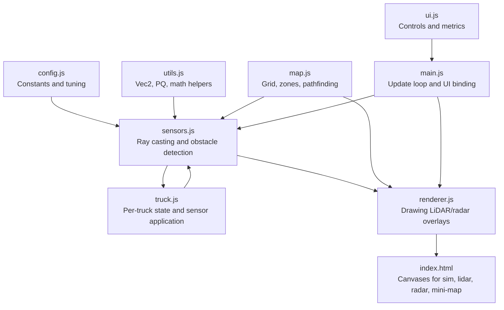
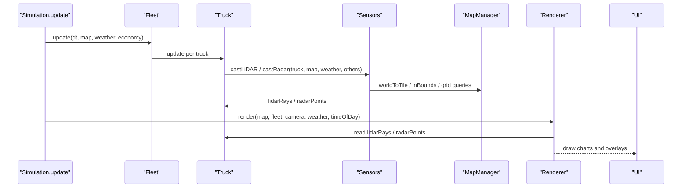
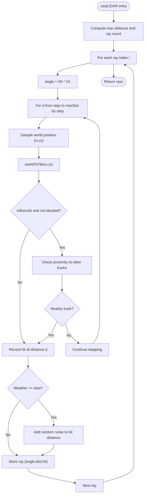
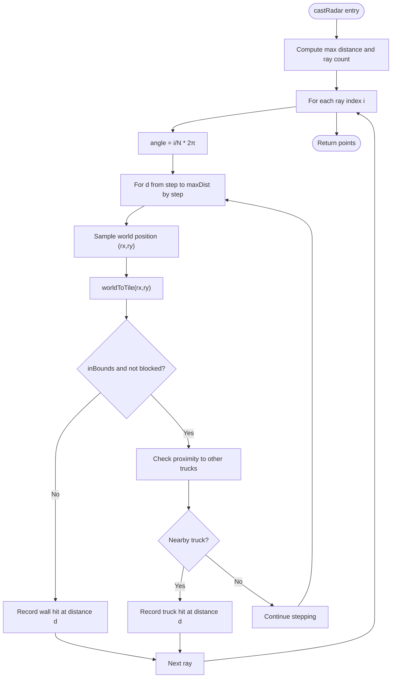
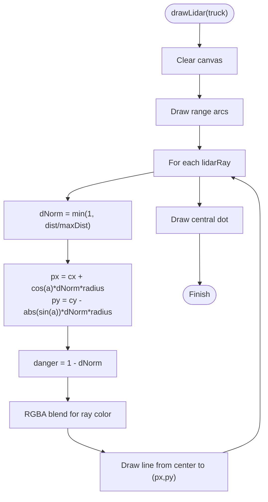
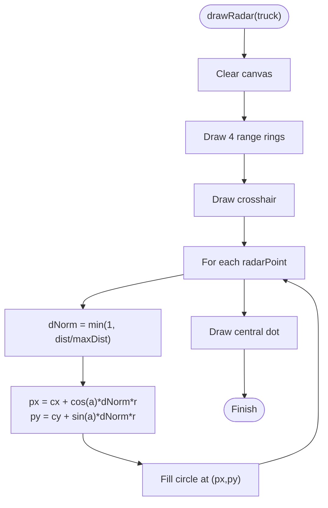
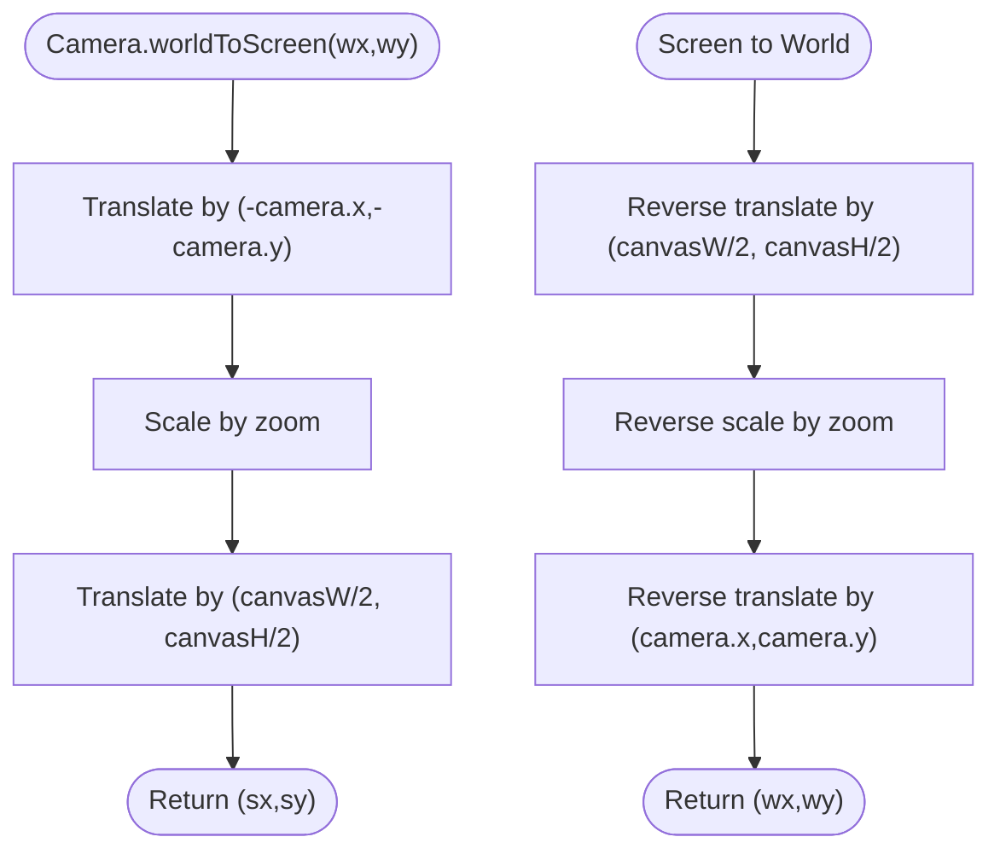
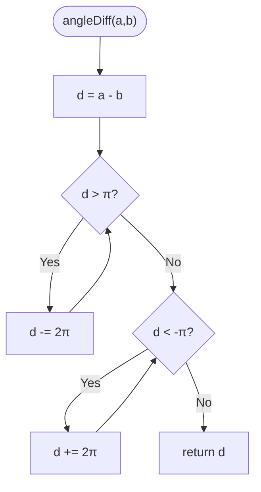
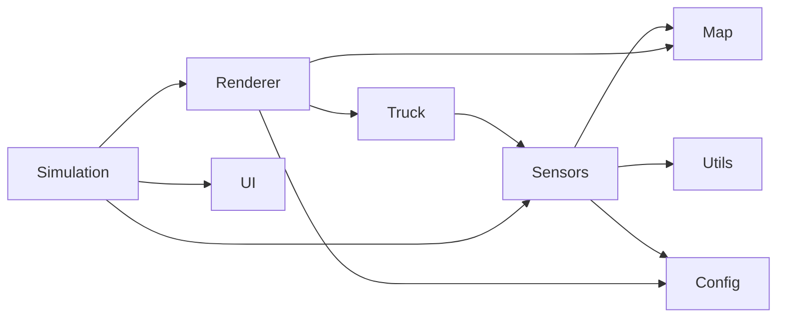

# Sensor Data Visualization

<cite>
**Referenced Files in This Document**
- [index.html](file://index.html)
- [config.js](file://config.js)
- [main.js](file://main.js)
- [utils.js](file://utils.js)
- [map.js](file://map.js)
- [sensors.js](file://sensors.js)
- [truck.js](file://truck.js)
- [renderer.js](file://renderer.js)
- [ui.js](file://ui.js)
</cite>

## Table of Contents
1. [Introduction](#introduction)
2. [Project Structure](#project-structure)
3. [Core Components](#core-components)
4. [Architecture Overview](#architecture-overview)
5. [Detailed Component Analysis](#detailed-component-analysis)
6. [Dependency Analysis](#dependency-analysis)
7. [Performance Considerations](#performance-considerations)
8. [Troubleshooting Guide](#troubleshooting-guide)
9. [Conclusion](#conclusion)

## Introduction
This document explains the sensor data visualization system that renders real-time LiDAR and radar information for autonomous trucks. It covers:
- How 360-degree scanning patterns are generated
- Distance calculation and rendering for obstacles
- Danger level indicators derived from sensor readings
- Proximity mapping and point cloud display for radar
- Range rings and coordinate transformations from world to screen coordinates
- Color coding for distance and threat assessment
- Real-time updates and mathematical foundations such as ray casting, angle normalization, and visual representation of sensor fields

## Project Structure
The visualization system spans several modules:
- Configuration defines constants for sensor behavior and rendering
- Simulation orchestrates update/render loops and UI
- Sensors computes ray-cast results for LiDAR and radar
- Truck stores per-truck sensor data and applies sensor logic
- Renderer draws the main scene and dedicated sensor canvases
- Map provides spatial utilities and grid-based collision checks
- Utilities supply math helpers (angles, interpolation, noise)
- UI presents controls and statistics

**Diagram sources**
- [config.js:1-93](file://config.js#L1-L93)
- [sensors.js:1-103](file://sensors.js#L1-L103)
- [map.js:1-438](file://map.js#L1-L438)
- [truck.js:1-406](file://truck.js#L1-L406)
- [renderer.js:1-437](file://renderer.js#L1-L437)
- [index.html:129-238](file://index.html#L129-L238)
- [main.js:1-266](file://main.js#L1-L266)
- [utils.js:1-102](file://utils.js#L1-L102)
- [ui.js:1-200](file://ui.js#L1-L200)

**Section sources**
- [index.html:129-238](file://index.html#L129-L238)
- [config.js:1-93](file://config.js#L1-L93)
- [main.js:1-266](file://main.js#L1-L266)

## Core Components
- Sensor computation:
  - LiDAR: casts N rays around the vehicle at fixed angular spacing, stepping inward until hitting an obstacle or reaching maximum distance
  - Radar: collects point samples along each ray at regular steps, marking wall and truck hits
- Rendering:
  - LiDAR overlay: draws arcs and angled rays with color indicating danger proximity
  - Radar overlay: draws concentric range rings and point clouds for detected obstacles
- Coordinate transforms:
  - World-to-screen transform for main map
  - Screen-to-world transform for UI interactions
- Angle normalization and utilities:
  - Ensures angles remain within [-π, π] for consistent comparisons
  - Interpolation and clamping for smooth visuals and safe bounds

**Section sources**
- [sensors.js:9-103](file://sensors.js#L9-L103)
- [renderer.js:318-388](file://renderer.js#L318-L388)
- [utils.js:75-82](file://utils.js#L75-L82)
- [map.js:13-19](file://map.js#L13-L19)

## Architecture Overview
The system follows a pipeline:
- Simulation.update drives per-frame updates
- Truck.applySensors triggers Sensors routines
- Sensors returns structured data (rays/points) with distances and hit types
- Renderer reads per-truck data and draws overlays onto dedicated canvases
- UI reacts to user inputs and displays metrics

**Diagram sources**
- [main.js:67-80](file://main.js#L67-L80)
- [truck.js:320-324](file://truck.js#L320-L324)
- [sensors.js:9-79](file://sensors.js#L9-L79)
- [map.js:9-19](file://map.js#L9-L19)
- [renderer.js:38-66](file://renderer.js#L38-L66)
- [ui.js:122-158](file://ui.js#L122-L158)

## Detailed Component Analysis

### Sensor Computation: LiDAR
- Scanning pattern:
  - N rays evenly distributed over 2π radians
  - Angular step computed from total rays
- Ray casting:
  - Steps inward from small step increments until:
    - Out-of-bounds or blocked tile hit
    - Other truck within a proximity threshold
  - Optional dust noise adds random offset to measured distance
- Output:
  - Array of rays with angle, normalized distance, and hit flag
- Danger assessment:
  - Normalized distance determines danger intensity
  - Color blends from green to red based on proximity

**Diagram sources**
- [sensors.js:9-49](file://sensors.js#L9-L49)
- [map.js:13-15](file://map.js#L13-L15)

**Section sources**
- [sensors.js:9-49](file://sensors.js#L9-L49)
- [map.js:9-19](file://map.js#L9-L19)

### Sensor Computation: Radar
- Scanning pattern:
  - Same angular distribution as LiDAR
- Point sampling:
  - Steps along each ray at fixed intervals
  - Records first hit encountered as either wall or truck
- Output:
  - Array of points with angle, distance, screen coordinates, and type
- Visualization:
  - Range rings drawn as concentric circles
  - Detected obstacles shown as filled dots sized by distance

**Diagram sources**
- [sensors.js:51-79](file://sensors.js#L51-L79)
- [map.js:13-15](file://map.js#L13-L15)

**Section sources**
- [sensors.js:51-79](file://sensors.js#L51-L79)

### Rendering: LiDAR Overlay
- Coordinate system:
  - Centered at bottom of canvas with radius-based arcs
  - Rays drawn from center outward at computed angles
- Distance normalization:
  - Normalized distance mapped to radius proportionally
- Danger coloring:
  - Danger increases with proximity; color transitions from green to red
- Visual elements:
  - Background arcs for range bands
  - Central dot representing the vehicle

**Diagram sources**
- [renderer.js:318-350](file://renderer.js#L318-L350)

**Section sources**
- [renderer.js:318-350](file://renderer.js#L318-L350)

### Rendering: Radar Overlay
- Coordinate system:
  - Centered canvas with concentric range rings
- Distance normalization:
  - Normalized distance scaled to ring radius
- Point cloud:
  - Each detected point plotted with polar conversion
- Visual elements:
  - Four range rings
  - Crosshair lines
  - Central dot

**Diagram sources**
- [renderer.js:352-388](file://renderer.js#L352-L388)

**Section sources**
- [renderer.js:352-388](file://renderer.js#L352-L388)

### Coordinate Transformations and Camera
- World-to-screen:
  - Applies camera translation and zoom to convert world coordinates to screen pixels
- Screen-to-world:
  - Used for UI interactions (e.g., clicking a truck)
- Camera follows the selected truck with smoothing

**Diagram sources**
- [renderer.js:17-21](file://renderer.js#L17-L21)
- [main.js:244-246](file://main.js#L244-L246)

**Section sources**
- [renderer.js:17-21](file://renderer.js#L17-L21)
- [main.js:244-246](file://main.js#L244-L246)

### Angle Normalization and Utilities
- Angle difference:
  - Computes minimal signed difference between two angles, normalized to [-π, π]
- Clamping and interpolation:
  - Ensures safe bounds and smooth transitions
- Vector utilities:
  - Provides vector operations used elsewhere in the system

**Diagram sources**
- [utils.js:77-82](file://utils.js#L77-L82)

**Section sources**
- [utils.js:75-82](file://utils.js#L75-L82)

### Mathematical Foundations
- Ray casting:
  - Angular sampling over 2π with fixed step size
  - Distance stepping until collision or boundary
- Angle normalization:
  - Keeps angular differences canonical for reliable sector checks
- Distance normalization:
  - Scales sensor distances to [0,1] for consistent visual mapping
- Visual representation:
  - Danger level derived from inverse of normalized distance
  - Range rings and arcs provide intuitive depth cues

**Section sources**
- [sensors.js:9-79](file://sensors.js#L9-L79)
- [utils.js:75-82](file://utils.js#L75-L82)
- [renderer.js:318-388](file://renderer.js#L318-L388)

### Real-Time Data Updates
- Per-truck sensor application:
  - Sensors are recomputed each frame and stored on the truck
- AI-driven behavior:
  - Front obstacle distance influences braking and steering
- Manual mode:
  - User input overrides AI movement; sensors still update for visualization

**Section sources**
- [truck.js:320-324](file://truck.js#L320-L324)
- [truck.js:285-289](file://truck.js#L285-L289)
- [main.js:114-146](file://main.js#L114-L146)

## Dependency Analysis
- Sensors depends on:
  - MapManager for spatial queries and grid checks
  - CONFIG for tunable parameters
  - Utils for angle normalization and math helpers
- Renderer depends on:
  - Truck’s stored sensor data
  - CONFIG for canvas sizes and scaling
  - MapManager for drawing overlays
- Simulation ties everything together:
  - Drives update/render cycles
  - Manages UI and camera selection

**Diagram sources**
- [sensors.js:1-103](file://sensors.js#L1-L103)
- [map.js:1-438](file://map.js#L1-L438)
- [utils.js:1-102](file://utils.js#L1-L102)
- [config.js:1-93](file://config.js#L1-L93)
- [truck.js:1-406](file://truck.js#L1-L406)
- [renderer.js:1-437](file://renderer.js#L1-L437)
- [main.js:1-266](file://main.js#L1-L266)

**Section sources**
- [sensors.js:1-103](file://sensors.js#L1-L103)
- [renderer.js:1-437](file://renderer.js#L1-L437)
- [main.js:1-266](file://main.js#L1-L266)

## Performance Considerations
- Ray counts and step sizes:
  - CONFIG.sensors.lidarRays controls angular resolution; higher values increase CPU cost
  - CONFIG.sensors.lidarStep affects distance resolution; smaller steps improve fidelity but cost more
- Weather effects:
  - Dust adds noise to LiDAR distances; consider caching noisy distances if performance is critical
- Rendering:
  - Drawing many lines and circles is efficient on modern browsers; keep ray counts reasonable for real-time
- Pathfinding and grid queries:
  - MapManager operations are O(grid size) per ray; ensure grid sizes and ray counts are balanced

[No sources needed since this section provides general guidance]

## Troubleshooting Guide
- No sensor data displayed:
  - Verify the selected truck has non-empty lidarRays/radarPoints
  - Ensure the sensor canvases are present in the DOM
- Incorrect danger colors:
  - Confirm distance normalization and danger calculation in the LiDAR renderer
- Radar points not appearing:
  - Check that radarMaxDist and step are configured appropriately
  - Verify that collisions with other trucks are detected before blocked tiles
- Angle artifacts:
  - Ensure angleDiff is used consistently for sector comparisons
- Camera mismatch:
  - Confirm worldToScreen and screenToWorld conversions are applied uniformly

**Section sources**
- [renderer.js:318-388](file://renderer.js#L318-L388)
- [sensors.js:9-79](file://sensors.js#L9-L79)
- [utils.js:75-82](file://utils.js#L75-L82)
- [index.html:224-238](file://index.html#L224-L238)

## Conclusion
The sensor visualization system combines efficient ray casting with straightforward rendering to provide intuitive 360-degree awareness for autonomous trucks. LiDAR uses normalized distance and danger blending for immediate threat perception, while radar offers dense point clouds with range rings for precise proximity mapping. Robust angle normalization and coordinate transforms ensure consistent behavior across scenarios. Tuning CONFIG parameters allows balancing realism and performance for real-time operation.