# Control Panel

<cite>
**Referenced Files in This Document**
- [index.html](file://index.html)
- [ui.js](file://ui.js)
- [main.js](file://main.js)
- [config.js](file://config.js)
- [renderer.js](file://renderer.js)
- [truck.js](file://truck.js)
- [map.js](file://map.js)
- [economy.js](file://economy.js)
- [utils.js](file://utils.js)
</cite>

## Table of Contents
1. [Introduction](#introduction)
2. [Project Structure](#project-structure)
3. [Core Components](#core-components)
4. [Architecture Overview](#architecture-overview)
5. [Detailed Component Analysis](#detailed-component-analysis)
6. [Dependency Analysis](#dependency-analysis)
7. [Performance Considerations](#performance-considerations)
8. [Troubleshooting Guide](#troubleshooting-guide)
9. [Conclusion](#conclusion)

## Introduction
This document describes the control panel system that manages all primary user interactions in the autonomous dump truck simulator. It focuses on:
- Mode switching between AI and manual operation modes, including button activation states and visual feedback
- Simulation control buttons for reset, pause/resume, and their state management
- Time scale controls with different speed multipliers and visual indicators
- Zoom slider for adjusting the viewport scale
- Camera selection dropdown for choosing which truck to follow
- Map selection interface for switching between different simulation environments
- Weather control system
- Event handling, state synchronization, and user feedback mechanisms

## Project Structure
The control panel is implemented primarily in HTML and JavaScript. The UI is defined declaratively in the HTML and driven by a dedicated UI controller class. The simulation lifecycle and state are managed by the main simulation class, which coordinates with the UI, rendering, and game logic.

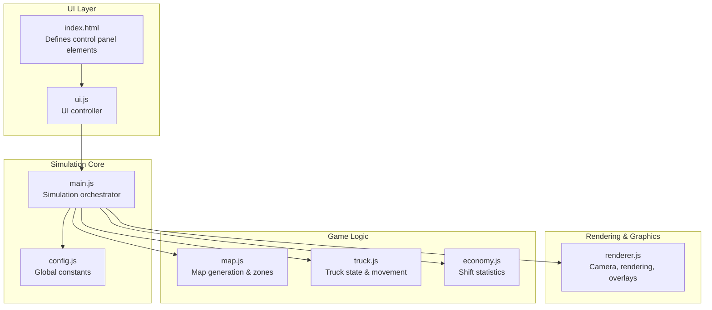

**Diagram sources**
- [index.html](file://index.html)
- [ui.js](file://ui.js)
- [main.js](file://main.js)
- [config.js](file://config.js)
- [renderer.js](file://renderer.js)
- [map.js](file://map.js)
- [truck.js](file://truck.js)
- [economy.js](file://economy.js)

**Section sources**
- [index.html](file://index.html)
- [ui.js](file://ui.js)
- [main.js](file://main.js)
- [config.js](file://config.js)

## Core Components
- Control panel layout and elements are defined in the HTML page.
- The UI controller binds events to user actions and updates the simulation state accordingly.
- The simulation orchestrator manages mode, time scale, pause, camera selection, map selection, and weather/time-of-day.
- Rendering integrates camera zoom and overlays for weather/time effects.
- Truck logic toggles manual mode per vehicle and applies physics and sensor feedback.
- Economy tracks production metrics and provides statistics for the UI.

**Section sources**
- [index.html](file://index.html)
- [ui.js](file://ui.js)
- [main.js](file://main.js)
- [renderer.js](file://renderer.js)
- [truck.js](file://truck.js)
- [economy.js](file://economy.js)

## Architecture Overview
The control panel is a thin UI layer that delegates to the simulation core. Events from the UI trigger callbacks that update internal state and synchronize the UI display.

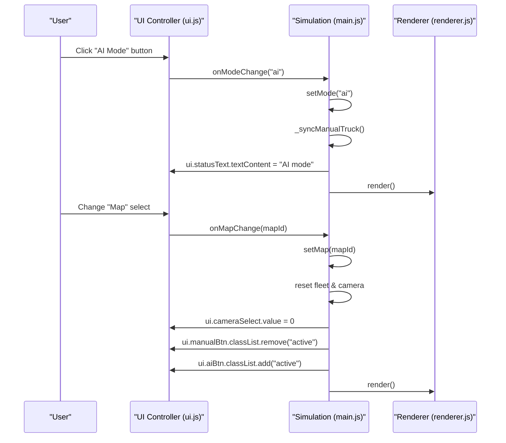

**Diagram sources**
- [ui.js](file://ui.js)
- [main.js](file://main.js)
- [renderer.js](file://renderer.js)

## Detailed Component Analysis

### Mode Switching: AI vs Manual
- Two mutually exclusive buttons control the global mode:
  - Manual mode activates only the currently selected truck for keyboard input.
  - AI mode lets all trucks operate autonomously.
- Button activation state:
  - Active button receives the "active" class; the other loses it.
- State synchronization:
  - The simulation sets a flag and toggles per-truck manual mode for the selected index.
  - UI updates status text and button classes.

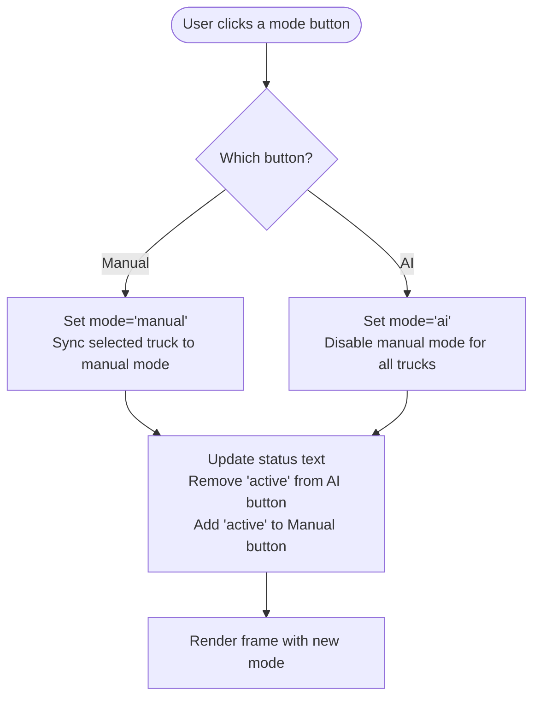

**Diagram sources**
- [ui.js](file://ui.js)
- [main.js](file://main.js)
- [truck.js](file://truck.js)

**Section sources**
- [index.html](file://index.html)
- [ui.js](file://ui.js)
- [main.js](file://main.js)
- [truck.js](file://truck.js)

### Simulation Controls: Reset and Pause/Resume
- Reset:
  - Reinitializes the current map, resets fleet positions at base, clears economy counters, resets camera focus, and switches to AI mode.
  - UI status text indicates reset completion.
- Pause/Resume:
  - Toggles a paused flag that affects the simulation loop.
  - UI updates the button label to reflect current state.

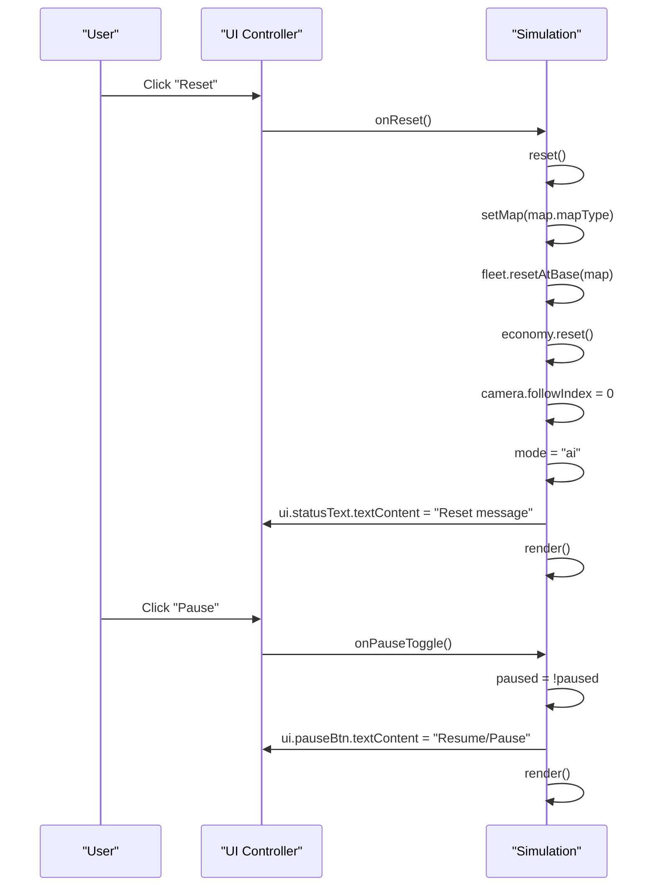

**Diagram sources**
- [ui.js](file://ui.js)
- [main.js](file://main.js)

**Section sources**
- [index.html](file://index.html)
- [ui.js](file://ui.js)
- [main.js](file://main.js)

### Time Scale Controls
- Buttons represent multipliers: 0, 1, 2, 4.
- Active multiplier is highlighted via the "active" class.
- The simulation loop scales delta time by the selected multiplier when not paused.
- UI reflects the current time scale and updates active button visuals.

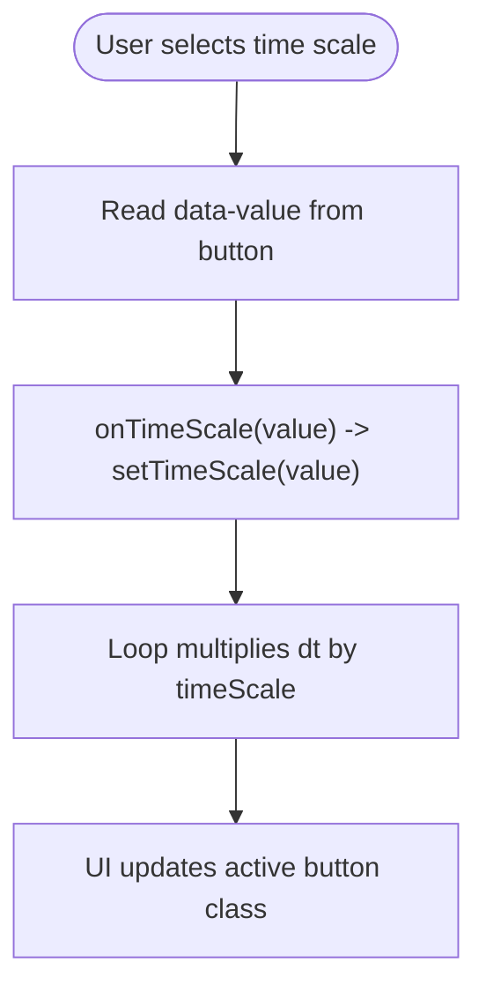

**Diagram sources**
- [ui.js](file://ui.js)
- [main.js](file://main.js)
- [config.js](file://config.js)

**Section sources**
- [index.html](file://index.html)
- [ui.js](file://ui.js)
- [main.js](file://main.js)
- [config.js](file://config.js)

### Zoom Slider
- A range input adjusts the camera zoom level.
- Value changes are sent to the simulation, which updates the camera zoom.
- The renderer applies zoom during world-to-screen transformations.

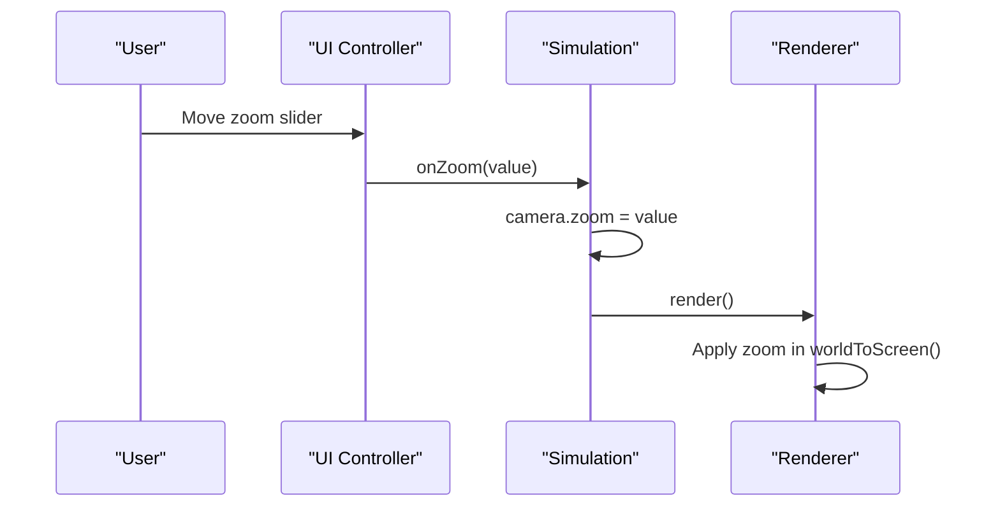

**Diagram sources**
- [ui.js](file://ui.js)
- [main.js](file://main.js)
- [renderer.js](file://renderer.js)

**Section sources**
- [index.html](file://index.html)
- [ui.js](file://ui.js)
- [main.js](file://main.js)
- [renderer.js](file://renderer.js)

### Camera Selection Dropdown
- Dropdown lists trucks by index.
- Selecting an option updates the camera’s follow index and syncs the manual truck index.
- Clicking on a truck in the simulation canvas also sets the camera and manual selection.

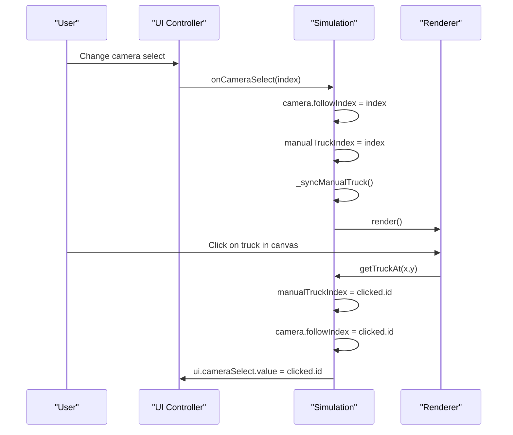

**Diagram sources**
- [ui.js](file://ui.js)
- [main.js](file://main.js)
- [renderer.js](file://renderer.js)

**Section sources**
- [index.html](file://index.html)
- [ui.js](file://ui.js)
- [main.js](file://main.js)
- [renderer.js](file://renderer.js)

### Map Selection Interface
- Dropdown populated with predefined maps.
- Changing the map regenerates terrain, resets fleet positions, clears economy, resets camera, and switches to AI mode.
- UI ensures the camera and mode buttons reflect the new state.

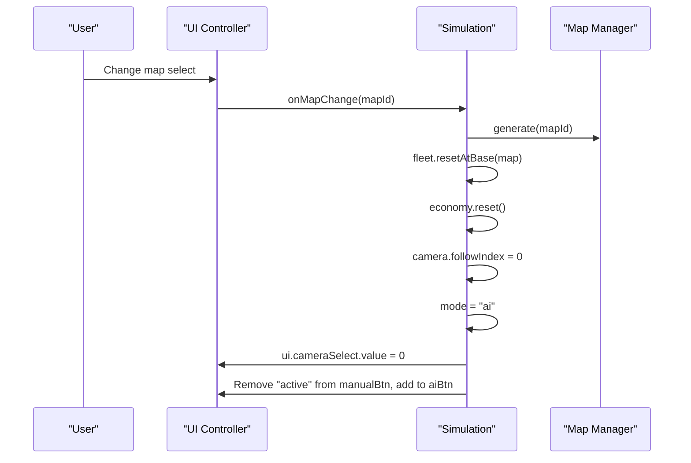

**Diagram sources**
- [ui.js](file://ui.js)
- [main.js](file://main.js)
- [map.js](file://map.js)

**Section sources**
- [index.html](file://index.html)
- [ui.js](file://ui.js)
- [main.js](file://main.js)
- [map.js](file://map.js)

### Weather and Time-of-Day Controls
- Environment controls include time-of-day (day/dusk/night) and weather (clear/fog/rain/dust).
- These affect rendering overlays and truck behavior (e.g., traction and sensor range).
- UI change events propagate to the simulation, which updates the current weather/time.

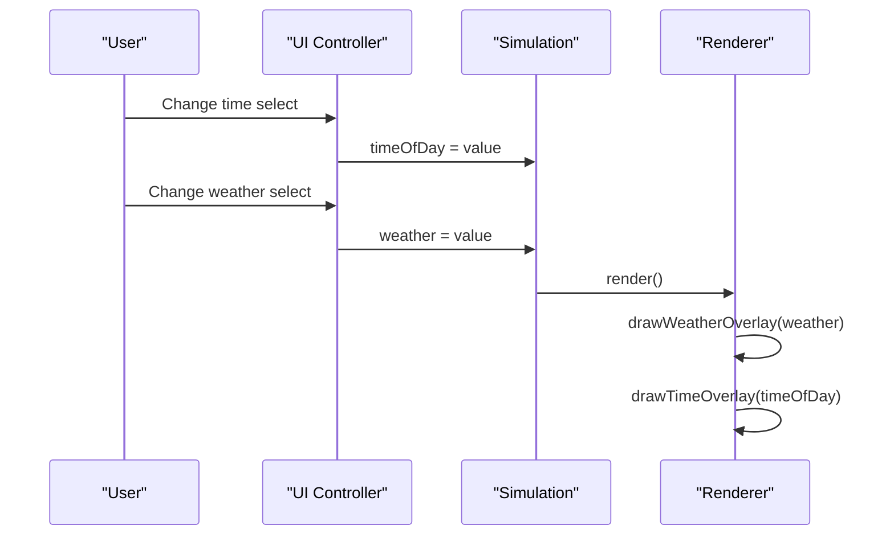

**Diagram sources**
- [ui.js](file://ui.js)
- [main.js](file://main.js)
- [renderer.js](file://renderer.js)

**Section sources**
- [index.html](file://index.html)
- [ui.js](file://ui.js)
- [main.js](file://main.js)
- [renderer.js](file://renderer.js)

### Event Handling, State Synchronization, and User Feedback
- Event binding:
  - UI registers click handlers for mode buttons, reset/pause, time scale buttons, zoom slider, camera select, and map select.
  - Keyboard input toggles manual mode and triggers operations when near zones.
- State synchronization:
  - Simulation updates internal state and informs UI to refresh displays.
  - UI maintains active button states and status messages.
- User feedback:
  - Status text communicates reset, mode changes, and export completion.
  - Visual feedback includes active button highlighting, pause button label, and chart updates.

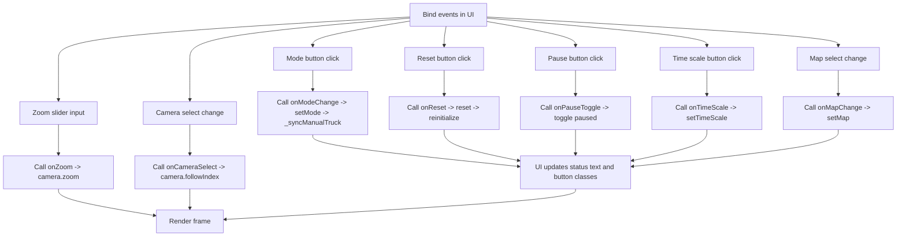

**Diagram sources**
- [ui.js](file://ui.js)
- [main.js](file://main.js)
- [renderer.js](file://renderer.js)

**Section sources**
- [ui.js](file://ui.js)
- [main.js](file://main.js)
- [index.html](file://index.html)

## Dependency Analysis
The control panel relies on a small set of core modules. The UI controller depends on the simulation orchestrator, which in turn depends on rendering, map generation, truck logic, and economy.

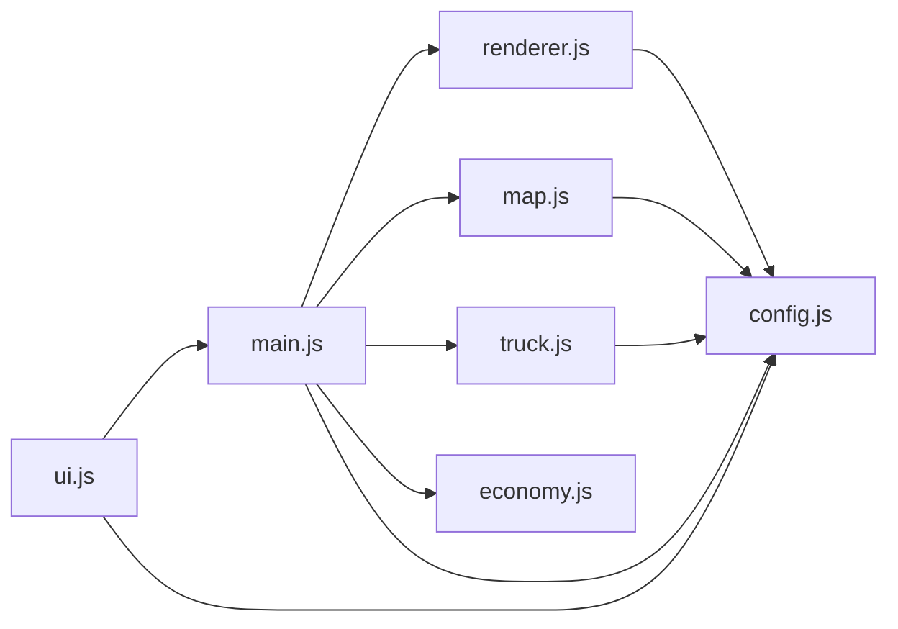

**Diagram sources**
- [ui.js](file://ui.js)
- [main.js](file://main.js)
- [renderer.js](file://renderer.js)
- [map.js](file://map.js)
- [truck.js](file://truck.js)
- [economy.js](file://economy.js)
- [config.js](file://config.js)

**Section sources**
- [ui.js](file://ui.js)
- [main.js](file://main.js)
- [renderer.js](file://renderer.js)
- [map.js](file://map.js)
- [truck.js](file://truck.js)
- [economy.js](file://economy.js)
- [config.js](file://config.js)

## Performance Considerations
- Time scale 0 effectively pauses the simulation by multiplying delta time to zero.
- Camera zoom is applied in the renderer’s world-to-screen transform; keep zoom within configured bounds to avoid excessive scaling.
- Manual mode reduces AI-driven movement for the selected truck, simplifying physics calculations for that vehicle.
- Weather conditions alter sensor range and traction, indirectly affecting performance-sensitive computations like pathfinding replanning.

[No sources needed since this section provides general guidance]

## Troubleshooting Guide
- Mode buttons not updating:
  - Verify that the active class is toggled and the status text is updated after mode changes.
- Reset does not restore state:
  - Ensure map regeneration, fleet reset, economy reset, and camera reset occur in sequence.
- Pause button label incorrect:
  - Confirm the pause state toggle and button text update in the UI.
- Zoom slider not applying:
  - Check that the zoom value is propagated to the camera and that the renderer uses it in transforms.
- Camera selection mismatch:
  - Validate that selecting a truck updates both the follow index and manual selection, and that canvas clicks synchronize the selection.
- Map switch not reflected:
  - Confirm that the map generator runs, fleet resets at base, and UI reflects the new camera and mode.

**Section sources**
- [ui.js](file://ui.js)
- [main.js](file://main.js)
- [renderer.js](file://renderer.js)
- [map.js](file://map.js)

## Conclusion
The control panel provides a cohesive interface for operating the autonomous dump truck simulation. Its design cleanly separates concerns: the UI handles user interactions and visual feedback, while the simulation orchestrator manages state transitions and rendering. Mode switching, reset/pause, time scale, zoom, camera selection, map switching, and environment controls are all synchronized through well-defined event handlers and state updates.