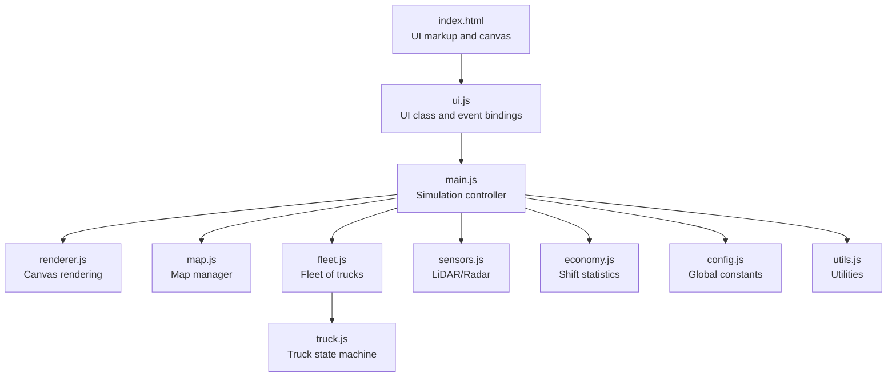
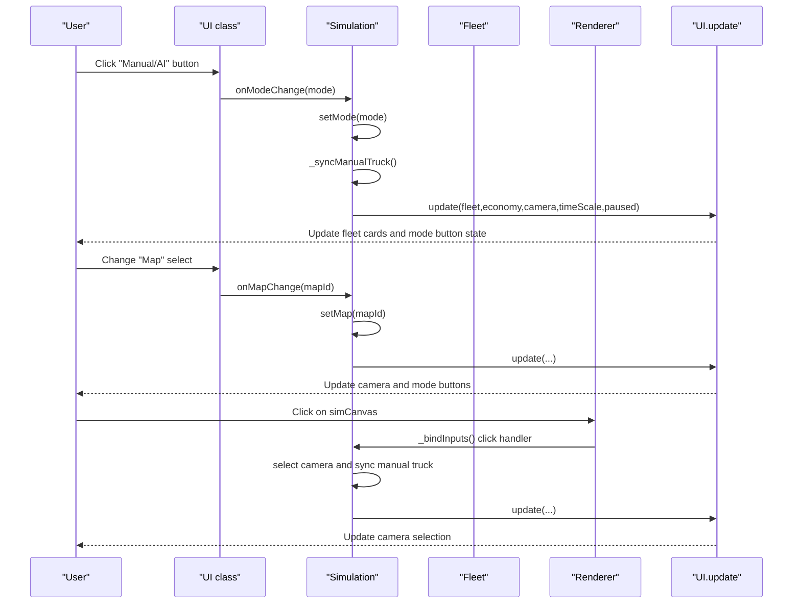
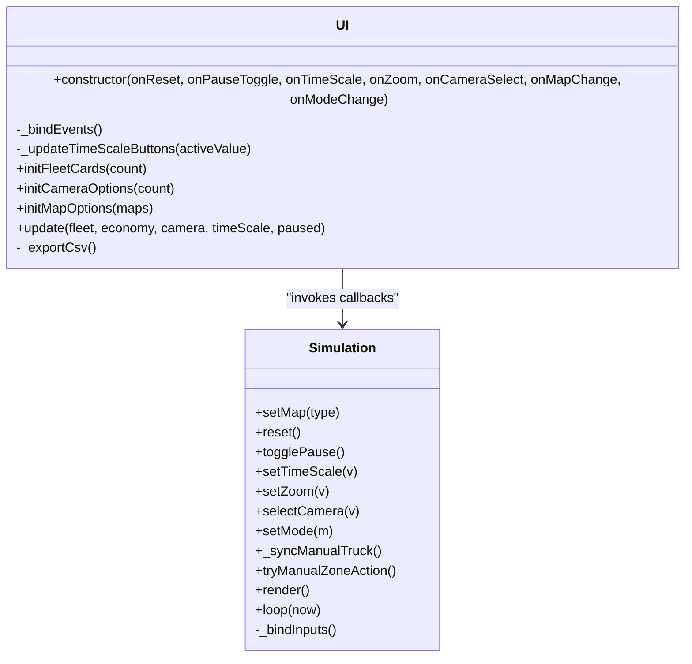
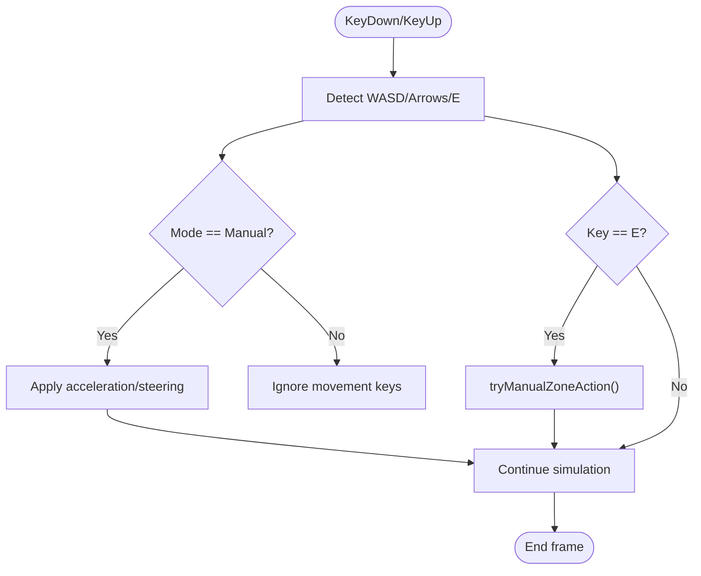
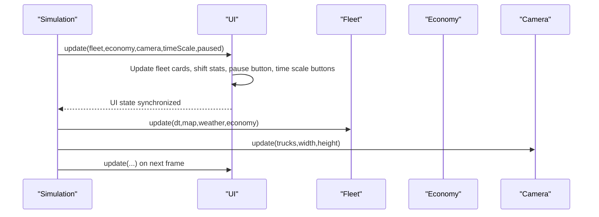
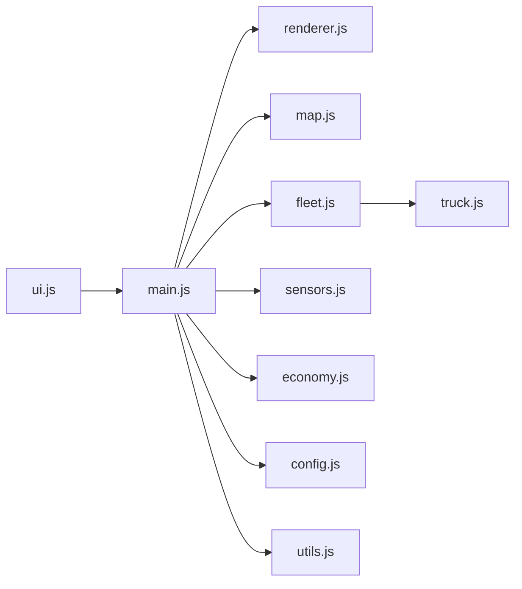

# Event Handling and User Interactions

<cite>
**Referenced Files in This Document**
- [index.html](file://index.html)
- [config.js](file://config.js)
- [ui.js](file://ui.js)
- [main.js](file://main.js)
- [renderer.js](file://renderer.js)
- [truck.js](file://truck.js)
- [map.js](file://map.js)
- [sensors.js](file://sensors.js)
- [economy.js](file://economy.js)
- [fleet.js](file://fleet.js)
- [utils.js](file://utils.js)
</cite>

## Table of Contents
1. [Introduction](#introduction)
2. [Project Structure](#project-structure)
3. [Core Components](#core-components)
4. [Architecture Overview](#architecture-overview)
5. [Detailed Component Analysis](#detailed-component-analysis)
6. [Dependency Analysis](#dependency-analysis)
7. [Performance Considerations](#performance-considerations)
8. [Troubleshooting Guide](#troubleshooting-guide)
9. [Conclusion](#conclusion)

## Introduction
This document explains the event handling system that powers user interactions and input responses in the autonomous dump truck simulator. It covers:
- Event binding architecture for buttons, forms, sliders, and keyboard shortcuts
- The callback system connecting UI actions to simulation controls
- Parameter passing mechanisms and state synchronization
- Accessibility and alternative input methods
- Responsive design and cross-browser compatibility
- Examples of event delegation patterns, state management, and user feedback

## Project Structure
The application is structured around a central Simulation controller that orchestrates UI, rendering, and simulation logic. UI events are bound in the UI class and forwarded to the Simulation controller, which updates internal state and triggers re-rendering.

**Diagram sources**
- [index.html:156-257](file://index.html#L156-L257)
- [ui.js:1-200](file://ui.js#L1-L200)
- [main.js:1-266](file://main.js#L1-L266)
- [renderer.js:24-437](file://renderer.js#L24-L437)
- [map.js:1-438](file://map.js#L1-L438)
- [fleet.js:1-65](file://fleet.js#L1-L65)
- [truck.js:1-406](file://truck.js#L1-L406)
- [sensors.js:1-103](file://sensors.js#L1-L103)
- [economy.js:1-66](file://economy.js#L1-L66)
- [config.js:1-93](file://config.js#L1-L93)
- [utils.js:1-102](file://utils.js#L1-L102)

**Section sources**
- [index.html:156-257](file://index.html#L156-L257)
- [main.js:28-45](file://main.js#L28-L45)

## Core Components
- UI class: Manages DOM elements, binds events, and synchronizes UI state with simulation.
- Simulation controller: Central orchestration of input handling, state updates, and rendering.
- Renderer: Canvas-based drawing and sensor visualizations.
- Fleet and Truck: State machines and movement logic synchronized with UI.
- Sensors: LiDAR and Radar computations for perception.
- Economy: Shift statistics and financial metrics.
- Config: Global constants and tuning parameters.

**Section sources**
- [ui.js:1-200](file://ui.js#L1-L200)
- [main.js:1-266](file://main.js#L1-L266)
- [renderer.js:24-437](file://renderer.js#L24-L437)
- [truck.js:1-406](file://truck.js#L1-L406)
- [sensors.js:1-103](file://sensors.js#L1-L103)
- [economy.js:1-66](file://economy.js#L1-L66)
- [config.js:1-93](file://config.js#L1-L93)

## Architecture Overview
The event handling architecture follows a unidirectional data flow:
- UI events trigger callbacks in the UI class
- UI forwards actions to the Simulation controller via constructor-provided callbacks
- Simulation updates internal state and calls UI.update to synchronize visuals
- Renderer draws the scene and sensor overlays
- Keyboard and mouse events are handled centrally in the Simulation controller

**Diagram sources**
- [ui.js:30-62](file://ui.js#L30-L62)
- [main.js:100-112](file://main.js#L100-L112)
- [main.js:225-260](file://main.js#L225-L260)
- [renderer.js:24-36](file://renderer.js#L24-L36)

## Detailed Component Analysis

### UI Event Binding and Callback System
The UI class encapsulates all DOM event bindings and exposes a clean callback interface to the Simulation controller. It maintains references to all interactive elements and delegates user actions to the Simulation controller.

Key responsibilities:
- Bind button clicks for reset, pause, manual/ai modes, and time scale
- Bind form changes for camera selection, map selection, time of day, and weather
- Bind slider input for zoom level
- Export CSV report
- Synchronize UI state with simulation state

**Diagram sources**
- [ui.js:1-200](file://ui.js#L1-L200)
- [main.js:1-266](file://main.js#L1-L266)

**Section sources**
- [ui.js:1-200](file://ui.js#L1-L200)
- [main.js:28-45](file://main.js#L28-L45)

### Keyboard Shortcut Support and Alternative Input Methods
The simulation supports keyboard-driven manual control and alternative input methods for accessibility:
- WASD/Arrow keys: Manual acceleration and steering for the selected truck
- E key: Trigger action in the current zone (load/unload/fuel/maintenance)
- Mouse click on the simulation canvas: Select a truck and follow it with the camera
- Touch interaction: The canvas element is designed for pointer interactions; touch gestures can be added via pointer events if needed

Accessibility features:
- Keyboard focus and key handling are centralized
- Visual feedback for active mode and camera selection
- Color-coded UI elements and meters for quick status assessment

**Diagram sources**
- [main.js:225-234](file://main.js#L225-L234)
- [main.js:148-207](file://main.js#L148-L207)

**Section sources**
- [main.js:69-76](file://main.js#L69-L76)
- [main.js:114-146](file://main.js#L114-L146)
- [main.js:225-234](file://main.js#L225-L234)
- [main.js:236-252](file://main.js#L236-L252)

### State Synchronization Between UI and Simulation
State synchronization occurs in two directions:
- UI to Simulation: Events trigger callbacks that update simulation state and internal flags
- Simulation to UI: After each update, Simulation calls UI.update to reflect fleet, economy, camera, time scale, and paused state

Active state management:
- Manual vs AI mode toggles the manualMode flag on the selected truck
- Camera selection updates the follow index and manual truck index
- Time scale buttons update the timeScale property and UI active state
- Pause toggles the paused flag

Visual feedback updates:
- Fleet cards show state, tasks, fuel, wear, and cargo
- Shift statistics panel displays metrics
- Status text communicates current mode and actions
- Time scale buttons highlight the active setting

**Diagram sources**
- [main.js:212-213](file://main.js#L212-L213)
- [ui.js:122-158](file://ui.js#L122-L158)

**Section sources**
- [main.js:108-112](file://main.js#L108-L112)
- [main.js:212-213](file://main.js#L212-L213)
- [ui.js:122-158](file://ui.js#L122-L158)

### Event Delegation Patterns and Parameter Passing
The UI class uses direct event listeners on individual elements for clarity and maintainability. Parameters are passed as primitive values or indices, enabling clean separation between UI and simulation concerns.

Examples:
- Button click handlers pass simple values (e.g., time scale numeric value)
- Form change handlers pass string identifiers (e.g., map type)
- Slider input handlers pass numeric values (zoom level)
- Mouse click handlers convert screen coordinates to world coordinates and select trucks

Parameter passing mechanisms:
- Numeric values: time scale, zoom
- String identifiers: map type, camera index, mode
- Objects: truck selection and camera position

**Section sources**
- [ui.js:30-62](file://ui.js#L30-L62)
- [main.js:236-252](file://main.js#L236-L252)

### User Feedback Mechanisms
The UI provides immediate and persistent feedback:
- Status text messages for reset, mode changes, and CSV export
- Active state indicators for buttons and time scale selections
- Visual meters for fuel and wear with color-coded thresholds
- Real-time charts for fuel consumption, tonnage, and profit
- Sensor visualizations (LiDAR and radar) for situational awareness

**Section sources**
- [ui.js:175-198](file://ui.js#L175-L198)
- [ui.js:122-158](file://ui.js#L122-L158)
- [renderer.js:318-388](file://renderer.js#L318-L388)
- [renderer.js:390-435](file://renderer.js#L390-L435)

## Dependency Analysis
The event handling system exhibits low coupling and high cohesion:
- UI depends on Simulation callbacks and DOM APIs
- Simulation depends on UI for state synchronization and on other modules for logic
- Renderer depends on Simulation state and UI for overlays
- Truck and Fleet depend on Map and Sensors for state transitions and movement
- Sensors depend on Map and configuration for perception

**Diagram sources**
- [ui.js:1-200](file://ui.js#L1-L200)
- [main.js:1-266](file://main.js#L1-L266)
- [renderer.js:24-437](file://renderer.js#L24-L437)
- [map.js:1-438](file://map.js#L1-L438)
- [fleet.js:1-65](file://fleet.js#L1-L65)
- [truck.js:1-406](file://truck.js#L1-L406)
- [sensors.js:1-103](file://sensors.js#L1-L103)
- [economy.js:1-66](file://economy.js#L1-L66)
- [config.js:1-93](file://config.js#L1-L93)
- [utils.js:1-102](file://utils.js#L1-L102)

**Section sources**
- [main.js:28-45](file://main.js#L28-L45)
- [ui.js:1-200](file://ui.js#L1-L200)

## Performance Considerations
- Event handlers are lightweight and delegate to centralized logic in the Simulation controller
- UI.update batches DOM updates to minimize layout thrashing
- Rendering uses requestAnimationFrame for smooth animation
- Keyboard input is polled efficiently via key state tracking
- Sensor computations are bounded by configurable ray counts and distances

[No sources needed since this section provides general guidance]

## Troubleshooting Guide
Common issues and resolutions:
- Buttons not responding: Verify that UI._bindEvents is called and callbacks are provided to the UI constructor
- Manual mode not activating: Ensure setMode updates manualTruckIndex and UI state
- Zoom slider not updating: Confirm onZoom callback is invoked and camera.zoom is set
- CSV export failing: Check that window.simEconomy exists and UI.statusText is present
- Click-to-select not working: Validate simCanvas click handler and coordinate conversion logic

**Section sources**
- [ui.js:30-62](file://ui.js#L30-L62)
- [main.js:94-98](file://main.js#L94-L98)
- [main.js:236-252](file://main.js#L236-L252)
- [ui.js:175-198](file://ui.js#L175-L198)

## Conclusion
The event handling system integrates UI interactions, simulation state, and rendering through a clean callback architecture. It supports keyboard shortcuts, form changes, and slider inputs while maintaining responsive visuals and accessible feedback. The design emphasizes modularity, state synchronization, and performance, enabling a robust user experience across different screen sizes and input methods.