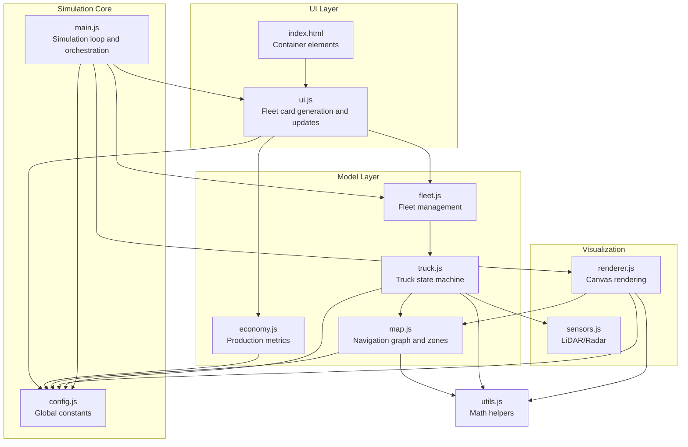
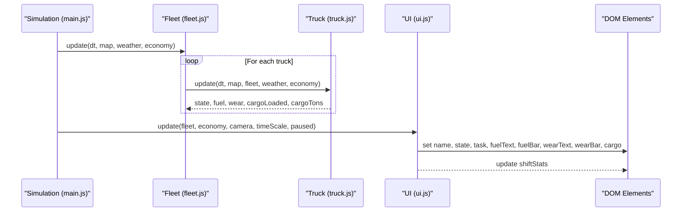
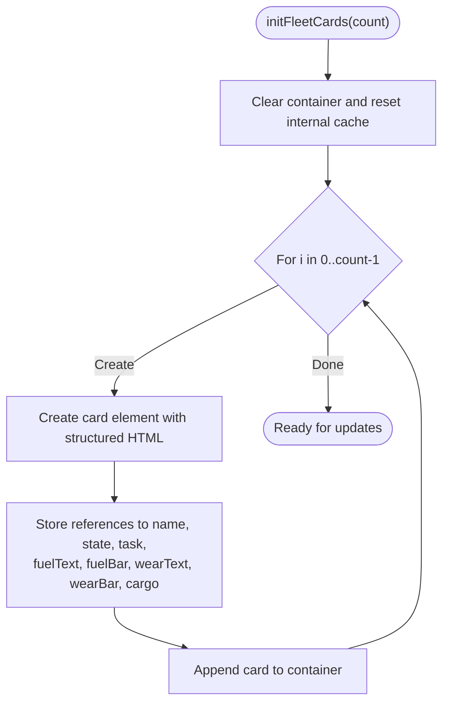
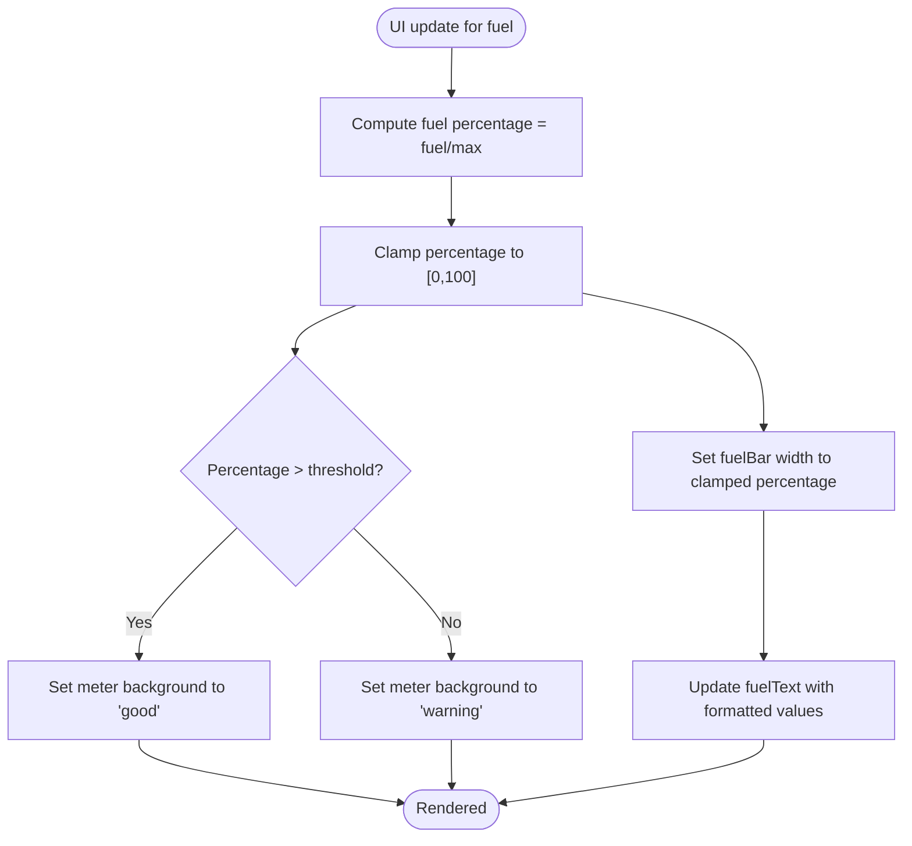
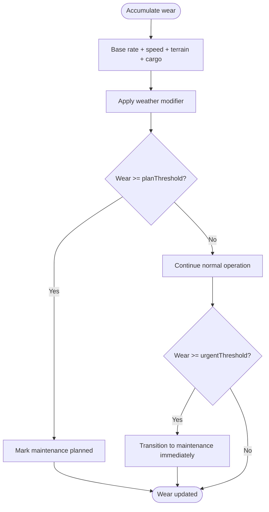
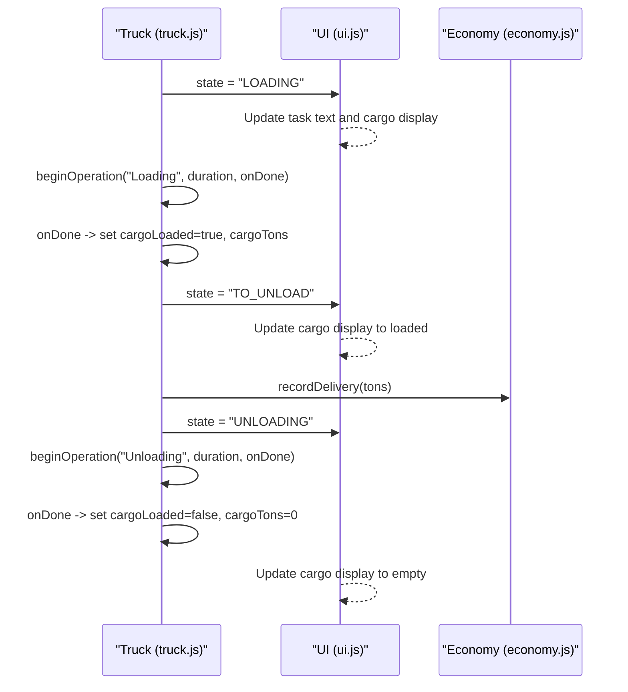
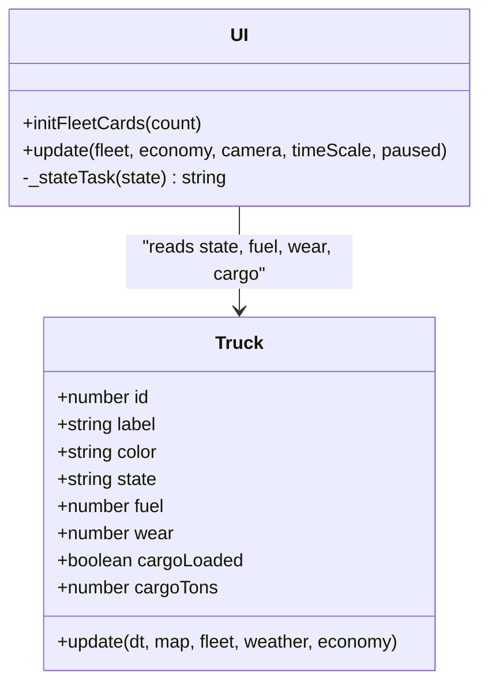
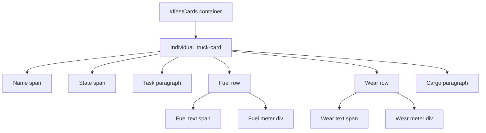
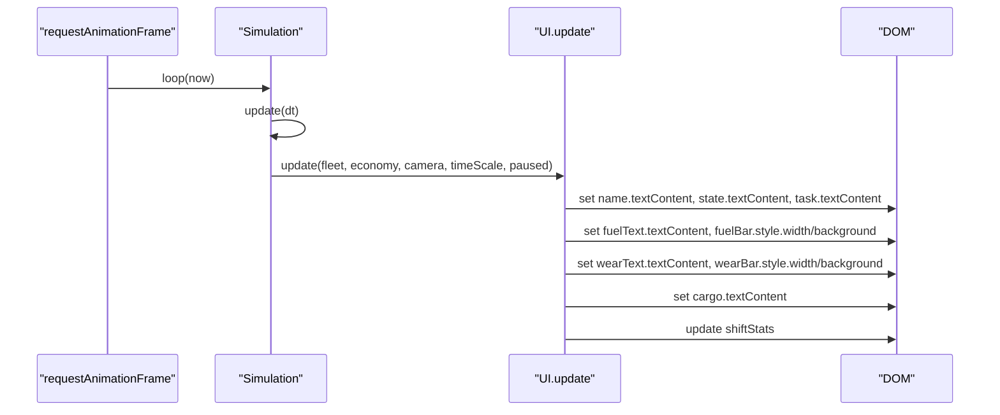
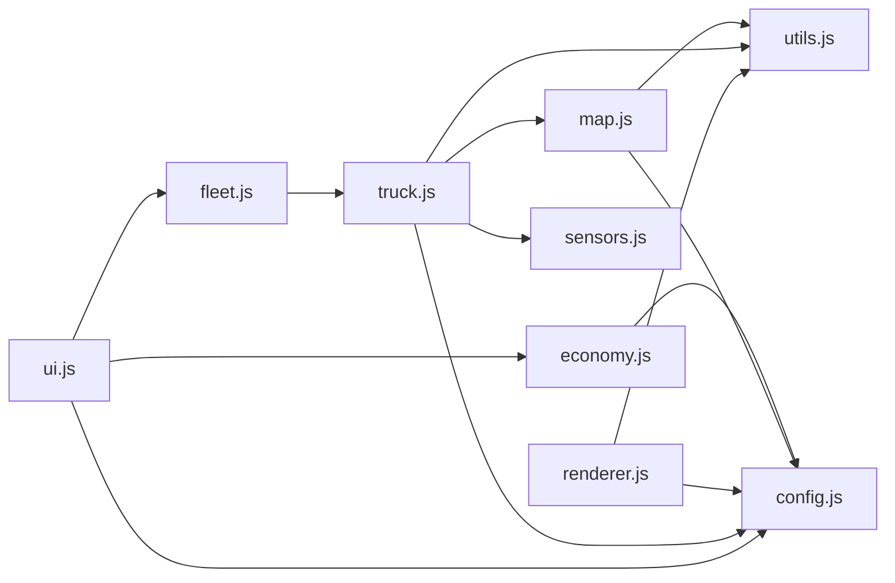

# Fleet Display System

<cite>
**Referenced Files in This Document**
- [index.html](file://index.html)
- [config.js](file://config.js)
- [main.js](file://main.js)
- [ui.js](file://ui.js)
- [fleet.js](file://fleet.js)
- [truck.js](file://truck.js)
- [renderer.js](file://renderer.js)
- [map.js](file://map.js)
- [economy.js](file://economy.js)
- [sensors.js](file://sensors.js)
- [utils.js](file://utils.js)
</cite>

## Table of Contents
1. [Introduction](#introduction)
2. [Project Structure](#project-structure)
3. [Core Components](#core-components)
4. [Architecture Overview](#architecture-overview)
5. [Detailed Component Analysis](#detailed-component-analysis)
6. [Dependency Analysis](#dependency-analysis)
7. [Performance Considerations](#performance-considerations)
8. [Troubleshooting Guide](#troubleshooting-guide)
9. [Conclusion](#conclusion)

## Introduction
This document describes the fleet display system that visualizes individual truck status and performance metrics in a real-time simulation. It covers dynamic fleet card generation, real-time fuel level visualization with color-coded meters, wear and tear monitoring, cargo loading status, color-coding for truck states, responsive card layout, and the synchronization mechanism with the simulation state. It also provides examples of DOM manipulation, real-time data binding, and visual feedback patterns.

## Project Structure
The fleet display system is composed of several interconnected modules:
- HTML template defines the UI shell and container elements for fleet cards and statistics.
- Configuration constants define global parameters for physics, fuel, wear, sensors, and UI behavior.
- Simulation orchestrates updates, rendering, and UI synchronization.
- UI module generates and updates fleet cards and shift statistics.
- Fleet and Truck classes model the fleet and individual truck states and behaviors.
- Renderer draws the map, routes, trucks, and sensor visualizations.
- Map manager provides navigation graph, zones, and pathfinding.
- Economy tracks production metrics and financial performance.
- Sensors provide LiDAR and radar data for perception.
- Utilities offer shared math helpers and formatting functions.

**Diagram sources**
- [index.html:155-257](file://index.html#L155-L257)
- [ui.js:1-200](file://ui.js#L1-L200)
- [main.js:1-266](file://main.js#L1-L266)
- [fleet.js:1-65](file://fleet.js#L1-L65)
- [truck.js:1-406](file://truck.js#L1-L406)
- [renderer.js:1-437](file://renderer.js#L1-L437)
- [map.js:1-438](file://map.js#L1-L438)
- [economy.js:1-66](file://economy.js#L1-L66)
- [sensors.js:1-103](file://sensors.js#L1-L103)
- [config.js:1-93](file://config.js#L1-L93)
- [utils.js:1-102](file://utils.js#L1-L102)

**Section sources**
- [index.html:155-257](file://index.html#L155-L257)
- [config.js:1-93](file://config.js#L1-L93)
- [main.js:1-266](file://main.js#L1-L266)

## Core Components
- Fleet card generation: Creates a responsive grid of truck cards with name, state, task, fuel meter, wear meter, and cargo status.
- Real-time fuel visualization: Displays fuel quantity, percentage, and a color-coded meter that shifts from good to warning thresholds.
- Wear monitoring: Shows cumulative wear percentage with a color-coded indicator.
- Cargo loading status: Indicates whether the truck is loaded and displays tonnage.
- Color-coding system: Assigns distinct colors per truck and applies state-dependent styling.
- Responsive layout: Uses CSS grid and flexbox to adapt to viewport and content changes.
- Update synchronization: The UI update routine reads the current fleet state and reflects it in the DOM.

**Section sources**
- [ui.js:70-158](file://ui.js#L70-L158)
- [truck.js:33-36](file://truck.js#L33-L36)
- [truck.js:118-222](file://truck.js#L118-L222)
- [fleet.js:53-63](file://fleet.js#L53-L63)
- [index.html:76-113](file://index.html#L76-L113)

## Architecture Overview
The fleet display system follows a reactive pattern:
- Simulation loop updates truck states and economy metrics.
- UI.update reads the current fleet and economy state and updates DOM elements.
- Fleet cards are generated once and reused for subsequent updates.
- Real-time data binding occurs by directly setting element properties (textContent, style.width, style.background).

**Diagram sources**
- [main.js:67-80](file://main.js#L67-L80)
- [main.js:209-213](file://main.js#L209-L213)
- [ui.js:122-158](file://ui.js#L122-L158)
- [fleet.js:20-24](file://fleet.js#L20-L24)
- [truck.js:78-116](file://truck.js#L78-L116)

## Detailed Component Analysis

### Fleet Card Generation and Layout
- Dynamic creation: The UI initializes a fleet card container and creates a card per truck with structured HTML for name, state, task, fuel meter, wear meter, and cargo label.
- Responsive card layout: Cards use flexbox and spacing to ensure readability and adapt to viewport changes.
- Color-coding: Each truck receives a unique color; the card name adopts the truck’s color for visual association.

**Diagram sources**
- [ui.js:70-100](file://ui.js#L70-L100)
- [index.html:191](file://index.html#L191)

**Section sources**
- [ui.js:70-100](file://ui.js#L70-L100)
- [index.html:76-113](file://index.html#L76-L113)

### Real-Time Fuel Level Visualization
- Percentage calculation: Fuel percentage is computed from current fuel divided by maximum capacity and scaled to percent.
- Meter width: The fuel bar width is set to the bounded percentage for smooth transitions.
- Color-coding: The meter background switches from a “good” color to an “warning” color as fuel drops below configured thresholds.
- Text display: The fuel text shows current liters, maximum capacity, and percentage.

**Diagram sources**
- [ui.js:131-134](file://ui.js#L131-L134)

**Section sources**
- [ui.js:131-134](file://ui.js#L131-L134)
- [config.js:20-27](file://config.js#L20-L27)

### Wear and Tear Monitoring
- Wear accumulation: Wear increases with speed, terrain cost, and cargo weight, and is influenced by weather conditions.
- Thresholds: Planned maintenance is triggered near a plan threshold; urgent maintenance triggers an immediate state change.
- Visual indicator: The wear meter width reflects the current wear percentage, and the color indicates severity.

**Diagram sources**
- [truck.js:369-382](file://truck.js#L369-L382)
- [config.js:29-37](file://config.js#L29-L37)

**Section sources**
- [truck.js:369-382](file://truck.js#L369-L382)
- [config.js:29-37](file://config.js#L29-L37)

### Cargo Loading Status Display
- Loading state: When arriving at the loading zone, the truck enters a loading operation with a fixed duration. During this time, the UI shows the loading state and task description.
- Cargo tonnage: After loading completes, the UI displays the loaded tonnage; otherwise, it shows empty cargo.
- Unloading and delivery: On unloading completion, the UI reflects the cargo as empty and updates shift statistics.

**Diagram sources**
- [truck.js:159-222](file://truck.js#L159-L222)
- [ui.js:127-139](file://ui.js#L127-L139)
- [economy.js:17-23](file://economy.js#L17-L23)

**Section sources**
- [truck.js:159-222](file://truck.js#L159-L222)
- [ui.js:127-139](file://ui.js#L127-L139)
- [economy.js:17-23](file://economy.js#L17-L23)

### Color-Coding System for Truck States
- Truck color: Each truck is assigned a unique color based on its index, ensuring consistent visual identity across UI and rendering.
- State indicators: The UI uses localized task labels mapped from internal state identifiers to Russian phrases for clarity.
- Meter colors: Fuel and wear meters switch color based on thresholds to provide immediate visual feedback.

**Diagram sources**
- [truck.js:29-36](file://truck.js#L29-L36)
- [ui.js:160-173](file://ui.js#L160-L173)
- [ui.js:127-139](file://ui.js#L127-L139)

**Section sources**
- [truck.js:29-36](file://truck.js#L29-L36)
- [ui.js:160-173](file://ui.js#L160-L173)
- [ui.js:127-139](file://ui.js#L127-L139)

### Responsive Card Layout
- Flexbox and grid: The card container and individual cards use flexbox to arrange rows and spacing, enabling responsive adaptation to viewport changes.
- Meter styling: Meters are styled with rounded edges and transitions for smooth width changes.
- Typography: Small and label classes provide consistent text sizing and muted colors for secondary information.

**Diagram sources**
- [index.html:191](file://index.html#L191)
- [index.html:76-113](file://index.html#L76-L113)
- [ui.js:76-98](file://ui.js#L76-L98)

**Section sources**
- [index.html:76-113](file://index.html#L76-L113)
- [ui.js:76-98](file://ui.js#L76-L98)

### Update Mechanism and Real-Time Data Binding
- Synchronization: The simulation loop calls UI.update every frame, passing the current fleet, economy, camera, time scale, and pause state.
- DOM manipulation: The UI updates textContent for labels and adjusts style.width and style.background for meters.
- Visual feedback: Transitions animate meter width changes, and color changes signal state transitions.

**Diagram sources**
- [main.js:215-223](file://main.js#L215-L223)
- [main.js:209-213](file://main.js#L209-L213)
- [ui.js:122-158](file://ui.js#L122-L158)

**Section sources**
- [main.js:215-223](file://main.js#L215-L223)
- [ui.js:122-158](file://ui.js#L122-L158)

## Dependency Analysis
- UI depends on fleet state and economy metrics to populate cards and shift statistics.
- Truck state machine drives UI visuals through state transitions and resource consumption.
- Map and sensors influence truck behavior and route planning, indirectly affecting UI task descriptions.
- Configuration constants underpin fuel, wear, and UI thresholds.

**Diagram sources**
- [ui.js:122-158](file://ui.js#L122-L158)
- [fleet.js:20-24](file://fleet.js#L20-L24)
- [truck.js:78-116](file://truck.js#L78-L116)
- [map.js:25-74](file://map.js#L25-L74)
- [sensors.js:1-103](file://sensors.js#L1-L103)
- [config.js:1-93](file://config.js#L1-L93)
- [utils.js:1-102](file://utils.js#L1-L102)
- [renderer.js:24-66](file://renderer.js#L24-L66)
- [economy.js:1-66](file://economy.js#L1-L66)

**Section sources**
- [ui.js:122-158](file://ui.js#L122-L158)
- [fleet.js:20-24](file://fleet.js#L20-L24)
- [truck.js:78-116](file://truck.js#L78-L116)
- [map.js:25-74](file://map.js#L25-L74)
- [sensors.js:1-103](file://sensors.js#L1-L103)
- [config.js:1-93](file://config.js#L1-L93)
- [utils.js:1-102](file://utils.js#L1-L102)
- [renderer.js:24-66](file://renderer.js#L24-L66)
- [economy.js:1-66](file://economy.js#L1-L66)

## Performance Considerations
- Efficient DOM updates: The UI caches element references and updates only changed properties, minimizing reflows.
- Smooth animations: Meter width transitions use CSS transitions for fluid updates.
- Conditional rendering: UI avoids unnecessary DOM writes by checking for existing references before updating.
- Frame pacing: The simulation loop caps delta time and respects time scale and pause states to prevent excessive updates.

[No sources needed since this section provides general guidance]

## Troubleshooting Guide
- Fleet cards not appearing: Verify the container element exists and initFleetCards was called with the correct count.
- Fuel/wear meters not updating: Ensure UI.update is invoked each frame and that the fleet state is being passed correctly.
- Incorrect state labels: Confirm the state-to-task mapping covers all states and that localized strings are present.
- Maintenance not triggering: Check wear thresholds and that the truck’s state machine transitions to maintenance when thresholds are met.
- Cargo tonnage not shown: Verify that cargoLoaded is toggled and cargoTons is set during loading operations.

**Section sources**
- [ui.js:70-100](file://ui.js#L70-L100)
- [ui.js:122-158](file://ui.js#L122-L158)
- [truck.js:159-222](file://truck.js#L159-L222)
- [config.js:29-37](file://config.js#L29-L37)

## Conclusion
The fleet display system integrates simulation state with a responsive UI to provide real-time insights into truck operations. Through dynamic card generation, color-coded meters, and synchronized updates, operators can monitor fuel levels, wear, cargo status, and task assignments efficiently. The modular architecture ensures maintainability and extensibility for future enhancements.