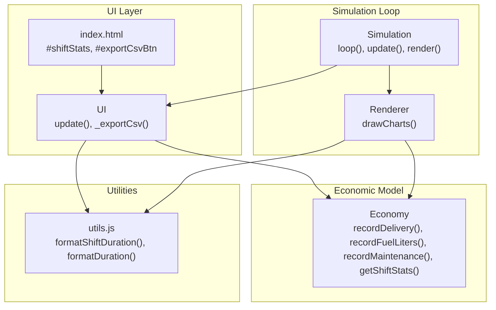
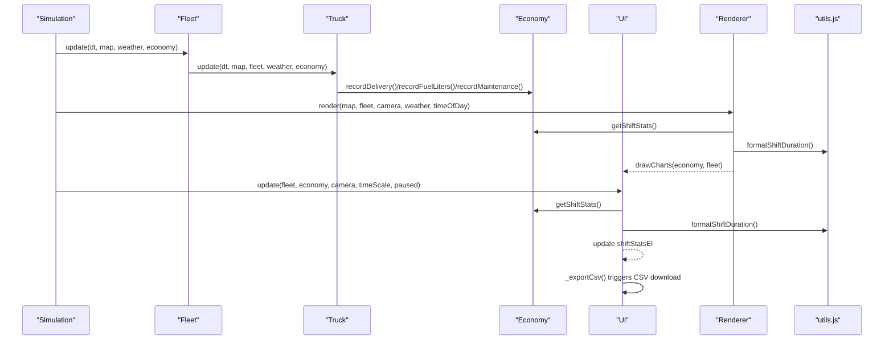
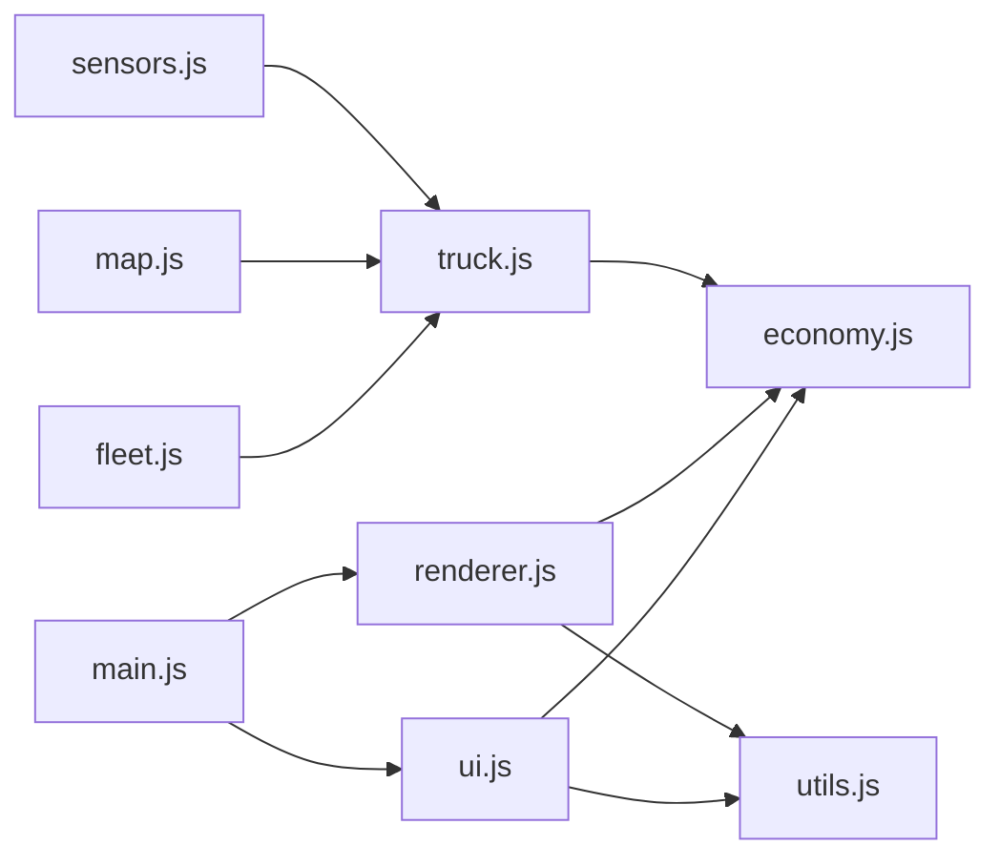

# Statistics and Analytics Display

<cite>
**Referenced Files in This Document**
- [index.html](file://index.html)
- [config.js](file://config.js)
- [main.js](file://main.js)
- [ui.js](file://ui.js)
- [economy.js](file://economy.js)
- [utils.js](file://utils.js)
- [renderer.js](file://renderer.js)
- [truck.js](file://truck.js)
- [fleet.js](file://fleet.js)
- [map.js](file://map.js)
- [sensors.js](file://sensors.js)
</cite>

## Table of Contents
1. [Introduction](#introduction)
2. [Project Structure](#project-structure)
3. [Core Components](#core-components)
4. [Architecture Overview](#architecture-overview)
5. [Detailed Component Analysis](#detailed-component-analysis)
6. [Dependency Analysis](#dependency-analysis)
7. [Performance Considerations](#performance-considerations)
8. [Troubleshooting Guide](#troubleshooting-guide)
9. [Conclusion](#conclusion)

## Introduction
This document describes the statistics and analytics display system responsible for presenting real-time performance metrics and shift reports. It focuses on the shift statistics panel that shows key performance indicators such as trip counts, tonnage metrics, fuel efficiency calculations, and profitability analysis. It also explains time-based metric calculations, shift duration formatting, hourly productivity measurements, CSV export functionality, and the real-time updating mechanism that ties simulation state to displayed metrics.

## Project Structure
The statistics and analytics system spans several modules:
- UI rendering and event handling for the statistics panel and CSV export
- Economic model that aggregates revenue, costs, and profitability
- Utilities for formatting durations and numeric values
- Rendering pipeline that updates the UI and draws charts
- Simulation loop that drives updates and triggers UI refreshes

**Diagram sources**
- [ui.js:122-198](file://ui.js#L122-L198)
- [economy.js:45-64](file://economy.js#L45-L64)
- [main.js:209-223](file://main.js#L209-L223)
- [renderer.js:390-435](file://renderer.js#L390-L435)
- [utils.js:84-96](file://utils.js#L84-L96)
- [index.html:194-199](file://index.html#L194-L199)

**Section sources**
- [index.html:194-199](file://index.html#L194-L199)
- [ui.js:122-198](file://ui.js#L122-L198)
- [economy.js:45-64](file://economy.js#L45-L64)
- [main.js:209-223](file://main.js#L209-L223)
- [renderer.js:390-435](file://renderer.js#L390-L435)
- [utils.js:84-96](file://utils.js#L84-L96)

## Core Components
- Shift statistics panel: displays shift duration, trip count, tonnage, average fuel per trip, average tonnage per trip, hourly productivity, total fuel consumed, maintenance cost, profit, and efficiency percentage.
- Real-time update mechanism: triggered by the simulation loop and UI update cycle, refreshing metrics and chart visuals.
- CSV export: generates a CSV report containing all relevant economic data for the current shift.
- Efficiency calculation: integrates with the economic system to derive an efficiency score tied to profitability and productivity.

Key responsibilities:
- UI renders metrics and handles CSV export events.
- Economy tracks deliveries, fuel usage, and maintenance to compute profitability and derived metrics.
- Renderer draws charts reflecting fuel, tonnage, and profit trends.
- Utilities provide consistent formatting for time and numeric values.

**Section sources**
- [ui.js:142-154](file://ui.js#L142-L154)
- [economy.js:45-64](file://economy.js#L45-L64)
- [renderer.js:390-435](file://renderer.js#L390-L435)
- [utils.js:84-96](file://utils.js#L84-L96)

## Architecture Overview
The statistics and analytics system is driven by the simulation loop. During each frame, the simulation updates fleet state, applies physics and AI decisions, and records economic events. The UI reads the current economic state and formats it for display. The renderer draws charts based on the same economic state. Users can trigger CSV export via the UI, which serializes the current shift statistics.

**Diagram sources**
- [main.js:67-80](file://main.js#L67-L80)
- [main.js:209-223](file://main.js#L209-L223)
- [renderer.js:390-435](file://renderer.js#L390-L435)
- [ui.js:122-158](file://ui.js#L122-L158)
- [economy.js:45-64](file://economy.js#L45-L64)
- [utils.js:84-96](file://utils.js#L84-L96)

## Detailed Component Analysis

### Shift Statistics Panel
The shift statistics panel is rendered inside the left panel and updated on every UI update cycle. It pulls metrics from the economic model and formats them for display.

Key metrics:
- Shift time in HH:MM:SS
- Trips completed
- Total tonnage delivered
- Average fuel per trip
- Average tonnage per trip
- Hourly productivity (tons per hour)
- Total fuel consumed (liters)
- Maintenance cost (RUB)
- Profit (RUB)
- Efficiency percentage

Formatting:
- Shift duration uses a dedicated formatter that converts seconds to HH:MM:SS.
- Numeric values are formatted with fixed decimals for readability.

Real-time updates:
- The UI update method is invoked by the simulation loop after fleet and economy state are updated.
- Metrics reflect the current shift from the start time recorded in the economy model.

CSV export:
- The export function serializes the current shift statistics into CSV format and triggers a browser download.
- The exported fields include shift time in seconds, trips, tonnage, average fuel per trip, total fuel liters, maintenance cost, profit, and efficiency percentage.

**Section sources**
- [index.html:194-199](file://index.html#L194-L199)
- [ui.js:142-154](file://ui.js#L142-L154)
- [ui.js:175-198](file://ui.js#L175-L198)
- [utils.js:90-96](file://utils.js#L90-L96)

### Economy Model and Metrics Calculation
The economy model maintains counters and accumulators for:
- Total fuel consumed (liters)
- Total income from deliveries
- Total maintenance cost
- Number of trips
- Total tonnage delivered
- Fuel spent during trips

Derived metrics:
- Average fuel per trip
- Average tonnage per trip
- Hourly productivity (tons per hour)
- Profit (income minus maintenance cost)
- Efficiency (derived from profit and productivity)

Calculation methodology:
- Shift time is computed as elapsed seconds since the economy start time.
- Average values are computed only when trips > 0 to avoid division by zero.
- Hourly productivity is computed using elapsed hours; if hours == 0, productivity is 0.
- Profit is income minus maintenance cost.
- Efficiency is calculated as a normalized ratio of profit to a function of productivity and time, preventing division by zero.

Integration with simulation state:
- Truck operations record deliveries, fuel usage, and maintenance events.
- These events update the economy model, which feeds into the UI and charts.

**Section sources**
- [economy.js:6-15](file://economy.js#L6-L15)
- [economy.js:17-39](file://economy.js#L17-L39)
- [economy.js:45-64](file://economy.js#L45-L64)
- [truck.js:177-182](file://truck.js#L177-L182)
- [truck.js:197-209](file://truck.js#L197-L209)
- [truck.js:213-220](file://truck.js#L213-L220)

### Real-Time Updating Mechanism
The simulation loop controls the update cadence:
- Updates fleet state and physics.
- Renders the scene and charts.
- Calls UI.update to refresh the statistics panel.

UI update flow:
- Reads current fleet and economy state.
- Formats metrics using utility functions.
- Updates the shift statistics element and other UI elements.

Chart drawing:
- The renderer draws three bars: fuel consumption, tonnage, and profit.
- Profit can be negative, so the chart centers at zero and uses different colors for positive/negative values.

**Section sources**
- [main.js:215-223](file://main.js#L215-L223)
- [main.js:209-213](file://main.js#L209-L213)
- [ui.js:122-158](file://ui.js#L122-L158)
- [renderer.js:390-435](file://renderer.js#L390-L435)

### CSV Export Workflow
The export process:
- Retrieves current shift statistics from the economy model.
- Builds a CSV payload with labeled rows.
- Creates a Blob and triggers a browser download with a timestamped filename.
- Updates the status text to confirm completion.

Fields included:
- shift_time_seconds
- trips
- tons
- avg_fuel_per_trip
- total_fuel_liters
- maintenance_cost
- profit
- efficiency_percent

**Section sources**
- [ui.js:175-198](file://ui.js#L175-L198)
- [economy.js:45-64](file://economy.js#L45-L64)

### Efficiency Calculation Methodology
Efficiency is computed as:
- If hourly productivity > 0: efficiency = profit / (hourly productivity × elapsed_hours + small epsilon)
- Else: efficiency = 0

This formulation ensures that efficiency reflects profitability relative to productivity and time, avoiding division by zero and providing a bounded measure suitable for comparison across shifts.

**Section sources**
- [economy.js:62](file://economy.js#L62)

### Data Aggregation and Formatting Functions
Data aggregation:
- Deliveries increment trip count and tonnage totals.
- Fuel usage increments total fuel and subtracts cost from income.
- Maintenance increments maintenance cost and subtracts a fixed amount from income.
- Trip fuel is tracked separately to compute average fuel per trip.

Formatting functions:
- Shift duration formatter converts seconds to HH:MM:SS.
- General duration formatter converts seconds to MM:SS.

These utilities ensure consistent, human-readable display of time-based metrics.

**Section sources**
- [economy.js:17-39](file://economy.js#L17-L39)
- [utils.js:84-96](file://utils.js#L84-L96)

## Dependency Analysis
The statistics and analytics system depends on:
- UI module for rendering and user interactions
- Economy module for aggregated metrics
- Renderer module for chart visualization
- Utilities for formatting
- Simulation loop for driving updates

**Diagram sources**
- [ui.js:122-198](file://ui.js#L122-L198)
- [economy.js:45-64](file://economy.js#L45-L64)
- [renderer.js:390-435](file://renderer.js#L390-L435)
- [main.js:209-223](file://main.js#L209-L223)
- [truck.js:177-182](file://truck.js#L177-L182)
- [fleet.js:20-24](file://fleet.js#L20-L24)
- [map.js:332-419](file://map.js#L332-L419)
- [sensors.js:9-102](file://sensors.js#L9-L102)

**Section sources**
- [ui.js:122-198](file://ui.js#L122-L198)
- [economy.js:45-64](file://economy.js#L45-L64)
- [renderer.js:390-435](file://renderer.js#L390-L435)
- [main.js:209-223](file://main.js#L209-L223)
- [truck.js:177-182](file://truck.js#L177-L182)
- [fleet.js:20-24](file://fleet.js#L20-L24)
- [map.js:332-419](file://map.js#L332-L419)
- [sensors.js:9-102](file://sensors.js#L9-L102)

## Performance Considerations
- Metrics recomputation is lightweight and occurs on every UI update; keep formatting and chart drawing efficient.
- CSV export creates a Blob and triggers a DOM action; ensure large datasets do not cause UI blocking.
- Chart rendering normalizes values and clamps extremes; avoid excessive reflows by batching DOM updates.

## Troubleshooting Guide
Common issues and resolutions:
- Zero trips causing division errors: The economy model guards against division by zero by checking trip counts before computing averages.
- Negative profit: Profit can be negative when fuel and maintenance costs exceed income; the chart handles negative profit by drawing below the baseline.
- Inaccurate efficiency: Efficiency is zero when productivity is zero; ensure productivity is computed using elapsed hours to avoid division by zero.
- CSV export fails silently: Verify that the economy object is attached to the global window and that the UI element exists.

**Section sources**
- [economy.js:48-50](file://economy.js#L48-L50)
- [economy.js:62](file://economy.js#L62)
- [renderer.js:422-432](file://renderer.js#L422-L432)
- [ui.js:175-198](file://ui.js#L175-L198)

## Conclusion
The statistics and analytics display system provides a comprehensive, real-time view of operational performance. It aggregates economic events from the simulation, computes meaningful metrics, and presents them in an easily consumable format with CSV export capabilities. The system’s modular design ensures maintainability and extensibility for future enhancements.