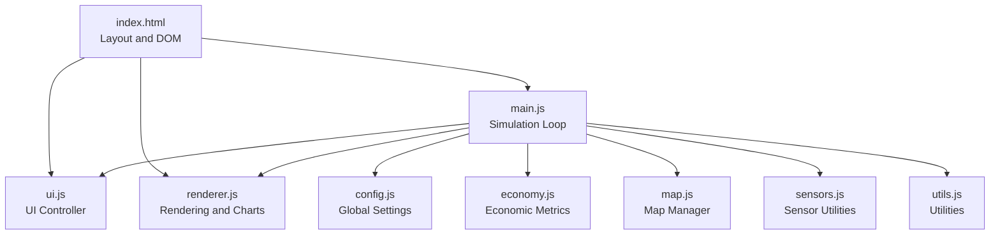
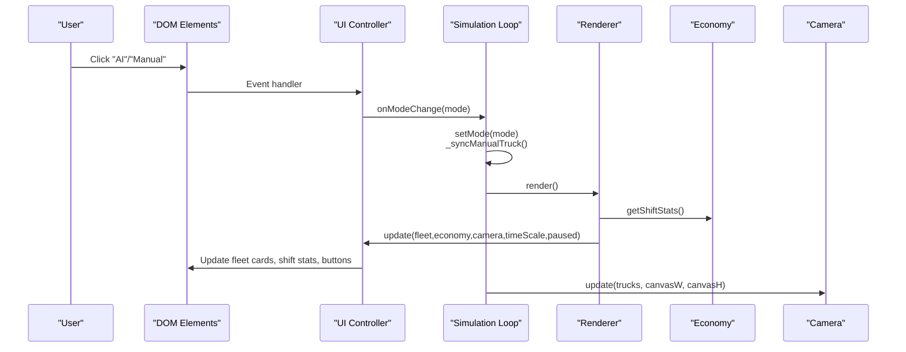
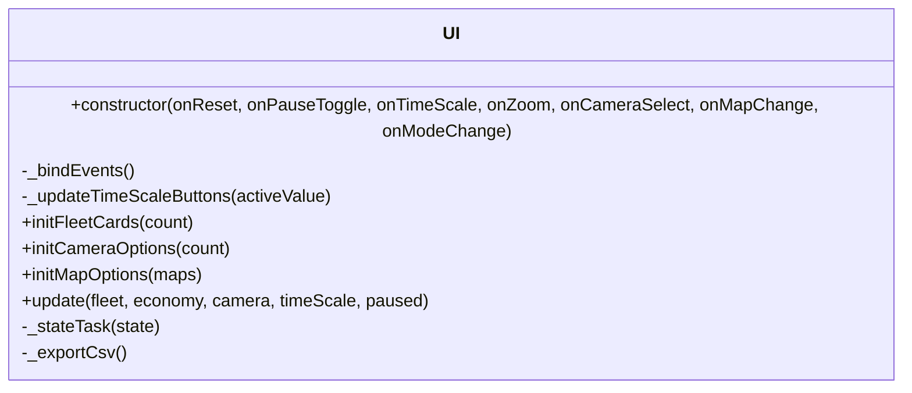
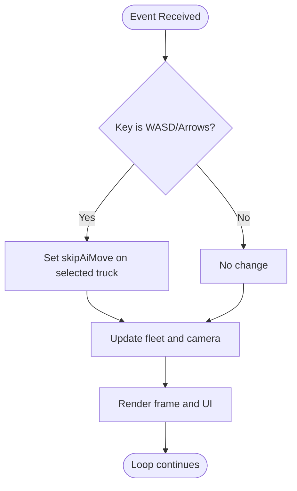
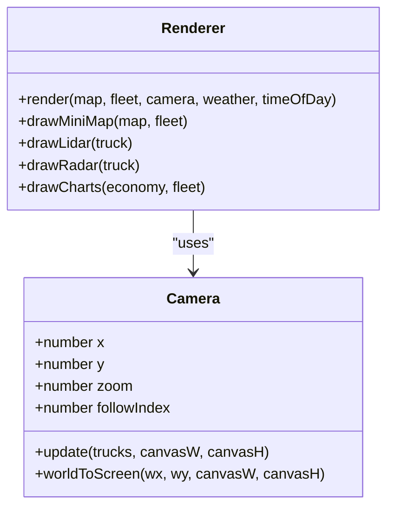
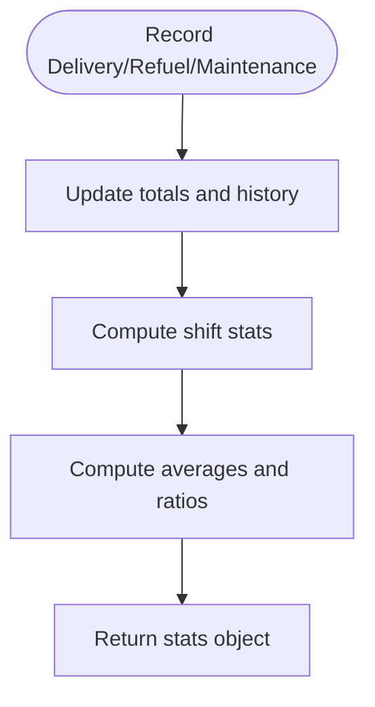
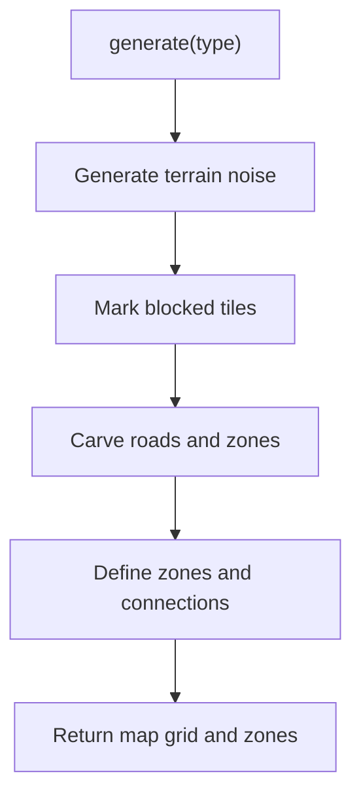
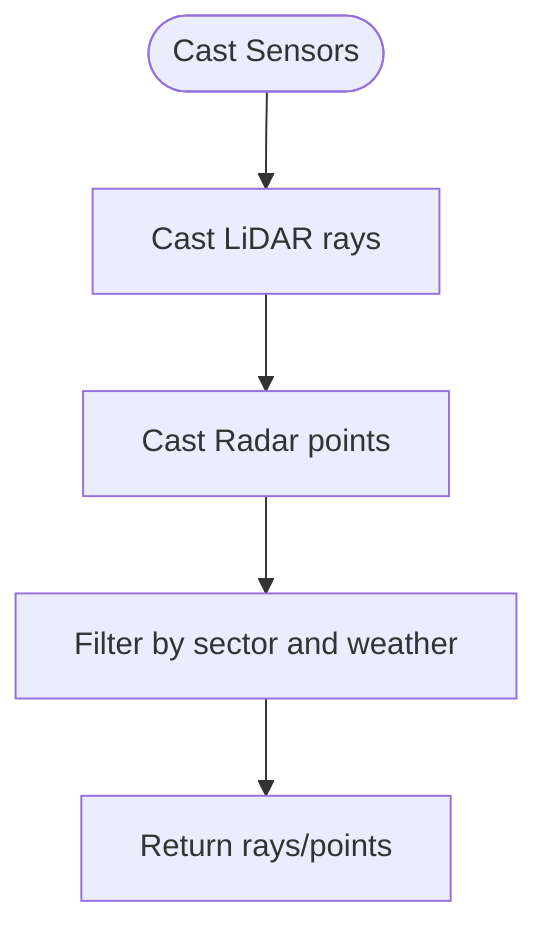
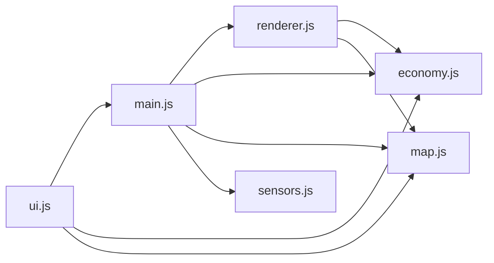

# User Interface Controls

<cite>
**Referenced Files in This Document**
- [index.html](file://index.html)
- [ui.js](file://ui.js)
- [main.js](file://main.js)
- [renderer.js](file://renderer.js)
- [config.js](file://config.js)
- [economy.js](file://economy.js)
- [utils.js](file://utils.js)
- [map.js](file://map.js)
- [sensors.js](file://sensors.js)
</cite>

## Table of Contents
1. [Introduction](#introduction)
2. [Project Structure](#project-structure)
3. [Core Components](#core-components)
4. [Architecture Overview](#architecture-overview)
5. [Detailed Component Analysis](#detailed-component-analysis)
6. [Dependency Analysis](#dependency-analysis)
7. [Performance Considerations](#performance-considerations)
8. [Troubleshooting Guide](#troubleshooting-guide)
9. [Conclusion](#conclusion)
10. [Appendices](#appendices)

## Introduction
This document describes the user interface control system that manages all interactive elements and user inputs for the autonomous dump truck simulator. It covers:
- Control panel architecture: mode switching between AI and manual operation, map selection, simulation control buttons, and camera management
- Statistics display system: real-time performance metrics, economic data presentation, and shift report generation
- Event handling: keyboard shortcuts, mouse interactions, and touch controls
- Responsive design, accessibility, and cross-browser compatibility
- UI state management, control enable/disable logic, and user feedback mechanisms

## Project Structure
The UI is implemented as a modular system with a dedicated UI controller, a main simulation loop, and rendering/sensor subsystems. The HTML layout defines the left control panel and the main canvas area, with styles for dark theme and responsive sizing.

**Diagram sources**
- [index.html:1-257](file://index.html#L1-L257)
- [ui.js:1-200](file://ui.js#L1-L200)
- [main.js:1-266](file://main.js#L1-L266)
- [renderer.js:1-437](file://renderer.js#L1-L437)
- [config.js:1-93](file://config.js#L1-L93)
- [economy.js:1-66](file://economy.js#L1-L66)
- [map.js:1-438](file://map.js#L1-L438)
- [sensors.js:1-103](file://sensors.js#L1-L103)
- [utils.js:1-102](file://utils.js#L1-L102)

**Section sources**
- [index.html:1-257](file://index.html#L1-L257)
- [main.js:1-45](file://main.js#L1-L45)

## Core Components
- UI Controller: binds DOM events, updates control panels, renders fleet cards, and exports shift reports
- Simulation Loop: orchestrates update/render cycles, handles keyboard/mouse/touch input, and toggles modes
- Renderer/Camera: draws the map, trucks, routes, overlays, and auxiliary sensor displays
- Economy: tracks production metrics and computes shift statistics
- Map Manager: generates maps, zones, and pathfinding data
- Sensors: computes LiDAR/Radar readings for visualization
- Utilities: math helpers and formatting functions

Key responsibilities:
- Mode switching: AI/manual toggling and synchronization with truck state
- Map selection: dynamic generation and reset behavior
- Simulation controls: pause/reset/time scale/camera selection/zoom/weather/time-of-day
- Statistics: per-truck health, per-shift KPIs, and CSV export
- Feedback: status messages, active button highlighting, and visual indicators

**Section sources**
- [ui.js:1-200](file://ui.js#L1-L200)
- [main.js:1-266](file://main.js#L1-L266)
- [renderer.js:1-437](file://renderer.js#L1-L437)
- [economy.js:1-66](file://economy.js#L1-L66)
- [map.js:1-438](file://map.js#L1-L438)
- [sensors.js:1-103](file://sensors.js#L1-L103)
- [utils.js:1-102](file://utils.js#L1-L102)

## Architecture Overview
The UI control system follows a layered architecture:
- Presentation Layer: index.html defines the layout and styles
- UI Controller: ui.js encapsulates DOM interactions and state updates
- Simulation Layer: main.js runs the game loop and delegates to subsystems
- Rendering Layer: renderer.js draws the scene and auxiliary charts
- Data Layer: economy.js, map.js, sensors.js provide metrics and data

**Diagram sources**
- [ui.js:30-62](file://ui.js#L30-L62)
- [main.js:100-112](file://main.js#L100-L112)
- [main.js:209-213](file://main.js#L209-L213)
- [renderer.js:38-66](file://renderer.js#L38-L66)
- [economy.js:45-64](file://economy.js#L45-L64)

## Detailed Component Analysis

### UI Controller (ui.js)
Responsibilities:
- Initialize DOM references and bind events for all controls
- Manage mode switching between AI and manual
- Update fleet cards with per-truck status and meters
- Render shift statistics and handle CSV export
- Synchronize camera selection and time scale buttons

Key behaviors:
- Mode switching toggles active class on buttons and invokes onModeChange callback
- Time scale buttons track active state and propagate numeric values
- Fleet cards are generated dynamically with localized labels and color-coded meters
- Shift stats display computed KPIs and status text updates
- CSV export builds a CSV string from current shift metrics

**Diagram sources**
- [ui.js:1-200](file://ui.js#L1-L200)

**Section sources**
- [ui.js:1-200](file://ui.js#L1-L200)

### Simulation Loop and Input Handling (main.js)
Responsibilities:
- Construct subsystems (Map, Fleet, Economy, Camera, Renderer)
- Bind keyboard and mouse/touch events
- Run the game loop with configurable time scale and pause state
- Toggle between AI and manual modes and sync truck state
- Handle manual driving and zone actions

Key behaviors:
- Keyboard handling captures WASD/Arrow keys and E for zone actions
- Mouse click on canvas selects a truck and sets camera/follow index
- Manual mode sets per-truck manual flag for the selected index
- Zone actions trigger operations (loading/unloading/fueling/maintenance)
- Weather affects traction; time-of-day affects lighting

**Diagram sources**
- [main.js:67-80](file://main.js#L67-L80)
- [main.js:114-146](file://main.js#L114-L146)
- [main.js:225-260](file://main.js#L225-L260)

**Section sources**
- [main.js:1-266](file://main.js#L1-L266)

### Rendering and Auxiliary Displays (renderer.js)
Responsibilities:
- Draw the main simulation canvas with grid, zones, routes, trucks, and overlays
- Render mini-map, LiDAR, radar, and chart displays
- Manage camera transform and screen-to-world conversions
- Compute and draw weather/time overlays

Key behaviors:
- Camera follows the selected truck with smoothing
- Grid coloring depends on map type and terrain attributes
- Routes are drawn for all trucks; selected truck’s route is emphasized
- Sensor canvases visualize obstacle detection and traffic density
- Charts show fuel consumption, tonnage, and profit trends

**Diagram sources**
- [renderer.js:1-437](file://renderer.js#L1-L437)

**Section sources**
- [renderer.js:1-437](file://renderer.js#L1-L437)

### Statistics and Economic Data (economy.js)
Responsibilities:
- Track deliveries, fuel usage, maintenance costs, and trip history
- Compute shift statistics including trips, tonnage, fuel usage, productivity, and profit
- Provide formatted durations and KPIs for UI display

Key behaviors:
- Delivery records increase income and trip counts
- Fuel usage reduces income proportionally
- Maintenance adds fixed cost and marks history
- Shift stats normalize metrics by elapsed time and compute efficiency

**Diagram sources**
- [economy.js:17-39](file://economy.js#L17-L39)
- [economy.js:45-64](file://economy.js#L45-L64)

**Section sources**
- [economy.js:1-66](file://economy.js#L1-L66)

### Map Management (map.js)
Responsibilities:
- Generate diverse maps with procedural terrain and roads
- Define zones (base, loading, unloading, fuel, maintenance)
- Provide pathfinding and route planning utilities
- Detect zone membership and compute tile costs

Key behaviors:
- Different map types carve distinct road networks and layouts
- Zones are placed and connected with roads
- Pathfinding uses A* with smoothed waypoints
- Route deviation and tile cost are used for navigation logic

**Diagram sources**
- [map.js:25-74](file://map.js#L25-L74)
- [map.js:196-249](file://map.js#L196-L249)

**Section sources**
- [map.js:1-438](file://map.js#L1-L438)

### Sensor Utilities (sensors.js)
Responsibilities:
- Cast LiDAR and Radar beams around a truck
- Apply weather-based range factors and noise
- Compute front obstacle distances and nearest obstacles

Key behaviors:
- LiDAR detects walls/trucks within angular sectors
- Radar collects points along radial lines
- Front-sector filtering helps detect immediate hazards

**Diagram sources**
- [sensors.js:9-79](file://sensors.js#L9-L79)

**Section sources**
- [sensors.js:1-103](file://sensors.js#L1-L103)

### Configuration and Utilities (config.js, utils.js)
Responsibilities:
- Provide global constants for physics, fuel, wear, sensors, economy, fleet, camera, and time scale
- Supply mathematical helpers and formatting utilities

Key behaviors:
- CONFIG centralizes tunable parameters for gameplay balance
- Utilities include vector math, priority queues, interpolation, clamping, and duration formatting

**Section sources**
- [config.js:1-93](file://config.js#L1-L93)
- [utils.js:1-102](file://utils.js#L1-L102)

## Dependency Analysis
The UI control system exhibits clear separation of concerns:
- ui.js depends on DOM elements and callbacks injected by main.js
- main.js composes subsystems and wires events to UI callbacks
- renderer.js depends on camera and economy for drawing auxiliary displays
- economy.js is consumed by renderer and UI for statistics
- map.js and sensors.js support rendering and manual driving logic

**Diagram sources**
- [ui.js:18-24](file://ui.js#L18-L24)
- [main.js:28-37](file://main.js#L28-L37)
- [renderer.js:24-36](file://renderer.js#L24-L36)

**Section sources**
- [ui.js:18-24](file://ui.js#L18-L24)
- [main.js:28-37](file://main.js#L28-L37)
- [renderer.js:24-36](file://renderer.js#L24-L36)

## Performance Considerations
- Event throttling: input events are handled via keydown/keyup and slider input; keep handlers lightweight
- Rendering: camera smoothing and canvas clearing are efficient; avoid unnecessary redraws by updating only changed UI elements
- Data computation: shift stats are computed on demand; cache where appropriate
- Memory: dynamically created DOM nodes are reused via innerHTML; ensure cleanup on reset

[No sources needed since this section provides general guidance]

## Troubleshooting Guide
Common UI issues and resolutions:
- Mode toggle not reflected: verify active class toggling and onModeChange callback invocation
- Camera selection mismatch: ensure follow index and manual truck index are synchronized
- Stats not updating: confirm update() is called each frame and economy.getShiftStats() is invoked
- Export fails silently: check window.simEconomy availability and CSV blob creation
- Manual driving not working: verify keys are registered and manualTruckIndex is set

**Section sources**
- [ui.js:33-42](file://ui.js#L33-L42)
- [main.js:108-112](file://main.js#L108-L112)
- [main.js:209-213](file://main.js#L209-L213)
- [ui.js:175-198](file://ui.js#L175-L198)

## Conclusion
The UI control system integrates tightly with the simulation loop to provide a responsive, informative, and accessible interface. Its modular design enables clear state management, robust event handling, and extensible statistics reporting. The combination of manual and AI modes, dynamic maps, and real-time economic metrics offers a comprehensive operational dashboard suitable for both training and monitoring.

[No sources needed since this section summarizes without analyzing specific files]

## Appendices

### UI State Management Examples
- Mode switching: UI toggles active class and calls onModeChange; main.syncManualTruck updates per-truck flags
- Control enable/disable: buttons reflect current state (paused, active mode, selected camera)
- User feedback: status text updates on reset and mode change; active time scale button highlights

**Section sources**
- [ui.js:33-42](file://ui.js#L33-L42)
- [main.js:100-106](file://main.js#L100-L106)
- [main.js:62-65](file://main.js#L62-L65)

### Event Handling Summary
- Keyboard: WASD/Arrows for manual movement; E for zone action; keydown/keyup registration
- Mouse: click on canvas to select truck; coordinate conversion to world space
- Touch: handled via mouse events; ensure touch-action CSS is configured if needed

**Section sources**
- [main.js:225-260](file://main.js#L225-L260)

### Responsive Design and Accessibility Notes
- Layout: left panel fixed width with scrollable content; main canvas fills remaining space
- Styles: dark theme with accent colors; meter bars with transitions; readable typography
- Accessibility: buttons and selects styled for hover; consider ARIA roles and focus outlines for enhanced accessibility

**Section sources**
- [index.html:27-153](file://index.html#L27-L153)