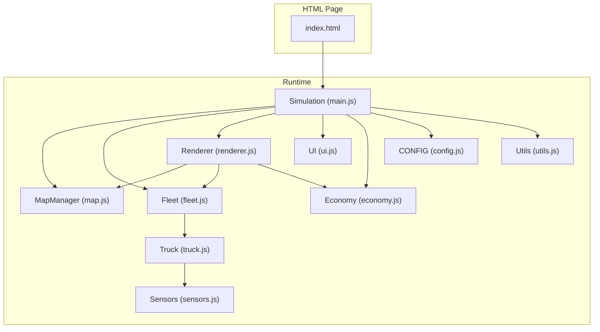
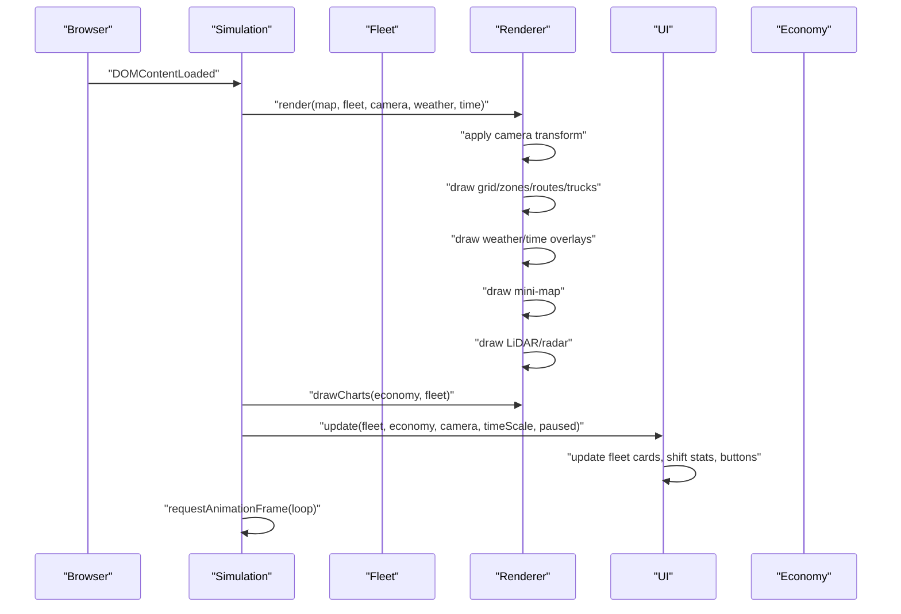
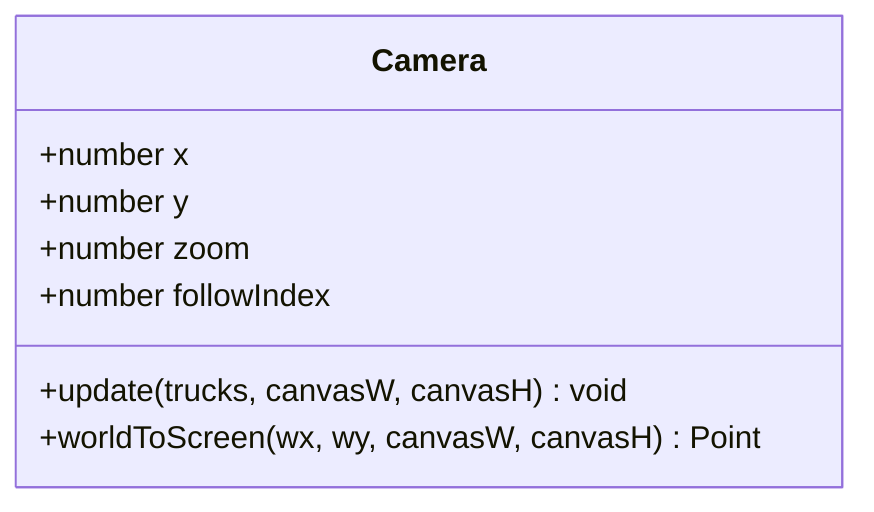
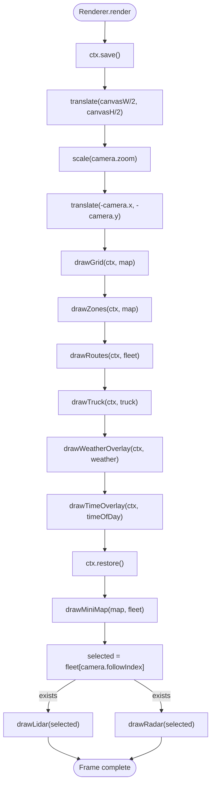
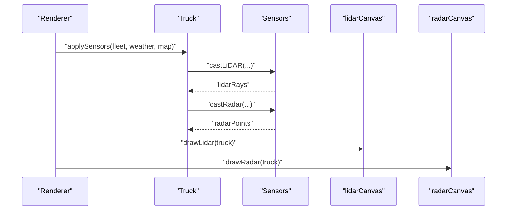
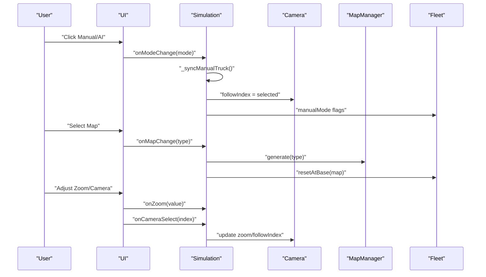
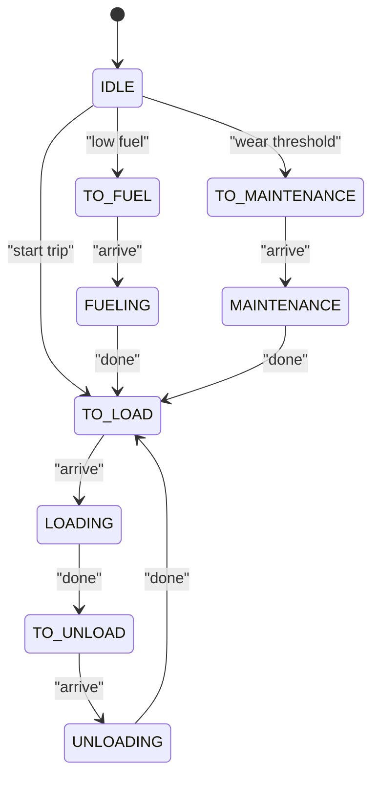
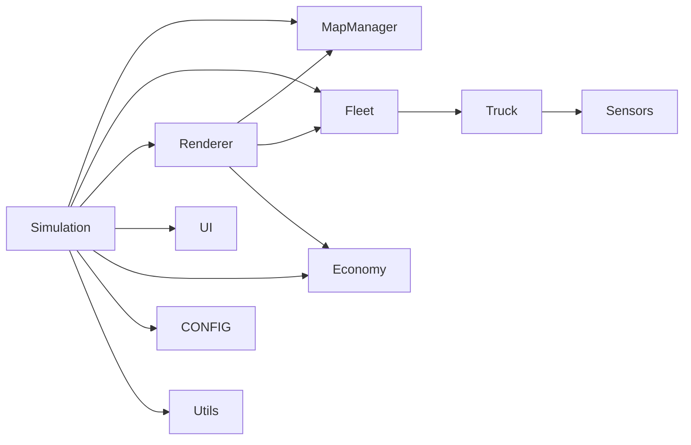

# Visualization and User Interface

<cite>
**Referenced Files in This Document**
- [index.html](file://index.html)
- [config.js](file://config.js)
- [utils.js](file://utils.js)
- [map.js](file://map.js)
- [sensors.js](file://sensors.js)
- [economy.js](file://economy.js)
- [truck.js](file://truck.js)
- [fleet.js](file://fleet.js)
- [renderer.js](file://renderer.js)
- [ui.js](file://ui.js)
- [main.js](file://main.js)
</cite>

## Table of Contents
1. [Introduction](#introduction)
2. [Project Structure](#project-structure)
3. [Core Components](#core-components)
4. [Architecture Overview](#architecture-overview)
5. [Detailed Component Analysis](#detailed-component-analysis)
6. [Dependency Analysis](#dependency-analysis)
7. [Performance Considerations](#performance-considerations)
8. [Troubleshooting Guide](#troubleshooting-guide)
9. [Conclusion](#conclusion)
10. [Appendices](#appendices)

## Introduction
This document explains the visualization and user interface systems that render the autonomous truck simulator’s graphics and interactive controls. It covers:
- Canvas-based rendering pipeline with camera management and projection
- Visual effects for weather and time-of-day
- Real-time sensor feeds (LiDAR and radar) and mini-map
- UI control panel for mode switching, map selection, simulation controls, and statistics
- Real-time data visualization (performance metrics dashboard)
- Responsive design, cross-browser compatibility, and accessibility considerations
- Rendering optimizations, UI interaction patterns, and data visualization techniques

## Project Structure
The application is a single-page HTML app with modular JavaScript modules. The rendering system centers around a canvas-based renderer and a camera that follows trucks. The UI module manages controls and statistics. Supporting modules provide map generation, physics, sensors, and economy tracking.

**Diagram sources**
- [index.html:1-257](file://index.html#L1-L257)
- [main.js:1-266](file://main.js#L1-L266)
- [map.js:1-438](file://map.js#L1-L438)
- [fleet.js:1-65](file://fleet.js#L1-L65)
- [truck.js:1-406](file://truck.js#L1-L406)
- [renderer.js:1-437](file://renderer.js#L1-L437)
- [ui.js:1-200](file://ui.js#L1-L200)
- [economy.js:1-66](file://economy.js#L1-L66)
- [sensors.js:1-103](file://sensors.js#L1-L103)
- [config.js:1-93](file://config.js#L1-L93)
- [utils.js:1-102](file://utils.js#L1-L102)

**Section sources**
- [index.html:1-257](file://index.html#L1-L257)
- [main.js:1-266](file://main.js#L1-L266)

## Core Components
- Camera: Smoothly follows the selected truck and applies zoom and translation for world-to-screen conversion.
- Renderer: Draws the grid/map zones/routes, trucks, overlays (weather/time), mini-map, and sensor visualizations.
- UI: Manages control panel, mode switching (AI/manual), map selection, simulation controls, and statistics display.
- Simulation: Orchestrates updates, renders frames, handles input, and synchronizes UI and renderer.
- Sensors: Computes LiDAR and radar data for each truck under various weather conditions.
- Economy: Tracks production metrics and generates shift statistics for charts and UI.
- Fleet and Truck: Manage vehicle states, routes, operations, and physics.

**Section sources**
- [renderer.js:1-437](file://renderer.js#L1-L437)
- [ui.js:1-200](file://ui.js#L1-L200)
- [main.js:1-266](file://main.js#L1-L266)
- [sensors.js:1-103](file://sensors.js#L1-L103)
- [economy.js:1-66](file://economy.js#L1-L66)
- [fleet.js:1-65](file://fleet.js#L1-L65)
- [truck.js:1-406](file://truck.js#L1-L406)

## Architecture Overview
The runtime loop updates physics and AI, then renders everything. The renderer translates world coordinates to screen coordinates using the camera transform. Separate canvases render the main scene, mini-map, LiDAR, radar, and a performance chart.

**Diagram sources**
- [main.js:209-223](file://main.js#L209-L223)
- [renderer.js:38-66](file://renderer.js#L38-L66)
- [ui.js:122-158](file://ui.js#L122-L158)
- [economy.js:45-64](file://economy.js#L45-L64)

## Detailed Component Analysis

### Camera Management
The camera smoothly follows the selected truck and converts world coordinates to screen coordinates. It supports zoom and translation.

**Diagram sources**
- [renderer.js:1-22](file://renderer.js#L1-L22)

Key behaviors:
- Smooth follow interpolation controlled by configuration.
- World-to-screen transform used by the renderer to draw all elements.

**Section sources**
- [renderer.js:9-21](file://renderer.js#L9-L21)

### Rendering Pipeline and Projection
The renderer sets up a 2D transform centered on the camera, then draws grid, zones, routes, trucks, and overlays. It also renders auxiliary views: mini-map, LiDAR, radar, and a performance chart.

**Diagram sources**
- [renderer.js:38-66](file://renderer.js#L38-L66)
- [renderer.js:278-316](file://renderer.js#L278-L316)
- [renderer.js:318-350](file://renderer.js#L318-L350)
- [renderer.js:352-388](file://renderer.js#L352-L388)

Rendering highlights:
- Grid coloring varies by terrain type and map variant.
- Routes drawn in two styles: raw waypoints and smoothed route.
- Trucks rendered as simple rectangles with orientation and operation progress indicator.
- Weather overlays: fog/dust/precipitation; time overlays: day/dusk/night with radial glow.
- Mini-map: scaled representation of walkable areas and routes.

**Section sources**
- [renderer.js:68-128](file://renderer.js#L68-L128)
- [renderer.js:130-172](file://renderer.js#L130-L172)
- [renderer.js:174-219](file://renderer.js#L174-L219)
- [renderer.js:230-276](file://renderer.js#L230-L276)
- [renderer.js:278-316](file://renderer.js#L278-L316)

### Visual Effects: Weather and Time
Weather affects visibility and movement:
- Fog/dust reduce sensor range.
- Rain/dust reduce traction.
- Precipitation adds animated streaks.
- Time-of-day adds tint and radial glow around the selected truck.

Implementation references:
- Weather overlay drawing and time overlay with gradient.
- Physics traction adjustments in manual movement and AI following.

**Section sources**
- [renderer.js:230-276](file://renderer.js#L230-L276)
- [main.js:125-132](file://main.js#L125-L132)
- [truck.js:291-298](file://truck.js#L291-L298)

### Sensor Feed Visualizations
Two specialized canvases visualize sensor data for the selected truck:
- LiDAR: Arc sectors with radial rays; distances normalized; color indicates proximity.
- Radar: Concentric circles and detected points; points color-coded by type.

**Diagram sources**
- [truck.js:320-324](file://truck.js#L320-L324)
- [sensors.js:9-49](file://sensors.js#L9-L49)
- [sensors.js:51-79](file://sensors.js#L51-L79)
- [renderer.js:318-350](file://renderer.js#L318-L350)
- [renderer.js:352-388](file://renderer.js#L352-L388)

Sensor behavior:
- LiDAR casts rays at discrete angles, detecting walls and other trucks.
- Radar samples angular points to detect obstacles and vehicles.
- Weather modifies detection range and introduces noise.

**Section sources**
- [sensors.js:1-103](file://sensors.js#L1-L103)
- [renderer.js:318-388](file://renderer.js#L318-L388)

### Mini-Map
The mini-map renders a scaled view of walkable tiles, routes, and truck positions. It helps situational awareness during manual mode.

**Section sources**
- [renderer.js:278-316](file://renderer.js#L278-L316)

### Performance Metrics Dashboard
A bar chart displays fuel consumption, tonnage, and profit. Values are normalized and centered appropriately for positive/negative balances.

**Section sources**
- [renderer.js:390-435](file://renderer.js#L390-L435)
- [economy.js:45-64](file://economy.js#L45-L64)

### UI Control Panel and Interaction Patterns
The UI module binds DOM events to simulation actions:
- Mode switching: manual vs AI toggles.
- Map selection: chooses terrain layout and resets state.
- Simulation controls: pause/reset, time scale, camera selection, zoom slider.
- Environment controls: time-of-day and weather.
- Statistics export: CSV export of shift metrics.

**Diagram sources**
- [ui.js:30-62](file://ui.js#L30-L62)
- [main.js:100-112](file://main.js#L100-L112)
- [main.js:47-60](file://main.js#L47-L60)
- [main.js:90-98](file://main.js#L90-L98)

UI updates:
- Fleet cards show state, tasks, fuel, wear, and cargo.
- Shift statistics computed from Economy.
- Export CSV with current shift metrics.

**Section sources**
- [ui.js:70-158](file://ui.js#L70-L158)
- [ui.js:175-198](file://ui.js#L175-L198)

### Simulation Loop and Input Handling
The simulation loop:
- Computes delta time and applies time scaling.
- Updates fleet and manual controls.
- Renders the frame and schedules next frame.

Input handling:
- Keyboard keys for manual driving.
- Click on the main canvas selects a truck and camera target.
- Zone action triggers when pressing the activation key while inside a zone.

**Section sources**
- [main.js:215-223](file://main.js#L215-L223)
- [main.js:67-80](file://main.js#L67-L80)
- [main.js:114-146](file://main.js#L114-L146)
- [main.js:236-252](file://main.js#L236-L252)
- [main.js:148-207](file://main.js#L148-L207)

### Truck Behavior and Route Following
Trucks follow finite-state logic:
- Idle -> Load -> Unload -> Refuel/TO -> Repeat.
- Operations include loading/unloading/fueling/maintenance with timed transitions.
- Route planning uses A* with smoothing; replanning on deviation.
- Sensors inform avoidance and braking; collisions resolved with separation.

**Diagram sources**
- [truck.js:118-222](file://truck.js#L118-L222)

**Section sources**
- [truck.js:78-116](file://truck.js#L78-L116)
- [truck.js:246-318](file://truck.js#L246-L318)
- [truck.js:320-324](file://truck.js#L320-L324)
- [truck.js:384-404](file://truck.js#L384-L404)

### Map Generation and Pathfinding
MapManager generates terrain, carves roads, defines zones, and computes paths:
- Procedural terrain with slope/roughness/cost.
- Road carving and zone roads.
- A* pathfinding with diagonal penalties and extra blocked tiles from moving fleet.
- Route smoothing and deviation checks.

**Section sources**
- [map.js:25-74](file://map.js#L25-L74)
- [map.js:332-437](file://map.js#L332-L437)

## Dependency Analysis
High-level dependencies:
- Simulation depends on MapManager, Fleet, Renderer, UI, Economy, Sensors, and CONFIG.
- Renderer depends on MapManager, Fleet, Economy, and UI for charting.
- Truck depends on Sensors, MapManager, and Fleet for obstacle tiles.
- UI depends on Simulation callbacks and Economy for statistics.

**Diagram sources**
- [main.js:1-45](file://main.js#L1-L45)
- [renderer.js:24-36](file://renderer.js#L24-L36)
- [truck.js:1-31](file://truck.js#L1-L31)
- [sensors.js:1-103](file://sensors.js#L1-L103)
- [config.js:1-93](file://config.js#L1-L93)
- [utils.js:1-102](file://utils.js#L1-L102)

**Section sources**
- [main.js:1-45](file://main.js#L1-L45)
- [renderer.js:24-36](file://renderer.js#L24-L36)
- [truck.js:1-31](file://truck.js#L1-L31)

## Performance Considerations
- Frame timing cap: delta time clamped to prevent spikes.
- Camera interpolation: smooth following reduces jitter.
- Efficient drawing:
  - Clear only once per frame.
  - Use transforms to avoid per-pixel calculations.
  - Draw only visible elements (grid tiles within bounds).
- Sensor sampling:
  - Fixed ray count and step size; noise injection minimal.
  - Early exits when hitting obstacles.
- Pathfinding:
  - A* with diagonal cost and extra blocked tiles from fleet avoids collisions.
  - Route smoothing reduces zig-zags.
- UI updates:
  - Batch DOM updates and avoid unnecessary reflows.
- Chart rendering:
  - Bars normalized and drawn once per frame.

[No sources needed since this section provides general guidance]

## Troubleshooting Guide
Common issues and remedies:
- Tractor sledding or stuck vehicles:
  - Verify collision resolution and separation radius.
  - Check terrain cost and blocked tiles near the vehicle.
- Route not found:
  - Confirm start/goal tiles are open; extra blocked tiles from fleet may block path.
  - Increase replan cooldown or adjust deviation thresholds.
- Manual control not responding:
  - Ensure mode is manual and the correct truck is selected.
  - Check keyboard event bindings and zone action key.
- Sensor visuals appear incorrect:
  - Confirm weather range factors and noise parameters.
  - Validate LiDAR/Radar ray counts and step sizes.
- Mini-map missing routes:
  - Ensure route arrays are populated and smoothed.
- Performance drops:
  - Reduce ray count or increase step size.
  - Limit chart updates frequency.
  - Disable non-essential overlays.

**Section sources**
- [truck.js:384-404](file://truck.js#L384-L404)
- [map.js:332-437](file://map.js#L332-L437)
- [main.js:225-260](file://main.js#L225-L260)
- [sensors.js:1-103](file://sensors.js#L1-L103)
- [renderer.js:278-316](file://renderer.js#L278-L316)

## Conclusion
The visualization and UI system combines a robust canvas renderer, a configurable camera, and rich sensor/overlay displays with an intuitive control panel. The modular architecture enables efficient updates, clear separation of concerns, and extensibility for future enhancements.

[No sources needed since this section summarizes without analyzing specific files]

## Appendices

### Responsive Design and Cross-Browser Compatibility
- Layout uses flexbox and fixed panel widths; canvas fills remaining space.
- Viewport meta tag ensures correct scaling on mobile devices.
- Canvas sizing is explicit; responsiveness can be improved by listening to resize and updating canvas pixel ratio.
- CSS variables define theme tokens for dark mode and accents.
- Event listeners use standard DOM APIs; ensure polyfills if targeting legacy browsers.

**Section sources**
- [index.html:15-153](file://index.html#L15-L153)
- [index.html:241-243](file://index.html#L241-L243)

### Accessibility Features
- Semantic labels and roles for buttons/selects.
- Color contrast maintained via theme tokens.
- Focusable elements and keyboard navigation support for controls.
- Screen reader-friendly labels for charts and meters.

**Section sources**
- [index.html:156-239](file://index.html#L156-L239)

### Configuration Reference
Key configuration categories:
- Physics: speeds, acceleration, friction, traction modifiers.
- Fuel/Wear/Economy: consumption rates, thresholds, costs.
- Sensors: ray counts, max distances, sectors, noise.
- FSM: thresholds for replan/deviation and arrival.
- Camera: zoom limits and follow interpolation.
- Time scale: multiple playback speeds.

**Section sources**
- [config.js:1-93](file://config.js#L1-L93)